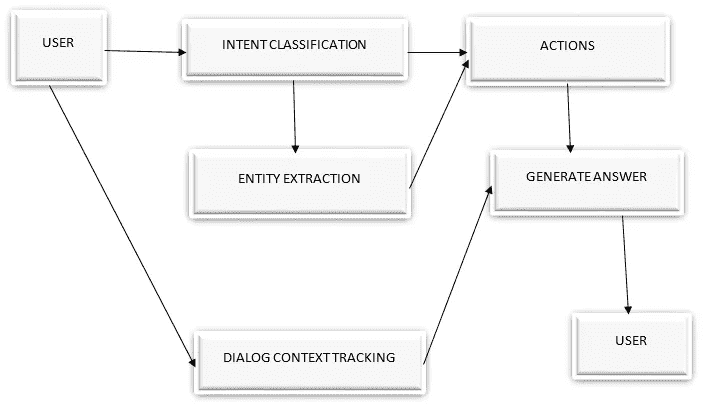

# 如何构建聊天机器人

> 原文：<https://medium.com/analytics-vidhya/how-to-build-a-chatbot-d20704f7dbb6?source=collection_archive---------15----------------------->


来源:[https://www . fin gent . com/blog/capitalizing-on-ai-chatbots-will-redefine-your-business-heres-how/](https://www.fingent.com/blog/capitalizing-on-ai-chatbots-will-redefine-your-business-heres-how/)

在当今世界，聊天机器人已经成为每个主要行业的一部分。主要应用包括零售和电子商务、旅游和酒店、银行、金融、医疗保健、媒体和娱乐。例如，客服聊天机器人有助于消除大部分重复和冗余的工作。

## 我们正在为银行客户服务设计一个聊天机器人。

## 目录:

1.  设计
2.  意图分类
3.  实体提取
4.  行动
5.  对话上下文跟踪
6.  问答和历史聊天



**参考**:【https://www.youtube.com/watch?v=ImzRs8eORsM】T4&t = 4s

# 1.设计

## 什么是聊天机器人？

聊天机器人是一种每当用户提问时都会提供答案的机器。为了做到这一点，聊天机器人首先需要理解问题的含义或语义。在这里，我们将使用两种广泛使用的技术来实现这一点，这两种技术称为意图分类和实体提取。

一旦我们理解了问题的含义，那么我们需要执行某些操作来为用户生成正确的答案。在这个银行客户服务示例中，如果用户询问账户余额，那么通过执行一个简单的 SQL 查询，机器人可以生成答案。如果用户询问一些像住房利率这样的一般信息，那么在银行的 FAQ(问答对)的帮助下，机器人可以生成答案。生成答案的另一种方法是参考历史聊天记录。

# 2.意图分类

这里，给定一个来自用户的查询或问题，我们需要确定问题背后的意图。客户会问的典型问题如下。

1.  我需要做什么来更改我的个人识别码？
2.  如何激活刚到的卡？
3.  Google Pay 可以用来充值吗，请帮忙？
4.  我可以用哪个自动取款机取款？
5.  为什么我的最后一笔支票存款花了这么长时间？

根据客户提出的问题，我们必须创建多个意图，然后我们需要分类该问题属于哪个意图。使用多类分类可以很容易地解决这个问题。我们可以创建如下的意图。

```
C1 : card_arrival
C2 : card_linking
C3 : exchange_rate
C4 : card_payment_wrong_exchange_rate
C5 : extra_charge_on_statement
```

## 使用 BERT 进行意图分类

来自转换器的 BERT-双向编码器表示是基于转换器的模型。如果我们有大量的训练数据，那么我们可以使用 BERT 模型来执行意图分类。但在现实世界中，我们通常只有很少的训练数据，比如每个意图 10 到 15 个句子。在这种情况下，最好使用少量镜头学习。(暹罗网)。在我们的银行数据集中，每个意向都有大量的训练数据，因此我们将使用 BERT 模型。

**数据预处理:**这是第一阶段。在这个阶段，我们首先需要删除重复项、空值、http 标签、特殊字符等。清理完数据后，我们需要将文本转换成向量。为此，我们首先将句子标记化为标记，然后将其转换为标记 id。

```
Output: ['please', 'help', 'me', 'with', 'my', 'card', '.', 'it', 'won', "'", 't', 'activate']
```

```
Output:[3531, 2393, 2033, 2007, 2026, 4003, 1012, 2009, 2180, 1005, 1056, 20544]
```

对于银行数据集，我们将使用 BERT 模型进行意向分类。我们已经从拥抱脸导入了 banking77 数据集。数据集总共有 13，083 条记录。(训练数据:10003，测试数据:3080)我们有 77 个标签或意向。

**输出**:显示前 5 条记录


在预处理阶段完成后，我们将把输入的训练数据传递给意图分类模型。在最后阶段，我们将使用多类分类来对句子的意图进行分类。

# 3.实体提取

为了获得问题背后的含义，实体提取和意图分类起着重要作用。

**举例**:信用卡的最高限额是多少？

在上面的例子中，使用意图分类我们可以找到上面问题的意图。(ie)意向-信用卡。我们知道这个问题与信用卡有关，但是我们不知道用户想要什么确切的信息。为了解决这个问题，我们使用了一种叫做实体提取的技术。

实体抽取或命名实体识别帮助我们找到问题中的实体，进而帮助我们理解问题的确切含义。实体是诸如人名、组织、位置、医疗代码、时间表达式、数量、货币值、百分比等类别。

**实体**:

信用卡**账户 _ 类型**最高限额【T8【金额】是多少？

NER 将读取句子并识别相关标签，如金额、账户类型、卡类型、支付模式等。利用这些信息，我们可以找到给定句子的意思。对于特定领域的应用，我们可以定制基于规则的系统。对于银行领域，无论何时我们发现像活期、储蓄、信用卡、借记卡这样的词，它都与 Account_type 有关。

# 4.行动

一旦我们确定了问题的含义，那么我们需要采取一定的行动，并向用户提供有效的答案或输出。如果用户请求他的储蓄账户的余额，那么我们可以执行 SQL 查询并提供答案。

# 5.对话上下文跟踪

在现实世界中，每当用户与聊天机器人或客户服务交互时，用户不会在单一上下文中提出他的问题。为了理解用户真正想要什么，我们需要跟踪与用户的整个对话。在这里，聊天机器人需要跟踪最近的意图和实体，以了解整体情况。此外，很有可能，用户可以在对话过程中提出多个问题。

# 6.问答和历史聊天

在大多数公司，客户服务人员和用户之间会有大量的历史聊天记录。这些数据对得出答案非常有用。在这里，给定一个问题，聊天机器人将搜索历史聊天记录，选择相关的问题，并基于此给出答案。

# 参考资料:

1.  [https://www.youtube.com/watch?v=ImzRs8eORsM](https://www.youtube.com/watch?v=ImzRs8eORsM)

2.【https://www.appliedroots.com/ 号