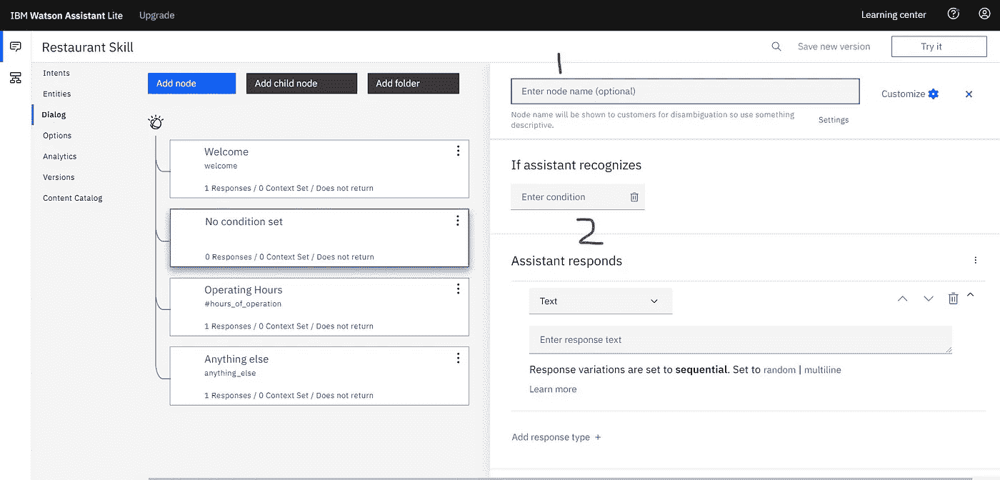

# 如何用 IBM Watson Assistant 构建聊天机器人

> 原文：<https://medium.com/analytics-vidhya/how-to-build-a-chatbot-with-ibm-watson-assistant-63e8b0a256a?source=collection_archive---------0----------------------->

在这篇文章中，我们将学习如何使用 IBM Watson Assistant 来构建一个有效的聊天机器人。Watson Assistant 是一项托管在 IBM cloud 上的服务，用于构建聊天机器人，它允许您在没有任何显式编程的情况下构建聊天机器人。

对话聊天机器人

在我们开始构建聊天机器人之前，让我们了解一下什么是聊天机器人及其用例。

> 聊天机器人是一种可以模拟人类对话的**人工智能(AI)** 软件。聊天机器人服务被编程为响应来自用户的文本、视觉或听觉输入，并利用 SMS、网站聊天窗口和社交消息服务等媒介来接收和回复消息

聊天机器人可以用于各种服务，例如 FAQ 回答、24*7 客户服务支持、订票、订购比萨饼等等。

我们将为一家餐厅构建一个聊天机器人，它可以处理以下任务:

1.  **预订** —我们的聊天机器人可以为最终用户预订一张桌子。
2.  营业时间——我们的聊天机器人可以提供餐厅的营业时间信息。

您可以添加任意多的特性，但是为了简单和更好的理解，我们将只关注上面的两个特性。

现在我们已经设定了我们的聊天机器人能做什么样的任务，让我们开始建造它。

# 构建聊天机器人

您需要有一个 IBM Cloud 帐户才能使用 IBM Watson Assistant 服务。登录您的 IBM Cloud 帐户。万一你没有，可以在这里免费报名[。](https://cloud.ibm.com/registration)

# 步骤 1:创建 Watson Assistant 服务的实例

一旦您登录到您的 IBM Cloud 帐户，下面的屏幕将出现在仪表板上。

在搜索栏输入“沃森助手”，创建一个沃森助手的服务。

一旦你创建了沃森助手的服务，点击它，就会出现下面的屏幕。

点击“启动沃森助手”

现在点击“启动沃森助手”来启动服务。

# 步骤 2:向助手添加对话技能

完成第一步后，你会得到下图。

在这一步中，我们将把对话技巧添加到我们的助手中。对话技巧将帮助我们的助手完成上述任务。

要为助手添加对话技能，请单击“我的第一个助手”。您将获得以下图像。

动作技能链接到“我的第一助手”

在这里你可以看到，有一个动作技能链接到助手。在某些情况下，有一个动作技能与助手相关联，而在其他情况下，有一个对话技能与助手相关联。

如果有一个对话技能链接到助手，那么我们不需要做任何改变，但是在我们的例子中，有一个动作技能链接到助手&我们想要链接对话技能。为此，首先，我们从助手中移除动作技能。

移除动作技能

要移除一个已有的动作技能，点击*我的第一个技能*右上角的三个点，再点击*移除技能*。成功移除动作技能后，您将获得以下图像。

添加对话技能

现在添加一个对话技能，点击“添加一个动作或对话技能”,创建一个名为“餐馆技能”的新对话技能，然后点击*创建技能。*

创造新的对话技巧。

完成这个之后，我们的助手就增加了一个新的对话技能。这就完成了构建聊天机器人的第二步。

对话技巧助手。

# 第三步:创建一个意图并增加技能

在这一步中，我们将创建一个意图并将其添加到技能中。但在此之前，我们需要了解什么是意图？

根据沃森助手的说法

> 意图是具有相同含义的用户语句的集合。通过创造意图，你可以训练你的助手理解用户表达目标的各种方式。

一个意图仅仅是具有相同含义的用户语句的集合。这些语句可以是用户想要表达目标的语句，在我们的例子中，类似于*预订*桌子。

**用户可以用哪些不同的方式预订餐厅的桌子？**

预订一张桌子。

为我预订一张桌子。

在餐厅预订一张桌子。

预定一张桌子。

我想预订一张餐桌。

所有这些例子都显示了用户预订桌子的意图。通过查看这些示例，我们可以很容易地说，用户想要预订一张桌子。聊天机器人的*意图*也是如此。

意图帮助聊天机器人识别用户想要完成的目标。这些目标可以是预订、获取关于营业时间的信息等。

在我们的聊天机器人中，我们想要完成两个主要目标:预订和获取关于营业时间的信息。因此，我们将创建两个意图，每个意图一个。

首先，我们创建一个 intent 来理解用户预订桌子的意图。

要创建意图，首先，点击*餐厅技能*。您将获得以下图像。

创建一个意图

现在点击*创建意图。*之后，键入意向名称“make_booking”然后点击创建意向。您将获得以下图像。

# make _ 预订意向已创建

现在，我们需要通过给出至少 5 个不同的例子来训练意图，在这些例子中，用户可以对聊天机器人说预订桌子。这些例子可以是我们前面看到的。

预订一张桌子。

*给我预订一张桌子。*

*在餐厅预订一张桌子。*

预定一张桌子。

我想预订一桌晚餐。

要添加示例，只需键入语句，然后点击*添加示例。*一旦你成功的添加了所有的例子，你会得到下面的图片。

5 个不同的例子添加到意图中

类似地，使用以下示例为*工作时间*创建另一个意图。

你们的营业时间是什么时候？

你们周末开门吗？

星期天你们开门吗？

你的工作时间是什么时候？

你们餐厅的时间是几点？

意向#操作小时数已创建

到目前为止，我们已经创建了一个 Watson assistant 服务的实例，为助手添加了一个对话技能，并创建了两个 intents。让我们进入下一步。

# 步骤 4:创建实体并添加技能

在这一步，我们将创建一个*实体*并将其添加到技能中。但在此之前，我们先了解一下什么是*实体*以及如何用它来构建聊天机器人？

据沃森助手说…

> ***实体*代表用户输入中与用户目的**相关的信息。

如果*意图*表示动词(用户想要做的动作)，那么*实体*表示名词(动作的对象或上下文)。例如，当*的意图*是获取天气预报时，相关的位置和日期*实体*在应用程序能够返回准确的预报之前是必需的。

在我们的示例中，用户想要在餐馆预订一张桌子。但是要预订一张桌子，聊天机器人需要知道用户想要预订一张桌子的时间和日期。这里**日期**和**时间**是需要预订桌子的*实体*。

所以我们会给对话技能增加两个实体，分别是**日期**和**时间**。幸运的是，我们不需要创建这两个实体。在 Watson Assistant 中，这两个实体是在*系统实体中预定义的。*我们只需要启用这两个实体就可以使用了。

要激活这两个*实体，*点击“餐厅技能”中的“实体”。点击后，你会得到下面的图片。

在实体部分，您将看到两个选项，即**我的实体**和**系统实体。**只需点击**系统实体**，启用*系统日期*和*系统时间*实体即可在聊天机器人中使用。

启用系统日期和系统时间实体。

现在您已经启用了**系统日期**和**系统时间**实体。现在你可以用它们来构建我们的聊天机器人。

# 步骤 5:创建对话框

现在我们将构建一个对话框来响应用户的输入。但在此之前，我们先了解一下什么是**对话框**？

据沃森助手说…

> 一个**对话框**以逻辑树的形式定义了你的对话流。它将意图(用户所说的)与回应(你的聊天机器人所说的)匹配起来。基于用户输入，树的每个节点都有一个触发它的条件。

要建立一个对话框，点击技能菜单中的“对话框”,你会得到下图。

具有欢迎和任何其他节点的对话框

这里您可以看到两个自动创建的对话框节点。

1.  **欢迎:**这包含当您的用户第一次使用助手时向他们显示的问候语。
2.  **其他信息**:包含当用户输入未被识别时用来回复用户的短语。

现在，点击**欢迎**节点，将助手回复部分中的文本替换为以下文字。

你好！我是餐厅的虚拟助理。我怎么帮你？

替换文本

每当用户使用聊天机器人时，他们首先会收到上面写的信息。现在我们还需要两个对话框节点，一个给出营业时间的信息，一个进行预订。

我们从*小时的操作*开始。要添加一个新节点，点击**欢迎**节点右上角的三个点，并点击下方的*添加节点。点击后，你会得到下面的图像。*

现在，在新创建的节点中填写以下详细信息。

1.  **输入节点名称(可选)**:运行小时数
2.  **输入条件**:开始输入 *#hours_of_operation* ，然后点击 *#hours_of_operation。*
3.  **输入回复文字** : *餐厅营业时间为工作日上午 10 点到下午 6 点，周末上午 10 点到晚上 8 点*。

现在点击 **C *定制*按钮旁边的*十字*图标。**

技能中增加了工作时间节点

现在，每当用户询问餐馆的工作时间时，就会触发**工作时间**节点，用户会得到以下响应:

> ***餐厅营业时间为工作日上午 10 点至下午 6 点，周末上午 10 点至晚上 8 点*。**

现在你可以试一下我们现在制作的聊天机器人。只需点击右上角中的**试试看**，输入下面这句话。

***营业时间是几点？***

您将得到以下响应。

尝试聊天机器人

到目前为止，我们已经添加了对话框节点来提供关于工作时间的信息。现在，我们将把最后一个对话节点添加到**中，预订**餐馆中的桌子。

要添加新的对话节点，只需点击**工作时间**节点中的三个点，然后点击上面的*添加节点。*

您将获得以下图像。

用于预订的对话节点

现在，在新创建的对话框节点中填写以下详细信息。

1.  **输入节点名称(可选)**:预约
2.  **输入条件**:开始输入 *#make_booking* ，然后点击 *#make_booking。*

更改后的节点。

我们已经输入了**#*make _ booking***意图作为识别的条件，因此每当用户询问预订桌子时，聊天机器人将识别意图**#*make _ booking***，并且该节点将被触发。

为了在餐馆预定一张桌子，聊天机器人需要问用户两件事。

1.  你想哪天来？(预订日期)
2.  你想预约什么时候？(订票时间)

预订餐桌的典型工作流程如下所示。

通过聊天机器人预订餐桌的工作流程

为了创建这个工作流，我们将使用**插槽**。插槽提供了一种结构化的格式，通过这种格式，您可以在单个节点中请求和保存来自用户的多条信息。当你心中有一个特定的任务，并且在执行之前需要用户提供关键信息时，它们是最有用的。

要使用**插槽，点击**右上角的 ***定制*** 按钮***预约*** *节点*，将插槽开关设置为 on，然后点击*应用*。

将插槽开关设置为开，然后单击应用

在 ***然后勾选*** *部分，*添加以下插槽:

1.  **查看** — @sys-date，**另存为** — $date，**如果不在，问** —你想哪天来？
2.  **查看** — @sys-time，**另存为** — $time，**如果不在，询问** —您想预约什么时间？

添加插槽后，您将获得以下图像。

向节点添加插槽。

现在，在**助手响应**部分，输入以下文本。

*感谢您在$date 预订。我们将在 6 点钟等你。*

向节点添加文本响应。

聊天机器人现在已经完成了。您可以使用右上角的**尝试一下**选项进行尝试。

希望这篇文章对你有用。如果你有任何疑问，欢迎在评论区提问。你可以在 [LinkedIn](https://www.linkedin.com/in/harvinder-singh-35a89619b/) 上联系我。

谢谢大家！