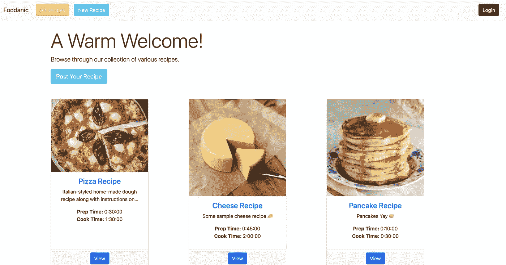
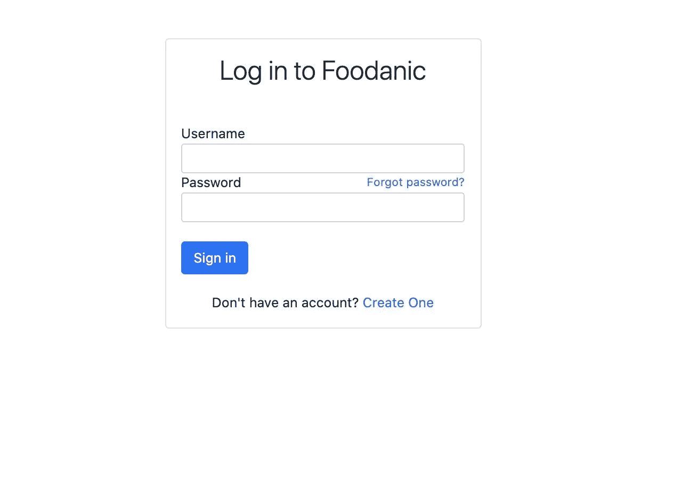
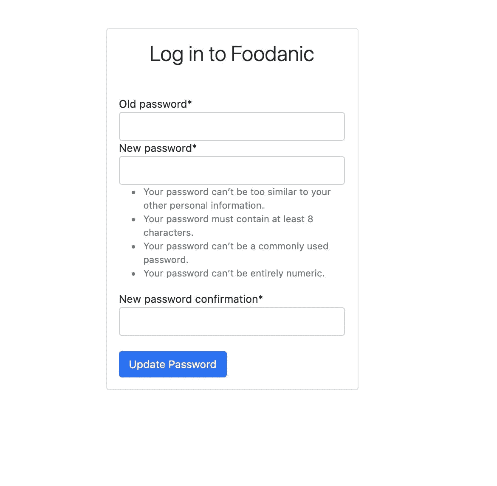
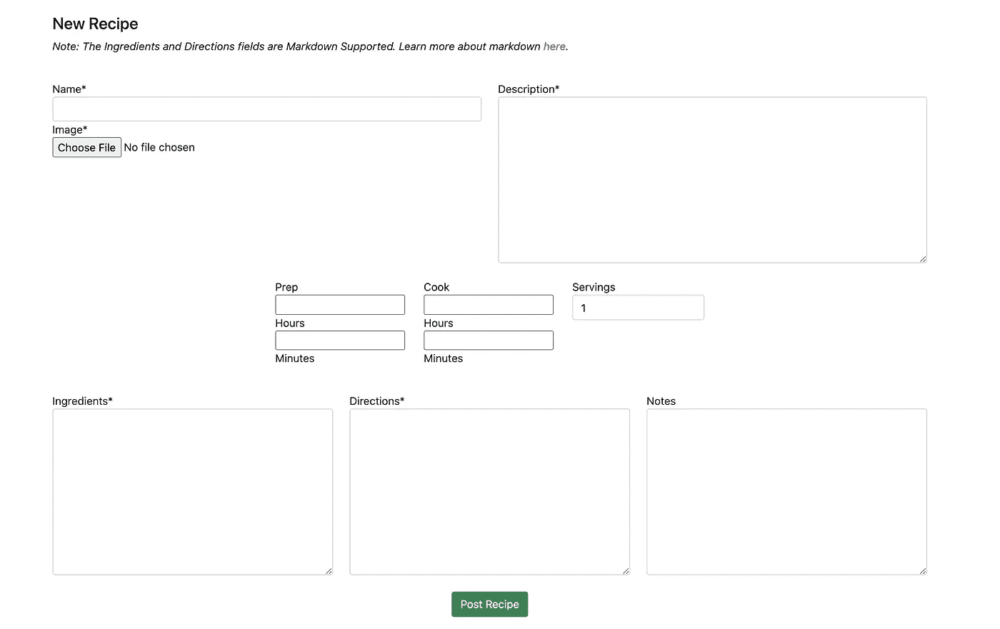
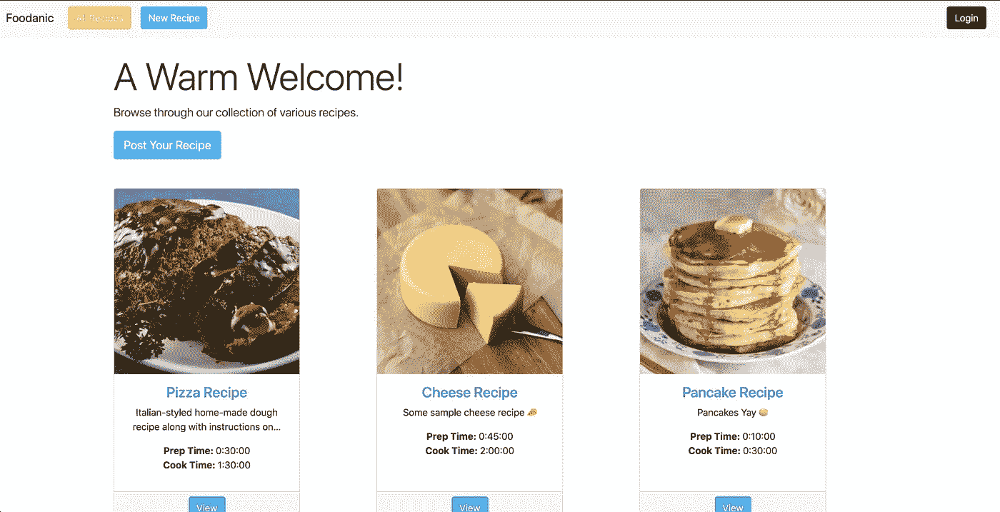

# 如何从头开始构建 Django web 应用程序(教程)

> 原文：<https://medium.com/analytics-vidhya/how-to-build-a-django-web-app-from-scratch-tutorial-20034f0a3043?source=collection_archive---------1----------------------->

欢迎来到我希望是非常详细和有用的教程，介绍如何从零开始构建一个 Django web 应用程序。在开发了几十个 Django 项目之后，我已经获得了一些技巧和诀窍来提高每个 Django 项目的效率，我将以教程的形式展示这些技巧和诀窍。本教程是我如何着手构建健壮的 Django 应用程序的一步一步的过程。**尽情享受！**

你可以在这里查看部署:[实时链接](https://foodanic.herokuapp.com/)

演示:



# 第一部分🚀

对于这个示例项目，我们将超越简单的 Todo 应用程序或博客网站——我们将构建一个具有完全用户身份验证和 CRUD 功能的食品配方应用程序，并将该应用程序部署到 Heroku 上的实时生产中。

# 目录

任何新项目的第一步都是建立目录。如果您希望您的 Django 项目在一个特定的目录中，在运行 startproject 命令之前导航到它。使用以下命令创建一个新的 Django 项目:

```
django-admin startproject [projectname]
```

这将生成如下文件结构:

```
├─ foodanic (our sample project title)
│  ├─ __init__.py
│  ├─ asgi.py
│  ├─ settings.py
│  ├─ urls.py
│  ├─ wsgi.py
├─ manage.py
```

让我们用 foodanic/和 manage.py 快速添加一个名为`templates`的文件夹到目录中

# 环境

下一个关键步骤是虚拟环境，将我们所有的依赖项包含在一个模块中。

要创建新的虚拟环境:

```
virtualenv env
```

*注意:[env]可以是您想要命名虚拟环境的任何名称*

要激活环境:

```
source env/bin/activate
```

要停用环境，请执行以下操作:

```
deactivate
```

创建并激活环境后，一个(env)标记将出现在您的终端中的目录名旁边。

# 设置:

这是一个步骤，你必须记住所有未来的项目，因为一个适当的初始设置设置将防止在未来的错误。

在您的`settings.py`文件中，在顶部添加`import os`，然后向下滚动到`TEMPLATES`部分，并在`DIRS`中进行以下更改:

```
import os'DIRS': [os.path.join(BASE_DIR, 'templates')],
```

这允许您将项目的根模板转发到主模板目录，以便将来引用`base.html`文件。

现在，让我们通过以下方式将 Django 安装到我们的应用程序中:

```
pip install django
```

接下来，我们将安装一个名为`whitenoise`的中间件，帮助 Heroku 处理 Django 应用程序的图像。

要安装依赖项，请运行:

```
pip install whitenoise
```

将 whitenoise 添加到您的`MIDDLEWARE`:

```
# settings.py
MIDDLEWARE = [
   ...
   'whitenoise.middleware.WhiteNoiseMiddleware',
]
```

每当我们向项目中添加一个新的依赖项时，您会希望将它们冻结到一个名为`requirements.txt`的文件中。

要执行此运行，请执行以下操作:

```
pip freeze > requirements.txt
```

静态和媒体

静态和媒体将服务于我们的应用程序上的图像。在 settings.py 中定义的`STATIC_URL`下面，添加

```
#settings.pySTATIC_ROOT = os.path.join(BASE_DIR, 'staticfiles')
STATIC_TMP = os.path.join(BASE_DIR, 'static')
STATICFILES_DIRS = (
    os.path.join(BASE_DIR, 'static'),
)
STATICFILES_STORAGE = 'whitenoise.storage.CompressedManifestStaticFilesStorage'MEDIA_URL = '/media/'
MEDIA_ROOT = os.path.join(BASE_DIR, 'media')
os.makedirs(STATIC_TMP, exist_ok=True)
os.makedirs(STATIC_ROOT, exist_ok=True)
os.makedirs(MEDIA_ROOT, exist_ok=True)
```

这以最佳方式设置了我们的静态和媒体目录，为我们的应用程序提供服务。

# 。gitignore

启动 Django 项目的另一个重要步骤是。gitignore file 将忽略那里列出的目录/文件。

使用以下内容创建. gitignore:

```
touch .gitignore
```

让我们将我们创建的虚拟环境添加到其中，这样它就不会占用 Github 上额外的云空间。

```
# .gitignore
env/
```

# 第二部分🚲

既然我们已经按照我们想要的方式建立了我们的项目，让我们开始创建我们的第一个应用程序来处理逻辑。除此之外，我们还要创建一个用户应用程序，稍后我们将使用它进行用户身份验证。

使用以下内容创建新应用:

```
python manage.py startapp app
python manage.py startapp users
```

将应用程序添加到 settings.py:

```
# settings.py
INSTALLED_APPS = [
    'app',
    'users',
     ...
]
```

现在，为了让我们的应用程序在我们的 web 应用程序中正确路由，我们需要在主`foodanic/urls.py`中包含我们的其他应用程序。

```
# foodanic/urls.pyfrom django.contrib import admin
from django.urls import path, include
from django.conf.urls.static import static
from django.conf import settingsurlpatterns = [
    path('admin/', admin.site.urls),
    path('', include('app.urls')),
    path('u/', include('users.urls')),
]if settings.DEBUG:
    urlpatterns += static(settings.MEDIA_URL, document_root = settings.MEDIA_ROOT)
```

# 应用程序

在新的应用程序和用户目录中，让我们添加两个文件和两个文件夹。

```
Files to add:         Folders to add:  (for each respectively)
- urls.py             - app/templates/app       
- forms.py            - users/templates/users
```

新的应用程序和用户目录将如下所示:

```
├─ app
│  ├─ migrations/
|  ├─ templates
|  |  └── app/
│  ├─ __init__.py
│  ├─ admin.py
│  ├─ apps.py
│  ├─ forms.py
│  ├─ models.py
│  ├─ tests.py
│  ├─ urls.py
│  └── views.py
│
├─ users
│  ├─ migrations/
|  ├─ templates
|  |  └── users/
│  ├─ __init__.py
│  ├─ admin.py
│  ├─ apps.py
│  ├─ forms.py
│  ├─ models.py
│  ├─ tests.py
│  ├─ urls.py
│  └── views.py
```

# 用户认证

为了方便起见，我们将使用基本的 Django 内置认证系统。

在 settings.py 中，我们需要指定一个登录和注销重定向，如下所示:

```
# foodanic/settings.py...LOGIN_REDIRECT_URL = '/'
LOGOUT_REDIRECT_URL = '/'
LOGIN_URL = 'login'
```

在我们新创建的用户应用程序中，指向 URL 以包含 Django auth 视图。

```
# users/urls.py
from django.urls import path
from django.conf.urls.static import static
from django.conf import settings
from django.contrib.auth import views as auth_views
from .views import *urlpatterns = [
    path('signup/', signup, name='signup'),
    path('login/', auth_views.LoginView.as_view(template_name='users/login.html'), name='login'),
    path('logout/', auth_views.LogoutView.as_view(template_name='users/logout.html'), name='logout'),
    path('change-password/', auth_views.PasswordChangeView.as_view(template_name='users/change-password.html'), name="change-password"),
    path('password_change/done/', auth_views.PasswordChangeDoneView.as_view(template_name='users/password_reset_done.html'), name='password_change_done'),
    path('password_reset/', auth_views.PasswordResetView.as_view(template_name='users/forgot-password.html', subject_template_name='users/password_reset_subject.txt', html_email_template_name='users/password_reset_email.html'), name='password_reset'),
    path('password_reset/done/', auth_views.PasswordResetDoneView.as_view(template_name='users/password_reset_done.html'), name='password_reset_done'),
    path('reset/<uidb64>/<token>/', auth_views.PasswordResetConfirmView.as_view(template_name='users/password_reset_confirm.html'), name='password_reset_confirm'),
    path('reset/done/', auth_views.PasswordResetCompleteView.as_view(template_name='users/password_reset_complete.html'), name='password_reset_complete'),
]if settings.DEBUG:
    urlpatterns += static(settings.MEDIA_URL, document_root = settings.MEDIA_ROOT)
```

现在，我们刚刚添加了大量的新 URL，让我们确保我们有所需的模板。假设您在基本目录(foodanic)中，下面的行将创建所有必要的模板。

```
touch users/templates/users/login.html && touch users/templates/users/logout.html && touch users/templates/users/change-password.html && touch users/templates/users/password_reset_done.html && touch users/templates/users/forgot-password.html && touch users/templates/users/password_reset_done.html && touch users/templates/users/password_reset_confirm.html && touch users/templates/users/password_reset_complete.html && touch users/templates/users/password_reset_email.html && touch users/templates/users/password_reset_subject.txt && touch users/templates/users/signup.html && touch users/templates/users/style.html
```

现在，我们可以设置每个模板从基础开始呈现，并显示相应的表单。自举设计归功于[这个代码打开](https://codepen.io/Ihor_Sukhorada/pen/LBwRvv)。

`users/style.html`

```
<style>
    html,body { 
        height: 100%; 
    }

    .global-container{
        height:100%;
        display: flex;
        align-items: center;
        justify-content: center;
        /* background-color: #f5f5f5; */
    }

    form{
        padding-top: 10px;
        font-size: 14px;
        margin-top: 30px;
    }

    .card-title{ font-weight:300; }

    .btn{
        font-size: 14px;
        margin-top:20px;
    }

    .login-form{ 
        width:330px;
        margin:20px;
    }

    .sign-up{
        text-align:center;
        padding:20px 0 0;
    }

    .alert{
        margin-bottom:-30px;
        font-size: 13px;
        margin-top:20px;
    }
</style>
```

`users/login.html`

```
<!-- users/login.html -->
<br class="mt-0 mb-4">
<div class="container">
    <div class="global-container">
        <div class="card login-form">
            <div class="card-body">
                <h3 class="card-title text-center">Log in to Foodanic</h3>
                <div class="card-text">
                    <form method="POST">
                        <div class="form-group">
                            <label for="username">Username</label>
                            <input type="text" name="username" class="form-control form-control-sm" id="username" aria-describedby="emailHelp">
                        </div>
                        <div class="form-group">
                            <label for="password">Password</label>
                            <a href="" style="float:right;font-size:12px;text-decoration:none;">Forgot password?</a>
                            <input type="password" name="password" class="form-control form-control-sm" id="password">
                        </div>
                        <button type="submit" class="btn btn-primary btn-block">Sign in</button>

                        <div class="sign-up">
                            Don't have an account? <a href="" style="text-decoration:none;">Create One</a>
                        </div>
                    </form>
                </div>
            </div>
        </div>
    </div>
</div>
```



`users/logout.html`

```
<!-- users/logout.html -->
<div class="container justify-content-center">
    <h4>You have successfully logged out of Foodanic. <a href="" style="text-decoration:none;">Log back in -></a></h4>
</div>
```

`users/signup.html`

```
<!-- users/signup.html -->
<br class="mt-0 mb-4">
<div class="container">
    <div class="global-container">
        <div class="card login-form">
            <div class="card-body">
                <h3 class="card-title text-center">Signup for Foodanic</h3>
                <div class="card-text">
                    <form method="POST">
                        {{ form|crispy }}
                        <button type="submit" class="btn btn-primary btn-block">Sign Up</button>

                        <div class="sign-up">
                            Already have an account? <a href="" style="text-decoration:none;">Sign In</a>
                        </div>
                    </form>
                </div>
            </div>
        </div>
    </div>
</div>
```

`users/change-password.html`

```
<!-- users/change-password.html -->
<br class="mt-0 mb-4">
<div class="container">
    <div class="global-container">
        <div class="card login-form">
            <div class="card-body">
                <h3 class="card-title text-center">Log in to Foodanic</h3>
                <div class="card-text">
                    <form method="POST">
                            {{ form|crispy }}
                        <button type="submit" class="btn btn-primary btn-block">Update Password</button>
                    </form>
                </div>
            </div>
        </div>
    </div>
</div> 
```



`users/password_reset_done.html`

```
<!-- users/password_reset_done.html -->Email Sent
<br><br>
<div class="container">
  <h1>Check your inbox.</h1>
  <p>We've emailed you instructions for setting your password. You should receive the email shortly!</p>
  <button class="btn btn-primary"><a href="">Return Home</button></a>
</div>

```

`users/forgot-password.html`

```
<!-- users/forgot-password.html -->


<body class="bg-gradient-primary"> <div class="container"> <div class="row justify-content-center"> <div class="col-xl-10 col-lg-12 col-md-9"> <div class="card o-hidden border-0 shadow-lg my-5">
          <div class="card-body p-0">
            <div class="row">
              <div class="col-lg-6 d-none d-lg-block bg-password-image">
                
              </div>
              <div class="col-lg-6">
                <div class="p-5">
                  <div class="text-center">
                    <h1 class="h4 text-gray-900 mb-2">Forgot Your Password?</h1>
                    <p class="mb-4">We get it, stuff happens. Just enter your email address below and we'll send you a link to reset your password!</p>
                  </div>
                  <form class="user" method="POST">
                    
                    <div class="form-group" style="border: 2px gray;">
                      <!-- {{ form|crispy }} -->
                      <input type="email" name="email" class="form-control form-control-user" id="exampleInputEmail" aria-describedby="emailHelp" placeholder="Enter your email...">
                    </div>
                    <br>
                    <button class="btn btn-primary btn-user btn-block" type="submit" style="text-decoration: none;">
                      Reset Password
                    </button>
                  </form>

                  <hr>
                  <div class="text-center">
                    <a class="small" href="" style="text-decoration: none;">Create an Account!</a>
                  </div>
                  <div class="text-center">
                    <a class="small" href="" style="text-decoration: none;">Already have an account? Login!</a>
                  </div>
                </div>
              </div>
            </div>
          </div>
        </div>
      </div>
    </div>
  </div>

```


`users/password_reset_subject.txt`

```
Foodanic Password Reset
```

`users/password_reset_email.html`

```
<!-- users/password_reset_email.html -->Hi, {{ user.username }}.
<br><br>
We received a request for a password reset. If this was you, 
follow the link below to reset your password. If this wasn't you, no action is needed.
<br><br>
<a href="{{ protocol }}://{{ domain }}" target="_blank">{{ protocol }}://{{ domain }}</a>
<br><br>
If clicking the link above doesn't work, please copy and paste the URL in a new browser
window instead.
<br><br>
Sincerely,<br>
Foodanic

```

`users/password_reset_done.html`

```
Email Sent
<br><br>
<div class="container">
  <h1>Check your inbox.</h1>
  <p>We've emailed you instructions for setting your password. You should receive the email shortly!</p>
  <button class="btn btn-primary"><a href="">Return Home</button></a>
</div>

```

`password_reset_confirm.html`

```
Enter new password


<br><br>
<div class="container">
  <h1>Set a new password</h1>
  <form method="POST">
    
    {{ form|crispy }}
    <br>
    <button class="btn btn-primary" type="submit">Change my password</button>
  </form>
</div>
<p>The password reset link was invalid, possibly because it has already been used. Please request a new password reset.</p>

```

`users/password_reset_complete.html`

```
Password reset complete
<br><br>
<div class="container">
    <h1>Password reset complete</h1>
    <p>Your new password has been set. You can now <a href="" style="text-decoration: none;">log in</a>.</p>
</div>

```

现在您可以尝试一下我们的新用户认证，这将带您参观 Django 认证系统。请记住，密码重置不起作用，因为我们没有用 Django 设置电子邮件服务器。推荐【本教程】(https://simpleisbetterthancomplex . com/tutorial/2016/09/19/how-to-create-password-reset-view . html)协助你进行邮件重置设置。

如果您想为您的站点创建一个管理员帐户，您可以使用:

```
python manage.py createsuperuser
```

# 主应用程序

有趣的部分来了，我们将构建应用程序的 CRUD 操作。

# 视图

视图控制应用程序的逻辑，呈现功能并对表单、模板和任何与应用程序相关的东西执行必要的操作。

首先，我们将写出我们将要处理的函数。

```
# views.pyfrom django.shortcuts import renderdef home(request):
    context = {}
    return render(request, 'app/index.html', context)def detail(request, id):
    context = {}
    return render(request, 'app/detail.html', context)def create(request):
    context = {}
    return render(request, 'app/create.html', context)def update(request, id):
    context = {}
    return render(request, 'app/update.html', context)def delete(request, id):
    context = {}
    return render(request, 'app/delete.html', context)
```

接下来，除了媒体 url 和根之外，让我们将它们添加到 app 中的`urls.py`文件，以处理我们未来的图像:

```
# app/urls.py
from django.urls import path
from .views import *
from django.conf.urls.static import static
from django.conf import settingsurlpatterns = [
    path('', home, name='home'),
    path('detail/<int:id>/', detail, name='detail'),
    path('new/', create, name='create'),
    path('update/<int:id>/', update, name='update'),
    path('delete/<int:id>/', delete, name='delete'),
]if settings.DEBUG:
    urlpatterns += static(settings.MEDIA_URL, document_root = settings.MEDIA_ROOT)
```

为了让我们在 app 中的 URL 正常工作，我们需要将它们添加到我们的主 urls.py 文件中。此外，还要将媒体 url 和根目录添加到主 URL 中。

```
# foodanic/urls.py
from django.contrib import admin
from django.urls import path, include
from django.conf.urls.static import static
from django.conf import settingsurlpatterns = [
    path('admin/', admin.site.urls),
    path('', include('app.urls')),
    path('u/', include('users.urls')),
]if settings.DEBUG:
    urlpatterns += static(settings.MEDIA_URL, document_root = settings.MEDIA_ROOT)
```

# 运行迁移和服务器

现在我们准备开始开发我们的 web 应用程序。让我们运行迁移来创建一个初始数据库并运行我们的应用程序。

运行迁移时使用:

```
python manage.py migrate
```

运行服务器时使用:

```
python manage.py runserver [OPTIONAL: PORT]
```

**注意:可选端口可以这样使用:* `*python manage.py runserver 8000*` `*python manage.py runserver 1234*`

# 模型

现在我们可以建立存储每个食谱的模型。在 models.py 中添加以下代码:

```
# models.py
from django.db import models
from datetime import datetime, timedelta
from markdownx.models import MarkdownxField
from django.contrib.auth.models import Userclass Recipe(models.Model):
    name = models.CharField(max_length=255)
    description = models.TextField()
    prep = models.CharField(max_length=255)
    cook = models.CharField(max_length=255)
    servings = models.IntegerField(default=1, null=True, blank=True)
    image = models.ImageField(upload_to='media/')
    ingredients = MarkdownxField()
    directions = MarkdownxField()
    notes = models.TextField(null=True, blank=True)
    author = models.ForeignKey(User, on_delete=models.CASCADE) def __str__(self):
        return self.name @property
    def formatted_ingredients(self):
        return markdownify(self.ingredients) @property
    def formatted_directions(self):
        return markdownify(self.directions)
```

这里需要注意一些事情:我们有 9 个字段来保存配方模型的信息。我们将为两个字段使用 Django MarkdownX[(Github Link)](https://github.com/neutronX/django-markdownx)以获得更好的外观。`@property`创建了一个属性标签，我们可以在模板中使用它来呈现 Markdown 字段。

要安装 Django Markdown，运行:

```
pip install django-markdownx
```

将其添加到 settings.py:

```
# settings.pyINSTALLED_APPS = [
   'markdownx',
   ...
]
```

将其添加到需求中:

```
pip freeze > requirements.txt
```

将其添加到主 urls.py:

```
# foodanic/urls.pyurlpatterns = [
    path('markdownx/', include('markdownx.urls')),
]
```

现在我们已经建立了模型，我们可以继续运行迁移了。注意:您必须在每次对模型进行更改时运行迁移，以便数据库得到更新。

```
python manage.py makemigrations && python manage.py migrate
```

如果一切顺利，您应该会看到类似这样的输出，并且在您的应用程序`migrations/`文件夹中有一个全新的迁移。

```
(env) ➜  foodanic git:(master) ✗ python manage.py makemigrations && python manage.py migrate
Migrations for 'app':
  app/migrations/0001_initial.py
    - Create model Recipe
Operations to perform:
  Apply all migrations: admin, app, auth, contenttypes, sessions
Running migrations:
  Applying app.0001_initial... OK
(env) ➜  foodanic git:(master) ✗
```

为了让我们的模型成功地显示在 Django Admin 中，我们需要将它注册到 admin.py 文件中，如下所示:

```
# app/admin.py
from django.contrib import admin
from .models import *admin.site.register(Recipe)
```

# 主要形式

为了将数据快速传递到我们的数据库中，我们将使用基于我们的模型的 django ModelForm。

在表单文件中进行以下更改:

```
# app/forms.py
from django import forms
from .models import *
from durationwidget.widgets import TimeDurationWidgetclass RecipeForm(forms.ModelForm):
    prep = forms.DurationField(widget=TimeDurationWidget(show_days=False, show_hours=True, show_minutes=True, show_seconds=False), required=False)
    cook = forms.DurationField(widget=TimeDurationWidget(show_days=False, show_hours=True, show_minutes=True, show_seconds=False), required=False)

    class Meta:
        model = Recipe
        fields = '__all__'
        exclude = ('author',)
```

有了这个表单，我们将能够呈现配方模型中的所有字段。此外，如果你想只包含某些字段，你可以在一个数组中列出它们:`fields = ['name', 'image',]`或者如果你想排除某些字段，你可以这样列出它们:`exclude = ('name', 'image',)`。

您可能已经注意到，我们添加了一个新的库来帮助我们渲染准备和烹饪时间的持续时间字段。另外，让我们安装另一个模块，稍后我们将使用它来帮助我们处理表单，[Django crisp Forms](https://django-crispy-forms.readthedocs.io/en/latest/)。

用 pip 安装它:

```
pip install django-durationwidget
pip install django-crispy-forms
```

将其添加到设置:

```
# settings.py
INSTALLED_APPS = [
    'durationwidget',
    'crispy_forms',
]TEMPLATES = [
    'APP_DIRS': True,        # set to True
]# on the bottom of settings.py
CRISPY_TEMPLATE_PACK = 'bootstrap4'
```

让我们冻结需求以保存依赖性:

```
pip freeze > requirements.txt
```

# create, read, update, and delete

现在我们准备开始写我们的观点的逻辑。

让我们从代表(创建、读取、更新、删除)的 **CRUD** 中的 **C** 开始

# 创造

在我们的视图中，让我们导入表单、模型，并为 GET 和 POST 请求呈现表单。当用户在页面上创建一个新的食谱时，GET 请求将被呈现，而 POST 将在提交后处理表单逻辑。

```
# app/views.py
from django.shortcuts import render, redirect, get_object_or_404
from django.contrib.auth.decorators import login_required
from django.core.files.storage import FileSystemStorage
from datetime import datetime, timedelta
from .models import *
from .forms import *@login_required
def create(request):
    context = {}
    if request.method == 'GET':
        form = RecipeForm()
        context['form'] = RecipeForm()
        return render(request, 'app/create.html', context)
    elif request.method == 'POST' and request.FILES != None:
        form = RecipeForm(request.POST, request.FILES)
        if form.is_valid():
            new = Recipe()
            user = request.user
            new.author = user
            new.name = form['name'].value()
            new.description = form['description'].value()
            new.prep = form['prep'].value()
            new.cook = form['cook'].value()
            new.servings = form['servings'].value()
            new.ingredients = form['ingredients'].value()
            new.directions = form['directions'].value()
            new.notes = form['notes'].value()
            theimg = request.FILES['image']
            fs = FileSystemStorage()
            filename = fs.save(theimg.name, theimg)
            file_url = fs.url(filename)
            new.image = filename
            new.save()
            return redirect('home')
        else:
            form = RecipeForm()
            context['form'] = RecipeForm()
            return render(request, 'app/create.html', context)
    return render(request, 'app/create.html', context)
```

哇，这是一大堆代码——让我们把它分解一下，以便了解它在做什么。

if 语句处理 if GET 呈现哪个模板的逻辑，以及在提交 POST 后将用户重定向到哪里。表单中的`request.FILES`用于我们的图像字段。本质上，如果提交的表单传递了我们的参数，我们将创建一个新的 Recipe 模型实例，并将表单的内容分别保存到模型值中。

现在我们必须为表单呈现一个模板。为此，我们需要在基本模板中创建一个`base.html`文件。我将添加 Bootstrap 的最新版本 5——因此，如果你稍后正在阅读本教程，请务必更新 Bootstrap 的相应 CDN，可在[getbootstrap.com](https://getbootstrap.com/)找到。

`foodanic/templates/base.html`

```
<!DOCTYPE html>
<html lang="en">
<head>
    <meta charset="UTF-8">
    <meta name="viewport" content="width=device-width, initial-scale=1.0">
    <meta http-equiv="X-UA-Compatible" content="ie=edge">
    <title>Foodanic</title>
    <link href="https://cdn.jsdelivr.net/npm/bootstrap@5.0.0-beta2/dist/css/bootstrap.min.css" rel="stylesheet" integrity="sha384-BmbxuPwQa2lc/FVzBcNJ7UAyJxM6wuqIj61tLrc4wSX0szH/Ev+nYRRuWlolflfl" crossorigin="anonymous">
    <link rel="shortcut icon" href="https://media.istockphoto.com/vectors/hand-opening-silver-cloche-vector-id1135322593?k=6&m=1135322593&s=612x612&w=0&h=QhIjVZdKyGzfQ6aGojvSFgXpLZpEG7RsueYSLngbdLA=" type="image/x-icon">
</head>
<body>
     

    <script src="https://cdn.jsdelivr.net/npm/bootstrap@5.0.0-beta2/dist/js/bootstrap.bundle.min.js" integrity="sha384-b5kHyXgcpbZJO/tY9Ul7kGkf1S0CWuKcCD38l8YkeH8z8QjE0GmW1gYU5S9FOnJ0" crossorigin="anonymous"></script>
</body>
</html>
```

现在我们有了我们的 base.html 设置，我们可以渲染其他没有不必要内容的模板。我把`create.html`页面引导成一个可以接受的格式，但是你可以随意修改设计。

`app/create.html`

```


 <br class="mt-0 mb-4">
<div class="container">
    <h4>New Recipe</h4>
    <p><i>Note: The Ingredients and Directions fields are Markdown Supported. Learn more about markdown <a href="https://www.markdownguide.org/cheat-sheet/" target="_blank" style="text-decoration: none;">here</a>.</i></p>
    <br>
        <form method="post" enctype="multipart/form-data">
            
            <div class="row">
                <div class="col-6">
                    <div class="col">
                        {{ form.name|as_crispy_field }}
                        {{ form.image|as_crispy_field }}
                    </div>
                </div>
                <div class="col-6">
                    {{ form.description|as_crispy_field }}
                </div>
            </div>
            <br>
            <div class="row justify-content-center">
                <div class="col-2">
                    {{ form.prep|as_crispy_field }}
                </div>
                <div class="col-2">
                    {{ form.cook|as_crispy_field }}
                </div>
                <div class="col-2">
                    {{ form.servings|as_crispy_field }}
                </div>
            </div>
            <br>
            <div class="row">
                <div class="col-4">
                    {{ form.ingredients|as_crispy_field }}
                </div>
                <div class="col-4">
                    {{ form.directions|as_crispy_field }}
                </div>
                <div class="col-4">
                    {{ form.notes|as_crispy_field }}
                </div>
            </div>
            <div class="mt-4 mb-4 d-flex justify-content-center">
                <button type="submit" class="btn btn-success">Post Recipe</button>
            </div>
        </form>

    {{ form.media }}
</div>
```

开始时，您可以看到我们基于创建的`base.html`文件在块内容标签中呈现信息。我们用标签加载 crisp，并将每个字段设置为一个 crisp 字段。`{{ form.media }}`标签呈现 MarkdownX 字段的内容。或者，您可以将整个表单渲染得像这样清晰:`{{ form|crispy }}`。

新路线应该类似于以下内容:



# 阅读

CRUD 的读取部分必须能够查看数据库中的每个对象。首先，我们将做单个食谱，然后我们将为我们的索引页面拉完整套食谱。

`app/views.py`

```
from django.shortcuts import render, redirect, get_object_or_404
from django.contrib.auth.decorators import login_required
from django.core.files.storage import FileSystemStorage
from datetime import datetime, timedelta
from markdownx.utils import markdownify
from .models import *
from .forms import *def detail(request, id):
    recipe = get_object_or_404(Recipe, id=id)
    recipe.ingredients = markdownify(recipe.ingredients)
    recipe.directions = markdownify(recipe.directions) context = {
        'recipe': recipe,
    }
    return render(request, 'app/detail.html', context)
```

以下模板归功于 Codepen 上的用户 [ARIELOZAM](https://codepen.io/ARIELOZAM/pen/JjRoxeN) 。

`app/detail.html`

```


<br class="mt-0 mb-4">
<div class="container">
    <div class="bg-codeblocks">
        <div class="main-box-codeblocks">
            <div class="container">
                <div class="row">
                    <div class="col-md-12">
                        <a href=""><button class="btn btn-info mb-4">Back Home</button></a>
                    </div>
                </div>
                <div class="row">
                    <div class="col-md-6">
                        <div class="box-image-codeblocks">
                            <div class="swiper-container gallery-top">
                                <div class="swiper-wrapper">
                                    <div class="swiper-slide">
                                        <div class="product-image">
                                            
                                        </div>
                                    </div>
                                </div>
                            </div>
                        </div>
                    </div>
                    <div class="col-md-6">
                        <h2 class="text-bold text-strong">{{ recipe.name|capfirst }} Recipe     <a href=""><i class="fas fa-edit"></i></a> <span data-bs-toggle="modal" data-bs-target="#delete"><i class="fas fa-trash"></i></span> </h2>
                        <span class="seller-name-codeblocks">
                            <h5>by <a href="#" style="text-decoration: none;">{{recipe.author}}</a></h5>
                        </span>
                        <br>
                        <span class="description-codeblocks">
                            <p>
                                <strong>Description:</strong> <br>
                                <span class="text-muted">
                                    <p style="width: 450px;overflow:scroll;">{{recipe.description}}</p>
                                </span>
                            </p>
                        </span>
                        <br>
                        <span class="extras-codeblocks ">
                            <ul class="nav nav-tabs my-2" id="myTab" role="tablist">
                                <li class="nav-item" role="presentation">
                                    <a class="nav-link active" id="home-tab" data-toggle="tab" href="#home" role="tab" aria-controls="home" aria-selected="true">Quick Info</a>
                                </li>
                                <li class="nav-item" role="presentation">
                                    <a class="nav-link" id="ingredients-tab" data-toggle="tab" href="#ingredients" role="tab" aria-controls="ingredients" aria-selected="false">Ingredients</a>
                                </li>
                                <li class="nav-item" role="presentation">
                                    <a class="nav-link" id="directions-tab" data-toggle="tab" href="#directions" role="tab" aria-controls="directions" aria-selected="false">Directions</a>
                                </li>
                            </ul>
                            <div class="tab-content" id="myTabContent">
                                <div class="tab-pane fade show active" id="home" role="tabpanel" aria-labelledby="home-tab">
                                    <br>
                                    <table style="width:250px;">
                                        <tr>
                                            <th>Servings:</th>
                                            <td>{{ recipe.servings }}</td>
                                        </tr>
                                        <tr>
                                            <th>Prep:</th>
                                            <td>{{ recipe.prep }}</td>
                                        </tr>
                                        <tr>
                                            <th>Cook:</th>
                                            <td>{{ recipe.cook }}</td>
                                        </tr>
                                    </table>
                                </div>
                                <div class="tab-pane fade" id="ingredients" role="tabpanel" aria-labelledby="ingredients-tab">
                                    {{ recipe.ingredients|safe }}
                                </div>
                                <div class="tab-pane fade" id="directions" role="tabpanel" aria-labelledby="directions-tab">
                                    {{ recipe.directions|safe }}
                                </div>
                            </div>
                        </span>
                    </div>
                </div>
            </div>
        </div>
    </div>
</div>

<!-- Modal -->
<div class="modal fade" id="delete" data-bs-backdrop="static" data-bs-keyboard="false" tabindex="-1" aria-labelledby="deleteLabel" aria-hidden="true">
    <div class="modal-dialog">
        <div class="modal-content">
        <div class="modal-header">
            <h5 class="modal-title" id="deleteLabel">Are you 100% sure?</h5>
            <button type="button" class="btn-close" data-bs-dismiss="modal" aria-label="Close"></button>
        </div>
        <div class="modal-body">
            Are you absolutely sure you want to delete the {{recipe.name|capfirst}} Recipe? The data will be erased from the database and will not be retrievable.
        </div>
        <div class="modal-footer">
            <button type="button" class="btn btn-secondary" data-bs-dismiss="modal">Nevermind</button>
            <a href=""><button type="button" class="btn btn-primary">OK, Proceed</button></a>
        </div>
        </div>
    </div>
</div><style>
.bg-codeblocks {
    margin-top: 4%;
    position: absolute;
    background: #8E2DE2;
    background: -webkit-linear-gradient(to right, #4A00E0, #8E2DE2);
    background: linear-gradient(to right, #4A00E0, #8E2DE2);
    height: auto;
}.main-box-codeblocks	{
	background-color: #FAFAFA;
	border-radius: 20px;
	padding: 5em 2em;
	width:90%;
	height: auto;
	position: relative;
	display: block;
	box-shadow: 0 0px 20px 2px rgba(0,0,0,0.5);
	margin: 3em auto;

}
</style><script src="https://cdnjs.cloudflare.com/ajax/libs/jquery/3.5.1/jquery.min.js"></script>
<script src="https://cdnjs.cloudflare.com/ajax/libs/twitter-bootstrap/4.5.3/js/bootstrap.min.js"></script>
<link rel="stylesheet" href="https://cdnjs.cloudflare.com/ajax/libs/font-awesome/5.15.2/css/all.min.css">
```

新模板应该如下所示:


现在是时候让我们所有的食谱显示在我们的主页上了。

`app/index.html`

```


 <nav class="navbar navbar-expand-lg navbar-light bg-light">
        <div class="container-fluid">
          <a class="navbar-brand" href="">Foodanic</a>
          <button class="navbar-toggler" type="button" data-bs-toggle="collapse" data-bs-target="#navbarSupportedContent" aria-controls="navbarSupportedContent" aria-expanded="false" aria-label="Toggle navigation">
            <span class="navbar-toggler-icon"></span>
          </button>
          <div class="collapse navbar-collapse" id="navbarSupportedContent">
            <ul class="navbar-nav me-auto mb-2 mb-lg-0">
              <li class="nav-item">
                <a class="nav-link active" aria-current="page" href=""><button class="btn btn-warning" style="color: white;">All Recipes</button></a>
              </li>
              <li class="nav-item">
                <a class="nav-link active" href=""><button class="btn btn-info" style="color: white;">New Recipe</button></a>
              </li>
            </ul>
            
                <a class="nav-link active" aria-current="page" href=""><button class="btn btn-dark" style="color: white;">Login</button></a>
            
                <a class="nav-link active" aria-current="page" href=""><button class="btn btn-dark" style="color: white;">Logout</button></a>
            
          </div>
        </div>
      </nav> <div class="container">
    <header class="jumbotron my-4">
      <h1 class="display-3">A Warm Welcome!</h1>
      <p class="lead">Browse through our collection of various recipes.</p>
      <a href=""><button class="btn btn-info btn-lg" style="color: white;">Post Your Recipe</button></a>
    </header> <br>
    <div class="row text-center">
    
      <div class="col-lg-4 col-md-6 mb-4">
        <div class="card h-100 w-75">
            <a href=""></a>
          <div class="card-body">
            <h4 class="card-title"><a href="" style="text-decoration: none;">{{recipe.name}} Recipe</a></h4>
            <p class="card-text">{{recipe.description|truncatechars:65}}</p>
            <p><b>Prep Time: </b>{{recipe.prep}} <br>
               <b>Cook Time: </b>{{recipe.cook}}
            </p>
          </div>
          <div class="card-footer">
            <a href="" class="btn btn-primary">View</a>
          </div>
        </div>
      </div>
    
    </div>
  </div> <br><br><br>
  <footer class="py-5 bg-dark">
    <div class="container">
      <p class="m-0 text-center text-white">Copyright &copy; Foodanic 2021</p>
    </div>
  </footer>

```

通过几个示例食谱，主页显示如下:



# 更新

更新视图将获取我们想要更新的对象的实例，并保存新信息。

`app/views.py`

```
@login_required
def update(request, id):
    recipe = get_object_or_404(Recipe, id=id)
    context = {
        'recipe': recipe
    }
    if request.method == 'GET':
        form = RecipeForm(instance=recipe)
        context['form'] = form
        return render(request, 'app/update.html', context)
    elif request.method == 'POST' and request.FILES != None:
        form = RecipeForm(request.POST, request.FILES, instance=recipe)
        if form.is_valid():
            form.save()
            return redirect('detail', recipe.id)
        else:
            form = RecipeForm(instance=recipe)
            context['form'] = form
            return render(request, 'app/update.html', context)
    return render(request, 'app/update.html', context)
```

这是一个简短的路径，呈现了 create 视图的一个副本，只是我们一般保存表单。

`app/update.html`

```


<br class="mt-0 mb-4">
<div class="container">
    <h4>Update Recipe</h4>
    <p><i>Note: The Ingredients and Directions fields are Markdown Supported. Learn more about markdown <a href="https://www.markdownguide.org/cheat-sheet/" target="_blank" style="text-decoration: none;">here</a>.</i></p>
    <br>
        <form method="post" enctype="multipart/form-data">
            
            <div class="row">
                <div class="col-6">
                    <div class="col">
                        {{ form.name|as_crispy_field }}
                        {{ form.image|as_crispy_field }}
                    </div>
                </div>
                <div class="col-6">
                    {{ form.description|as_crispy_field }}
                </div>
            </div>
            <br>
            <div class="row justify-content-center">
                <div class="col-2">
                    {{ form.prep|as_crispy_field }}
                </div>
                <div class="col-2">
                    {{ form.cook|as_crispy_field }}
                </div>
                <div class="col-2">
                    {{ form.servings|as_crispy_field }}
                </div>
            </div>
            <br>
            <div class="row">
                <div class="col-4">
                    {{ form.ingredients|as_crispy_field }}
                </div>
                <div class="col-4">
                    {{ form.directions|as_crispy_field }}
                </div>
                <div class="col-4">
                    {{ form.notes|as_crispy_field }}
                </div>
            </div>
            <div class="mt-4 mb-4 d-flex justify-content-center">
                <button type="submit" class="btn btn-success">Save Recipe</button>
            </div>
        </form>
    {{ form.media }}
</div>
```

继续试一试，你的表单应该显示对象的数据，并正确地保存到数据库中。

# 删除

尽管删除我们的数据库对象很痛苦，但有时这是用户或我们想要做的。

`app/views.py`

```
@login_required
def delete(request, id):
    recipe = get_object_or_404(Recipe, id=id)
    if not request.user == recipe.author:
        return redirect('detail', recipe.id)
    else:
        name = recipe.name
        recipe.delete()
        context = {
            'name': name
        }
        return render(request, 'app/delete.html', context)
```

`app/delete.html`

```


<br class="mt-0 mb-4">
<div class="container">
    <h4>You have successfully deleted the {{name|capfirst}} Recipe</h4>
    <br><br>
    <div class="row">
        <div class="col"><a href=""><button class="btn btn-primary">Back Home</button></a></div>
        <div class="col"><a href=""><button class="btn btn-success">New Recipe</button></a></div>
    </div>
</div>

```

# 第三部分🚗

我们现在已经准备好在 Heroku 进行现场部署。此时，请前往 [Github](https://github.com/) ，创建并推送您的代码到一个新的存储库，这样我们就可以在 Heroku 上托管它。另外，如果你还没有一个 Heroku 账户，去 Heroku 主页创建一个。

此外，Heroku 需要 gunicorn 来运行，所以我们将使用 pip 来安装它。

```
pip install gunicorn
pip freeze > requirements.txt
```

接下来我们需要一个`Procfile`，这样 Heroku 就知道用 gunicorn 运行我们的应用程序。

```
web: gunicorn foodanic.wsgi --log-file -
```

确保您在终端中使用以下信息登录 Heroku:

```
heroku login
```

使用以下内容创建新的 Heroku 应用程序:

```
heroku create
# or
heroku create [app-name]
```

在 git 和 commit 之后，运行

```
git push heroku HEAD:master
```

当你得到一个成功的消息说你的应用程序(带链接)被部署到 Heroku，我们必须确保我们的应用程序接受那个引用。

`foodanic/settings.py`

```
ALLOWED_HOSTS = ['[your-app].herokuapp.com']
```

请务必将`['your-app']`替换为 Heroku 应用的相应应用名称。

然后重新提交并…

```
git push heroku HEAD:master
```

# 结束了

如果你已经到了本教程的结尾，那你就牛逼了！如果你在整个教程中遇到了任何错误，请不要羞于在评论中发表它们，这样我就可以在别人遇到它们之前快速修复它们。编程毕竟是一项协作工作😁

# 项目链接:

Github 回购:[链接](https://github.com/vladyslavnUA/foodanic)

直播:[链接](https://foodanic.herokuapp.com/)

# 资源:

详情页代码笔:[链接](https://codepen.io/ARIELOZAM/pen/JjRoxeN)

用户授权页面代码笔:[链接](https://codepen.io/Ihor_Sukhorada/pen/LBwRvv)

首页引导模板:[链接](https://startbootstrap.com/template/heroic-features)

Django MarkdownX: [链接](https://pypi.org/project/django-markdownx/)

姜戈脆皮形式:[链接](https://django-crispy-forms.readthedocs.io/en/latest/)

*附言* *如果你想让我深入研究某些项目/话题，请在下面的评论中提出来，我会尽全力研究的。感谢阅读*🙂