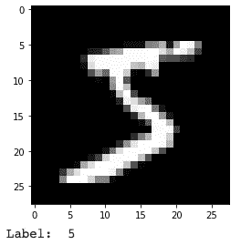
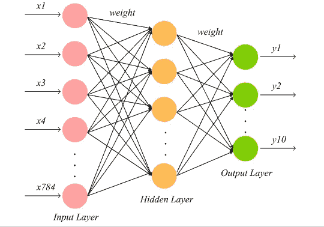
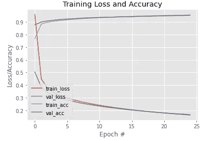
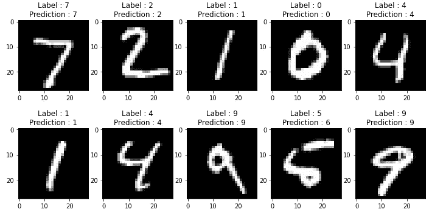

# 如何在 Python 中建立一个没有 CNN 的多类图像分类模型

> 原文：<https://medium.com/analytics-vidhya/how-to-build-a-multi-class-image-classification-model-without-cnns-in-python-660f0f411764?source=collection_archive---------16----------------------->

## 初学者指南建立一个简单的人工神经网络模型


照片由[马里乌斯·马萨拉尔](https://unsplash.com/@marius?utm_source=medium&utm_medium=referral)在 [Unsplash](https://unsplash.com?utm_source=medium&utm_medium=referral) 拍摄

卷积神经网络(CNN)可以说是计算机视觉任务中最好的机器学习模型，但在我们开始学习 CNN 之前，最好先从一个更简单的模型开始。

在本文中，我们将使用反向传播作为人工神经网络算法来分类 MNIST 手写数字，我们将使用 TensorFlow 作为我们的机器学习库。

# 关于数据

我认为 MNIST 手写数字是最受欢迎的深度学习实验数据。正如 Yann LeCun 的网站所写:

> 对于那些想在真实世界的数据上尝试学习技术和模式识别方法，同时花费最少的精力进行预处理和格式化的人来说，这是一个很好的数据库。

该数据包含 60，000 幅训练图像和 10，000 幅测试图像。它是灰度格式，尺寸为 28 x 28 像素。

# 加载数据

MNIST 手写数字数据集已经作为 TensorFlow 库的一部分可用，因此我们可以通过调用函数`load_data()`轻松加载它。

```
import tensorflow as tf

mnist = tf.keras.datasets.mnist
(x_train, y_train),(x_val, y_val) = mnist.load_data()
```

数据加载后，首先我们要验证数据加载是否正确。我们可以通过绘制样本图像来验证它们。

```
import matplotlib.pyplot as pltplt.imshow(x_train[0], cmap="gray")
plt.show()
print("Label : ", y_train[0])
```



MNIST 手写数字图像

# 数据标准化

图像数据的值在 0 到 255 的范围内，0 代表黑色，255 代表白色，灰色介于两者之间。我们希望将这些图像数据值归一化到从 0 到 1 的范围内。由于我们将在输出层中使用 softmax 激活，因此数据标签被编码为一个热码格式。

```
train_norm = x_train.astype('float32')
val_norm = x_val.astype('float32')x_train = train_norm / 255.0
x_val = val_norm / 255.0# convert label to one-hot encoded
y_train_enc = tf.keras.utils.to_categorical(y_train)
y_val_enc = tf.keras.utils.to_categorical(y_val)
```

# 建立模型

这是我们构建模型的部分。这是我们将使用的模型架构:



反向传播模型

它只有三层，在网络中间有一个隐藏层。这里没有卷积或特征提取。如果有必要，我们可以添加更多的隐藏层。

我们有 784 个输入神经元。这个数字对应于我们图像的像素数量。我们将所有 784 个像素输入到输入层。输入层的 10 个神经元对应于类的数量。

```
model = tf.keras.models.Sequential()
model.add(tf.keras.layers.Flatten())model.add(tf.keras.layers.Dense(128, input_shape=(784,), activation=tf.nn.relu))
model.add(tf.keras.layers.Dense(10, activation=tf.nn.softmax))
```

# 训练模型

在训练模型之前，需要定义一些超参数。它们是优化器、学习率、损失函数和纪元。优化器是一种改变模型参数值以达到最小损失的算法。学习率将决定每次迭代中值的变化程度。因为我们有一个多类问题，所以我们使用分类交叉熵作为损失函数。epochs 就是迭代的次数。

```
sgd = tf.keras.optimizers.SGD(learning_rate=0.004)model.compile(optimizer=sgd, loss="categorical_crossentropy", metrics=["accuracy"])EP = 25
history = model.fit(x=x_train, y=y_train_enc, epochs=EP, validation_data=(x_val, y_val_enc))
```

训练过程不到两分钟。在这里，我们可以对训练过程进行可视化，以检查我们的模型的性能。

```
import numpy as npplt.style.use("ggplot")
plt.figure()plt.plot(np.arange(0, EP), history.history["loss"], label="train_loss")plt.plot(np.arange(0, EP), history.history["val_loss"], label="val_loss")plt.plot(np.arange(0, EP), history.history["accuracy"], label="train_acc")plt.plot(np.arange(0, EP), history.history["val_accuracy"], label="val_acc")plt.title("Training Loss and Accuracy")
plt.xlabel("Epoch #")
plt.ylabel("Loss/Accuracy")
plt.legend(loc="lower left")
```



培训过程的可视化

正如我们所看到的，我们的模型做得很好。损耗越来越接近最小值，精度逐渐提高。

# 评估和预测

```
val_loss, val_acc = model.evaluate(x=x_val, y=y_val_enc)
```

> 313/313[= = = = = =]—1 秒 2 毫秒/步—损耗:0.1642 —精度:0.9530

这个模型在验证数据上可以得到 0.9529 的准确率。这意味着我们的模型能够以 95%的准确率识别出它在训练过程中从未见过的手写数字。对于一个简单的神经网络来说相当令人印象深刻。

这里我们可以展示一些预测结果的例子:

```
predictions = model.predict(x_val)x_val__ = x_val.reshape(x_val.shape[0], 28, 28)fig, axis = plt.subplots(2, 5, figsize=(12, 6))for i, ax in enumerate(axis.flat): ax.imshow(x_test__[i], cmap='gray') ax.set(title = f"Label : {y_val[i]}\nPrediction :  {predictions[i].argmax()}")
```



验证数据的预测

该模型能够识别整体手写数字，但仍然无法识别糟糕的书写。正如我们所看到的，它无法识别标签 5，因为手写数字不是很清楚。实际上是五个，但看起来也像六个。

# 结论

我们建立的简单模型能够在不到两分钟的时间内达到 95%的准确率。它简单快速，也不需要图形处理器。适合想学习神经网络的初学者。然而，该模型不适用于复杂的图像数据。

# 下一步是什么？

*   尝试使用超参数。添加更多的隐藏层，改变学习率，时期，隐藏神经元的数量等，看看它如何影响精度和性能。
*   挑战模型识别外部看不见的手写数字数据。
*   尽量使用特征提取。
*   在其他数据集上尝试该模型。