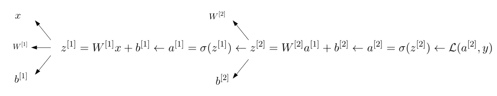

# 如何从零开始建立一个神经网络游乐场

> 原文：<https://medium.com/analytics-vidhya/how-to-build-a-neural-network-playground-from-scratch-6a91440b9ff?source=collection_archive---------3----------------------->

最近几年的[研究出版物主题](https://www.kdnuggets.com/wp-content/uploads/Fig2-winning-machine-learning-competition.jpg)显示，神经网络变得越来越受欢迎。这些模型的主要优点是它们可以学习复杂的结构，并且高度可定制。然而，一个显著的缺点是它们的解释能力差。神经网络通常被归类为难以理解的所谓“黑盒模型”。

幸运的是，有一些非常好的教程来理解神经网络实际上是如何工作的。[吴恩达](https://www.coursera.org/learn/neural-networks-deep-learning)的教程是一些非常有用的在线资料的例子。

我个人认为一层网络相对容易理解，但是当层数增加时就变得棘手了。本文试图通过建造一个小操场来详细了解 2 层神经网络。我们甚至会在网上发布操场！为了充分享受这篇文章，读者必须熟悉 1 层神经网络的工作。

一层网络和二层网络的区别取决于下图:

单层与双层

2 层神经网络具有由隐藏单元(神经元)组成的隐藏层。请注意，在计算层数时，通常会忽略输入层。

为了深入理解 1 层，我强烈推荐吴恩达的教程以获得更多的细节，或者这篇[文章](https://towardsdatascience.com/everything-you-need-to-know-about-neural-networks-and-backpropagation-machine-learning-made-easy-e5285bc2be3a)作为总结。

现在让我们更深入地了解两层网络的工作细节。

# 两层神经网络

关于神经网络背后的数学，已经有大量的文章和资源，所以我不会说太多细节，而是专注于我认为最重要的几点。

为了简单起见，我们将使用二元分类来构建操场。因此，标签属于{0，1}。成本函数是:

二元分类的损失函数

其中 y 是真正的标签，y_hat 是它的估计值(概率)。

我们注意到，当 y 不等于 y_hat 时，损失函数减小，这是我们希望惩罚错误分类时所期望的。

正向传播允许基于权重计算损失函数:

正向传播

正如我们在这里看到的，我们使用两组权重和偏差:

要更新的参数

然后，反向传播允许找到如何更新权重以最小化损失:

反向传播

从损失的导数开始，由于链式法则，我们最终得到了告诉我们如何更新权重以最小化损失的表达式。

关于导数计算的全部细节，我在我的[网站](https://savoga.github.io/machinelearning/neural-network/)上写下了一切(希望我没有犯太多错误)。

# 构建应用程序

该应用程序将允许用户提供两种类型的输入:

-数据的形状:斑点、圆圈或卫星

-神经网络中隐藏单元的数量

当然，这只是用户和神经网络之间可以进行的交互类型的一个例子。但是正如本文结论中所解释的，您可以添加更多的参数！

为操场选择的图形库是 plotly-dash。我个人是这个框架的忠实粉丝，因为[文档](https://dash.plotly.com/)相当完整，[社区](https://community.plotly.com/c/dash/16)非常活跃。

开发应用程序时，将建模部分与图形部分分开是一个很好的做法。我们还将创建一个特定的模块来生成数据。最后，这个应用程序中有 3 个 python 脚本:

*   app.py:这个脚本创建了服务器并包含了图形部分的所有内容(按钮、标题等)。)
*   model.py:这里我们实现了神经网络本身！
*   在这个模块中，我们根据用户的偏好来模拟数据

## app.py

该模块创建服务器并处理所有图形组件。我们指定文本、按钮和图形的位置。需要注意的是，我们对两个按钮使用了相同的函数(也称为“回调函数”)。事实上，dash 似乎不允许用相同的输出处理不同的按钮。

## model.py

在本模块中，我们构建神经网络逻辑。如前所述，我们希望从零开始构建它，以便我们了解正在发生的一切。

这里棘手的部分是与维度保持一致，尤其是在导数计算期间:

导数计算(链式法则的结果)

完整的代码可以在我的 [Github repo](https://github.com/savoga/nn-playground-from-scratch/blob/main/model.py) 上找到。

## utils.py

我们将允许用户选择三种类型的数据形状:斑点，圆形和月亮。

不同类型的数据形状

# 部署

部署是通过 [Heroku](https://www.heroku.com/) 完成的。部署的清晰步骤在[这里](https://dash.plotly.com/deployment)解释。正如链接中提到的，“Heroku 是部署和管理公共 Flask 应用程序的最简单的平台之一。”。

总而言之，部署包括将代码托管在 Github repo 中，然后使用以下命令通过 Heroku 进行部署:

# 关键见解

玩这个应用程序时，我们已经可以得出一些有趣的见解:

- 1 隐藏单元仅通过一条线提供线性分隔。这在选择圆时尤其明显。

带 1 个隐藏单元的分离

- 2 隐藏单元通过两条线提供线性分离，从而允许更好的分离。

带 2 个隐藏单元的分离

- 3 个隐藏单位在形状不是凸面(月亮)时完美地分离数据。

带 3 个隐藏单元的分离

这说明了神经网络的力量。我们可以想象他们在识别人脸或指纹时有多好！

# 扩展ˌ扩张

扩展的可能性是无限的！您可以考虑添加复选框/按钮，以便用户可以选择:

-与数据生成相关的噪声(标准偏差)

-要生成的数据点的数量

-参数更新期间使用的学习率

-层数

然而，对于最后一点，我认为它需要大量的工作，尤其是如果你不像我们在这里一样使用任何神经网络库(如 tensorflow 或 pytorch)。

# 结论

对于游乐场的最终版本，请查看[这个链接](https://nn-playground-app.herokuapp.com/) ( **编辑**:这个项目已经不再维护了——一些库可能已经过时，导致链接无法正常工作)。所有代码都可以在我的 [github repo](https://github.com/savoga/nn-playground-from-scratch/) 上获得。

玩得开心！

PS:这是我的第一篇关于媒体的文章，我很高兴得到你的反馈和/或评论:)