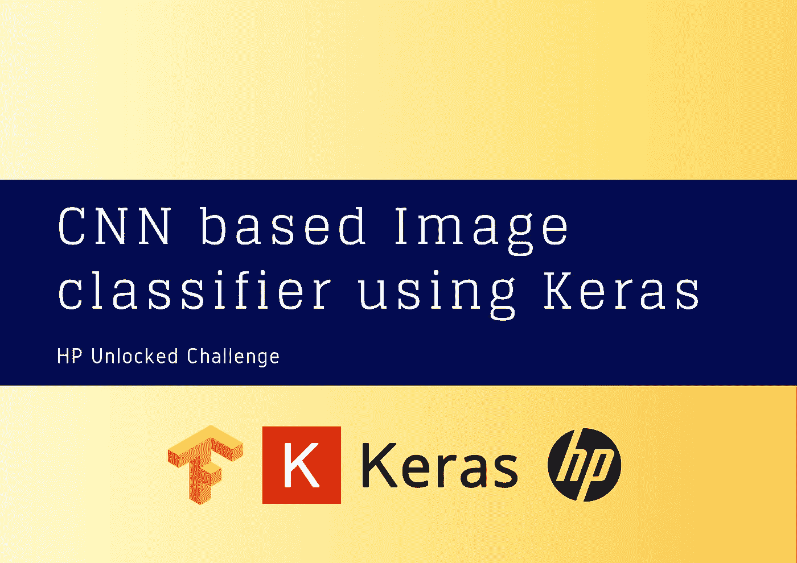

# 如何使用 Keras 建立一个简单的基于 CNN 的图像分类器

> 原文：<https://medium.com/analytics-vidhya/how-to-build-a-simple-cnn-based-image-classifier-using-keras-6f7e7375a313?source=collection_archive---------0----------------------->

# 1 导言

# 1.1 什么是卷积神经网络(CNN)？

卷积神经网络(CNN)是一类在各种计算机视觉任务中占主导地位的人工神经网络，它吸引了多个领域的兴趣。