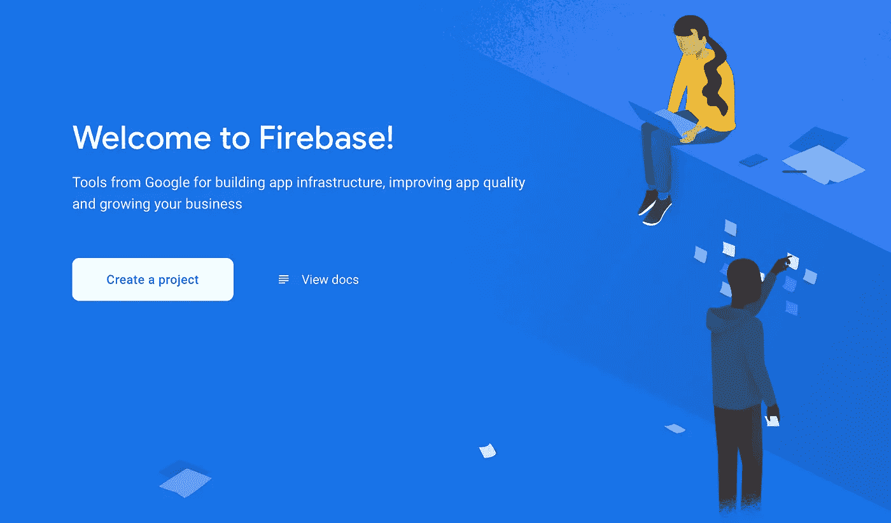
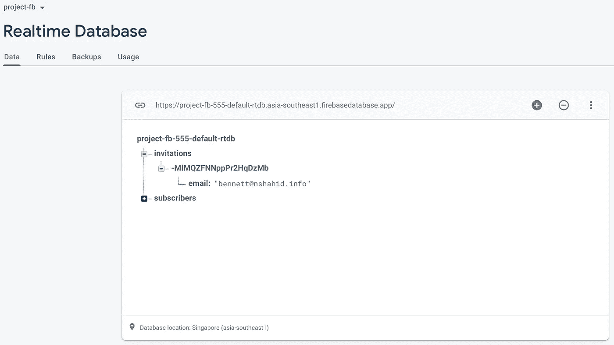

# 如何构建一个 Ember Web 应用程序

> 原文：<https://medium.com/analytics-vidhya/how-to-build-a-simple-ember-application-80f5b8ccb076?source=collection_archive---------1----------------------->

本指南教你如何构建一个简单的 *Ember.js* 应用程序，连接 *Firebase* 数据库，以及 *Spring Boot* 。

# 概观

本教程的目的是演示 web 应用程序开发中客户端和服务器端的交互。我们使用 *Ember.js* 用于客户端 UI，使用 *Firebase* 用于服务器端开发。

# 工具准备

根据您的操作系统下载并安装以下工具。

*   **Node.js**

从官网选择“LTS”选项并[下载](https://nodejs.org/en)它。 *Node.js* 是一个 *JavaScript* 运行时，支持在 *HTML* 文件中呈现 *UI* 组件。而且， *Node.js* 的包管理器 npm 也会同时安装。安装成功后，在操作系统的*命令提示符/终端/控制台*中输入`node -v`和`npm -v`应该可以看到版本信息。

*   **Ember.js**

使用命令`npm install -g ember-cli`在全局命名空间中安装 *Ember CLI* 的最新稳定版本。该命令生成一个使用最新版本的 *Ember.js* 和 *Ember* 数据的应用程序。

***Mac 用户注意事项*** *:建议安装 Node.js 最新版本。如果您在安装时遇到问题(例如，EACCESS 权限错误)，请使用“brew”进行安装。*

*   **纱线(可选)**

*Yarn* 是由*脸书*创建的 *JavaScript* 包管理器。 *Yarn* 代表*又一个资源谈判者*。它提供了与 *npm* 类似的功能，可以作为从 *npm* 注册表或 *GitHub* 库安装、卸载和管理包依赖关系的替代方法。要安装纱线，使用命令`npm install --global yarn`。

成功安装 *Node.js* 、 *Ember.js* 和 *Yarn* 并正确指定环境变量路径后，在*命令提示符/终端/控制台*中运行`ember -v`和`yarn --version`并检查输出。

*Node.js* 和 Ember.js 在 Windows 环境下成功安装

# 背景知识

在 *Ember.js* 中有一些核心元素，它们在呈现 *UI* s 中扮演不同的角色，下图展示了 *Ember.js* 应用程序是如何工作的。

Ember.js 应用程序如何工作

首先， *Ember.js* 路由器将 *URL* 映射到一个路由处理器。然后，路由处理器通常执行两个动作:

1.  它呈现一个模板。
2.  它加载一个模型，然后该模型可用于模板。

*Ember.js* 使用模板在应用中组织 *HTML* 布局。模板描述了用户界面的外观，而组件描述了它的行为。每个组件都有两部分:用*手柄*编写的模板，和用 *JavaScript* 编写的定义其行为的源文件。模型通常将信息保存到 web 服务器，尽管它们可以配置为保存在任何地方，包括浏览器的本地存储。

## 任务 I:解压缩现有项目或创建新项目

*   从 [GitHub](https://github.com/muhammadnaumanshahid/simple_ember_application.git) 下载或克隆 *Task-I/project* 资源库。
*   打开*命令提示符/终端/控制台*，导航到*项目*目录。
*   使用命令`npm install`或`yarn install`安装依赖项。然后，使用命令`npm start`或`yarn start`启动项目。如果需要，启用穿越防火墙。
*   打开默认浏览器，使用`[http://localhost:4200](http://localhost:4200/)`访问应用程序。

## 任务二:在 Firebase 上设置服务器

*   在 [*Firebase* 网站](http://firebase.google.com)上创建账户。
*   导航到项目目录，使用*命令提示符/终端/控制台*中的`npm install firebase`和`ember install emberfire@next`命令。 *Firebase* 和 *emberfire* 会将你的 *Ember.js* app 连接到 *Firebase* 服务。更多细节可在[这里](https://github.com/FirebaseExtended/emberfire/blob/master/docs/quickstart.md)找到。
*   *登录*[*Firebase*](https://firebase.google.com)，点击控制台，新建一个项目。

创建一个新的 firebase 项目

为您的项目取一个友好的名称

*   当您的新 *Firebase* 项目准备就绪时，点击`</>`将 *Firebase* 添加到您的 web 应用程序中。

将 firebase 添加到您的应用程序中

*   在下一个窗口中，给你的应用取一个昵称(例如 *firebase-app-nickname* )并注册。
*   记下下一个窗口中的`apiKey`、`authDomain`和其他配置值。

apiKey 和 authDomain

*   将 *Firebase* 中的配置值复制粘贴到您的 *Ember.js* 应用库`/.env-sample`中，并将其重命名为`.env`。
*   将您的数据库更改为 public，以避免在此阶段进行身份验证。为此，导航到您的 *Firebase* 控制台，选择您的新应用程序，在左侧菜单中的*项目概述>构建*下，单击*实时数据库*、*、*更改*读取*和*编写*、规则*为真*并单击*发布*。

更改项目数据库的公共读写权限

*   在*命令提示符/终端/控制台*中导航到项目目录，并使用`npm install`或`yarn install`安装依赖项。然后，使用命令`npm start`或`yarn start`启动项目。如果需要，启用穿越防火墙。
*   打开默认浏览器，使用`[http://localhost:4200](http://localhost:4200/)`访问应用程序。
*   在数据库中保存一个电子邮件地址(例如 *bennett@nshahid.info* )。

添加您的电子邮件地址

保存在 Firebase 数据库中的电子邮件地址

Firebase 数据库中保存的电子邮件地址

## 任务三:将 Spring Boot 应用程序连接到您的 Firebase 数据库

*   在 *Firebase Admin SDK* 中生成*新私钥*。转到*项目概述>项目设置>服务帐户> FireBase Admin SDK* 。点击*生成新私钥*按钮，下载*新私钥* ( *json* 文件)。

生成新的私钥

*   打开 [Task-III](/analytics-vidhya/how-to-make-a-web-application-using-spring-boot-4c89c8e7053e) 目录，进行如下修改:将 *json* 文件移动到*demo/src/main/resources*目录。
*   修改*demo/src/main/Java/com/example/demo/greeting controller . Java*并修改突出显示的代码:

`InputStream serviceAccount = this.getClass().getClassLoader().getResourceAsStream(“**project-fb-555-firebase-adminsdk-z6ldc-6acb653960.json**”);
// FireBase options set
FirebaseOptions options = new FirebaseOptions.Builder()
.setCredentials(GoogleCredentials.fromStream(serviceAccount))
.setDatabaseUrl(“[**https://project-fb-555-default-rtdb.asia-southeast1.firebasedatabase.app**](https://project-fb-555-default-rtdb.asia-southeast1.firebasedatabase.app)")
.build();`

*   将其更改为:

`InputStream serviceAccount = this.getClass().getClassLoader().getResourceAsStream(“**your_json_file_name.json**”);
// FireBase options set
FirebaseOptions options = new FirebaseOptions.Builder()
.setCredentials(GoogleCredentials.fromStream(serviceAccount))
.setDatabaseUrl(“[**your_firebase_database_url.app**](https://project-fb-555-default-rtdb.asia-southeast1.firebasedatabase.app)")
.build();`

*   将*数据库引用*表更改为*订户*。

`DatabaseReference ref = database.getReference(“**subscribers**”);`

*   打开*命令提示符/终端/控制台*，导航到演示目录，使用`*mvn spring-boot:run*`命令运行。
*   打开您的默认浏览器，使用以下网络链接从*fire base*数据库获取邮件和设置邮件*到 *Firebase* 数据库。*

`[*http://localhost:8080/get_mails*](http://localhost:8080/get_mails)`

`[*http://localhost:8080/set_mail?mail=demo@demo.com*](http://localhost:8080/set_mail?mail=demo@demo.com)`

恭喜你！您构建了一个 *Ember.js* web 应用程序，并将您的 *Firebase* 数据库与它连接起来。此外，你还学习了如何连接*点火座*和 *Spring Boot* 。

# 结论

*Ember.js* 将渲染 *UI* 组件的过程分离并模块化为几个相互依赖的部分。Routes changing 机制有助于程序员减少工作量，而不是考虑如何将用户重定向到不同的页面或呈现和组织不同的组件，开发人员可以将更多的精力放在如何在不同的状态下处理和显示数据上。

任务一、任务二、任务三的所有代码文件都可以在 [*GitHub*](https://github.com/muhammadnaumanshahid/simple_ember_application.git) 获得。

> 感谢阅读！如果你喜欢这首曲子，快速👏对我来说意味着一切。订阅我的个人资料，随时了解最新动态，不要犹豫发表评论或联系我们。快乐阅读！