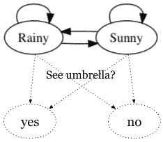
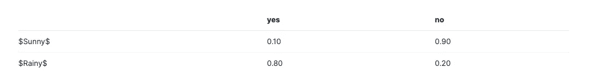
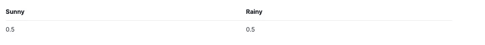
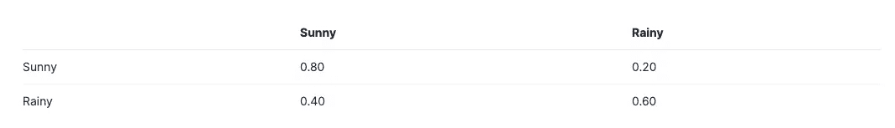
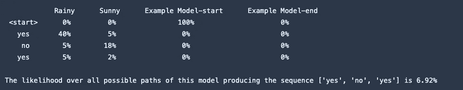
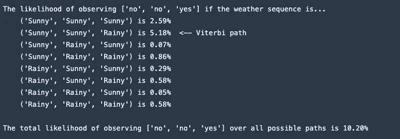

# 如何用石榴建立一个简单的隐马尔可夫模型

> 原文：<https://medium.com/analytics-vidhya/how-to-build-a-simple-hidden-markov-models-with-pomegranate-dfa885b337fb?source=collection_archive---------2----------------------->

在本文中，我们将使用[石榴](http://pomegranate.readthedocs.io/en/latest/index.html)库来构建一个简单的隐马尔可夫模型

HHM 将基于《人工智能:现代方法[一书中的一个例子:](http://aima.cs.berkeley.edu/)

> 你是驻扎在一个秘密地下设施的保安。每天，你都试图猜测今天是否下雨，但你唯一接触外面世界的方式是每天早上看到导演带着或不带伞进来。

所需网络拓扑的简图如下所示。



# 描述网络

> λ=(A，B)根据发射概率分布 A 和状态转移概率分布 B 来指定隐马尔可夫模型

HMM 网络由两个分布参数化:发射概率给出观察每个隐藏状态的证据值的条件概率，转移概率给出在序列期间在状态之间移动的条件概率。此外，您可以指定一个初始分布来描述序列在每个状态开始的概率。

> 在每个时间 t，Xt 代表隐藏状态，Yt 代表当时的观察。

在这个问题中， *t* 对应于一周中的每一天，隐藏状态表示外面的天气(是雨天还是晴天)，观察记录保安是否看到导演带着伞。

例如，在某个特定的星期，警卫可能在星期一到星期五观察一把伞['是'，'否'，'是'，'否'，'是']，而外面的天气是['下雨'，'晴天'，'晴天'，'晴天'，'下雨']。那样的话，*t*=星期三， *t* 星期三=是， *X* 星期三=晴天。(可能令人惊讶的是，警卫会在晴天观察一把伞，但在这种类型的模型下是可能的。)

# 用石榴初始化 HMM 网络

石榴库支持[两种初始化方法](http://pomegranate.readthedocs.io/en/latest/HiddenMarkovModel.html#initialization)。您可以显式地提供这三个发行版，也可以逐行构建网络。对于示例网络，我们将使用逐行方法，但是对于词性标记器，您可以自由使用任何一种方法。

```
# create the HMM model
model = HiddenMarkovModel(name="Example Model")
```

# 实现—添加隐藏状态

当 HMM 模型被逐行指定时，对象作为一个空容器开始。第一步是给每个州命名，并附上排放分布图。

**观测发射概率:P(Yt | Xt)**

我们需要假设我们有一些关于导向器行为的先验知识(可能来自数据集),来估计每个隐藏状态的发射概率。在实际问题中，你经常可以凭经验估计发射概率，这就是我们将为词性标注器所做的。我们的假想数据将产生下面的条件概率表。(请注意，这些行的总和为 1.0)



```
# create the HMM model
model = HiddenMarkovModel(name="Example Model")# emission probability distributions, P(umbrella | weather)
sunny_emissions = DiscreteDistribution({"yes": 0.1, "no": 0.9})
sunny_state = State(sunny_emissions, name="Sunny")# above & use that distribution to create a state named Rainy
rainy_emissions = DiscreteDistribution({"yes": 0.8, "no": 0.2})
rainy_state = State(rainy_emissions, name="Rainy")# add the states to the model
model.add_states(sunny_state, rainy_state)assert rainy_emissions.probability("yes") == 0.8, "The director brings his umbrella with probability 0.8 on rainy days"
print("Looks good so far!")
```

# 添加转场

一旦将状态添加到模型中，我们就可以构建各个状态转换的理想拓扑。

## 初始概率 P(X0):

我们将假设我们不知道任何有用的关于序列开始于任一状态的可能性。如果序列在每个星期的星期一开始，在每个星期的星期五结束(所以每个星期都是一个新的序列)，那么这个假设意味着星期一的天气很可能是雨天或晴天。我们可以通过设置 P(X*0*=雨天)=0.5 和 P(X*0*=晴天)= 0.5 来给每个起始状态分配相等的概率:



## 状态转移概率 P(Xt | Xt-1)

最后，在这个例子中，我们假设我们可以从某个地区的历史天气数据中估计转移概率。在实际问题中，您通常可以使用问题的结构(如语言语法)来对转移概率施加限制，然后使用用于估计发射概率的相同训练数据来重新估计参数。在这个假设下，我们得到下面的条件概率表。(请注意，这些行的总和为 1.0)



```
# create edges for each possible state transition in the model
# equal probability of a sequence starting on either a rainy or sunny day
model.add_transition(model.start, sunny_state, 0.5)
model.add_transition(model.start, rainy_state, 0.5)# add sunny day transitions (we already know estimates of these probabilities
# from the problem statement)
model.add_transition(sunny_state, sunny_state, 0.8)  # 80% sunny->sunny
model.add_transition(sunny_state, rainy_state, 0.2)  # 20% sunny->rainy# TODO: add rainy day transitions using the probabilities specified in the transition table
model.add_transition(rainy_state, sunny_state, 0.4)  # 40% rainy->sunny
model.add_transition(rainy_state, rainy_state, 0.6)  # 60% rainy->rainy# finally, call the .bake() method to finalize the model
model.bake()assert model.edge_count() == 6, "There should be two edges from model.start, two from Rainy, and two from Sunny"
assert model.node_count() == 4, "The states should include model.start, model.end, Rainy, and Sunny"
print("Great! You've finished the model.")
```

# 检查模型

可以在`HMM.states`属性上使用数组语法来访问模型的状态，并且可以通过调用`HMM.dense_transition_matrix()`来访问转移矩阵。元素$(i，j)$编码从状态$i$转换到状态$j$的概率。例如，在指定了默认列顺序的情况下，element $(2，1)$给出了从“雨天”过渡到“晴天”的概率，我们将其指定为 0.4。

```
column_order = ["Example Model-start", "Sunny", "Rainy", "Example Model-end"]  # Override the Pomegranate default order
column_names = [s.name for s in model.states]
order_index = [column_names.index(c) for c in column_order]# re-order the rows/columns to match the specified column order
transitions = model.dense_transition_matrix()[:, order_index][order_index, :]
print("The state transition matrix, P(Xt|Xt-1):")
print(transitions)
print("\nThe transition probability from Rainy to Sunny is {:.0f}%".format(100 * transitions[2, 1]))
```

# 隐马尔可夫模型中的推理

在本节中，我们将使用这个简单的网络来快速浏览石榴 API，以执行三个最常见的 HMM 任务:

*   计算序列可能性
*   解码最可能的隐藏状态序列
*   前向似然性与维特比似然性

# 实施—计算序列可能性

使用[正向算法](https://en.wikipedia.org/wiki/Forward_algorithm)计算来自 HMM 网络的观察序列的似然性。石榴提供了`HMM.forward()`方法来计算显示将每个观察值与 HMM 中的每个状态对齐的可能性的完整矩阵，并提供了`HMM.log_probability()`方法来计算指定模型生成观察序列的所有可能隐藏状态路径上的累积可能性。

```
# input a sequence of 'yes'/'no' values in the list below for testing
observations = ['yes', 'no', 'yes']assert len(observations) > 0, "You need to choose a sequence of 'yes'/'no' observations to test"# use model.forward() to calculate the forward matrix of the observed sequence,
# and then use np.exp() to convert from log-likelihood to likelihood
forward_matrix = np.exp(model.forward(observations))# use model.log_probability() to calculate the all-paths likelihood of the
# observed sequence and then use np.exp() to convert log-likelihood to likelihood
probability_percentage = np.exp(model.log_probability(observations))# Display the forward probabilities
print("         " + "".join(s.name.center(len(s.name)+6) for s in model.states))
for i in range(len(observations) + 1):
    print(" <start> " if i==0 else observations[i - 1].center(9), end="")
    print("".join("{:.0f}%".format(100 * forward_matrix[i, j]).center(len(s.name) + 6)
                  for j, s in enumerate(model.states)))print("\nThe likelihood over all possible paths " + \
      "of this model producing the sequence {} is {:.2f}%\n\n"
      .format(observations, 100 * probability_percentage))
```

输出



# 实现—解码最可能的隐藏状态序列

[维特比算法](https://en.wikipedia.org/wiki/Viterbi_algorithm)计算具有最高可能性的单个路径，以产生特定的观察序列。石榴提供了`HMM.viterbi()`方法来计算隐藏状态序列和相应的维特比路径的可能性。

这被称为“解码”，因为我们使用观察序列来解码相应的隐藏状态序列。在词性标注问题中，隐藏状态映射到词性，观察值映射到句子。给定一个句子，维特比解码找到对应于该句子的最可能的词性标记序列。

我们将使用与上面相同的样本观察序列，然后使用`model.viterbi()`方法计算可能性和最可能的状态序列。让我们比较一下观察序列的维特比似然性和前向算法似然性。

```
# input a sequence of 'yes'/'no' values in the list below for testing
observations = ['yes', 'no', 'yes']# use model.viterbi to find the sequence likelihood & the most likely path
viterbi_likelihood, viterbi_path = model.viterbi(observations)print("The most likely weather sequence to have generated these observations is {} at {:.2f}%."
      .format([s[1].name for s in viterbi_path[1:]], np.exp(viterbi_likelihood)*100)
)
```

输出


# 前向似然性与维特比似然性

下面的代码显示了长度为 3 的每个观察序列的可能性，并将其与维特比路径进行比较。

```
from itertools import productobservations = ['no', 'no', 'yes']p = {'Sunny': {'Sunny': np.log(.8), 'Rainy': np.log(.2)}, 'Rainy': {'Sunny': np.log(.4), 'Rainy': np.log(.6)}}
e = {'Sunny': {'yes': np.log(.1), 'no': np.log(.9)}, 'Rainy':{'yes':np.log(.8), 'no':np.log(.2)}}
o = observations
k = []
vprob = np.exp(model.viterbi(o)[0])
print("The likelihood of observing {} if the weather sequence is...".format(o))
for s in product(*[['Sunny', 'Rainy']]*3):
    k.append(np.exp(np.log(.5)+e[s[0]][o[0]] + p[s[0]][s[1]] + e[s[1]][o[1]] + p[s[1]][s[2]] + e[s[2]][o[2]]))
    print("\t{} is {:.2f}% {}".format(s, 100 * k[-1], " <-- Viterbi path" if k[-1] == vprob else ""))
print("\nThe total likelihood of observing {} over all possible paths is {:.2f}%".format(o, 100*sum(k)))
```

输出



Github 上的全部代码。点击[这里](https://github.com/MLMarins/hmm-tagger/blob/master/HMM%20warmup.ipynb)！

看看我的博客

编码快乐！

*本笔记本是由 Udacity 提供的 NLP 计划的一部分。*