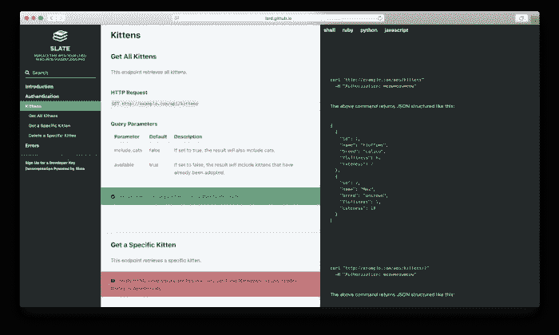

# 如何使用 Slate 构建 API docs 站点并在 Heroku 中部署

> 原文：<https://medium.com/analytics-vidhya/how-to-build-an-api-docs-site-using-slate-and-deploy-in-heroku-783640461330?source=collection_archive---------11----------------------->



# 石板？那是什么？？？

Slate 是一个基于 Ruby 的工具，它从一组 markdown 文件中生成一个漂亮的三面板 API 文档静态站点。它是由开发人员罗伯特·洛德在 2013 年建造的，当时他 18 岁，在旅游软件公司 Tripit 实习。

# 使用本机构建您的站点

# 依赖关系:

至少，您需要以下内容:

*   [红宝石](https://www.ruby-lang.org/en/) > = 2.5
*   [捆扎机](https://bundler.io/)
*   [节点 JS](https://nodejs.org/en/)

请注意，目前官方只支持 Linux 和 macOS。虽然 slate 应该可以在 Windows 上运行，但它不受支持。

不同操作系统/发行版的安装说明见下文。

# 在 Linux 上安装依赖项

安装 Ruby、NodeJS 和用于编译原生 ruby gems 的工具:

在 Ubuntu 18.04+上

```
sudo apt install ruby ruby-dev build-essential libffi-dev zlib1g-dev liblzma-dev nodejs patch
```

在 Fedora 31+上

```
sudo dnf install @development-tools redhat-rpm-config ruby ruby-devel libffi-devel zlib-devel xz-devel patch
```

然后，更新 RubyGems 并安装 bundler:

```
sudo gem update --system
sudo gem install bundler
```

# 在 macOS 上安装依赖项

首先，安装[家酿](https://brew.sh/)，然后安装 xcode 命令行工具:

```
xcode-select --install
```

同意 Xcode 许可协议:

```
sudo xcodebuild -license
```

安装节点运行时:

```
brew install node
```

更新 RubyGems 并安装 bundler:

```
gem update --system
gem install bundler
```

# 正在设置

1.  在 Github 上分叉这个库。
2.  用`git clone [https://github.com/YOURUSERNAME/slate.git](https://github.com/YOURUSERNAME/slate.git)`将*你的分叉库*(不是我们原来的)克隆到你的硬盘上
3.  `cd slate`
4.  为石板安装红宝石宝石:

```
# either run this to run locally
bundle install
```

注:如果以上安装 nokogiri 和使用 macOS 失败，请参见[这里的](https://github.com/sparklemotion/nokogiri.org/blob/master/docs/tutorials/installing_nokogiri.md#macos)获得一些有用的提示。

# 跑步记录

您可以通过两种方式运行 slate，要么作为开发的服务器进程，要么只是构建 html 文件。

要执行第一个选项，请运行:

```
bundle exec middleman server
```

你应该可以在 http://localhost:4567 看到你的文档。哇哦。太快了！

第二个选项(构建 html 文件)，运行:

```
bundle exec middleman build
```

就这样，你完成了。

**让我们部署到 heroku:**

> *中间人是一个静态网站生成器，使用现代网络开发中的所有快捷方式和工具*

# 为 heroku 建立网站:

中间人是一个**静态**站点生成器，因此，我们需要在部署时弄清楚如何构建站点。这样就不必在部署之前构建站点并提交结果。

Heroku 将自动尝试执行一个名为`assets:precompile`的耙子任务。

这原本是为了 Rails 的利益，但我们现在可以利用这一点来满足自己的需求。

我创建了一个新的`Rakefile`并添加了以下内容。

```
namespace :assets **do**
  task :precompile **do**
    sh 'middleman build'
  **end**
**end**
```

当站点被推送到 Heroku 时，这个任务只需调用自动构建站点的`middleman build`。中间人将所有文件输出到`./build`。

# 为网站服务:

一旦你理解了基础知识，在 Heroku 上服务一个静态中间人站点的过程是非常简单的。该网站将作为一个机架应用程序运行，所以我们需要一个`config.ru`文件。这是我的样子。

```
require 'rack'
require 'rack/contrib/try_static'*# Serve files from the build directory*
use Rack**::**TryStatic,
  root: 'build',
  urls: %w[/],
  try: ['.html', 'index.html', '/index.html']run lambda{ **|**env**|**
  four_oh_four_page **=** File.**expand_path**("../build/404/index.html", **__FILE__**)
  [ 404, { 'Content-Type'  **=>** 'text/html'}, [ File.**read**(four_oh_four_page) ]]
}
```

`Rack::TryStatic`部分是当站点被推送到 Heroku 时，我们如何提供中间人构建的静态文件。中间人将所有文件输出到`./build`。

如果`Rack::Trystatic`应用程序没有提供页面，则使用下一个`run`部分提供 404 页面。

确保将`rack-contrib`添加到您的`Gemfile.`中

我决定使用 [Puma](http://puma.io/) 网络服务器来执行*实际的*文件网络服务，因为我以前从未使用过它，并且想尝试一下。我将 Puma 添加到我的`Gemfile`中，并创建了这个`Procfile`。

```
web: bundle exec puma **-**p $PORT
```

彪马表现很好。

就这么简单。一旦被推到 Heroku，一切都正常了

# 保持网站活力:

我用一个免费的 Dyno 服务这个网站，速度非常快。诚然，这个网站没有收到大量的流量，但它仍然非常快。

单个 Heroku Dyno 的唯一缺点是，它会在一段时间不活动后闲置，这种情况经常发生，除非你有大量的常规流量。

我为了保持网站的活力，网站需要定期请求。

为此我使用了 [Pingdom](http://www.pingdom.com/) 。

谢谢…编码快乐。