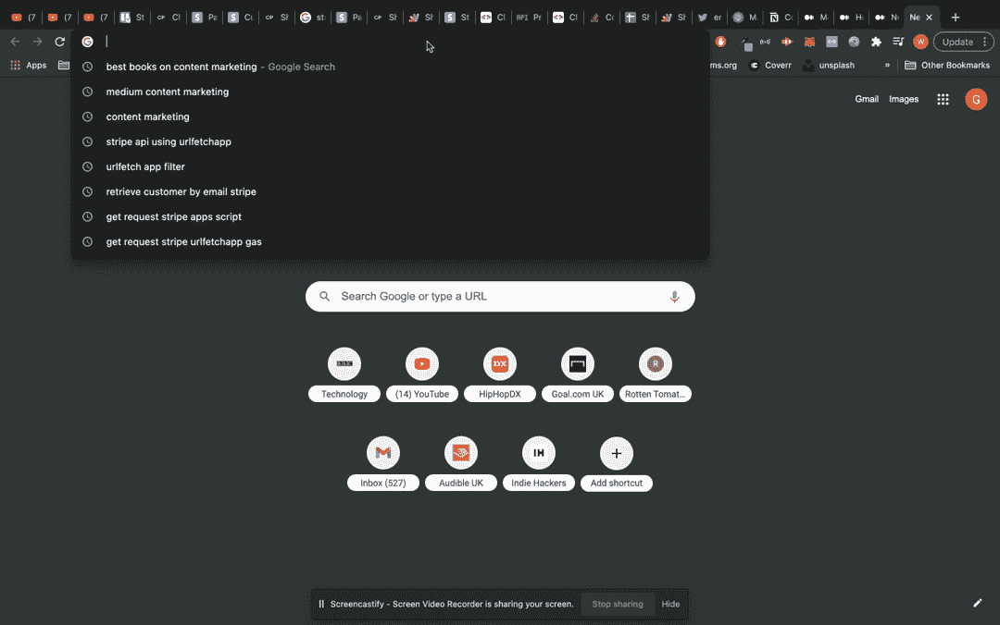

# 如何建立一个自动化的数据通讯新冠肺炎在 5 个步骤与无代码？

> 原文：<https://medium.com/analytics-vidhya/how-to-build-an-automated-data-newsletter-on-covid-19-in-5-steps-with-no-code-cb515f6e8e11?source=collection_archive---------29----------------------->

创建您想要查看的 covid 数字的自动每日简报。在你的收件箱里。

由 Unsplash 的 Maxim Ilyahov 提供

在这些繁忙的时候，比以往任何时候都更难掌握简单的数据。虽然有点病态，但这将有助于获得每日 covid 统计的高水平概述，而不必每天早上查看网站。此外，某些网站提供的数据比需要的多一点，所以只截取你想看的统计数据并获取每日简报也是有用的。

嗯，我在这里告诉你，这是相对简单的设置这一切没有精通编码或数据科学；我们只需要一张谷歌表单，不到 10 分钟就能搞定。

# 第一步:打开一个谷歌表单

这是不言自明的，最快的方法是在谷歌搜索栏中输入命令“sheets.new”。这将旋转一个新的页面，我们可以开始工作。

# **第二步:将数据导入工作表**

Google sheets 恰好有一个非常方便的从网络导入数据的功能。它被称为 IMPORTHTML，最适合用于从网站导入表格或列表。**这个公式的美妙之处在于它每 15 分钟刷新一次数据源，这对于内置自动化来说是完美的。**出于本教程的目的，我们将使用 [worldometers](https://www.worldometers.info/coronavirus/#countries) ，因为它是可靠且全面的 covid 数据源。它还有按国家划分的数据，这是一种有用的划分。

使用该函数，我们可以通过 worldometers url 简单地导入数据，说明数据的类型和位置。查看网页，它看起来是网站上的第一个表格，因此我们将使用“表格”作为数据类型，使用“1”作为位置。这是完整的公式:

## = IMPORTHTML(" https://www . worldometers . info/coronavirus/# countries "，" table "，1)

# **第三步:整理数据**

接下来，我们想稍微整理一下数据，这样我们就只有国家分组了(而不是国家和洲都在上面)。为此，您可以将列标题复制到一个新的选项卡中，然后从洲分组(第 10 行)下面的数据开始。

# **步骤 4:下载电子表格**

SheetSpread 是 google 的一个插件，可以很容易地从 google sheets 中创建数据通讯。它从你的工作表中取出一个数据表，并允许你计划多久用电子邮件把数据发给你自己或其他人。

要下载它，去谷歌市场[这里](https://gsuite.google.com/marketplace/app/sheetspread/257074946633)

SheetSpread 是 Google Marketplace 上的一个实时应用程序

# 步骤 5:创建数据简讯

下载完成后，你需要做的就是在 google sheets 中打开应用程序(通过附加菜单)，选择你想要包含在时事通讯中的数据区域，并设置你的自定义日程。对于我的时事通讯，我想看到的是总病例数、总死亡数和总恢复数(因为这不全是厄运和悲观！).我也只希望看到前 20 个国家，以便集中在受灾最严重的地区，因此在这种情况下，我将选择单元格 A1:H21。

就是这样！第二天早上你查看你的电子邮件，它应该看起来像下面的图片(你也可以选择电子表格中的“立即发送”选项来发送一次性电子邮件)。

最后，您可以选择通过从您的电子邮件日程中删除来停止简讯，只需在电子表格中导航到“查看电子邮件日程”并从列表中删除简讯。如果你等得够久，还有一个小惊喜:)。

如您所见，跟踪您所关心的指标非常简单。Google sheets 是一个从网上抓取原始数据的强大工具，SheetSpread 非常适合每天在你的收件箱中创建数据通讯。

这只是这两个工具一起使用时所能做的事情的皮毛，我希望以后能看到更多的例子！

**P.S.** 这篇文章是真心想帮助人们，所以我必须公开我也是小型张的创始人！欢迎随时关注我的推特[@ gbadewole](https://twitter.com/gbadeadewole)获取更多更新。