# 如何从零开始建立用于眼睛问题失明检测的 DL 模型

> 原文：<https://medium.com/analytics-vidhya/how-to-build-dl-models-from-scratch-for-eye-problems-blindness-detection-e16dd47183b9?source=collection_archive---------12----------------------->

“人们说眼睛是心灵的窗户”。我们通过视觉感知了 80%的印象。根据最近的调查，从 2010 年到 2050 年，美国糖尿病视网膜病变的人数预计将增加近一倍，从 770 万增加到 1460 万。所以，早期发现 DR 对防止患者失明问题起着至关重要的作用。作为本案例研究的一部分，我们将使用一些 DL 技术来解决 DR 检测问题。

# 概观

本博客分为 10 个部分；它们是:

1.业务问题的解释

2.我们的数据来源

3.解决我们问题的现有方法

4.我们的方法

5.图像预处理

6.探索性数据分析

7.如何开发一个 DL 模型

8.以表格形式比较您的所有模型

9.如何开发进一步的改进

10.参考

1.  **业务问题说明**

糖尿病视网膜病变是一种可能发生在糖尿病患者身上的疾病。它会对视网膜造成渐进性损伤，导致视力丧失和失明。这是一种严重威胁视力的糖尿病并发症。

血液中过多的糖会对全身造成损害，导致疾病，包括眼睛。当这些微小的血管泄漏血液和其他液体时，就会发生这种情况。通常会影响双眼。一个人患糖尿病的时间越长，就越有可能患上糖尿病性视网膜病变。如果不治疗，会导致失明。

**糖尿病视网膜病变进展有四个阶段:**

轻度非增生性视网膜病变——早期阶段，仅出现微动脉瘤

中度非增生性视网膜病——这一阶段可以描述为由于血管随着疾病的发展而扭曲和肿胀而丧失了血液运输能力

严重的非增生性视网膜病变——这是一个由于更多血管堵塞而导致视网膜供血不足的阶段，因此会向视网膜发出新血管生长的信号

增生性糖尿病视网膜病变——是晚期阶段，其中视网膜分泌的生长特征激活新血管的增生，新血管在一些玻璃体凝胶中沿着视网膜内侧覆盖物生长，充满眼睛。

**2。数据**

大多数数据来自 https://www.kaggle.com/c/aptos2019-blindness-detection.，为了获得更多的眼底图像，我们选择了一些其他来源，如 IDRiD (1) & MESSIDOR (2)。到目前为止，他们依靠训练有素的医生来检查视网膜的图像并提供诊断。所以，我们的目标是通过技术扩大他们的努力；通过建立稳健的 ML/DL 训练模型来识别糖尿病视网膜病变的潜在患者。

**3。解决问题的现有方法:**

他们使用编码器-解码器架构，但他们没有训练编码器，而是使用 Imagenet 预训练 CNN 作为编码器的初始化。他们使用了三个解码器——分类头、回归头和有序回归头。分类头输出一个热编码向量，其中每个阶段的存在表示为 1。回归头输出 0 到 4.5 之间的实数，然后四舍五入为代表疾病阶段的整数。对于有序回归头，如果数据点属于类别 k，则它自动属于从 0 到 k-1 的所有类别。通过将线性模型拟合到三个头的输出来获取最终预测。参见参考网站(3)。

他们采用了多阶段训练过程

**预训练-** 他们从 Imagenet 预训练 CNN 初始化权重，它已经使用迁移学习在大数据集(2015)上训练。他们使用小批量 SGD 和余弦退火学习率表进行训练。经过预训练后，他们使用编码器权重作为后续阶段的初始化。

**Main-training -** 它对 2019 年的数据进行了处理，IDRID 和 MESSIDOR 相结合，从预训练阶段训练的重量开始。他们对分类头使用焦点损失，对顺序回归头使用二元焦点损失，对回归头使用均方误差。它已经训练了亚当优化器和余弦退火学习率表。

**训练后-** 他们建立了不同人头输出的线性回归模型。

**正则化-** 他们使用了权重衰减和丢失进行正则化。还应用了标注平滑以降低错误标注的重要性。

**集成**-他们集成了具有不同分辨率的 3 种编码器架构的模型，这些模型在维持数据集上得分最高:EfficientNet-B4、EfficientNet-B5 和 SE-ResNeXt50

他们使用了 3 个 CNN 架构的集合，并为我们的最终解决方案进行了迁移学习，他们取得了高且稳定的结果。

**4。我们的方法:**

下面是一些计划用来解决这个问题的迁移学习技巧:

1.**研究论文模型** —我们可以尝试复制研究论文中提到的三阶段培训实施。

2. **DenseNet** —将 DenseNet 架构应用于数据增强技术，如旋转、缩放、裁剪、翻转等。

3. **VGG 16** —使用没有完全连接层的预训练 VGG-16 模型，并用 Imagenet 训练的权重初始化所有权重。之后，2 个 conv 层等同于 FC，输出层使用分类交叉熵作为损失函数。VGG 16 网没有培训。

我们可以使用二次加权 kappa 分数作为性能度量，使用 Macro-F1 分数作为其不平衡数据集。

**5。图像预处理**

图像预处理中遵循的步骤:

图像中三色通道(红色、绿色和蓝色)的绿色通道血管、渗出物和出血之间的对比在绿色通道中看得最清楚，该通道既不像其他两个通道那样照明不足也不过度饱和。因此，我们只提取绿色通道进行分析和分类。

对比度增强为了进一步增强图像的特征，执行对比度受限的自适应直方图均衡化

围绕图像中心画一个圆

将图像大小调整为 512 * 512

围绕圆裁剪无信息区域

图像平滑

下面是预处理方法的代码片段:

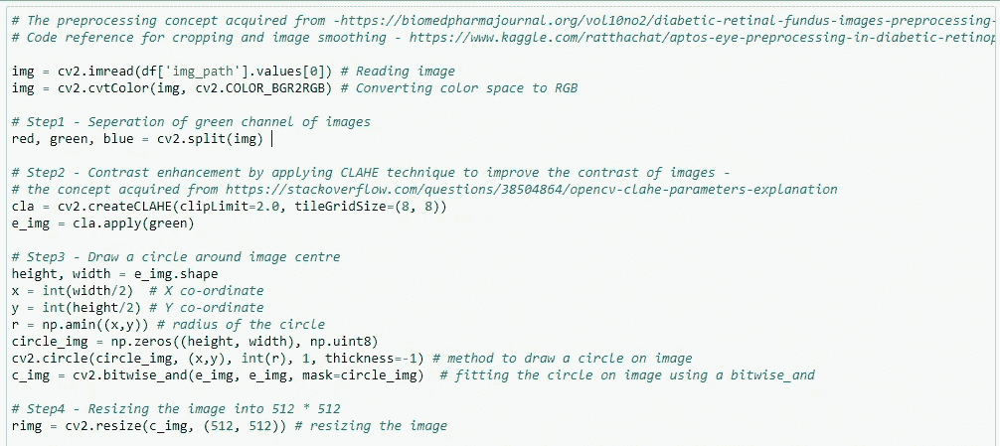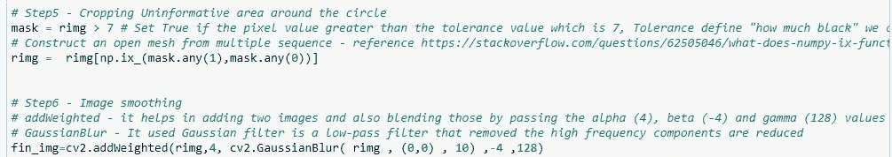

**6。探索性数据分析**

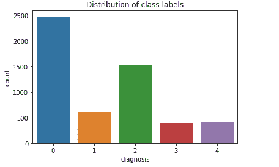

这是一个不平衡的数据。无灾难恢复类别的更多样本数。严重-3 和增生-4，这些样本的大小大大少于其他类别。

绘图-原始眼底图像与预处理后的眼底图像

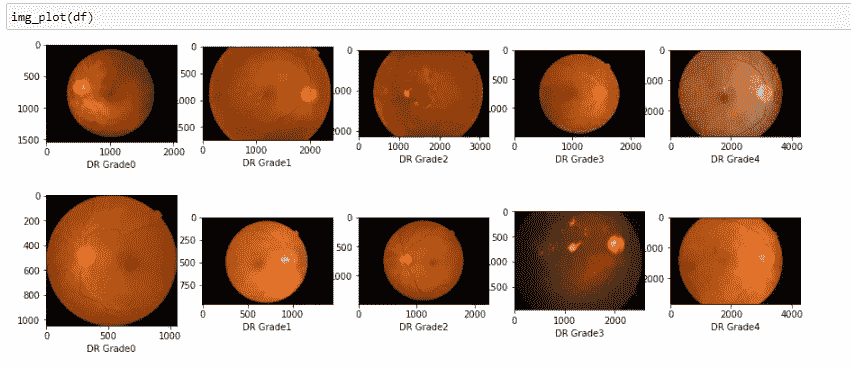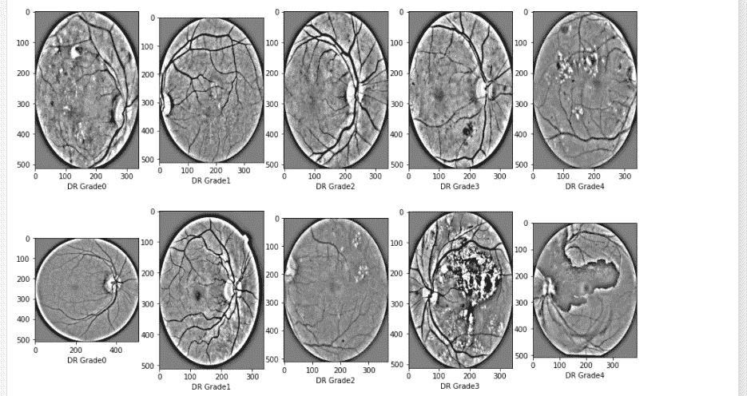

***观察结果*** :

通过观察预处理的眼底图像，我们可以更容易地发现 DR 分级

3 & 4 级预处理眼底图像上有许多斑块和空白

DR 级预处理眼底图像上没有太多斑块和空白

**7。如何开发 DL 模型**

如前所述，我们已经执行了上述预处理技术，并将原始图像转换为更清晰的图像，可以输入到模型中。

之后，我们对预处理后的图像进行了增强——旋转、翻转、缩放、亮度和 zca _ 白化

1.  **研究论文的实施**

以下是研究论文的架构:

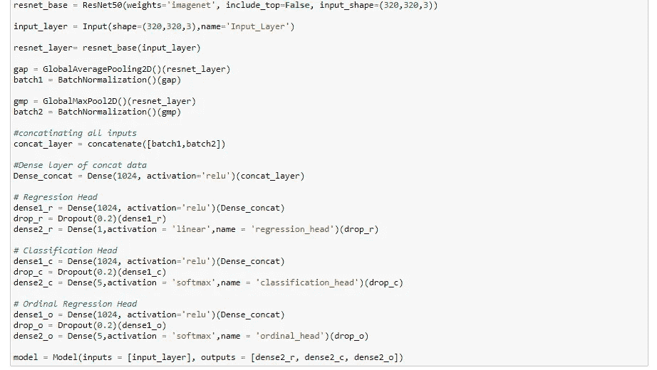

作为阶段 1-预训练的一部分，我们将使用预处理的眼底图像来训练所有层

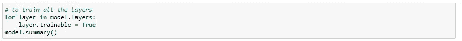

之后，作为第二阶段主要训练的一部分，我们将冻结顶层 5 个时期

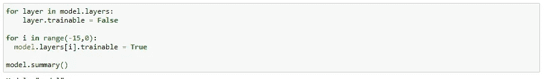

5 个时期后，解冻所有层，使所有层可训练，并训练 50 个时期。

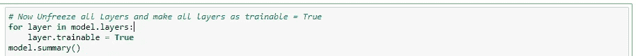

之后，作为第三阶段(后培训)的一部分，我们建立了不同头部输出的线性回归模型。

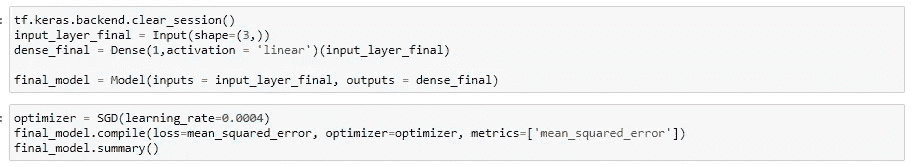

预测测试集结果并计算二次 Cohen kappa 分数和 Macro -F1 分数

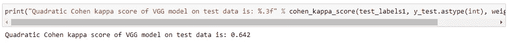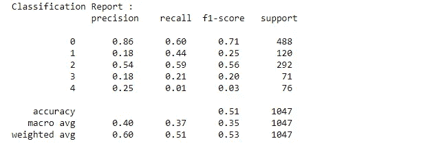

测试数据二次科恩卡帕评分:0.64，不达标。

**2。实施 DenseNet**

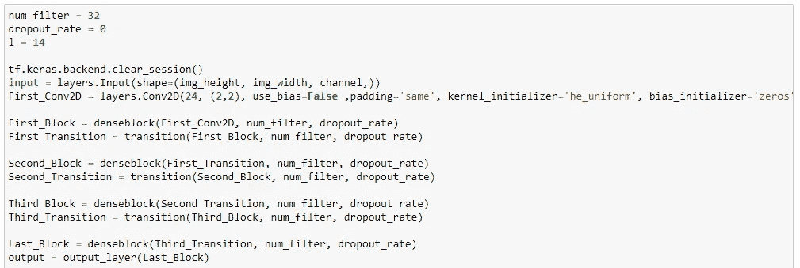

预测测试集结果并计算二次 Cohen kappa 分数和 Macro -F1 分数

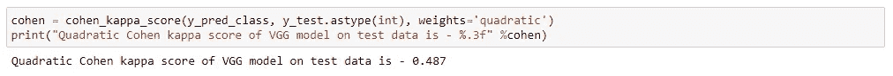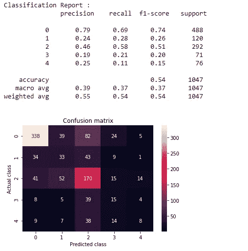

测试数据的二次 Cohen kappa 评分:0.48，比之前的模型最差。

**3。VGG16** 的实现

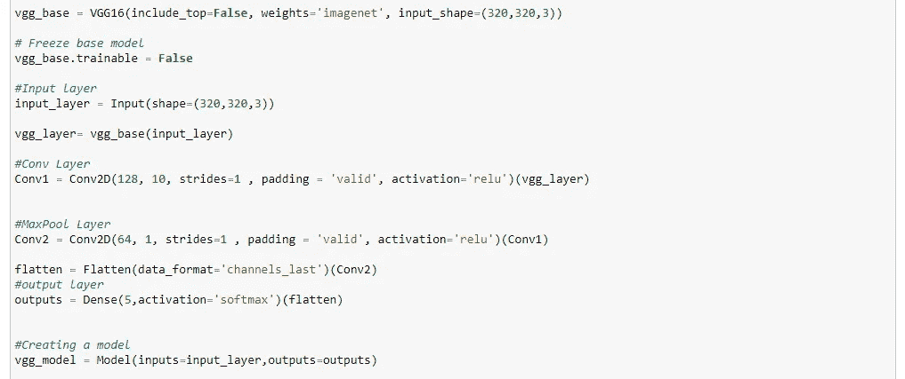

预测测试集结果并计算二次 Cohen kappa 分数和 Macro -F1 分数

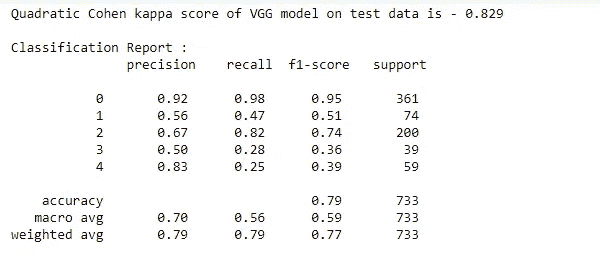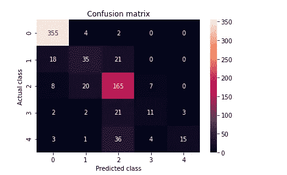

测试数据的二次科恩卡帕评分:0.82。这表明这是我们为盲检测建立的最好的模型，优于前两个模型。

**8。以表格形式比较您的所有型号**

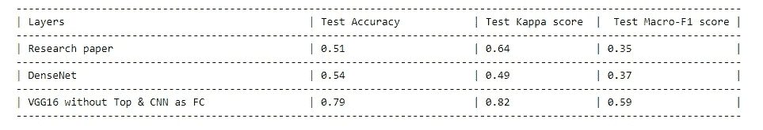

根据以上数据，可以清楚地看出 VGG16 是所有型号中最好的型号。因此，我们最终确定 VGG16 作为我们对这个问题的预测模型，它返回二次 Cohen kappa 分数为 0.829 & 80%的准确度。

尽管有不平衡的问题，我们的 VGG16 模型能够像预期的那样预测大约 80%的点，这在模型性能方面真的很棒。

**9。如何进一步改进**

毫无疑问，有一个范围来尝试一些其他 CNN 架构，如 EfficientNet、DarkNet、Inception Net 等。，以提高模型的性能。此外，我们可以用可以从 2015 APTOS kaggle 数据集产生的更多眼底图像来训练模型。

代码可在 github[https://github.com/muru94/blindness_detection.git](https://github.com/muru94/blindness_detection.git)获得

这是部署模型的演示

 [## 20210910_153057.mp4

### 编辑描述

drive.google.com](https://drive.google.com/file/d/1nhLNkTZ3DhUP62HHYuBGpyQSZ3l6fqUe/view?usp=sharing) 

Linkedin 个人资料—[www.linkedin.com/in/murugesh-krishnan-718971157](http://www.linkedin.com/in/murugesh-krishnan-718971157)

**10。参考文献**

1.  [https://IEEE-data port . org/open-access/Indian-diabetic-retinopathy-image-dataset-idrid](https://ieee-dataport.org/open-access/indian-diabetic-retinopathy-image-dataset-idrid)
2.  [https://www.adcis.net/en/third-party/messidor/](https://www.adcis.net/en/third-party/messidor/)
3.  [https://arxiv.org/abs/2003.02261](https://arxiv.org/abs/2003.02261)
4.  [https://www.appliedaicourse.com/](https://www.appliedaicourse.com/)