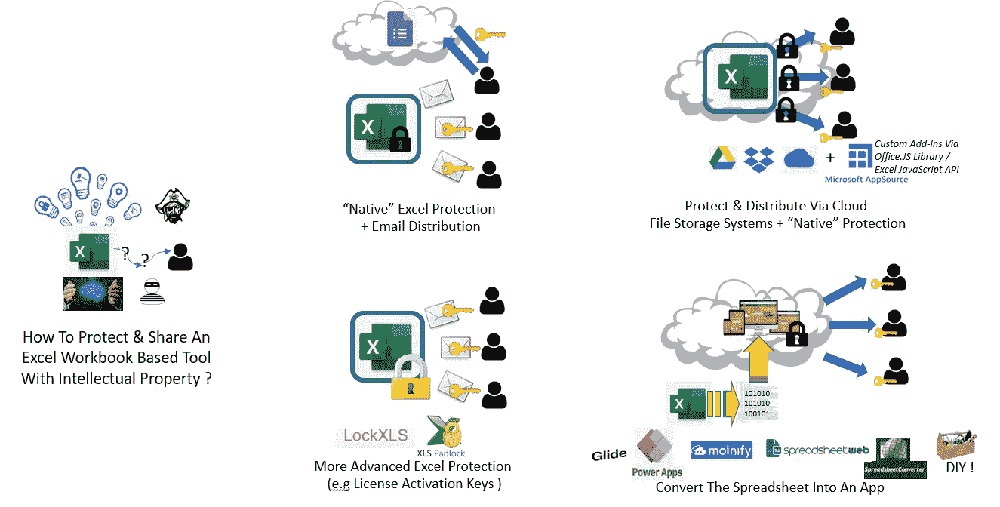
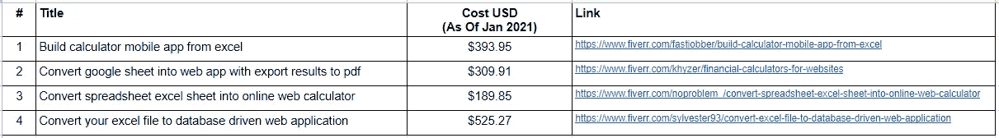

# 如何构建、保护和共享一个专有的电子表格计算器工具，作为“类似 SaaS”的产品

> 原文：<https://medium.com/analytics-vidhya/how-to-build-protect-share-a-proprietary-spreadsheet-calculator-to-support-lead-generation-da72e7a46cfa?source=collection_archive---------8----------------------->

想象一个场景，你在一家中小企业，花了一些时间开发一个基于自定义电子表格的“计算器”工具。(例如，mortgate 计算器或家庭维修报价评估工具或医疗筛选工具等)。

*也许你想免费提供它，只要用户提供一些联系方式，这样你就可以为你的其他服务建立一个潜在客户名单，或者你甚至想将这个工具货币化，并希望在用户购买付费版本之前设置一个“免费试用期”。*

*现在你需要弄清楚的是，你如何才能广泛地分发你的工具，但仍然有可见性和对谁使用它的一些控制，并保护内部的专有信息。*

如果这些听起来很熟悉，那么这篇文章也许能帮到你。

(如果你更喜欢观看而不是阅读，你也可以跳过下面的文章，浏览一下这个整理了所有视频的播放列表……[https://www.youtube.com/playlist?list = plx 06 F3 ukoznbkvfbnda 3 jgwjkikzdu 3k](https://www.youtube.com/playlist?list=PLx06F3uKOZnbkVfbndA3JGWJkIIKzdu3k)

# **概要:**

*   [**上下文&客户需求**](#2f8a)
*   [**介绍工作实例:流行病传染估计工具**](#307a)
*   [**选项一:DIY 宏(Excel)+密码保护**](#0695)
*   **__** [**选项 1A:全部锁定**](#ef50)
*   **__** [**选项 1B:允许打开文件但需要电子邮件激活**](#be60)
*   **__** [**选项 1C:允许文件打开但设置有限试用期**](#3925)
*   **__** [**【通过调查响应工具“分发”文件 URLs 密码**](#4294)
*   [**选项 2:第三方工作簿保护/许可工具**](#d370)
*   [**选项 3:在线共享工作簿，锁定/隐藏关键元素**](#4621)
*   [**选项 4a:通过托管服务**](#8d6b) **(例如 Glide & Molnify)** 将电子表格转换为 Web 应用
*   [**选项 4b:将电子表格转换成网络应用——DIY 方法**](#a7f1)
*   [**结论**](#7edc)

# A.背景和客户要求

在我的一份自由职业工作中，我有一个客户，他有一个相当复杂的基于 Excel 电子表格的工具，可以根据用户提供的参数(例如行业类型、预期客户保留率、增长率、流失率等)以及一些专有的内部基准/经验法则比率进行财务估算(例如预计的年收入、成本、利润等)。

我的客户试图找出如何将该工具分发给广大受众(预计超过 100 个以上的用户)，但仍然确保某些表格范围/公式保持隐藏，并控制文件的访问/转发方式。

因此，任何解决方案都需要能够做到以下几点:

1.  **(必须有)防止用户打开 Excel 中隐藏的工作表**，其中存储了‘秘制酱’的计算(是一堆自定义的动态数组公式)**转发文件**；或者“**泄露”密码**
2.  **(必须)记录(同意的)用户**的电子邮件联系和其他相关详细信息，因为它也是一个“免费样品”工具，用于追加销售公司的其他更全面的咨询服务。
3.  (很高兴有)一个额外的收获是找到一种方法来限制用户访问工具的持续时间，通过设置自动失效日期或者限制文件可以打开的次数
4.  **(** 很高兴拥有)**收集&用户输入/输出结果的存储**每次运行计算以进行汇总级分析*可能会很有趣*，但前提是可以轻松安全地做到这一点&

# **B .介绍工作实例:流行病传染估计工具**

以下所有示例将引用一个相对简单的 macro free* ***示例电子表格*** ，该电子表格基于逻辑增长曲线或 SIR 流行病学模型，根据每日和累计病例数计算并绘制疾病传染的增长率。此外，它还估计了峰值每日病例数和最大累积病例数将出现的日期(注意:如果你对这个主题的实际数学/科学感兴趣，我在 2020 年就此写了另一篇文章)

这是指向文件本身的链接，没有任何保护/修改。

 [## 00_Base_EpiCurvePlot.xlsx

### 在线存储照片和文档。从任何 PC、Mac 或手机访问它们。在 Word、Excel 或……上创建和协同工作

1drv.ms](https://1drv.ms/x/s!AqZfpTxqClrLhkXfM1yJACw4QZkh?e=7ee4Oa) 

*实际上，这些电子表格工具可能包括宏，甚至自定义插件(*。XLA)但是为了简单起见，我从小事做起。

# **C .方案一:DIY 宏(Excel)+密码保护**

**选项 1A:全部锁定**

最简单的方法是只隐藏任何专有的公式/数据，锁定除输入之外的所有其他单元格，保护工作表和工作簿结构，最后加上另一个密码要求来打开文件。之后，该文件(或其下载链接)可以附在营销电子邮件中，发送给任何潜在客户/用户。

根据感兴趣的新用户的请求，文件作者将通过电子邮件或 sms 等发送密码。

(注意——您需要下载本地副本并在 Excel 桌面上打开，因为宏在 Excel Online 中不工作——密码是“弱的”(哈哈))

 [## 01A _ PW _ Protected _ epicurveplot . xlsx

### 在线存储照片和文档。从任何 PC、Mac 或手机访问它们。在 Word、Excel 或……上创建和协同工作

1drv.ms](https://1drv.ms/x/s!AqZfpTxqClrLhlDDLNPmIh4i7NA4?e=lpUtDA) 

**选项 1B:允许打开文件，但要求在“激活”前注册**

在这个版本中，用户得到了更多的信任，因为文件可以在没有密码的情况下打开(这很好，因为用户至少可以看到布局结构——例如输入/输出),但是所有的计算都是“无效的”。

通过使用一个宏，用户会被提示(*我是自愿这样做的——这样我们就不会显得太咄咄逼人；-)* )分享自己的邮件来“激活”基本功能。(但是请注意，即使在 calc 字段被激活后，敏感的工作表/公式/表格仍然被 excel 的本机密码保护所隐藏)

(注意—您需要下载本地副本并在 Excel 桌面上打开，因为宏在 Excel Online 中不工作)

 [## 01B _ PW _ Protected _ W _ macro foremailing _ epic . xlsm

### 在线存储照片和文档。从任何 PC、Mac 或手机访问它们。在 Word、Excel 或……上创建和协同工作

1drv.ms](https://1drv.ms/x/s!AqZfpTxqClrLhk-Vtt4PZZCuvNMh?e=6UDL0h) 

**选项 1C:设置基于时间或基于使用次数的到期条件**

这几乎是一样的工作方式，但现在电子表格有了一个“倒计时”计时器，所以一旦文件“到期”，用户必须回到你这里永久解锁，而不是依赖于他们会分享电子邮件或其他信息的善意

 [## 01C _ PW _ Protected _ W _ Macro _ 临近试用期结束. xlsm

### 在线存储照片和文档。从任何 PC、Mac 或手机访问它们。在 Word、Excel 或……上创建和协同工作

1drv.ms](https://1drv.ms/x/s!AqZfpTxqClrLhklFNEejpDIIcsyw?e=EgoMdP) 

**使用调查响应工具分发文件 URL&密钥/密码**

最后—在上述所有选项中，密码都被假定为通过电子邮件共享。然而，有一些方法可以优化密码传播，例如，取代早期的“推送式”方法(这种方法可能令人不快，因为它需要手动通知作者并等待回复才能获得密码)，更自动化的“拉取式”是通过 Google Form 自动回复来共享(常用)密码，同时收集用户电子邮件和个人信息，而不是像这样的电子邮件:

这是一个[链接，指向视频](https://docs.google.com/forms/d/1oAucH2gO1Up1coOUOJbBHMPi63_3VEoutwVkcIfEv7U/edit?usp=sharing)中使用的示例 Google 表单

**优点:**

*   简单明了。

**缺点:**

*   不太安全，因为只受 excel 密码的保护(网上有很多 Excel 黑客工具),而且有很多方法可以“欺骗”宏来规范使用
*   更令人担忧的是，这些都依赖于信任，因为仍然没有什么可以阻止不道德的用户将他们的密码或文件的激活副本转发给其他人
*   即使我们假设(弱的)安全性足以阻止普通用户滥用该工具，密码/版本管理也可能成为一个问题。如果所有分发的文件都使用一个通用的“主”密码，那么一个漏洞就会暴露电子表格的内部工作原理。如果有多个密码(每个收件人一个)，那么您需要管理使用不同密码跟踪不同文件的管理任务。

**成本:**

*   免费，因为这些都只是基本的 excel 安全功能！

# D.选项 2:第三方工作簿保护/许可工具

这是对以前选项的一个重大改变，对于希望“许可”其电子表格并限制其 IP 共享方式的高级 Excel 作者来说，这是一个非常常见的解决方案。

提供此功能的一些(付费)工具有:-

*   [XLSPadlock](https://www.xlspadlock.com/distribute-workbook)([https://www.xlspadlock.com/distribute-workbook](https://www.xlspadlock.com/distribute-workbook))
*   [LockXLS](http://www.lockxls.com/product.asp)([http://www.lockxls.com/product.asp](http://www.lockxls.com/product.asp))
*   [Xcellcompiler](https://xcellcompiler.com/)([https://xcellcompiler.com](https://xcellcompiler.com/))

 [## 02a _ LockXLS _ Protected _ mustregistertoopen . exe

### 在线存储照片和文档。从任何 PC、Mac 或手机访问它们。在 Word、Excel 或……上创建和协同工作

1drv.ms](https://1drv.ms/u/s!AqZfpTxqClrLhkv3H9ifldGmekfY?e=D7t3Nd)  [## 02b _ lock xls _ Protected _ opensbutwithtrialperiod . exe

### 在线存储照片和文档。从任何 PC、Mac 或手机访问它们。在 Word、Excel 或……上创建和协同工作

1drv.ms](https://1drv.ms/u/s!AqZfpTxqClrLhkxW_kcNj9nDoXtu?e=TO4I4s) 

注意- ***小心****——这些都是*。*exe 文件，所以如果你在公司防火墙后，你可能无法下载这些文件，而且，你可能不应该从网上随便下载并打开 exe 文件；)*

**优点:**

*   分发电子表格的更实用、更可持续的方法
*   有些服务甚至提供在线“许可证生成”服务，以帮助跟踪用户，其中文件可以设置为在特定时间后或在打开特定次数后“自动过期”

**缺点:**

*   虽然这是对选项 1 的巨大改进，但您本质上仍然只是分发文件，因此版本管理仍然需要在“Excel 之外”处理(这意味着如果您想要对计算或公式进行更改，您不能自动“召回”旧文件)

**成本(2021 年 1 月撰写本文时):**

*   取决于具体的套餐(即一次性套餐或订阅套餐等)，但大约在 150-250 美元之间

# **E .选项 3:在线共享工作簿，锁定/隐藏关键元素**

另一个选择是将电子表格工具转移到 Excel Online，这样您就可以在一个驱动器上共享 xlsx 文件。

(* *从技术上来说，如果您的 Excel 文件没有宏或任何像动态数组等奇特的功能，您也可以选择使用谷歌工作表——如果没有，您需要在谷歌的应用程序脚本中重新创建这些功能，因为您的 VBA 不会跨平台翻译*

所有这些云存储工具的一个通用特征是，你可以设置一个密码保护，以便访问者在打开文件之前需要输入密码。

使用“原生”Microsoft 有一些好处，因为任何存储的 Excel 文件都可以在 Excel Online 中打开，这与桌面版本具有相同的外观。然而，一个大的缺点是 Excel Online 不支持 VBA 宏。不过，您似乎可以通过在 Office.JS 中编写自定义加载项来复制类似的功能。

这种方法的问题是，要私下分发它，您需要将它提交到 Microsoft AppSource 平台。[https://stack overflow . com/questions/40251271/how-to-distribute-private-office-add-ins](https://stackoverflow.com/questions/40251271/how-to-distribute-private-office-add-ins)

如果您不这样做，您的最终用户需要了解一些基本的编程，以便他们可以将自定义插件本地加载到他们的 Excel online 帐户:[https://docs . Microsoft . com/en-us/office/dev/add-ins/publish/publish](https://docs.microsoft.com/en-us/office/dev/add-ins/publish/publish)

不幸的是，这是一个我自己还没有完全探索过的领域，所以我没有太多可以分享的(目前)，但我认为它值得一提。

以下是选项 1A/B/C 中包含的同一组文件的链接，但现在可以在 Microsoft OneDrive 上访问:

 [## 媒体文章样本

### 在线存储照片和文档。从任何 PC、Mac 或手机访问它们。在 Word、Excel 或……上创建和协同工作

1drv.ms](https://1drv.ms/u/s!AqZfpTxqClrLhkDA0bcYar6CWQ3b?e=kfybyh) 

**优点:**

*   这避免了版本管理问题(*，如果您对公式或基准等进行任何更新，将需要通知用户请求文件的新版本*，并且您仍然可以隐藏和保护带有敏感公式的标签/保护单元格

**缺点:**

*   如果许多不同的用户需要访问同一个文件(*假设他们需要独立的版本并且没有在同一个数据*上协作)，那么你仍然需要为同一个文件创建**多个副本**，否则**用户将开始覆盖彼此的输入**。不幸的是，多个副本也意味着版本管理的麻烦(例如，如果您更新了一个公式，那么这个变更需要在文件的所有副本中复制)
*   另外，**一个驱动器上的访问控制不够精细，无法允许访问在线视图&编辑，但仍然阻止下载**。似乎微软正在研究这个功能(Ref [Link 1](https://onedrive.uservoice.com/forums/913531-onedrive-sharing-collaboration/suggestions/7105024-prevent-shared-files-from-being-downloaded#{toggle_previous_statuses}) 和 [Link 2](https://answers.microsoft.com/en-us/msoffice/forum/msoffice_sharepoint-mso_win10-mso_o365b/allow-edit-and-not-download/40188539-f487-4a0b-852f-ce18452cc0c4) )，但目前为止它仅限于 PDF-s、图像文件和一些其他文件类型。
*   **没有 VBA 支持** —您需要在 Office 中重新创建宏功能。JS 并找到一种方法来获得

**费用:**

*   免费(Excel Online 和 OneDrive 免费，只要你有 Windows 或 MS Office 版本)

# F.选项 4a:使用托管服务将电子表格转换为 Web 应用程序

安全共享电子表格工具的另一种方法是将电子表格转换为应用程序。市场上有许多解决方案，它们都是通过创建一个前端接口来工作的，该接口使用来自电子表格(如数据库)的数据来执行 CRUD(创建读取更新删除)操作。

事实上，如果你是微软的铁杆粉丝，他们有一款名为 [PowerApps](https://powerapps.microsoft.com/en-us/) 的产品可以做到这一点(还有一整套技巧，不在本文讨论范围之内)

然而，为了做一个演示，我使用了一个名为 [Glide](https://www.glideapps.com/) 的服务，因为我更熟悉它的界面([我以前写过一篇文章，解释我如何使用 Glide](https://zhijingeu.medium.com/building-a-facilities-access-records-tracker-app-using-glide-google-sheets-a07ea89fdf41) 构建一个设施访问记录系统

在此亲自试用该应用程序:-

 [## 04A_GlideApp_EpiCurvePlot

### 编辑描述

幽幽港湾 0419.glideapp.io](https://faint-harbor-0419.glideapp.io/) 

请注意，因为这只是一个演示应用程序，我没有设置登录/注册过程。因此，所有用户都被匿名对待，并使用相同的数据集。这是因为只有一行记录被编辑来创建图表。然而，对于我们的示例应用程序，用户不需要在任何共享数据上进行协作。

然而，正如视频中提到的，在 Glide 中有一种[方法可以做到这一点，如果你打开用户注册并允许用户只查看/编辑他们自己的行。](https://community.glideapps.com/t/restrict-users-to-edit-their-own-records/1265)

不幸的是，如果您的计算很复杂，这种方法会变得很麻烦，因为您必须将输入/输出字段重构为更类似于数据库记录的东西(即，每个输入和输出字段有许多列的行)，并确保在您进行转换时计算保持“完整无缺”。

因此，有一些定制的解决方案可以更好地满足这一需求:

*   [SpreadsheetWeb](https://www.spreadsheetweb.com/)([www.spreadsheetweb.com](https://www.spreadsheetweb.com/))
*   [SpreadsheetConverter](http://www.spreadsheetconverter.com)([www.spreadsheetconverter.com](https://www.spreadsheetconverter.com/examples/))
*   莫尔尼菲([app.molnify.com](https://app.molnify.com/#ajax/examples))

这是我用 Molnify 做的一个演示应用:

链接到应用程序本身，如下所示

 [## 流行病曲线绘图仪应用程序

### 一个定制的应用程序——由 Molnify 提供支持

app.molnify.com](https://app.molnify.com/app/epicurveplotter_molnify) 

注意——如果上面的链接不起作用——这可能是因为我的 30 天免费试用已经到期，但你可以使用[流行病增长估计器应用程序的基本文件注册自己的试用和实验，我已经修改了该文件，以便与 Molnify](https://1drv.ms/x/s!AqZfpTxqClrLhkrdTj0jr_nyYCwz?e=txHx9m) 一起使用

**优点:**

*   这种方法**解决了不同用户同一文件不同副本之间的版本管理问题**
*   根据服务提供商的不同，他们甚至可能为您提供**托管网络应用/转换电子表格的附加功能**
*   类似地，一些服务提供商有**用户登录功能**，因此您甚至可以允许用户存储/检索他们的输入，或者定制他们可以与之交互的字段
*   这些服务中的大部分也是**渐进式/反应式网络应用**，这些应用**与移动设备**一起“玩得很好”——也就是说，用户可以将应用添加到主屏幕，并且从桌面到移动设备没有奇怪的布局问题

**缺点(*取决于服务提供商):**

*   **对转换后的电子表格的观感的潜在约束**(如输出图表和表格的格式和样式)
*   **可以转换/翻译成网络应用的潜在限制**(例如，我发现 Molnify 无法处理 excel 中的动态数组，当我用另一个更复杂的电子表格尝试时，我不得不重新分解一些非常复杂的 Excel 公式)
*   作为“基础”电子表格，用户对正在进行的计算不太透明，所有的公式都是隐藏的。

**成本:在撰写本文时(2021 年 1 月):**

*   有一个 ***很大的变化*** 你需要根据自己的需要做自己的研究:
*   例如，一个提供商对每个应用程序每月收费 10-30 美元(但对每月可对后台电子表格进行的“编辑”数量有上限)
*   另一家提供商对每个应用每月收费 200-300 美元(但没有用户数量限制)
*   还有一家提供商提供“一次性”转换，终身许可证价格约为 250-700 美元，但似乎对不同平台有不同的费率(例如 HTML 与原生 Android/iPhone 页面)

## 奖励材料:

这有点超出了本文的范围，但是也可以使用像 Power BI(或者甚至 Tableau)这样的数据分析工具来实现类似的东西。

下面是我制作的一个仪表板的链接，它允许你直接绘制和操作逻辑增长曲线的参数，还可以用实际案例数据覆盖它。(如果你感兴趣，我有另外一篇关于 Power BI 的文章

 [## 电源 BI 报告

### 由 Power BI 支持的报告

app.powerbi.com](https://app.powerbi.com/view?r=eyJrIjoiZjZmZmVlNWEtOTY3OS00NzUxLTgyNjctN2FmNTlkNTRkMWQwIiwidCI6IjNkZjMzNzhmLWY4ZTItNDYzNy04ZjUxLTkzNDQ3N2Q4OGFkMCIsImMiOjEwfQ%3D%3D&pageName=ReportSection) 

(*请注意，SIR 模型模拟不在实时仪表盘上，因为我必须使用 Python 来完成，而且显然 Python 集成到公开托管仪表盘的 PowerBI 中是一项仅适用于高级层客户的功能*

# G.选项 4b:将电子表格转换成网络应用程序——DIY 方法

如果其他选项不适合你，而你有其他的专业需求，你也可以自己动手制作一个定制的网络应用程序。

这里有一个 Python Flask web 应用程序的简单示例，它复制了我随后使用 Heroku 部署的电子表格工具。

在此亲自试用该应用程序:-

 [## 演示应用程序-流行病传染评估工具

### 这是一个最小的可行的演示应用程序，展示了如何将 Excel 电子表格工具转换成…

epidemic-curve-flask-pwa-app.herokuapp.com](https://epidemic-curve-flask-pwa-app.herokuapp.com/) 

**优点:**

*   完全控制设计/布局和用户访问管理流程

**缺点:**

*   需要相当数量的编程能力来发展

**成本:**

*   你自己的时间和精力，如果你是自己构建的话——上面的应用程序(无可否认是非常简单的)花了我大约一天的时间来制作和部署。
*   如果你通过自由职业者服务平台雇人帮你做这件事——价格从 200-500 美元不等，作为一次性费用，根据你所追求的东西的复杂程度来构建你的东西(注意——你可能仍然需要单独寻找和支付应用程序等的托管费用)

*基于如下 10 分钟快速在线搜索:

[https://docs . Google . com/spreadsheets/d/1 auwz 5 ojft 8 ho 0 oim-eg 4 wh 7 NX foe-rbcyyynme 72 rdq/edit？usp =共享](https://docs.google.com/spreadsheets/d/1aUwZ5ojFT8ho0oiM-eg4wh7NXfOe-RBCyYyNmE72rDQ/edit?usp=sharing)

# H.结论

因此，在涵盖了从简单到更复杂的解决方案的所有选项后，您可能会想知道什么最适合自己？嗯……这取决于你追求的是什么——我的建议是考虑以下几个方面

*   Excel 电子表格中的专有内容有多敏感/机密？
*   Excel 工具中的公式/计算有多复杂——例如，没有宏可以吗？(一般来说，代码越简单，就越容易将其转化为 web 应用程序)
*   您的电子表格将作为单独的独立实例使用，还是您希望多人协作编辑/查看同一组共享数据？
*   您是否计划使用您的计算器工具作为收集其他信息的手段，例如，用户电子邮件/联系信息来描述您的潜在客户，或者汇总用户计算运行的输入/输出来寻找见解(…如果是这样，您需要考虑如何传输/存储这些数据的数据隐私和数据安全性)
*   你希望有多少人分享这个工具？
*   所有用户都是匿名的吗？他们与电子表格工具的交互方式是否相同？(例如，如果您想将电子表格转化为应用程序，这一点尤为重要——您需要保存/加载数据选项吗？您是否有不同类型的用户，他们可能拥有不同级别的访问权限来查看或编辑某些字段？)
*   用户数量将以什么样的速度增长？
*   最重要的是…你能买得起什么？

如果你需要帮助，我的 Fiverr 上有一个工作机会，我可以和你一起优化和改进你的电子表格(Excel 或 Google sheets——我可以两者都用)

 [## 织金谷

### 嗨！我是 Z，在一家大型石油和天然气公司有超过 15 年的项目管理经验，我可以帮助你…

www.fiverr.com](https://www.fiverr.com/zhijingeu) 

希望这篇文章对有类似需求的人有用。我把所有的样本文件和代码都放在了这个 GitHub 和 OneDrive 文件夹中。

 [## 织金古/XLS 至弗拉斯克瓦普

### 这是一个非常简单的基于 Flask 的渐进式 Web 应用程序，演示了将一个简单的

github.com](https://github.com/ZhijingEu/XLS_To_FlaskPWApp)  [## 媒体文章样本

### 在线存储照片和文档。从任何 PC、Mac 或手机访问它们。在 Word、Excel 或……上创建和协同工作

1drv.ms](https://1drv.ms/u/s!AqZfpTxqClrLhkDA0bcYar6CWQ3b?e=xPnTbw) 

如果你想让我更详细地扩展或覆盖任何东西，请在评论中反馈，直到下次——玩得开心！