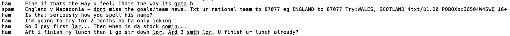
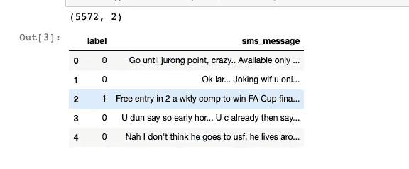
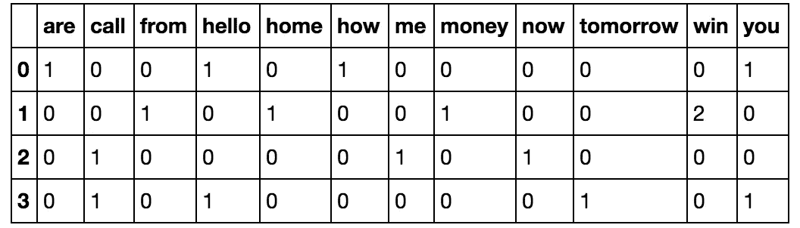
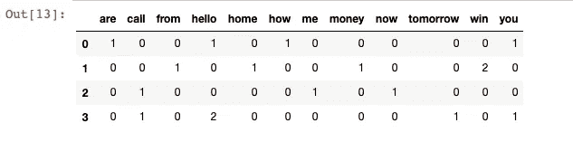
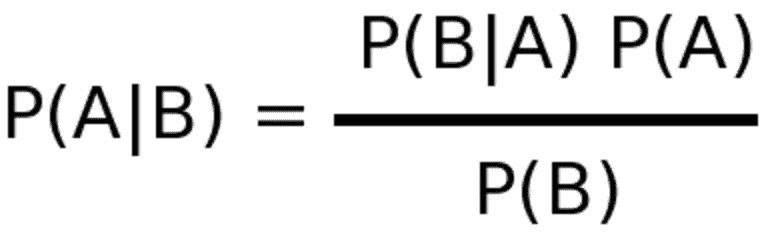
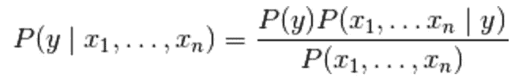

# 如何用朴素贝叶斯构建垃圾邮件分类器(初学者指南)

> 原文：<https://medium.com/analytics-vidhya/how-to-build-spam-classifier-with-naive-bayes-beginner-guide-6c40d2c0a559?source=collection_archive---------6----------------------->

在本文中，我想展示一个简单的算法，如朴素贝叶斯，实际上是如何产生有意义的结果的。我将在一个真实的数据集中介绍该算法，并向算法的利弊解释文本预处理中的每一步。

朴素贝叶斯算法在分类任务中应用概率计算。这种算法属于监督机器学习算法，我们可以训练一组数据，并根据它们的类别对它们进行标记。

你也可以在我的博客上看到我的文章和代码！

# 我们想要达到的目标

我们将使用朴素贝叶斯创建一个模型，可以根据提供的数据集将短信分类为垃圾短信或非垃圾短信(ham)。作为人类，我们可能会发现一些垃圾邮件，我们也可以注意到一些垃圾邮件包含诸如“赢”、“赢家”、“现金”、“奖品”等词。基本上，他们想引起我们的注意，这样我们就可以点击他们。作为人类，我们也可以发现其他模式，如奇怪的字符，大量的大写字母等。

我们的目标是通过使用朴素贝叶斯来模仿人类识别这些信息的能力。这是一个二元分类，这意味着它是垃圾邮件或不是垃圾邮件。

# 概观

以下项目由 Udacity 提供，该项目提供从市场营销到人工智能的在线课程(请注意，本文和博客都不是由 Udacity 赞助的)。

在这篇博文中，我展示了该项目的一个概要版本，所以如果你想深入了解其中的解释和概念，请查阅 jupyter 笔记本。该项目分为以下几个步骤:

*   步骤 0:朴素贝叶斯定理简介
*   步骤 1.1:了解我们的数据集
*   步骤 1.2:数据预处理
*   步骤 2.1:单词袋(鞠躬)
*   步骤 2.2:从头实现 BoW(仅在 Jupyter 笔记本上可用，不在本文中)
*   步骤 2.3:在 scikit-learn 中实现单词包
*   步骤 3.1:训练和测试集
*   步骤 3.2:将单词包处理应用到我们的数据集。
*   步骤 4.1:从零开始实现贝叶斯定理
*   步骤 4.2:从头开始实现朴素贝叶斯
*   步骤 5:使用 scikit-learn 实现朴素贝叶斯
*   步骤 6:评估我们的模型
*   第七步:结论

# 步骤 0:朴素贝叶斯定理简介

定理中“幼稚”的一点，即认为每个特征都是相互独立的，这可能并不总是如此，因此会影响最终的判断。简而言之，贝叶斯定理基于某些其他事件的联合概率分布(在我们的例子中，某些单词在消息中的出现)来计算某个事件发生的概率(在我们的例子中，消息是垃圾邮件)。

# 步骤 1.1:了解我们的数据集

我们将使用最初编译并发布在 UCI 机器学习知识库上的数据集，该知识库有非常好的用于实验研究目的的数据集集合。以下是数据预览:



数据集中的列目前还没有命名，如您所见，有 2 列。第一列有两个值，“ham”表示该邮件不是垃圾邮件，“spam”表示该邮件是垃圾邮件。第二列是正在分类的 SMS 消息的文本内容。

# 步骤 1.2:数据预处理

现在我们对数据集有了基本的了解，为了便于计算，让我们将标签转换为二进制变量，0 表示“ham”(即不是垃圾邮件)，1 表示“spam”。如果我们将标签保留为字符串，我们的模型仍然能够进行预测，但是在计算性能指标时，例如在计算我们的精度和召回分数时，我们可能会遇到问题。因此，为了避免以后出现意想不到的“陷阱”，将我们的分类值作为整数输入到我们的模型中是一个很好的实践。

```
df['label'] = df.label.map({'ham':0, 'spam':1})
print(df.shape)
df.head() # returns (rows, columns)
```



# 步骤 2.1:单词袋

我们的数据集中有大量的文本数据(5，572 行数据)。大多数 ML 算法依赖于数字数据作为输入，而电子邮件/sms 消息通常是大量的文本。

在这里，我们要介绍单词包(BoW)概念，这个术语用于指定需要处理的具有“单词包”或文本数据集合的问题。BoW 的基本思想是获取一段文本，并计算该文本中单词的频率。值得注意的是，BoW 概念单独处理每个单词，单词出现的顺序无关紧要。

使用我们现在将要经历的过程，我们可以将文档的集合转换成矩阵，其中每个文档是一行，每个单词(标记)是一列，相应的(行，列)值是每个单词或标记在该文档中出现的频率。

例如:

假设我们有 4 个文档，在我们的例子中是文本消息，如下所示:

`['Hello, how are you!', 'Win money, win from home.', 'Call me now', 'Hello, Call you tomorrow?']`

我们的目标是将这组文本转换为频率分布矩阵，如下所示:



这里我们可以看到，文档按行编号，每个单词是一个列名，对应的值是该单词在文档中的出现频率。

让我们分解一下，看看我们如何使用一小组文档来完成这种转换。

为了解决这个问题，我们将使用 sklearn 的[计数矢量器](http://scikit-learn.org/stable/modules/generated/sklearn.feature_extraction.text.CountVectorizer.html#sklearn.feature_extraction.text.CountVectorizer)方法，该方法执行以下操作:

*   它将字符串标记化(将字符串分隔成单个单词)，并为每个标记提供一个整数 ID。
*   它计算这些标记的出现次数。

# 步骤 2.2:从头开始实现单词包

(仅在我的存储库中的 Jupyter 笔记本[上可用，不在本文中)](https://github.com/MLMarins/spam-classifier)

# 步骤 2.3:在 scikit-learn 中实现单词包

这里，我们将在一个较小的文档集上创建一个频率矩阵，以确保我们理解文档术语矩阵是如何生成的。我们已经创建了一个示例文档集“文档”。

```
documents = ['Hello, how are you!',
                'Win money, win from home.',
                'Call me now.',
                'Hello, Call hello you tomorrow?']
from sklearn.feature_extraction.text import CountVectorizer
count_vector = CountVectorizer()
```

我们将使用 CountVectorizer()提供的以下参数

*   `lowercase = True`
*   `lowercase`参数有一个默认值`True`，它将我们所有的文本转换成小写形式。
*   `token_pattern = (?u)\\b\\w\\w+\\b`
*   `token_pattern`参数有一个默认的正则表达式值`(?u)\\b\\w\\w+\\b`，它忽略所有标点符号并将其视为分隔符，同时接受长度大于或等于 2 的字母数字字符串作为单独的标记或单词。
*   `stop_words`
*   `stop_words`参数，如果设置为`english`，将从我们的文档集中删除所有匹配 scikit-learn 中定义的英语停用词列表的单词。考虑到我们的数据集很小，而且我们处理的是 SMS 消息，而不是像电子邮件这样较大的文本源，所以我们不会使用停用词，也不会设置这个参数值。

结果:

`['are', 'call', 'from', 'hello', 'home', 'how', 'me', 'money', 'now', 'tomorrow', 'win', 'you']`

```
doc_array = count_vector.transform(documents).toarray()
frequency_matrix = pd.DataFrame(doc_array, 
                                columns = count_vector.get_feature_names())
```



使用这种方法可能产生的一个潜在问题是，如果我们的文本数据集非常大(比方说，如果我们有大量的新闻文章或电子邮件数据)，由于语言本身的结构，某些值会比其他值更常见。例如，像“是”、“the”、“an”、代词、语法结构等词。会扭曲我们的矩阵并影响我们的分析。有几种方法可以减轻这种情况。一种方法是使用 stop_words 参数，并将其值设置为 english。这将自动忽略我们输入文本中在 scikit-learn 的内置英语停用词列表中找到的所有单词。减轻这种情况的另一种方法是使用 tfidf 方法。

# 步骤 3.1:训练和测试集

既然我们已经了解了如何使用单词袋方法，我们可以返回到我们最初的、更大的 UCI 数据集，并继续我们的分析。我们的第一步是将数据集分为训练集和测试集，这样我们可以先训练，然后测试我们的模型。

现在，我们将使用 sklearn 中的 train_test_split 方法将数据集拆分为一个训练和测试集，并打印出每个训练和测试数据中的行数。我们使用以下变量分割数据:

*   `X_train`是我们为“sms_message”栏目提供的培训数据。
*   `y_train`是我们用于“标签”列的训练数据
*   `X_test`是我们对‘SMS _ message’栏目的测试数据。
*   `y_test`是我们对“标签”栏的测试数据。

```
from sklearn.cross_validation import train_test_splitX_train, X_test, y_train, y_test = train_test_split(df['sms_message'], df['label'], random_state=1)
```

# 步骤 3.2:将单词包处理应用到我们的数据集。

*   首先，我们必须将我们的训练数据(`X_train`)放入`CountVectorizer()`并返回矩阵。
*   其次，我们必须转换我们的测试数据(`X_test`)来返回矩阵。

请注意，`X_train`是我们数据集中“sms_message”列的训练数据，我们将使用它来训练我们的模型。

`X_test`是我们对“sms_message”列的测试数据，这是我们将使用的数据(转换为矩阵后)来进行预测。在后面的步骤中，我们将把这些预测与`y_test`进行比较。

这个部分的代码分为两部分。首先，我们正在为训练数据学习词汇字典，然后将数据转换成文档-术语矩阵；其次，对于测试数据，我们只是将数据转换成文档术语矩阵。

```
# Instantiate the CountVectorizer method
count_vector = CountVectorizer()# Fit the training data and then return the matrix
training_data = count_vector.fit_transform(X_train)# Transform testing data and return the matrix. Note we are not fitting the testing data into the CountVectorizer()
testing_data = count_vector.transform(X_test)
```

# 步骤 4.1:从零开始实现贝叶斯定理

现在，我们已经有了我们需要的格式的数据集，我们可以进入我们任务的下一部分，即我们将用来进行预测以将邮件分类为垃圾邮件或非垃圾邮件的算法。请记住，在任务开始时，我们简要讨论了贝叶斯定理，但现在我们将进入更详细的讨论。通俗地说，贝叶斯定理是根据与正在讨论的事件相关的某些其他概率来计算事件发生的概率。它由“先验概率”——或者仅仅是“先验”组成。这些“先验”是我们意识到的或被赋予的可能性。贝叶斯定理也由“后验概率”组成，或者仅仅是“后验”，也就是我们希望使用“先验”来计算的概率。

让我们用一个简单的例子从头开始实现贝叶斯定理。假设我们正试图找出一个人患糖尿病的几率，假设他或她接受了糖尿病测试并得到了阳性结果。在医学领域，这种概率起着非常重要的作用，因为它们经常处理生死情况。

我们假设如下:

`P(D)`是一个人患糖尿病的概率。它的值是`0.01`，或者换句话说，1%的普通人群患有糖尿病(免责声明:这些值是假设，并不反映任何实际的医学研究)。

`P(Pos)`是得到阳性检测结果的概率。

`P(Neg)`是得到阴性检测结果的概率。

`P(Pos|D)`假设您患有糖尿病，在检测糖尿病的测试中获得阳性结果的概率。这有一个值`0.9`。换句话说，测试在 90%的时候是正确的。这也被称为敏感度或真阳性率。

`P(Neg|~D)`假设您没有糖尿病，在检测糖尿病的测试中获得阴性结果的概率。这也有一个值`0.9`，因此在 90%的情况下都是正确的。这也被称为特异性或真阴性率。

贝叶斯公式如下:



*   `P(A)`是 A 独立发生的先验概率。在我们的例子中，这是`P(D)`。这个值是给我们的。
*   `P(B)`是 B 独立发生的先验概率。在我们的示例中，这是`P(Pos)`。
*   `P(A|B)`是给定 b 时 A 出现的后验概率。在我们的示例中，这是`P(D|Pos)`。也就是说，假设一个人的测试结果为阳性，那么这个人患糖尿病的概率。这是我们要计算的价值。
*   `P(B|A)`是 B 发生的先验概率，给定 a。在我们的例子中，这是`P(Pos|D)`。这个值是给我们的。

将我们的值代入贝叶斯定理的公式，我们得到:

`P(D|Pos) = P(D) * P(Pos|D) / P(Pos)`

获得阳性检测结果`P(Pos)`的概率可以使用灵敏度和特异性计算如下:

`P(Pos) = [P(D) * Sensitivity] + [P(~D) * (1-Specificity))]`

```
# P(D)
p_diabetes = 0.01# P(~D)
p_no_diabetes = 0.99# Sensitivity or P(Pos|D)
p_pos_diabetes = 0.9# Specificity or P(Neg|~D)
p_neg_no_diabetes = 0.9# P(Pos)
p_pos = (p_diabetes * p_pos_diabetes) + (p_no_diabetes * (1 - p_neg_no_diabetes))
print('The probability of getting a positive test result P(Pos) is: {}',format(p_pos))
```

得到一个肯定的测试结果 P(Pos)的概率是:{} 0.107999999999

使用所有这些信息，我们可以计算我们的后验概率如下:

一个人患糖尿病的概率，鉴于此，这个人得到阳性检测结果:

`P(D|Pos) = (P(D) * Sensitivity)) / P(Pos)`

一个人没有糖尿病的概率，鉴于此，这个人得到了阳性检测结果:

`P(~D|Pos) = (P(~D) * (1-Specificity)) / P(Pos)`

我们的后验总和将永远等于`1`。

公式为:P(D|Pos) = (P(D) * P(Pos|D) / P(Pos)

```
p_diabetes_pos = (p_diabetes * p_pos_diabetes) / p_pos
print('Probability of an individual having diabetes, given that that individual got a positive test result is:\
',format(p_diabetes_pos))
```

假设一个人的测试结果为阳性，那么这个人患糖尿病的概率是:0 . 46386 . 38638638661

计算一个人没有糖尿病的概率，假设这个人得到一个阳性的测试结果。换句话说，计算 P(~D|Pos)。

公式为:P(~ D | Pos)= P(~ D)* P(Pos | ~ D)/P(Pos)

请注意，P(Pos|~D)可以计算为 1 — P(Neg|~D)。

因此:P(Pos | ~ D)= P _ Pos _ no _ diabetes = 1–0.9 = 0.1

```
# P(Pos/~D)
p_pos_no_diabetes = 0.1# P(~D|Pos)
p_no_diabetes_pos = (p_no_diabetes * p_pos_no_diabetes) / p_pos
print('Probability of an individual not having diabetes, given that that individual got a positive test result is:'\
,p_no_diabetes_pos)
```

分析表明，即使你得到了阳性的测试结果，你实际上只有 8.3%的可能性患有糖尿病，而你没有糖尿病的可能性为 91.67%。当然，这是假设整个人口中只有 1%的人患有糖尿病，这只是一个假设。

“朴素贝叶斯”中的“朴素”是什么意思？

Naive Bayes 中的术语“Naive”来自于这样一个事实，即算法认为它用来进行预测的特征是相互独立的，但情况可能并不总是如此。因此，在我们的糖尿病例子中，我们只考虑一个特征，即测试结果。假设我们增加了另一个功能，“锻炼”。假设该特征具有二进制值`0`和`1`，其中前者表示个人每周锻炼少于或等于 2 天，后者表示个人每周锻炼大于或等于 3 天。如果我们必须使用这两个特征，即测试结果和“练习”特征的值，来计算我们的最终概率，贝叶斯定理将失败。“朴素贝叶斯”是贝叶斯定理的扩展，它假设所有的特征都是相互独立的。

# 步骤 4.2:从头开始实现朴素贝叶斯

假设我们有两个政党的候选人，绿党的“吉尔·斯坦”和自由党的“加里·约翰逊”，我们有这些候选人在演讲时说出“自由”、“移民”和“环境”的概率:

*   吉尔·斯坦说“自由”的概率:0.1——————>`P(F|J)`
*   吉尔·斯坦说“移民”的概率:0.1—-->`P(I|J)`
*   吉尔·斯坦说“环境”的概率:0.8—-->`P(E|J)`
*   加里·约翰逊说“自由”的概率:0.7—-->`P(F|G)`
*   加里·约翰逊说“移民”的概率:0.2 — -> `P(I|G)`
*   加里·约翰逊说“环境”的概率:0.1 — -> `P(E|G)`

让我们也假设吉尔·斯坦发表演讲的概率，`P(J)`是`0.5`，加里·约翰逊，`P(G) = 0.5`也是一样。

鉴于此，如果我们必须找出吉尔·斯坦说“自由”和“移民”这两个词的概率，会怎么样？这就是朴素贝叶斯定理发挥作用的地方，因为我们正在考虑两个特征，“自由”和“移民”。

现在我们可以定义朴素贝叶斯定理的公式了:



这里，`y`是类别变量(在我们的例子中是候选人的名字)，而`x1`到`xn`是特征向量(在我们的例子中是单个单词)。该定理假设每个特征向量或单词(`xi`)彼此独立。将这一点应用到我们将邮件分类为垃圾邮件的问题中，朴素贝叶斯算法会单独查看每个单词，而不是将它们视为相互之间有任何链接的关联实体。在垃圾邮件检测器的情况下，这通常是可行的，因为在电子邮件中有某些红色标记词，这些词非常可靠地将其分类为垃圾邮件。例如，带有“伟哥”字样的电子邮件通常被归类为垃圾邮件。

为了分解它，我们必须计算以下后验概率:

*   给定“自由”和“移民”这两个词，吉尔说出这两个词的概率有多大？
*   使用公式和我们的贝叶斯定理知识，我们可以如下计算:`P(J|F,I)` = `(P(J) * P(F|J) * P(I|J)) / P(F,I)`。这里的`P(F,I)`是‘自由’和‘移民’这两个词在演讲中出现的概率。
*   `P(G|F,I)`:鉴于“自由”和“移民”这两个词是由加里说出的，这两个词出现的概率有多大？
*   使用公式，我们可以计算如下:`P(G|F,I)` = `(P(G) * P(F|G) * P(I|G)) / P(F,I)`

现在您已经了解了贝叶斯定理的来龙去脉，我们将扩展它来考虑我们有多个特征的情况。

# 步骤 5:使用 scikit-learn 实现朴素贝叶斯

我们将使用 sklearn 的 sklearn.naive_bayes 方法对我们的 SMS 消息数据集进行预测。

具体来说，我们将使用多项式朴素贝叶斯算法。这个特定的分类器适合于具有离散特征的分类(例如在我们的例子中，文本分类的字数)。它接受整数字数作为输入。另一方面，高斯朴素贝叶斯更适合于连续数据，因为它假设输入数据具有高斯(正态)分布。

```
from sklearn.naive_bayes import MultinomialNB
naive_bayes = MultinomialNB()
naive_bayes.fit(training_data, y_train)
```

结果

`MultinomialNB(alpha=1.0, class_prior=None, fit_prior=True)`

现在，我们的算法已经使用训练数据集进行了训练，我们现在可以使用 predict()对存储在“testing_data”中的测试数据进行一些预测

```
predictions = naive_bayes.predict(testing_data)
```

# 步骤 6:评估我们的模型

既然我们已经对测试集进行了预测，我们的下一个目标是评估我们的模型做得有多好。这样做有各种各样的机制，所以首先让我们回顾一下。

准确度衡量分类器做出正确预测的频率。它是正确预测的数量与预测总数(测试数据点的数量)的比率。

Precision 告诉我们被我们归类为垃圾邮件的邮件中，实际上有多少是垃圾邮件。它是真阳性(分类为垃圾邮件的单词，实际上是垃圾邮件)与所有阳性(分类为垃圾邮件的所有单词，不管这是否是正确的分类)的比率。换句话说，精度是

`[True Positives/(True Positives + False Positives)]`

Recall (sensitivity)告诉我们实际上是垃圾邮件的邮件中有多少被我们归类为垃圾邮件。它是真阳性词(被归类为垃圾邮件的词，以及实际上是垃圾邮件的词)与所有实际上是垃圾邮件的词的比率。换句话说，回忆是

`[True Positives/(True Positives + False Negatives)]`

对于像我们这样的分类分布不均匀的分类问题，例如，如果我们有 100 条短信，只有 2 条是垃圾邮件，其他 98 条不是垃圾邮件，准确性本身并不是一个很好的指标。我们可以将 90 封邮件归类为非垃圾邮件(包括 2 封垃圾邮件，但我们将其归类为非垃圾邮件，因此它们会是假阴性)，将 10 封邮件归类为垃圾邮件(所有 10 封邮件都是假阳性)，但仍然可以获得相当好的准确度分数。对于这种情况，精确和回忆非常方便。这两个指标可以结合起来得到 F1 值，F1 值是精确值和召回值的加权平均值。该分数的范围从 0 到 1，1 是 F1 的最佳分数。

我们将使用所有 4 个指标来确保我们的模型运行良好。对于数值范围从 0 到 1 的所有 4 个指标，分数尽可能接近 1 是我们的模型表现如何的良好指标。

```
from sklearn.metrics import accuracy_score, precision_score, recall_score, f1_score
print('Accuracy score: ', format(accuracy_score(y_test, predictions)))
print('Precision score: ', format(precision_score(y_test, predictions)))
print('Recall score: ', format(recall_score(y_test, predictions)))
print('F1 score: ', format(f1_score(y_test, predictions)))Accuracy score:  0.9885139985642498
Precision score:  0.9720670391061452
Recall score:  0.9405405405405406
F1 score:  0.9560439560439562
```

# 第七步:结论

与其他分类算法相比，朴素贝叶斯的一个主要优势是它能够处理大量的特征。在我们的例子中，每个单词都被视为一个特征，有成千上万个不同的单词。此外，即使存在不相关的特征，它也能很好地执行，并且相对不受它们的影响。它的另一个主要优点是相对简单。“朴素贝叶斯”开箱即用，很少需要调整其参数，除非通常在数据分布已知的情况下。它很少过拟合数据。另一个重要的优势是，对于它可以处理的数据量来说，它的模型训练和预测时间非常快。总而言之，朴素贝叶斯真的是算法中的瑰宝！

我也相信朴素贝叶斯非常有用，即使你更高级。像这样的简单模型可以用作更高级模型的基线。为什么不呢？

编码快乐！