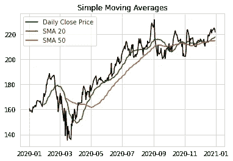
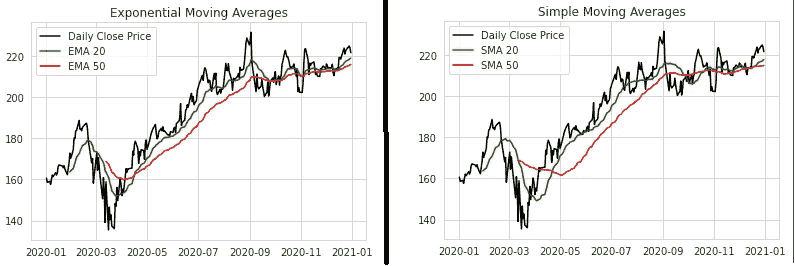

# 如何用 Python 构建股票技术指标

> 原文：<https://medium.com/analytics-vidhya/how-to-build-stock-technical-indicators-with-python-7a0c5b665285?source=collection_archive---------0----------------------->

又见面了！我带着另一篇关于股票分析的重要文章回来了，我知道你们会喜欢我的股票分析系列，下周会有更多的文章，所以一定要关注我！现在我们将在 Python 中分析 MSFT 股票，计算一些交易指标。

要进行更复杂的分析，请查阅这篇文章

用于股票市场的 Python:

[](/analytics-vidhya/python-for-stock-analysis-fcff252ca559) [## 用于股票分析的 Python

### 在这个项目中，我们将分析股票市场的数据。

medium.com](/analytics-vidhya/python-for-stock-analysis-fcff252ca559) 

**股票技术指标**在股票分析中是不可或缺的。它们是根据历史股票价格通过不同的数学公式计算出来的。在 [**算法交易**](https://www.investopedia.com/terms/a/algorithmictrading.asp) 中，技术指标也是必不可少的，才能形成一个交易机器人可以触发一笔交易的开仓和平仓的交易信号。

在本文中，我将展示如何使用 Python 库 [**TA-Lib**](http://mrjbq7.github.io/ta-lib/) ，用几行代码构建一些流行的技术指标。这里将介绍三组主要的技术指标:

1.  **趋势指标** —简单移动平均线(SMA)、指数移动平均线(EMA)和平均方向移动指数(ADX)
2.  **动量指标** —移动平均收敛发散(MACD)和相对强弱指标(RSI)
3.  **波动指标** —布林线

因为我们将为指示器使用 TA-LIB 库，如果你不能用 pip 直接安装它，请查看我的文章:-

 [## 如何在 Python 中安装 TA-LIB

### 在这里，我将帮助您在 PC/笔记本电脑上安装 TA-LIB。对你们来说应该很容易！

rohan09.medium.com](https://rohan09.medium.com/how-to-install-ta-lib-in-python-86e4edb80934) 

这里，我们将获取 2020 年的数据，让我们看看我们的指标表现如何。我将使用 YFINANCE 下载数据，您可以通过以下方式安装 YFINANCE:—

```
pip install yfinance
```

让我们现在下载数据吧！我将使用微软 2020 年的数据，你们可以玩玩其他公司和指数。

```
import yfinance as yfmsft = yf.download("MSFT", start="2020-01-01", end="2020-12-31", interval="1d")msft
```


MSFT 历史数据 2020

加油！我们来画这个吧！！

```
msft['Adj Close'].plot(legend=True,figsize=(12,5))
```


MSFT 价格图

# 趋势指标

趋势指标基本上是对股票价格趋势方向(向上、向下或横向)的衡量。先说最基础的一个，简单均线(SMA)。

# 简单移动平均线

简单移动平均线(SMA)是特定时间段(如 10 天、20 天、50 天等)内近期价格的移动平均值。SMA 随着价格移动，它可以平滑每日价格以显示价格方向。

让我们使用 *talib SMA* 命令来构建 20 天和 50 天时间框架的 SMA 指标。



MSFT 形状记忆合金图

时间框架越短，SMA 对标的股票价格的变化越敏感，时间框架越长，相对越不敏感。

你可以选择大的时间周期，比如 50 & 100 或者 50 & 200

# 指数移动平均线

指数移动平均线(EMA)类似于 SMA，只是 EMA 对最近的价格赋予较高的权重，而 SMA 对所有的值赋予相同的权重。EMA 基于以下公式计算:

```
**EMA = Closing Price * multiplier + EMA_previous_day * (1-multiplier)**
```

幸运的是，Python TA-Lib 库为我们提供了执行复杂计算的一行命令。


现在，如果你比较均线和均线图，你会发现均线对价格波动更敏感，因为对最近价格的权重不同。



MSFT 均线和 MSFT 均线图

# 平均定向运动(ADX)

平均方向移动(ADX)是由 J. Welles Wilder 开发的一个指标，用来衡量趋势的强度，而不仅仅是价格的移动。ADX 值越高，趋势越强。ADX 的测量值在 0 和 100 之间波动，可分为三个范围组:

**ADX ≤ 25:无趋势**

**25 < ADX ≤ 50:趋势**

**ADX > 50:强趋势**

我们将使用 TA-Lib *ADX* 命令来获取时间序列上的 ADX 值。

让我在这里解释一些线:-

**第 1 行:** TA-Lib *ADX* 命令需要最高价、最低价和收盘价作为其输入。我们按照行业标准将时间段设置为 14 天。

**第 2 行:**这里，我们将图表分成两个独立的子图，以便于我们直观地了解价格运动和 ADX 值之间的关系。

**第 3–7 行:**我们在第一个子图上绘制价格变动，在第二个子图上绘制 ADX 值。

**第 8–9 行:**使用 Matplotlib *axhline* 命令创建两条覆盖在 ADX 线图上的水平线。这两条线将帮助我们从图中识别高或低趋势时期。


从上面的 ADX 图中，我们可以看到，当 ADX 值在 25-50 之间时，形成了上升趋势。当 ADX 跌破 25 时，观察到价格横向移动。

现在让我们开始建立一些势头指标！

# 势头指标

动量指标是用来衡量价格运动的速度，而不是趋势。这种类型的指标提供了一个信号，如果价格运动是加强或减弱。

# 移动平均收敛发散(MACD)

移动平均线收敛发散(MACD)显示了股票价格的两条指数移动平均线(EMA)之间的关系。它是用 EMA-12 减去 EMA-26 计算出来的。这将产生一条 MACD 线。MACD 的另一根 EMA-9 也会画在 MACD 线的上面，作为触发买入和卖出的信号线。

我们可以使用 *TA-Lib MACD* 命令来生成所有提到的 MACD 和信号线。

TA-Lib MACD 接受四个输入，即收盘价、较短的均线时间框架(*快速期*)、较长的均线时间框架(*慢速期*)和另一个设置为*信号期*的均线时间框架。通常，我们会遵循行业标准来使用以下参数设置:

```
*fastperiod=12**showperiod=26**signalperiod=9*
```


MSFT·MACD 情节

# 相对强度指数

相对强度指数(RSI)也是由 J.Welles Wilder 开发的，但它通过确定股票是超买还是超卖来衡量趋势的势头。这里有两个重要的基准:

**相对强弱指标> 70:超买**

**RSI < 30:超卖**

我们将使用 *TA-Lib RSI* 命令来获取 RSI 值。


MSFT 相对强弱图

从 RSI 图中，我们可以看到 MSFT 股票在前半段时间普遍超买。超买条件(RSI > 70)表明股票被高估，并可能导致熊市方向的趋势反转。相反，当出现超卖情况时(RSI < 30), the stock price is undervalued and may move up to form a bullish trend.

Let’s build one Volatility Indicator last one in this article.

# Volatility Indicator

The volatility indicator shows us the fluctuation of the price movement. It will look at the changes in market prices over a specified period of time. Here we will only look at one example, Bollinger Bands.

# Bollinger Bands

A Bollinger Band is composed of three trendlines that form a middle band, upper band and lower band, respectively.

Middle band — A simple moving average (20 days by standard)

Upper band — 2 standard deviations above the middle band

Lower band — 2 standard deviations below the middle band

The wider the distance between the upper and lower bands, the more volatile the stock prices. A price close to the upper band is considered relatively high. On another hand, when the price close to the lower band, it is viewed as relatively low.

We can use the TA-Lib *BBANDS* 命令获得中间、上部和下部波段值，并将其绘制到图表上。


MSFT 布林线图

上面的布林线向我们展示了一幅清晰的画面，在较宽的波段区域波动更大，在较窄的区域波动较小。

**免责声明**已经有人尝试使用时间序列分析算法来预测股票价格，尽管它们仍然不能用于在真实市场中下注。这只是一篇教程文章，并不打算以任何方式“指导”人们购买股票。

# 我们如何试图预测未来的股票行为？

在这里，我给你提供了一个可以用来预测股票价格的不同模型的列表。

# [使用脸书的先知模型预测股票价格](/analytics-vidhya/predicting-stock-prices-using-facebooks-prophet-model-b1716c733ea6)

# [时间序列预测:用 ARIMA 模型预测微软(MSFT)的股票价格](/analytics-vidhya/time-series-forecasting-predicting-microsoft-msft-stock-prices-using-arima-model-be1c45961739)

# [时间序列预测:使用 LSTM 模型预测苹果股票价格](/analytics-vidhya/time-series-forecasting-predicting-apple-stock-price-using-an-lstm-model-f1bb73bd8a80)

我推荐你通读这些文章，所描述的模型能够非常精确地预测价格。

现在轮到你鼓掌了，跟我来。感谢您的阅读！

给我一个[关注](https://rohan09.medium.com/)如果你喜欢这个，更多的技术博客！

> “如果一开始你不成功，那么跳伞不适合你。”—梅尔·赫利策

再见！