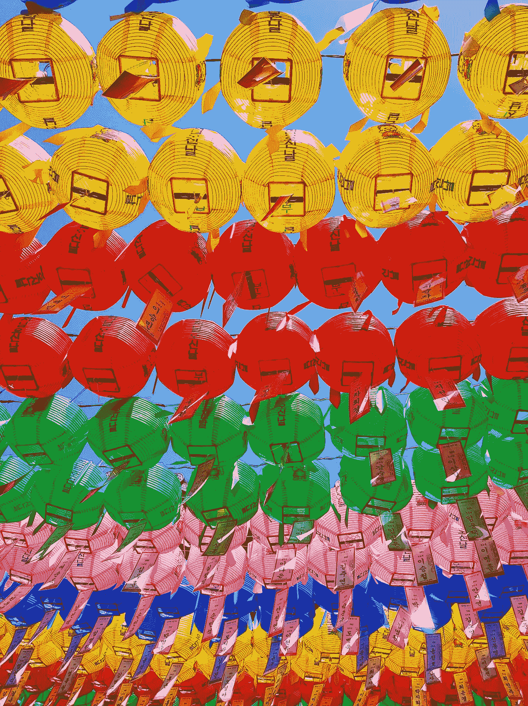

# 如何在 Python 中计算某些图像的 RGB 值

> 原文：<https://medium.com/analytics-vidhya/how-to-calculate-rgb-values-for-some-images-in-python-ccf9abcea8f3?source=collection_archive---------1----------------------->

循序渐进的指南。

由 [KS KYUNG](https://unsplash.com/@mygallery?utm_source=unsplash&utm_medium=referral&utm_content=creditCopyText) 在 [Unsplash](https://unsplash.com/s/photos/color-image?utm_source=unsplash&utm_medium=referral&utm_content=creditCopyText) 上拍摄的照片

学习 Python 时，一个很好的练习是计算一些图像的 RGB 值。
如果你问自己:“RGB 到底是什么意思？”；不要担心:这是我在为这个练习编码之前问自己的第一个问题。
所以，在码之前，先说一下 RGB。