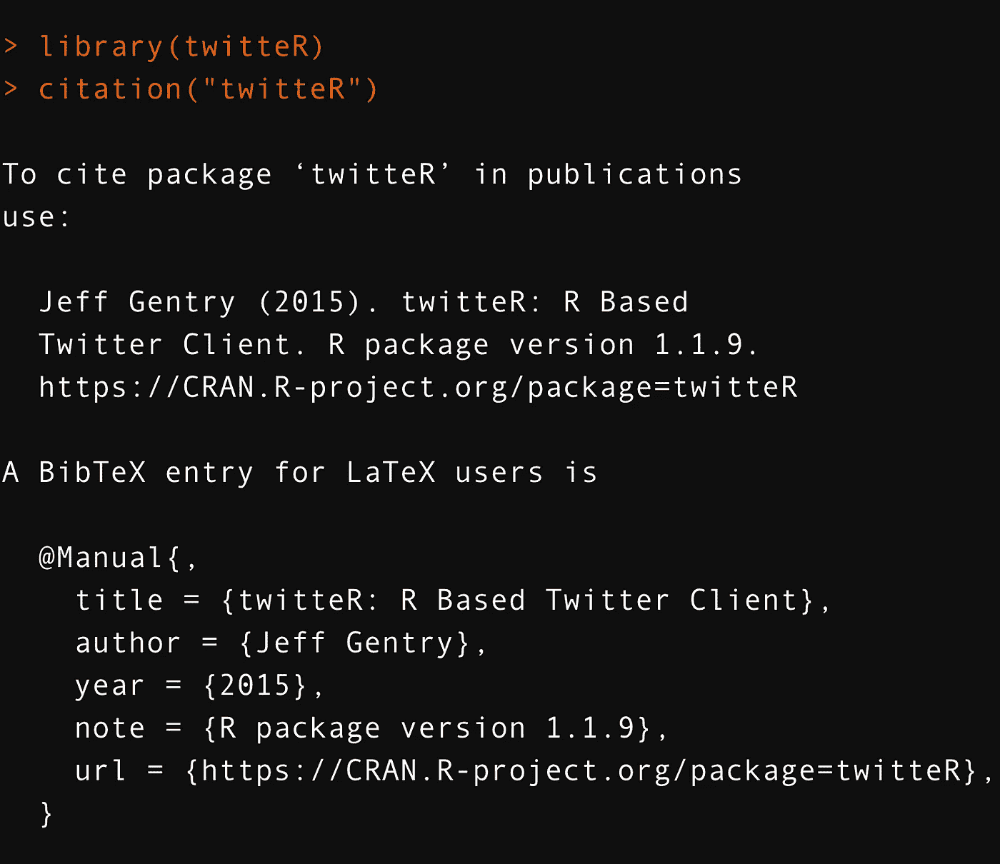

# R 编程中如何调用包引用

> 原文：<https://medium.com/analytics-vidhya/how-to-call-package-citations-in-r-programming-6f01f1176301?source=collection_archive---------15----------------------->

## 数据科学项目中的引用越来越必要。这里有一个概述。

作者引用示例的 RStudio 截图

R 编程中一些最重要的发展是为数据模型选择库和依赖项。当撰写关于这些模型的论文时，引用软件包及其文档的作者变得很有必要。这样做…