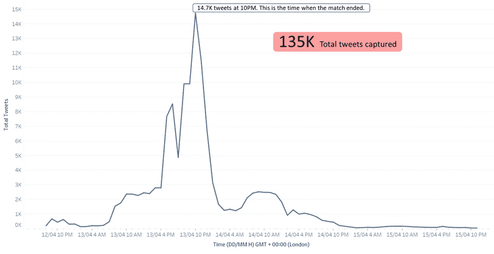
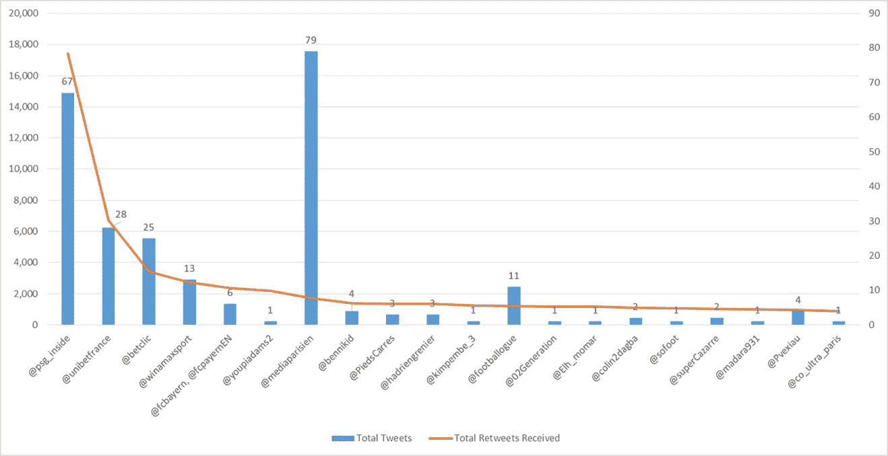

# 如何捕捉、分析和可视化 Twitter 数据？

> 原文：<https://medium.com/analytics-vidhya/how-to-capture-analyse-and-visualize-twitter-data-19c8e5b0f87c?source=collection_archive---------9----------------------->

Joshua Hoehne 在 [Unsplash](https://unsplash.com?utm_source=medium&utm_medium=referral) 上拍摄的照片

推特！

那个平台-

[总统](https://blog.twitter.com/en_us/topics/company/2020/suspension.html)和[演员](https://indianexpress.com/article/entertainment/bollywood/kangana-ranaut-twitter-account-suspended-7301461/#:~:text=Kangana%20Ranaut's%20Twitter%20account%20was,of%20the%20micro%2Dblogging%20site.&text=The%20referenced%20account%20has%20been,policy%20and%20Abusive%20Behaviour%20policy.%E2%80%9D)被封杀，

两条推文可以判你藐视法庭罪，

一个人的推文可以影响股票价格。

但是这篇文章不是关于 Twitter 的争议(尽管你可以使用这里的技术来分析这种争议)。这是关于你如何捕捉、分析和可视化公开的 Twitter 数据。与其他社交媒体平台相比，Twitter 是一个公开开放的平台，这使得通过 Twitter API 捕捉数据变得很容易。

这种分析经常由研究人员和营销专业人员进行。

开始之前，请确保您准备好以下工具:

[1。Twitter 存档的 Google Sheets (TAGS)](https://tags.hawksey.info/) :这是一个免费的工具，可以用来根据关键字获取 Twitter 数据

2. [Tableau](https://public.tableau.com/en-us/s/download) : Tableau 是付费工具。如果你是学生，你可以通过正确的身份验证获得免费版本。也可以试试 14 天的 Tableau 审判。我用的是 Tableau Public，基本上具备 Tableau 的所有功能，但是你的数据会存储在他们的公共服务器上，任何人都可以查看。所以，不要把你客户的机密数据上传到那里。

3.Gephi 是一个免费的工具，用于可视化你的网络结构。

我分析了以下两个数据集

1.  巴黎圣日耳曼 vs 拜仁慕尼黑半决赛第二回合(4 月 14 日)
2.  Twitter 上的博士和学术聊天

选择这两个关键词背后的整个想法是将一个高容量、短时间的事件与一组在长时间内具有一致推文量的关键词进行比较。

*声明:我不是社交媒体专家。我将此作为一个兼职项目，并在做的同时学到了一些新东西。将此视为社交媒体分析的起点，而不是全面的指南。*

# **第一部分:巴黎圣日耳曼 vs 拜仁**

用于跟踪的关键字:#PSGBAY，#PSGFCB

日期范围:21 年 4 月 12 日至 21 年 4 月 15 日

# **推文趋势**

135 万条推文在晚上 10 点(伦敦时间)达到峰值

基于体育赛事或奥斯卡等事件的关键词在活动期间会有突然的推文量峰值，但在活动前后会显著降低。

因为冠军联赛是全球关注的，我想大部分数据都是英文的。然而，在仔细查看数据后，我发现大部分数据都是法语的。我没有以任何方式量化这些数据，因为这会涉及到使用复杂的 NLP 算法。不过，如果我大胆猜测的话，大约 50%到 80%的推文是用法语写的。

# **推文类型**

任何推文都可以分为三大类—

1.  转发:

2.@提及推文:

3.原创推文:用户在推文中没有提到任何人。

在数据集中，转发占所有推文的 85%。为什么会这样呢？是因为放大别人的信息比自己发微博容易得多吗？你认为转发只在这个数据集中占主导地位，还是对其他具有不同关键字/标签的数据集也是如此？

如果围绕特定标签或一组关键词的社区呼声很高，并且他们更喜欢写原创想法而不是转发他人，那么原创推文/@提及次数可能会高于转发推文。有没有想到这样的社区？

# 谁的推文产生了最多的转发？

这里的数据符合幂律，少数有影响力的用户负责产生大多数转发。

Twitter 用户和他们收到的转发数量

@psg_inside 的所有推文收到了大约 18000 条转发。后面的网络分析我们会看到，@psg_inside 是这个网络的核心。

@psg_inside 的一些推文

其他一些获得高参与度的推文是那些博彩门户网站。最突出的两个账户是:@unibetfrance 和@ betclic。

体育博彩在许多国家是一种常见的活动。点击查看赌博在你的国家是否合法[。](https://www.legalsportsbetting.com/countries/)

当 UnibetFrance 开始直接谈论钱的生意时…

Betlic 通过幽默与粉丝互动…

# **用户活动**

用户活跃度由任何用户发微博或转发微博的次数来定义。它不考虑任何这些用户的追随者的数量。

在数据集中，最活跃的用户是 PSG 的粉丝。在大多数情况下，他们会转发其他人的微博来扩大他们的信息。

值得深思的是——为什么拜仁慕尼黑的球迷没有巴黎圣日耳曼的球迷活跃？

# **推文到达**

你认为什么更有影响力？

很多用户，很少关注者，在推特上谈论/转发一个话题？

运筹学

几个有影响力的用户，有数百万的关注者，发推/转发一个话题？

让我们看几个数据集中的例子。

BBC Sport 的这条推文获得了最大的传播，因为它被一个有影响力的账户转发:@bbcworld，拥有约 3100 万粉丝。尽管最初的推文仅获得了 17 次转发，但可以肯定的是，它仍会获得更广泛的受众。

[https://twitter.com/BBCWorld/status/1382048274052481034](https://twitter.com/BBCWorld/status/1382048274052481034)

让我们看另一个例子。虽然塞斯克的推文没有得到那么多转发，但他的推文仍然发送给了 1000 万粉丝！

# **二级标签**

用于跟踪的主要标签是:#PSGBAY 和#PSGFCB

现在让我们来看看在推文中使用的所有其他二级标签。为了简单起见，该算法考虑了推文中出现的第一个标签。统计推文中的所有其他标签也是可能的，但很复杂。

# **可视化网络**

核心网络有 63K 个节点(用户)和 99K 条边(交互)。原始网络看起来像下图中的黑盒。是因为还没有应用网络结构算法。

在这个网络中，我删除了所有不互动的节点——至少两次以转发、原始推文或@提及的形式。经过这种预处理后，只剩下 19.7 K 个节点和 56.7 K 条边。

我应用了原力图谱 2 算法来增加网络的可见性。下图显示了稳定后的图表。

你可以在这里阅读更多关于力算法[的内容。](https://en.wikipedia.org/wiki/Force-directed_graph_drawing)

应用 Force Atlas 2 算法后的稳定网络

# **网络中的集群**

模块性是对网络或图形结构的一种度量，它度量网络划分成模块(也称为组、簇或社区)的强度。

在我们的网络中，有三大集群:

巴黎圣日耳曼球迷集群

拜仁慕尼黑球迷聚集

赌博集群

# **度中心性**

节点的度被定义为传入和传出边的总和，而不考虑节点的权重。

考虑到节点的权重，节点的加权度被定义为传入和传出边的总和。

对于我们的网络，我在所有计算中都使用了加权度。具有低加权度的节点是蓝色的，而具有高加权度的节点是红色的。节点越大意味着加权度越高。

PSG 集群的放大视图

所有用户的入度都远大于出度。这意味着其他人在转发或提到他们，但反之则不然。

# **中间中心性**

在下图中，现在有一些大的蓝色节点。这些具有较高的加权度(它们接收和/或发送许多@提及和转发)，但相对较差的中间中心性。其他较小的红色或黄色节点具有较高的介数，但加权度值相对较低。

从中介的角度来看，被其他人广泛提及或转发，但自己从不与其他参与者互动的 Twitter 账户不能成为网络的中心——它们是端点，而不是连接的枢纽。其他人可能更有价值，因为他们是全方位的连接者，即使他们的努力没有得到那么多的提及和转发。

PSG 集群的放大视图

# **第二部**

# **学术闲聊**

用于跟踪的关键字:

#phdchat，#phdlife，#phdfriend，#phdvoice，#academictwitter，#academicchatter

日期范围:

4 月 14 日至 5 月 1 日

如果在推文中使用了上述任何关键词，推文就会被捕获。

由于我不想这篇文章太长，你可以在这里查看剩余的分析和完整的报告。

感谢您的阅读！

*特别感谢 Future Learn，我从昆士兰科技大学提供的社交媒体分析课程中学到了很多。你可以在这里进入课程:*[*https://www.futurelearn.com/courses/social-media-analytics*](https://www.futurelearn.com/courses/social-media-analytics)*。*

*向课程教育者大声疾呼—*

*让·伯吉斯(http://goo.gl/fhAoiv)*

*阿克塞尔·布伦斯(http://goo.gl/NQD9Cy)*