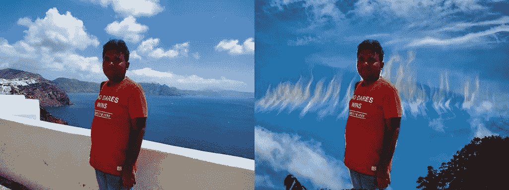
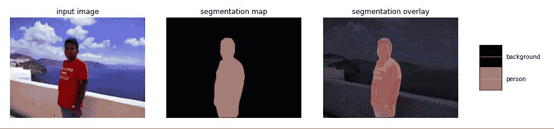
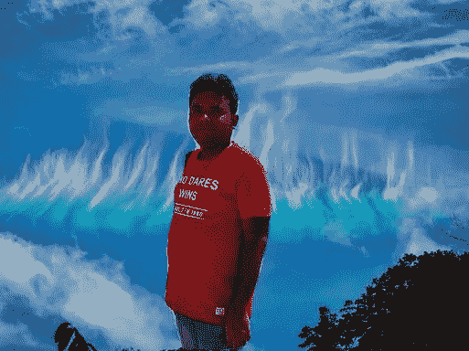

# 如何在 Python 中使用 Tensorflow 中的 Deeplabv3 更改图像背景

> 原文：<https://medium.com/analytics-vidhya/how-to-change-image-background-using-tensorflow-in-python-62b1b2d570b9?source=collection_archive---------1----------------------->



图像背景去除是图像处理中最常见的任务之一。

如果图像背景是统一的颜色，那么 opencv 可以用来改变图像背景。为了从所有其他图像中去除背景，可以使用神经网络来分割图像。

经过语义分割训练的神经网络可以将图像的像素分类。

我使用了来自 Deeplabv3 架构的预先训练的分段权重。加载模型并绘制其预测的代码如下所示:

运行上述代码后，它将加载模型。我们可以通过运行下面的代码来查看模型的预测

```
path = 'filepath of image to predict'
run_visualization_local(path)
```



运行上述代码后，它使用神经网络为图像创建分割图。图像的每个像素被分配一个对应于检测到的类别的值。由于网络是在 COCO 数据集上训练的，因此 person 类的值等于 15。

```
resized_im, seg_map = run_local(path)
image = np.array(resized_im)
```

运行上述代码将分割图和图像保存为 numpy 数组。神经网络要求图像的最大尺寸为 513 像素。因此分割图和调整尺寸 _im 具有 513 像素的最大尺寸。接下来，我们加载背景图像。

```
background = 'rainbow.jpeg'
bg_image = Image.open(background)
INPUT_SIZE = 513
width, height = bg_image.size
resize_ratio = 1.0 * INPUT_SIZE / max(width, height)
target_size = (int(resize_ratio * width), int(resize_ratio * height))
bg = bg_image.convert('RGB').resize(target_size, Image.ANTIALIAS)
bgimage = np.array(bg)
```

我已经调整了背景图像的大小，使其最大尺寸为 513 像素，并且在调整大小时图像的纵横比保持不变。

接下来，使用分段图对于人类别具有值 15 的事实。我用没有检测到人物类别的背景图像替换预测图像。

```
merged = np.zeros(image.shape)
if image.shape[0]>bgimage.shape[0]:
    bgimage = np.pad(bgimage,((image.shape[0]-bgimage.shape[0],0),    
                     (0,0),(0,0)))
merged[:,:,0] = np.where(seg_map==15, image[:,:,0], 
                  bgimage[:image.shape[0],:image.shape[1]][:,:,0])
merged[:,:,1] = np.where(seg_map==15, image[:,:,1],
                  bgimage[:image.shape[0],:image.shape[1]][:,:,1])
merged[:,:,2] = np.where(seg_map==15, image[:,:,2], 
                  bgimage[:image.shape[0],:image.shape[1]][:,:,2])
```

如果调整大小后的背景图像小于预测图像，则它会对背景图像进行零填充，使其与预测图像具有相同的尺寸。然而，如果调整后的背景图像大于预测图像，则将其裁剪为相同的大小。

使用下面的代码可以看到最终的图像

```
final = Image.fromarray(merged.astype(np.uint8))
final
```

