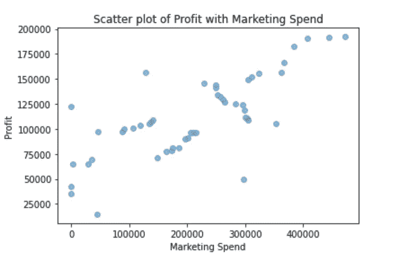
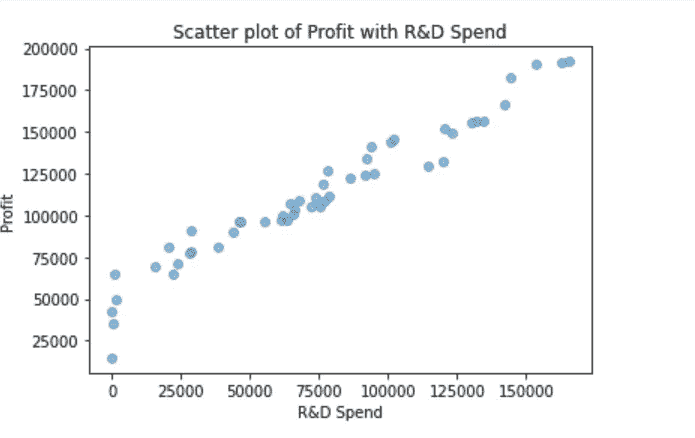
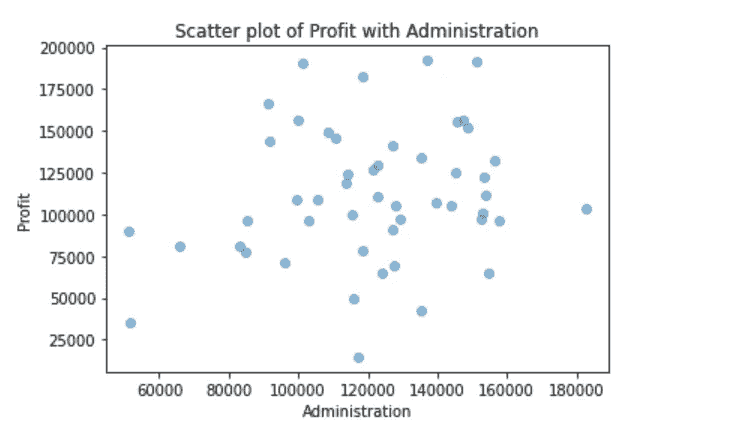
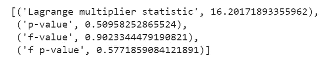
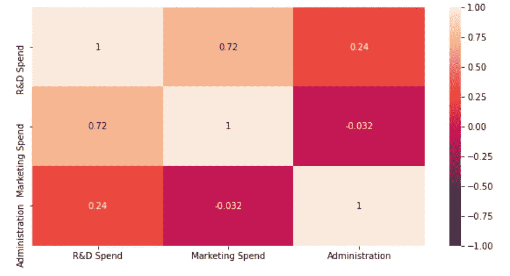
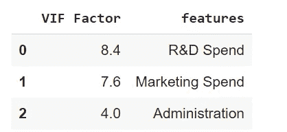
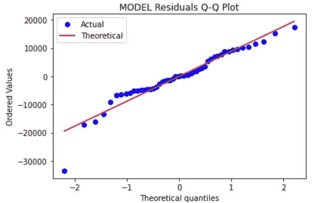

# 如何检查线性回归中的假设

> 原文：<https://medium.com/analytics-vidhya/how-to-check-for-assumptions-in-a-linear-regression-a68116aef88a?source=collection_archive---------1----------------------->

在我们开始检查假设之前，让我们先理解为什么我们需要在拟合模型之前检查假设。

我们为什么要这样做？你不需要有最佳拟合线的假设。但是你的参数可能有偏差或者有很高的方差。违反假设将使回归结果的解释更加困难。此外，该模型做出的预测将是非常低效的。既然我们理解了需要，让我们看看如何做。

我将使用 50 家初创企业的数据集来检验这些假设。你可以用尽可能多的变量来做这个实验。

# **1。自变量和因变量之间的线性**

期望值或预测值是每个独立变量的直线函数。

用散点图可以很容易地检查线性

```
# Importing the libraries
import numpy as np
import pandas as pd
from numpy import math
import matplotlib.pyplot as plt#Marketing spend and Profit
plt.scatter(dataset['Marketing Spend'], dataset['Profit'], alpha=0.5)
plt.title('Scatter plot of Profit with Marketing Spend')
plt.xlabel('Marketing Spend')
plt.ylabel('Profit')
plt.show()
```



从图表中可以看出，除了少数例外情况，利润和营销支出之间基本上是直接相关的。

```
#R&D Spend with Profit
plt.scatter(dataset['R&D Spend'], dataset['Profit'], alpha=0.5)
plt.title('Scatter plot of Profit with R&D Spend')
plt.xlabel('R&D Spend')
plt.ylabel('Profit')
plt.show()
```



R&D 支出和利润之间的关系完全是线性的。他们几乎完美地结合在一起。

```
#Administration with Profit
plt.scatter(dataset['Administration'], dataset['Profit'], alpha=0.5)
plt.title('Scatter plot of Profit with Administration')
plt.xlabel('Administration')
plt.ylabel('Profit')
plt.show()
```



利润和管理之间几乎没有关系

那么，从商业角度来看，我们可以从下面的图表中推断出什么呢？

R&D 的花费将直接几乎完美地影响利润。增加 R&D 支出将导致更高的利润。营销支出和利润之间有很好的关系。管理层变动对利润率没有直接影响。

# 2.回归模型是同质的

同方差意味着误差不会在自变量的所有值上改变。

我们可以借助 ***的白色测试轻松检查这一点。***

我们可以在 Python 的 Statsmodels libaray 中找到。白色测试给了我们一个直接的答案，而不必绘制图表。

```
#Importing Libraries
import statsmodels.api as sm
from statsmodels.stats.diagnostic import het_white
from statsmodels.compat import lzip#The variables
x=dataset[['R&D Spend','Marketing Spend','Administration']].values
y=dataset['Profit'].values#Fit the model
model = sm.OLS(y,x).fit()
```

白色测试是通过传递残差和所有独立变量来完成的。

```
#The test
white_test = het_white(model.resid,  model.model.exog)#Zipping the array with labels
names = ['Lagrange multiplier statistic', 'p-value','f-value', 'f p-value']
lzip(names,white_test)
```



怀特检验有零假设，即误差具有相同的方差或相同的方差。p 值≤ 0.05 表明零假设被拒绝，因此异方差。

白色测试有一些限制:它需要很多变量，因此非常耗时，所以对大型数据集使用白色测试不太实际，使用 **Breusch-Pagan 测试会更容易。**

**有异方差怎么办？**

1.  离群点去除
2.  x 变量的对数变换
3.  多项式回归

# 3.无多重共线性

当独立变量相互关联时，会出现多重共线性。如果多重共线性的程度很高，则可能会在解释结果时造成问题。

使用热图可以很容易做到这一点

```
#Import Seaborn
import seaborn as sns
plt.figure(figsize=(10,5))
sns.heatmap(dataset[['R&D Spend','Marketing Spend','Administration']].corr(),vmin=-1,annot= True)
```



独立变量的热图

从热图中我们已经可以看出，R&D 支出和营销支出之间存在显著的相关性。

我们可以借助于变动通货膨胀系数(VIF)来确定相关程度

它可以解释为:

1=不相关

1–5 =中度相关

> 5 =高度相关

让我们看看如何去做

```
from statsmodels.stats.outliers_influence import variance_inflation_factor# For each X, calculate VIF and save in dataframevif = pd.DataFrame()vif["VIF Factor"] = [variance_inflation_factor(dataset[['R&D Spend','Marketing Spend','Administration']].values, i) for i in range(x.shape[1])]vif["features"] = dataset[['R&D Spend','Marketing Spend','Administration']].columnsvif.round(1)
```



正如已经怀疑的那样，变量之间存在相关性。

那么我们如何处理多重共线性呢？

根据数据集及其要求，我们可以通过以下方式实现:

1.  去掉一些高度相关的变量
2.  对高度相关的变量进行主成分分析
3.  将它们线性相加

# 4.误差呈正态分布

为什么要检查这个？因为它会在计算置信区间时产生问题。偏度可能是由于异常值的存在，这可能在参数估计时产生偏差。

最有效的方法是 Q-Q 概率图。分位数-分位数是通过绘制残差对统计量的顺序而得到的。这可以通过以下方式实现:

```
#Import libraryfrom scipy import statsstats.probplot(model.resid, dist="norm", plot= plt)plt.title("MODEL Residuals Q-Q Plot")plt.legend(['Actual,'Theoretical'])
```

