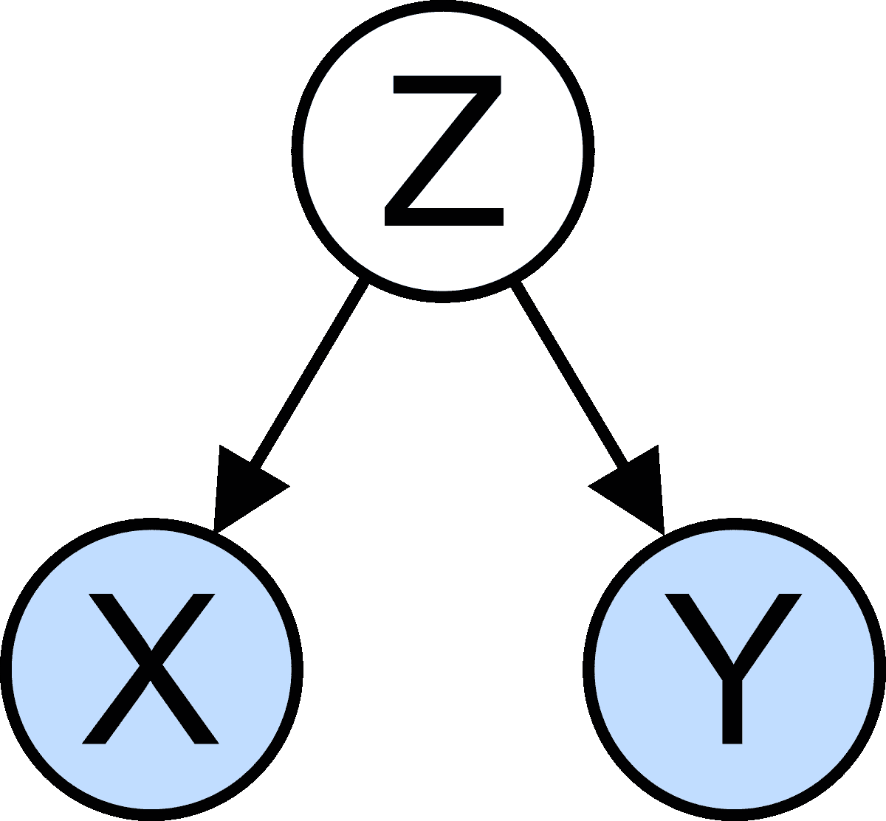
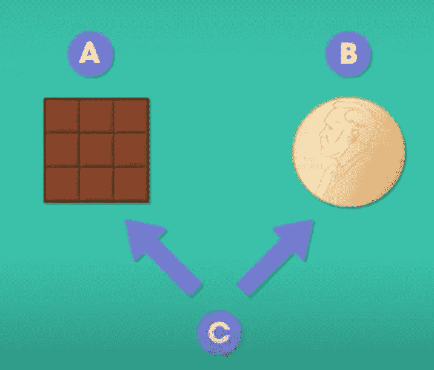

# 如何对抗混杂效应？

> 原文：<https://medium.com/analytics-vidhya/how-to-combat-confounding-effect-9faa98c0ccbc?source=collection_archive---------20----------------------->

混淆会越来越误导人！

我们作为人类，根据我们通过我们的感觉系统感知的观察，推断两个或更多现象之间的许多规则和关联。混淆可能会导致理解的错觉，因为人类习惯于根据非常有限的观察得出快速的结论。 那么，混杂效应是什么呢？我们将回答这个问题，并提出一些方法来减少它对我们决策过程的影响。**最终目标是在观察的基础上得出非常合理和合理的结果。**

# 混杂效应是什么？

假设你想推断一组两个变量之间是否有因果关系。在统计学和测量理论中，这非常简单。你记录一对数值，然后进行统计检验，如皮尔逊系数(PC)，看看两个变量之间是否有任何关系(最好是线性的)。但是，您应该谨慎使用这种方法。所提到的方法仅仅提供了两个变量可能相互代表的关系的数量。因果推论是科学方法理解世界的最终目标，但它并没有得到 PC 分析的保证。不要忘记，科学方法的最终目标是推断两个或更多现象之间的偶然联系。请注意，相关性并不意味着因果关系。当数据显示一个相当好的关系，但实际上根本没有关系时，混杂效应就出现了！这种关系只是一种幻觉，由潜伏在我们观察中的第三个因素所控制，而我们对此完全忽视了。这就是混杂效应。在设计实验时，为了得到一个有效的结论，把任何混淆因素都考虑进去是非常重要的。

# 它是如何工作的？

混杂效应来自与自变量和因变量相关的外来变量。这种相关性也表明了某种偶然的联系。通过只观察手头的两个变量，你实际上是在观察混杂变量和其他两个变量之间的关系，作为投影的结果。如果我们示意性地展示它，它将类似于下图所示:

混杂效应

变量 **Z** 与我们已经测量的两个变量 **X** 和 **Y** 有联系。如果我们忽略混杂效应，我们可能会得出一个结论，即 **X** 和 **Y** 是相关联的，但实际上它们不是。这种使我们得出错误结论的错觉是外来变量 **Z 对两个变量产生影响的结果。忽略 Z 的影响会误导我们得出两组测量值之间的偶然联系。**

作为一个现实世界的例子，想象我们被要求找出巧克力消费和诺贝尔奖获得者之间有任何关系！我们从收集世界各地不同国家的样本开始。比方说，我们发现巧克力消费量和诺贝尔奖获得者的数量之间有很高的相关性。我们应该下结论说巧克力消费对你成为诺贝尔奖获得者有很大影响吗？**答案是绝对没有！**

我们哪里做错了？高相关性不是表示(线性)关系吗？当然，高相关性表明关系，但这并不一定意味着这种关系是真实的，而不是虚假的。毕竟，所有这些都是数字，解释取决于测试环境，逻辑存在于问题中。如果我们在这种关系中找不到任何合理的意义，我们就不应该宣布任何结果，因为统计分析的最终目的是找出两个事件之间的因果关系。

[巧克力和诺贝尔奖](https://www.youtube.com/watch?v=aOX0pIwBCvw)

那么，我们是如何结束这种局面的呢？答案是，可能有其他因素导致这种关系，并影响这两个因素。把这个因素想象成国家的财富。一个国家越富裕，分配给科学发现的研究基金就越多，因此也就产生了更多的诺贝尔奖获得者。当然，一个国家越富裕，他们就越有可能买得起巧克力棒(我们知道巧克力很贵，不算在基本的食品篮子里)。这就是相关性遇到因果关系的方式！

好了，现在怎么办？在我们了解了更多关于混杂因素的知识后，有什么方法可以解决这个讨厌的影响吗？答案是肯定的，会在后面的内容中呈现。

提出了许多方法来解决混杂因素的影响。以下是其中的一些方法:

*   **限制**:在这种方法中，我们关注样本的子集，具有固定值的可能混杂因素(注意，我们应该识别混杂因素)。通过固定混杂因素，我们解开了两个变量之间的联系。记住方差是信息(联系)。这种方法的优点是易于实现。然而，它极大地限制了观察样本，并且可能无法包括其他混杂因素。
*   **匹配**:请注意，这种方法适用于我们有两个数据集的情况:一个属于受控测试，另一个属于非受控测试。在这种方法中，我们匹配两组数据。我们将一组数据中的一个样本与另一组中的一个对应样本进行匹配，两者具有相同的混杂因子值(范围)。通过这样做，我们想再次确定两组之间的差异是由于非混杂因素的差异。这种方法的好处是它允许您包含比限制更多的主题。然而，由于您需要为混杂因子的每个值找到一个对应项，因此实现起来可能会很麻烦。它也可能让你无法考虑另一个混淆因素。
*   **统计工具**:在这种方法中，我们利用一种叫做回归的统计工具来减轻混杂因素的影响。通过这样做，我们可以将可能的混杂因素作为控制变量包含在您的回归模型中。这样，你就可以控制混杂变量的影响。换句话说，你排除了混杂因素的影响，把你的注意力限制在剩余部分，看看是否有影响出现。同样，这种方法不能保证你已经考虑了所有的混杂因素。
*   **随机化:**另一种方法是将样本随机分成两组。例如，如果有两组受控和非受控样品，将它们混合在一起，然后将结果分成两组。通过这样做，你解开了混杂因素可能与两组之间的联系。由于这些因素不会因分组而不同，它们不会与你的独立变量相关，因此不会干扰你的研究。换句话说，通过随机化，你保证两组平均有相同的混杂因素。这是对抗混杂因素最有效的方法，因为您在研究中包含了所有的混杂因素。

# 结论

在这篇短文中，我们旨在简要介绍统计推断中作为偏倚误差之一的混杂因素。我们解释了为什么不考虑混杂因素会导致误导性结果，从而质疑结果的科学有效性。我们也提出了一些减少混淆因素的有效方法。