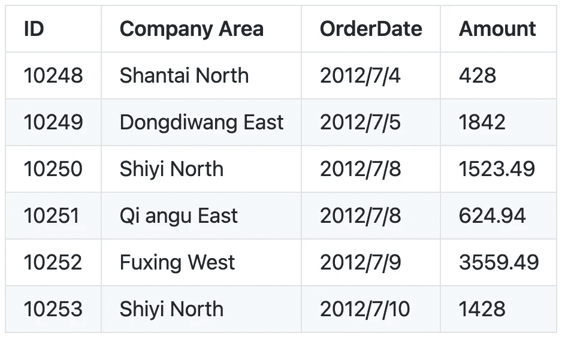
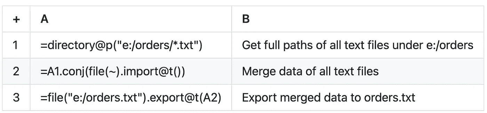
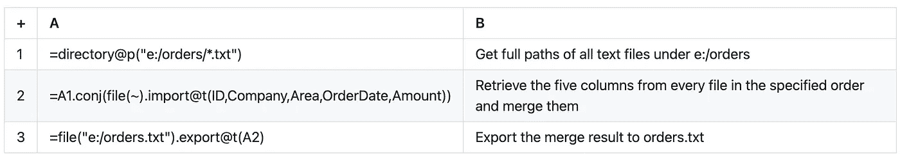

# 如何将多个 CSV 合并为一个

> 原文：<https://medium.com/analytics-vidhya/how-to-combine-multiple-csvs-into-one-6e4dc807735d?source=collection_archive---------28----------------------->

对于数据分析人员来说，将结构相同或相似的文本文件组合成一个文件是很常见的。这里我们来看看不同类型的场景。结合 esProc 做文件很方便。

# 相同结构的文本文件

目录包含许多列标题和结构相同的文本文件，但行数和详细数据不同。我们希望将这些文件合并成一个文件，放在一组列标题下。

示例:e:/orders 下有记录每日订单的相同结构的文本文件。每个文件在第一行有列标题，从第二行开始有详细数据，如下所示。我们希望将它们合并到一个名为 orders.txt 的文件中。

esProc SPL 脚本:

如果 e:/orders 有子目录，那么每个子目录下的文本文件也需要合并。在这种情况下，A1 可以重写为=directory@ps("e:/orders/*。txt”)。@s 选项支持递归获取所有子目录下的文件。

# 结构相似的文本文件

有时文本文件并不具有完全相同的结构。它们可能包含不同数量的列，或者具有不同顺序的列，尽管它们都共享许多公共列。要将所有文件中的公共列合并到一个文件中，我们需要按照指定的顺序从每个文件中检索它们。

示例:在前面的 e:/orders 中，所有订单文件都有 ID、Company、Area、OrderDate 和 Amount 列，尽管订单不同。有些文件包含其他列。任务是合并每个文件的这五列，并将结果写入 orders.txt。

esProc SPL 脚本:

上面的脚本是在合并后的数据可以放入内存的条件下编写的。如果不能，请参见更复杂的场景[合并和拆分文件的示例](http://c.raqsoft.com/article/1600309450633)