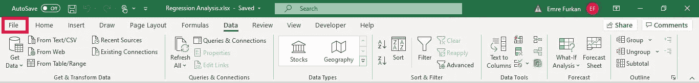
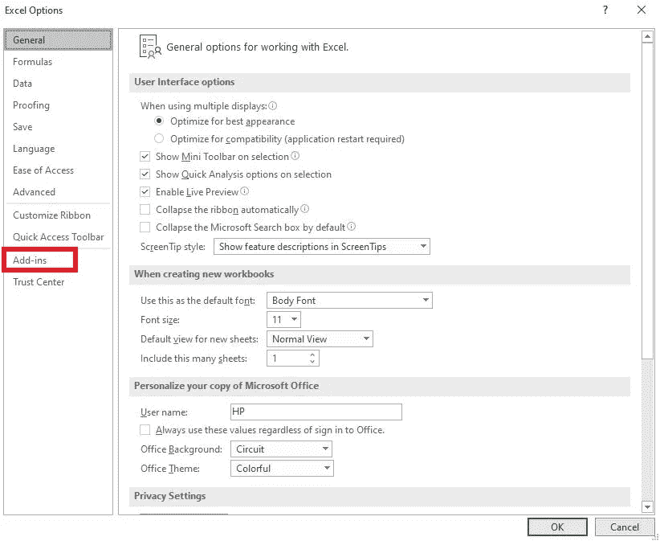
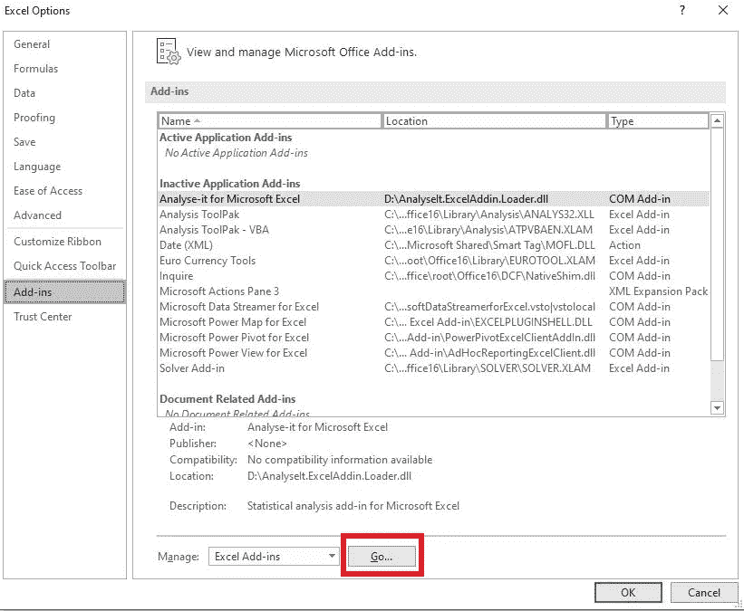
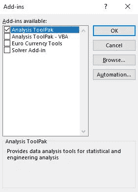
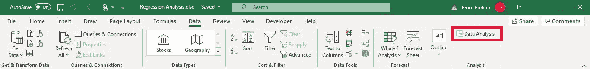
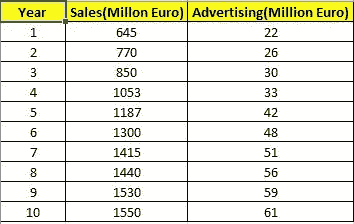
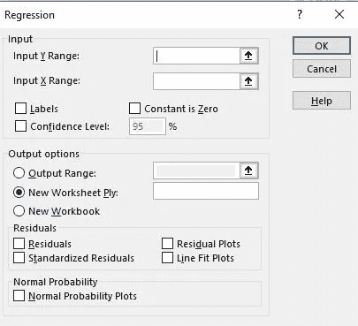
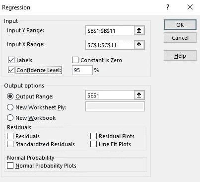
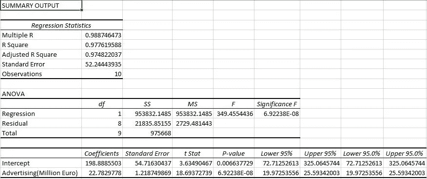
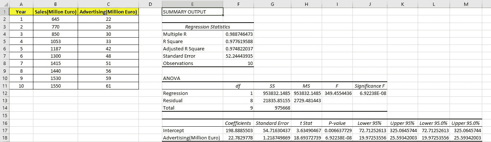

# 如何在 Excel 上进行简单的回归分析

> 原文：<https://medium.com/analytics-vidhya/how-to-conduct-simple-regression-analysis-on-excel-b6acb46335ee?source=collection_archive---------11----------------------->

大家好，
作为一名金融专业的学生，我在本科学习期间不得不学习如何在 Excel 上进行回归分析，我想在这篇文章中解释一下如何在 Excel 上进行这个简单的分析。(我假设你已经知道什么是回归分析及其用途。)
首先，您将点击页面顶部功能区上的“数据”选项，如下所示。

在弹出菜单的左侧，您会看到“数据分析”按钮。如果您没有，请不要担心，因为这意味着您没有激活数据分析工具库，该工具库可以按如下方式执行:

首先，你点击“文件”

然后，从弹出菜单中选择“选项”

在出现的“Excel 选项”页面中，单击“加载项”

点击“开始”按钮

您将看到 AnalysisToolPak 插件，单击它，然后单击“OK ”,您就一切就绪了。

现在，当您单击功能区上的“数据”时，您将能够看到“数据分析”选项。

所以，现在我们准备进行一个简单的回归分析。我们有以下样本数据，其中包括 10 年的销售额和与这 10 年中每一年相对应的广告支出。

我们想看看广告支出对销售量是否有影响。这就是我们将进行回归分析的原因。首先，单击“数据分析”，从列表中选择“回归”，然后单击“确定”。将出现回归页面，您可以在其中输入变量。

因变量用“Y”表示，自变量用“X”表示。在我们的例子中，我们的因变量是“销售额”，我们的自变量是“广告”。

## 如何输入数据:

**1-** 点击“输入 Y 范围”框，转到数据表，点击“销售”并向下滚动选择 Y 变量。

**2-** 点击“输入 X 范围”框，进入数据表，点击“广告”并向下滚动选择 X 变量。

**3-** 勾选“标签”方框。

**4-** 勾选“信心水平”方框。

**5-** 从“输出选项”中，您可以选择回归分析结果的显示位置。它可能是一个新工作表，也可能是同一工作表上的任何特定单元格。

**6-** 点击“确定”即可完成！

以下是您将获得的输出:

最终视图:

感谢您的关注。我希望它能帮助你理解在 Excel 上进行回归分析的基础，并关注我以获得更多相关内容…