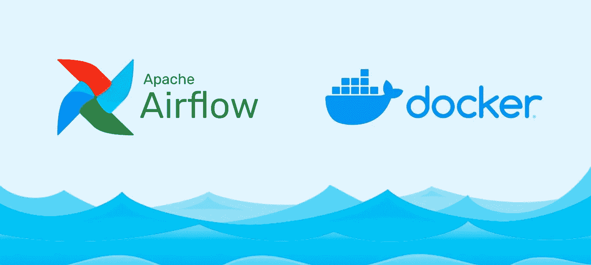
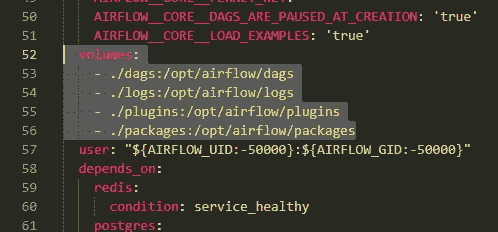
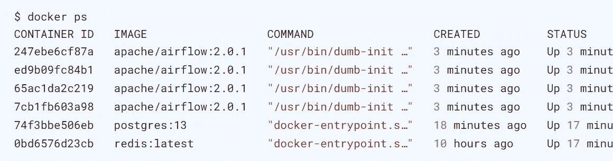
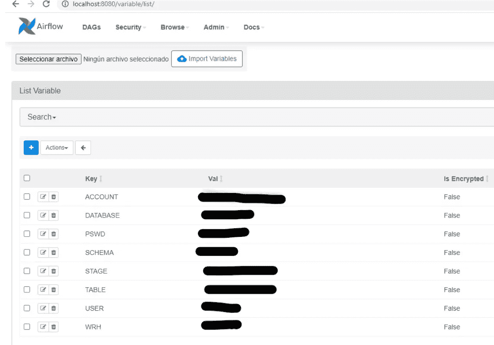
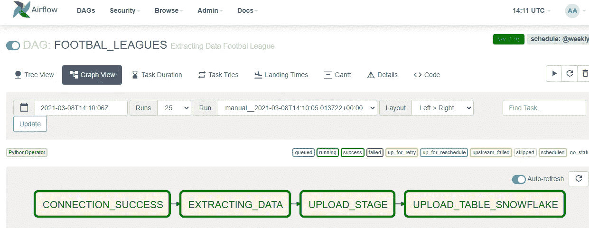
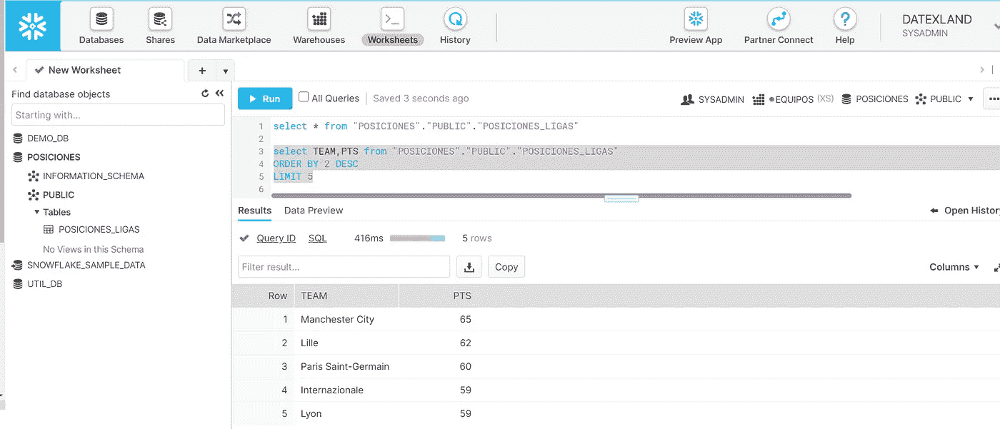

# 如何在 Docker 上连接雪花和气流，以便免费搭建数据提取管道

> 原文：<https://medium.com/analytics-vidhya/how-to-connect-snowflake-with-airflow-on-docker-in-order-to-build-a-data-extraction-pipeline-for-e65591f011d6?source=collection_archive---------3----------------------->

> 从多个足球联赛中提取数据



# **简介**

Apache airflow 是一个编排工作流和数据处理管道的伟大工具，可以在几个云提供商中使用，如***【GCP】*******AWS*、**和 ***Azure*** 等等，但此时我们将关注如何在 Docker 上简单快速地部署它。*

# *我们如何做到这一点？*

*我尝试按照以下方式处理研究案例:*

1.  *我们应该获取[*docker-compose . YAML*](https://airflow.apache.org/docs/apache-airflow/stable/docker-compose.yaml)文件。*
2.  *初始化气流环境。*
3.  *流动气流。*
4.  *安装额外的 python 依赖项。*
5.  *我们创建一个审判 ***雪花*** *账户*。*
6.  *添加 Airflow Web UI 中所需的环境变量。*
7.  *运行我们的 ***DAG*** 。*
8.  *我们准备在 ***雪花*** 中查询你喜欢的足球联赛数据。*

## *我们开始吧！！*

*第一步是获取 *docker-compose.yaml* ，为此，我们将在终端上运行以下命令:*

```
**curl -LfO ‘*[*https://airflow.apache.org/docs/apache-airflow/2.0.1/docker-compose.yaml'*](https://airflow.apache.org/docs/apache-airflow/2.0.1/docker-compose.yaml')*
```

*如果你想查看包含这个文件的内容你可以去这个 [***链接***](https://airflow.apache.org/docs/apache-airflow/stable/start/docker.html) ，你必须记住 Dag 的文件夹包含我们的 Python 脚本(DAGS)
和 packages 文件夹包含***requirements . txt***文件与 Python 的依赖项一起安装，现在我们需要准备我们的环境，为此，你将创建一些文件夹，如:*

```
**mkdir ./dags ./logs ./plugins ./packages
echo -e "AIRFLOW_UID=$(id -u)\nAIRFLOW_GID=0" > .env**
```

*在**所有操作系统**上，您需要运行数据库迁移并创建第一个用户帐户。要做到这一点，运行。*

```
**docker-compose up airflow-init**
```

*运行 Airflow 之前，您必须编辑***docker-compose . YAML***以创建之前添加的卷:*

**

*现在，您可以启动所有服务:*

```
**docker-compose up**
```

*在新的终端中，您可以看到活动的容器:*

**

*我们准备安装 Python 依赖项，为此，我们需要输入除 ***Postgres*** 和 ***Redis*** 之外的每个容器，如下所示:*

```
*docker exec --user="root" -ti **CONTAINER_ID** /bin/bash
cd ./packages/ && pip install -r requirements.txt*
```

**

*此时，您必须有一个 ***数据仓库、数据库、表*** 和 ***阶段*** 处于活动状态的试用雪花帐户，以便与 Airflow 连接。*

## *访问 web 界面*

*一旦集群启动，您就可以登录到 web 界面并尝试运行一些任务。*

*web 服务器位于:`**http://localhost:8080**`。默认账户有登录名`airflow`和密码`airflow`*

*在运行我们的 DAG 之前，我们必须在 Airflow Web UI 中添加所需的环境变量*

**

## *让我们开始吧！！*

**

## *2020–2021 赛季哪些球队积分最多？*

**

# *摘要*

*Docker 上的气流是一种免费的自动化过程的简单方法，但我们需要记住，我们必须有 8GB 或更多的内存。*

*另一方面，您可以随意查看用于本示例的代码，并且您可以 [**转到代码 Github**](https://github.com/alexbonella/AIRFLOW_DOCKER_SNOWFLAKE/blob/master/dags/leagues.py) 。*

*谢谢你读到这里。如果你觉得这篇文章有用，喜欢并分享这篇文章。有人也会觉得它很有用，为什么不邀请我喝杯咖啡呢？*

*[](https://www.paypal.com/donate/?hosted_button_id=GBVXVLXMETRHE)

**用 PayPal 捐款**👆* 

*跟我来👉 [**LinkedIn**](https://www.linkedin.com/in/alexanderbolano/)*

*跟我来👉 [**推特**](https://twitter.com/Alex_bonella)*

*联系人:alexbonella2806@gmail.com*