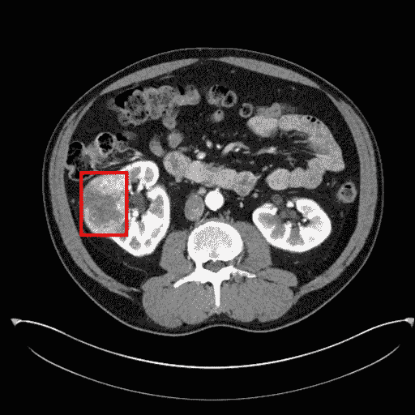

# 如何用 Python 将灰度 DICOM 文件转换成 RGB DICOM 文件

> 原文：<https://medium.com/analytics-vidhya/how-to-convert-grayscale-dicom-file-to-rgb-dicom-file-with-python-df86ac055bd?source=collection_archive---------7----------------------->

## KiTS19 挑战中肾脏 CT 数据的使用案例

# TL；速度三角形定位法(dead reckoning)

*   要将 DICOM 文件从灰度转换为 RGB，您应该修改几个 DICOM 标签，而不仅仅是像素数据。
*   [完整的源代码](#7761)在这篇文章的末尾。

# 介绍

[DICOM](https://www.dicomstandard.org/) (医学中的数字成像和通信)是存储和传输医学图像的国际标准，在医院中 DICOM 文件大多使用 PACS(图像存档和通信系统)来查看。

虽然 X 射线、CT 和 MR 等放射图像是灰度图像，但您可能希望编辑 RGB 图像，例如用于注释或图像处理。编辑后的图像应以 DICOM 格式提供，以便医生在临床实践中进行解释。

这篇文章旨在提供如何用 Python 将灰度 DICOM 文件转换成 RGB DICOM 文件，主要使用 [Pydicom](https://pydicom.github.io/) 包。

> 请注意:这篇文章不包括处理 DICOM 数据的基本方法。对于那些不熟悉的，请查看 [Pydicom 文档](https://pydicom.github.io/pydicom/stable/auto_examples/index.html)。

这里我们用的是 [KiTS19](https://kits19.grand-challenge.org/) (2019 肾肿瘤分割挑战赛)的公开 CT 数据，可以在这里下载[。](https://github.com/neheller/kits19)

假设你开发了一个在腹部 CT 上发现肾癌的模型。我们将在肿瘤周围绘制一个 ***红色*** 包围框，并将图像保存为 DICOM 格式。

# 加载 DICOM 文件并处理像素数据

首先用`pydicom`加载 DICOM 文件，可以得到用 [Hounsfield 单位](https://radiopaedia.org/articles/hounsfield-unit) (HU)表示的像素数据如下:

```
import pydicomds = pydicom.dcmread(INPUT_DICOM_PATH)
img = ds.pixel_array # dtype = uint16
img = img.astype(float)
img = img*ds.RescaleSlope + ds.RescaleIntercept
```

由于 Hounsfield 单位的范围从大约-1000 到超过 2000，所以可以使用适当的 CT 窗口(例如，对于腹部 CT，宽度:400，水平:50)来调整图像的对比度和亮度。

```
def apply_ct_window(img, window):
    # window = (window width, window level)
    R = (img-window[1]+0.5*window[0])/window[0]
    R[R<0] = 0
    R[R>1] = 1
    return Rdisplay_img = apply_ct_window(img, [400,50])
```


案例 26，来自 KiTS19 数据集的图像 174

让我们在肿瘤周围画一个红色的边框。在这里，我使用了`PIL` 库来这样做，但是你可以做任何你想做的事情。只要确保在任何改变之前将图像从灰度转换为 RGB，并在编辑后获得一个`ndarray`(不是枕头图像)。

```
import numpy as np# for this particular example
top, left, bottom, right = [211,99,291,158]
thickness = 4img_bbox = Image.fromarray((255*display_img).astype('uint8'))
img_bbox = img_bbox.convert('RGB')draw = ImageDraw.Draw(img_bbox)
for i in range(thickness):
    draw.rectangle(
        [left + i, top + i, right - i, bottom - i],
        outline=(255,0,0)
    )
del drawimg_bbox = np.asarray(img_bbox)
```


CT 图像转换为 RGB，肿瘤上有红色边框

我们现在有一个处理过的图像。我们用 DICOM 格式保存吧。

# 保存新的像素数据

要覆盖像素数据，我们只需将新图像从数组转换为字节。但就这样吗？让我们保存文件并在 DICOM 查看器上检查(这里我们使用了 [RadiAnt DICOM 查看器](https://www.radiantviewer.com/))。

```
ds.PixelData = img_bbox.tobytes()
ds.save_as(OUTPUT_DICOM_PATH)
```


哦不…

出事了。我们做什么呢

# 不仅仅是像素数据，还有 DICOM 标签

灰度和 RGB 图像不仅具有不同的原始像素数据，还具有包括通道数量在内的多种不同属性。因此，除了像素数据之外的 DICOM 元数据也应该被适当地修改。

## 灰度到 RGB

让我们来看看原始 DICOM 文件中与灰度/RGB 格式相关的一些 DICOM 标签。

```
(0028, 0004) Photometric Interpretation          CS: 'MONOCHROME2'
(0028, 0002) Samples per Pixel                   US: 1
(0028, 0100) Bits Allocated                      US: 16
(0028, 0101) Bits Stored                         US: 12
(0028, 0102) High Bit                            US: 11
```

CT 数据最初是 2 字节无符号整数(uint16 ),具有 1 个通道。因此，我们必须根据 RGB 格式更改 DICOM 标签，增加一个标签'[平面配置](https://dicom.innolitics.com/ciods/mr-image/image-pixel/00280006)，这在“每像素样本数”> 1 时是必需的。

```
ds.PhotometricInterpretation = 'RGB'
ds.SamplesPerPixel = 3
ds.BitsAllocated = 8
ds.BitsStored = 8
ds.HighBit = 7
ds.add_new(0x00280006, 'US', 0)
```

现在，让我们再次保存文件并在 DICOM 查看器上检查。



哒哒！

## 还有什么可能出错？

幸运的是，对 DICOM 标签的相当直观的修改(如果你考虑灰度和 RGB 图像的结构)对我们的例子有效。然而，关于 [*传输语法*](https://www.dicomlibrary.com/dicom/transfer-syntax/) *，可能需要额外的修改(在我看来，很难想到)。*

```
ds.file_meta...
(0002, 0010) Transfer Syntax UID    UI: Explicit VR Little Endian
...
```

如果我们的文件是用 Big Endian 编码的，它在 DICOM viewer 上会是这样的。


红线变成了 RGB 条纹

相邻像素之间的 RGB 值似乎混淆了(可能与字节排序有关，但不确定具体原因)。因此，我们必须保持小端的传输语法。(显式/隐式在转换为 RGB 时无关紧要)

```
ds.is_little_endian = True
ds.fix_meta_info()
```

# 完整源代码

完整源代码

# 结论

有时需要将灰度 DICOM 文件转换为 RGB DICOM 文件，以提供可在医院实际使用的经过处理的医学图像。为此，您必须修改 DICOM 元数据(包括光度解释、每像素采样数和位数)以及像素数据。