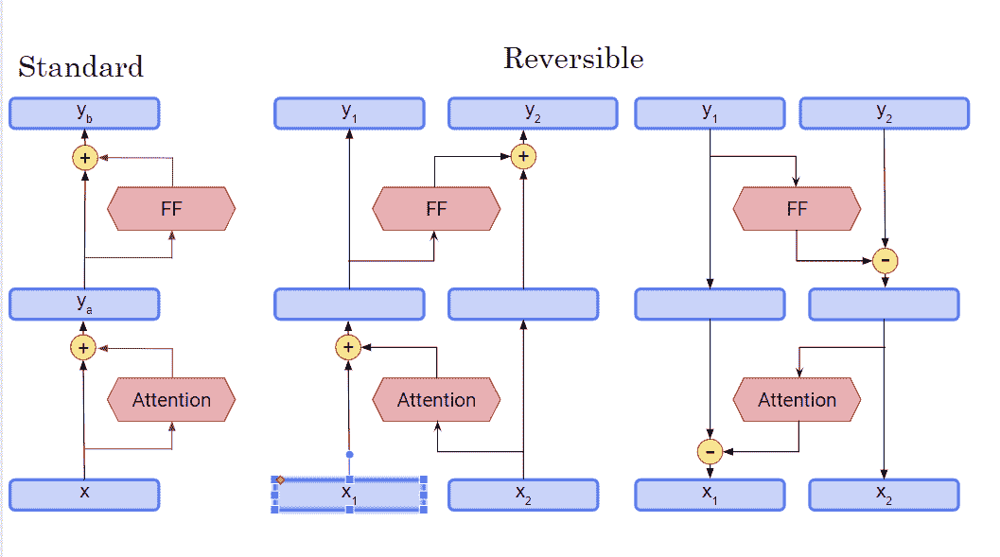
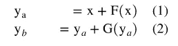
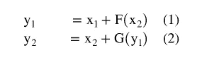
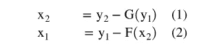
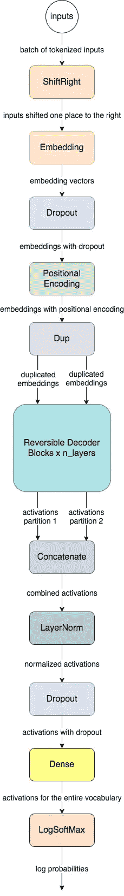
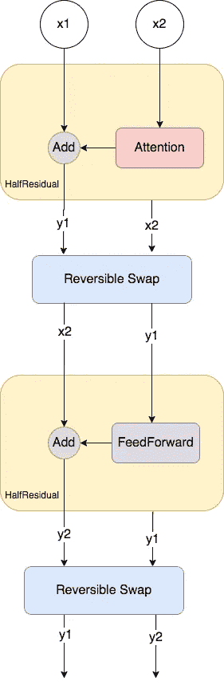

# 如何在 Python II 中创建 Chabot

> 原文：<https://medium.com/analytics-vidhya/how-to-create-a-chabot-in-python-5080f0d0029?source=collection_archive---------5----------------------->

## 使用高效转换器开发基于自然语言处理的聊天机器人第二部分


让我们首先回忆一下我们在第一部分讨论过的事情

> [如何用 Python 创建聊天机器人](https://shsarv.medium.com/how-to-create-a-chatbot-in-python-7ab924f10125)。

数据集和源代码在-[https://github.com/shsarv/ChatBot](https://github.com/shsarv/ChatBot)

我们知道聊天机器人是一个人造的个体或人类，它与人类或其他机器人进行交互。聊天机器人使用自然语言处理(NLP)和高级机器学习(ML)算法从数据洞察中学习& NLP 是计算机理解和处理人类语音的能力，并以人类可以理解的语言做出回应。这样，它使交互看起来像是两个人之间的交流。我们也开始了解 chabots 的优势，如 24*7 支持、即时回答和无需人工帮助的订单。最后，我们开始使用 **Reformer** 或 efficient Transformer 创建我们自己的聊天机器人，在这里我们探索了 MultiWoz 数据集，并看到了 MultiWoz 数据集的不同方面。


现在，我们将开始聊天机器人创建的第二阶段，我们将处理数据，将其输入模型，训练我们的模型&通过向模型输入问题来生成对话。这些是我们为完成这些任务将要执行的步骤。

*   **处理转化炉输入数据—** 标记化，用分桶法分批
*   **可逆层**
*   **可逆层和随机性**
*   **改革者培训**
*   **从预训练的模型解码。**

# 2.**处理转化炉输入数据。**

我们现在将使用`get_conversation()`函数来处理数据。重整者期望这种形式的输入:

**人 1:为什么我这么开心？因为你正在学习如何创建聊天机器人。人员 1: …人员 2: …***

对话继续进行，并有一些文本。如您所见,“人物 1”和“人物 2”充当分隔符，因此模型会自动识别人物以及正在说话的人。然后，它可以为每个人提供相应的文本响应。让我们以这种方式为改革者处理文本。首先，让我们从所有对话文件中获取所有对话字符串，并将它们放在一个列表中。

```
# the keys are the file names
all_files = DIALOGUE_DB.keys()

# initialize empty list
untokenized_data = []

# loop over all files
for file in all_files:
    # this is the graded function you coded
    # returns a string delimited by Person 1 and Person 2
    result = get_conversation(file, DIALOGUE_DB)

    # append to the list
    untokenized_data.append(result)

# print the first element to check if it's the same as the one we got before
print(untokenized_data[0])
```

输出-

```
Person 1: am looking for a place to to stay that has cheap price range it should be in a type of hotel Person 2: Okay, do you have a specific area you want to stay in? Person 1: no, i just need to make sure it's cheap. oh, and i need parking Person 2: I found 1 cheap hotel for you that includes parking. Do you like me to book it? Person 1: Yes, please. 6 people 3 nights starting on tuesday. Person 2: I am sorry but I wasn't able to book that for you for Tuesday. Is there another day you would like to stay or perhaps a shorter stay? Person 1: how about only 2 nights. Person 2: Booking was successful.
Reference number is : 7GAWK763\. Anything else I can do for you? Person 1: No, that will be all. Good bye. Person 2: Thank you for using our services.
```

现在，让我们将列表拆分为一个训练和评估数据集。

```
# shuffle the list we generated above
random.shuffle(untokenized_data)

cut_off = int(len(untokenized_data) * .05)

# slice the list. the last elements after the cut_off value will be the eval set. the rest is for training. 
train_data, eval_data = untokenized_data[:-cut_off], untokenized_data[-cut_off:]

print(f'number of conversations in the data set: {len(untokenized_data)}')
print(f'number of conversations in train set: {len(train_data)}')
print(f'number of conversations in eval set: {len(eval_data)}')
```

输出-

```
number of conversations in the data set: 10438
number of conversations in train set: 9917
number of conversations in eval set: 521
```

因此，我们的训练集的会话数等于 9917，而测试集中的会话数等于 521。

## 2.1 令牌化，使用分桶进行批处理

我们现在可以继续生成标记化的数据批次。让我们首先定义一个效用生成器函数，从我们的数据集中产生元素:

```
def stream(data):
    # loop over the entire data
    while True:
        # get a random element
        d = random.choice(data)

        # yield a tuple pair of identical values 
        # (i.e. our inputs to the model will also be our targets during training)
        yield (d, d)
```

现在让我们定义数据管道，对数据进行标记和批处理。我们将按长度存储桶，并且对令牌长度也有一个上限。我们将使用 trax，它允许我们使用组合子来生成数据管道。然后，我们将对数据进行标记，并过滤掉长序列。最后，我们将把数据管道应用于我们的训练和评估集。

```
data_pipeline = trax.data.Serial(
    # randomize the stream
    trax.data.Shuffle(),

    # tokenize the data
    trax.data.Tokenize(vocab_dir=VOCAB_DIR,
                       vocab_file=VOCAB_FILE),

    # filter too long sequences
    trax.data.FilterByLength(2048),

    # bucket by length
    trax.data.BucketByLength(boundaries=[128, 256,  512, 1024],
                             batch_sizes=[16,    8,    4,   2, 1]),

    # add loss weights but do not add it to the padding tokens (i.e. 0)
    trax.data.AddLossWeights(id_to_mask=0)
)

train_stream = data_pipeline(stream(train_data))
eval_stream = data_pipeline(stream(eval_data))
```

让我们来看看训练流。流生成器将产生(输入、目标、权重)。让我们只获取输入进行检查

```
inp, _, _ = next(train_stream)

# print the shape. format is (batch size, token length)
print("input shape: ", inp.shape)

# detokenize the first element
print(trax.data.detokenize(inp[0], vocab_dir=VOCAB_DIR, vocab_file=VOCAB_FILE))
```

输出

```
input shape:  (2, 1024)
 Person 1: Well, I am planning a trip and need some help with a train. Person 2: Of course, do you know your departure location and time? Person 1: I weill departing on thursday from cambridge and need to arrive by 10:30 in stevenage.  Person 2: I have three, leaving between 5:21 and 9:21\. Do you have a preference? Person 1: Not really. I need to know how much a ticket costs and how long it travels. Person 2: Train TR0552 arrives by 10:10 the ticket price is 12.80 pounds and the travel time is 49 minutes.  Person 1: Perfect. I am also looking for a place to stay with free parking Person 2: No problem, how many nights will you be staying? Person 1: I'm not sure of that yet. It does need to be in the north.  Person 2: Would you prefer a guest house or hotel? Person 1: I would like a hotel in the north, the star of the hotel and free internet. Person 2: how about acorn guest house? it's 4 stars. Person 1: Thank you, I'll take it. Can you book me for that hotel? Person 2: I would be happy to- I just need to know for which nights and for how many people. Person 1: Just for myself. And say, 2 nights ought to do it.  Person 2: 2 nights starting on Thursday? Person 1: Actually I am just calling for information not a booking. I need a hotel, not guesthouse, in the north with free parking. Can you recommend a hotel? Person 2: I don't have any hotels in the north that meet your criteria. Would you like me to look in a different area? Person 1: I'm really needing something in the north.  Please try again. Person 2: I just double checked. Still no hotels in the north that meet your criteria. What about a guesthouse? Person 1: No, I need a hotel in the north with free parking, no other criteria. I don't need free internet. Person 2: I'm sorry but I don't have anything meeting that criteria.  Person 1: Well okay then let's just go with whatever's available in the north. Person 2: Does the number of stars matter? Person 1: Not really, can you give me the number of stars and whether or not they have internet? Person 2: Ashley hotel, it has two stars and yes they have internet  Person 1: Sweet. That's all I needed then. Person 2: Thank you for calling today. Please call again if you have anything else that you need. Goodbye.
```

# 第 3 部分:可逆层

当运行大型深度模型时，我们经常会耗尽内存，因为每一层都分配内存来存储用于反向传播的激活。为了节省这个资源，我们需要能够在向后传递期间重新计算这些激活，而不需要在向前传递期间存储它们。首先看看下面最左边的图表。



这就是剩余网络在标准变压器中的实现方式。由此可见，给定`F()`是注意力，`G()`是前馈(FF)。：



如您所见，它要求保存 x 和 y(a ),以便在反向传播过程中使用。我们希望避免这种情况，以节省内存，这就是可逆剩余连接出现的原因。它们显示在上面中间和最右边的图表中。关键的想法是，我们将从模型输入的两个副本开始，在每一层，我们将只更新其中的一个。我们*没有*更新的激活将用于计算残差。现在，在这个可逆设置中，您将得到以下内容:



从(y1，y2)恢复(x1，x2)



有了这种配置，我们现在能够完全反向运行网络。您会注意到，在向后传递的过程中，x1 和 x2 可以只根据 y1 和 y2 的值重新计算。向前传球时不需要扑球。

现在，我们将使用上面的等式实现`reversible_layer_forward`函数。这个函数接受输入向量`x`和函数`f`和`g`，并返回 y1 和 y2 的连接。为此，我们将在进行可逆剩余步骤之前拆分`x`。然后我们可以将这两个向量用于`reversible_layer_reverse`函数。我们将利用`np.concatenate()`形成输出，小心匹配`np.split()`的轴。

```
def reversible_layer_forward(x, f, g):
    """
    Args: 
        x (np.array): an input vector or matrix
        f (function): a function which operates on a vector/matrix
        g (function): a function which operates on a vector/matrix
    Returns: 
        y (np.array): an output vector or matrix whose form is determined by 'x', f and g
    """
    # split the input vector into two (* along the last axis because it is the depth dimension)
    x1, x2 = np.split(x, 2, axis=-1) 
    y1 = x1 + f(x2)
    y2 = x2 + g(y1)

    # concatenate y1 and y2 along the depth dimension. be sure output is of type np.ndarray
    y = np.concatenate([y1, y2], axis=-1)
    return y
```

我们现在将实现`reversible_layer_reverse`函数，这是可能的，因为在每个时间步，你有 x1 和 x2，y1 和 y2，以及函数`f`和`g`。其中`f`是注意力，`g`是前馈。

```
def reversible_layer_reverse(y, f, g):
    """
    Args: 
        y (np.array): an input vector or matrix
        f (function): a function which operates on a vector/matrix of the form of 'y'
        g (function): a function which operates on a vector/matrix of the form of 'y'
    Returns: 
        y (np.array): an output vector or matrix whose form is determined by 'y', f and g
    """

    # split the input vector into two (* along the last axis because it is the depth dimension)
    y1, y2 = np.split(y, 2, axis=-1)
    x2 = y2 - g(y1)
    x1 = y1 - f(x2)
    # concatenate x1 and x2 along the depth dimension
    x = np.concatenate([x1, x2], axis=-1) 
    return x
```

## 3.1 可逆层和随机性

我们将使用 fastmath 的随机函数和键&利用同一个键，`trax.fastmath.random.uniform()`将返回相同的值。当层中引入随机噪声时，这是反向传递返回正确的层输入所必需的。

```
# Layers like dropout have noise, so let's simulate it here:
f = lambda x: x + np.random.uniform(size=x.shape)

# See that the above doesn't work any more:
output_vector = reversible_layer_forward(input_vector, f, g)
reversed_vector = reversible_layer_reverse(output_vector, f, g)

assert not np.allclose(reversed_vector, input_vector)  # Fails!!

# It failed because the noise when reversing used a different random seed.

random_seed = 27686
rng = trax.fastmath.random.get_prng(random_seed)
f = lambda x: x + trax.fastmath.random.uniform(key=rng, shape=x.shape)

# See that it works now as the same rng is used on forward and reverse.
output_vector = reversible_layer_forward(input_vector, f, g)
reversed_vector = reversible_layer_reverse(output_vector, f, g)

assert np.allclose(reversed_vector, input_vector,  atol=1e-07)
```

# 第 4 部分:改革者培训

我们现在开始训练你的模型。既然你已经知道了区别于标准变形金刚的两个主要组件，LSH 和上面的可逆层，我们可以使用 Trax 中已经实现的预建模型。它将具有这样的架构:



与 Transformer 类似，我们希望将注意力和前馈层应用到我们的输入中。对于重整器，我们通过使用**可逆解码器模块**来提高内存效率，您可以在 Trax 中描绘它的实现，如下所示:



你可以看到，它采用初始输入`x1`和`x2`，并计算第 3 部分中得到的可逆网络的第一个方程。如你所知，可逆残差有两个正向传递方程，因此只需其中一个方程就能构成可逆解码器模块的一半。在进行第二个等式(即可逆残差的后半部分)之前，首先需要交换元素，以考虑 Trax 中的堆栈语义。它只是把`x2`放在栈顶，这样它就可以被送到半剩余层的 add 块。然后，它再次交换两个输出，以便可以将其馈送到网络的下一层。所有这些都得到了第 3 部分中的两个方程，并且它可以用于在反向传递期间重新计算激活。

现在我们将实现一个包装器函数，它返回一个重整器语言模型。我们可以使用 Trax 的 [ReformerLM](https://trax-ml.readthedocs.io/en/latest/trax.models.html#trax.models.reformer.reformer.ReformerLM) 来快速完成这项工作。它将具有如上所示的相同架构。

```
def ReformerLM(vocab_size=33000, n_layers=2, mode='train', attention_type=tl.SelfAttention):
    """
    Args: 
        vocab_size (int): size of the vocabulary
        n_layers (int): number of decoder layers
        mode (string): setting of the model which can be 'train', 'eval', or 'predict' 
        attention_type(class): attention class to use 
    Returns: 
        model (ReformerLM): a reformer language model implemented in Trax
    """    
    # initialize an instance of Trax's ReformerLM class
    model = trax.models.reformer.ReformerLM( 
        # set vocab size
        vocab_size=vocab_size,
        # set number of layers
        n_layers=n_layers,
        # set mode
        mode=mode,
        # set attention type
        attention_type=attention_type
    )
    return model# display the model
temp_model = ReformerLM('train')
print(str(temp_model))

# free memory
del temp_model
```

现在，您将编写一个函数来接收我们的模型并对其进行训练。我们将实现`training_loop`来训练上面的神经网络。这是我们应该做的事情的清单:

*   创建`TrainTask`和`EvalTask`
*   创建训练循环`trax.supervised.training.Loop`

根据 train_task 传入以下内容:

*   `labeled_data=train_gen`
*   `loss_layer=tl.CrossEntropyLoss()`
*   `optimizer=trax.optimizers.Adam(0.01)`
*   `lr_schedule=lr_schedule`
*   `n_steps_per_checkpoint=10`

我们将使用带有 Adam 优化器的 CrossEntropyLoss 损失函数。请阅读 [trax](https://trax-ml.readthedocs.io/en/latest/trax.optimizers.html?highlight=adam#trax.optimizers.adam.Adam) 文档以获得全面理解。

将以下内容传递给 eval_task:

*   `labeled_data=eval_gen`
*   `metrics=[tl.CrossEntropyLoss(), tl.Accuracy()]`

这个函数应该返回一个`training.Loop`对象。要了解更多信息，请查看[文档](https://trax-ml.readthedocs.io/en/latest/trax.supervised.html?highlight=loop#trax.supervised.training.Loop)。

```
def training_loop(ReformerLM, train_gen, eval_gen, output_dir = "./model/"):
    """
    Args:
        ReformerLM:  the Reformer language model you are building
        train_gen (generator): train data generator.
        eval_gen (generator): Validation generator. 
        output_dir (string): Path to save the model output. Defaults to './model/'.

    Returns:
        trax.supervised.training.Loop: Training loop for the model.
    """

    # use the warmup_and_rsqrt_decay learning rate schedule
    lr_schedule = trax.lr.warmup_and_rsqrt_decay(
        n_warmup_steps=1000, max_value=0.01)

    # define the train task
    train_task = training.TrainTask(            
        # labeled data
        labeled_data=train_gen,
        # loss layer
        loss_layer=tl.CrossEntropyLoss(),
        # optimizer
        optimizer=trax.optimizers.Adam(0.01),
        # lr_schedule
        lr_schedule=lr_schedule,
        # n_steps
        n_steps_per_checkpoint=10
    )

    # define the eval task
    eval_task = training.EvalTask(                      
        # labeled data
        labeled_data=eval_gen,
        # metrics
        metrics=[tl.CrossEntropyLoss(), tl.Accuracy()]
    )

    loop = training.Loop(ReformerLM(mode='train'),
                         train_task,
                         eval_tasks=[eval_task],
                         output_dir=output_dir)
    return loop
```

# 第 5 部分:从预训练模型解码

我们现在将继续使用您刚刚实现的模型架构进行解码。我们将使用 Trax 的[auto regressive _ sample _ stream()](https://trax-ml.readthedocs.io/en/latest/trax.supervised.html#trax.supervised.decoding.autoregressive_sample_stream)解码方法进行快速推断。让我们定义几个参数来初始化我们的模型。

```
# define the `predict_mem_len` and `predict_drop_len` of tl.SelfAttention
def attention(*args, **kwargs):
    # number of input positions to remember in a cache when doing fast inference. 
    kwargs['predict_mem_len'] = 120
    # number of input elements to drop once the fast inference input cache fills up.
    kwargs['predict_drop_len'] = 120
    # return the attention layer with the parameters defined above
    return tl.SelfAttention(*args, **kwargs)

# define the model using the ReformerLM function we implemented earlier.
model = ReformerLM(
    vocab_size=33000,
    n_layers=6,
    mode='predict',
    attention_type=attention,
)

# define an input signature so we can initialize our model. shape will be (1, 1) and the data type is int32.
shape11 = trax.shapes.ShapeDtype((1, 1), dtype=np.int32)
```

我们现在可以从包含预训练权重的文件中初始化我们的模型。我们将保存这个起始状态，以便在生成新对话时可以重置模型状态。这将在后面的`generate_dialogue()`功能中变得更加清晰。

```
# initialize from file
model.init_from_file('chatbot_model1.pkl.gz',
                     weights_only=True, input_signature=shape11)

# save the starting state
STARTING_STATE = model.state
```

让我们定义几个效用函数来帮助我们令牌化和去令牌化。我们可以使用`trax.data.tf_inputs`中的 [tokenize()](https://trax-ml.readthedocs.io/en/latest/trax.data.html#trax.data.tf_inputs.tokenize) 和 [detokenize()](https://trax-ml.readthedocs.io/en/latest/trax.data.html#trax.data.tf_inputs.detokenize) 来实现这一点。

```
def tokenize(sentence, vocab_file, vocab_dir):
    return list(trax.data.tokenize(iter([sentence]), vocab_file=vocab_file, vocab_dir=vocab_dir))[0]

def detokenize(tokens, vocab_file, vocab_dir):
    return trax.data.detokenize(tokens, vocab_file=vocab_file, vocab_dir=vocab_dir)
```

我们现在准备定义我们的解码函数。这将返回一个生成器，该生成器生成模型输出下一个符号。只要给它输入一个起始句，它就能预测接下来的单词。

```
def ReformerLM_output_gen(ReformerLM, start_sentence, vocab_file, vocab_dir, temperature):
    """
    Args:
        ReformerLM:  the Reformer language model you just trained
        start_sentence (string): starting sentence of the conversation
        vocab_file (string): vocabulary filename
        vocab_dir (string): directory of the vocabulary file
        temperature (float): parameter for sampling ranging from 0.0 to 1.0.
            0.0: same as argmax, always pick the most probable token
            1.0: sampling from the distribution (can sometimes say random things)

    Returns:
        generator: yields the next symbol generated by the model
    """

    # Create input tokens using the the tokenize function
    input_tokens = tokenize(start_sentence, vocab_file=vocab_file, vocab_dir=vocab_dir)

    # Add batch dimension to array. Convert from (n,) to (x, n) where 
    # x is the batch size. Default is 1\. (hint: you can use np.expand_dims() with axis=0)
    input_tokens_with_batch = np.array(input_tokens)[None, :]

    # call the autoregressive_sample_stream function from trax
    output_gen = trax.supervised.decoding.autoregressive_sample_stream( 
        # model
        ReformerLM,
        # inputs will be the tokens with batch dimension
        inputs=input_tokens_with_batch,
        # temperature
        temperature=temperature
    )

    return output_gen
```

单元测试-

```
import pickle

WEIGHTS_FROM_FILE = ()

with open('weights', 'rb') as file:
    WEIGHTS_FROM_FILE = pickle.load(file)

shape11 = trax.shapes.ShapeDtype((1, 1), dtype=np.int32)

def attention(*args, **kwargs):
    kwargs['predict_mem_len'] = 120
    kwargs['predict_drop_len'] = 120
    return tl.SelfAttention(*args, **kwargs)

test_model = ReformerLM(vocab_size=5, n_layers=1, mode='predict', attention_type=attention)

test_output_gen = ReformerLM_output_gen(test_model, "test", vocab_file=VOCAB_FILE, vocab_dir=VOCAB_DIR, temperature=0)

test_model.init_weights_and_state(shape11)

test_model.weights = WEIGHTS_FROM_FILE

output = []

for i in range(6):
    output.append(next(test_output_gen)[0])

print(output)

# free memory
del test_model 
del WEIGHTS_FROM_FILE
del test_output_gen
```

太好了！现在，您将能够看到运行中的模型。下面的实用函数将调用您刚刚实现的生成器，并将格式化输出以便于阅读。

```
shape11 = trax.shapes.ShapeDtype((1, 1), dtype=np.int32)

def attention(*args, **kwargs):
    kwargs['predict_mem_len'] = 120  # max length for predictions
    kwargs['predict_drop_len'] = 120  # never drop old stuff
    return tl.SelfAttention(*args, **kwargs)

model = ReformerLM(
    vocab_size=33000,
    n_layers=6,
    mode='predict',
    attention_type=attention,
)
```

和

```
model.init_from_file('chatbot_model1.pkl.gz',
                     weights_only=True, input_signature=shape11)

STARTING_STATE = model.state
```

还有，

```
def generate_dialogue(ReformerLM, model_state, start_sentence, vocab_file, vocab_dir, max_len, temperature):
    """
    Args:
        ReformerLM:  the Reformer language model you just trained
        model_state (np.array): initial state of the model before decoding
        start_sentence (string): starting sentence of the conversation
        vocab_file (string): vocabulary filename
        vocab_dir (string): directory of the vocabulary file
        max_len (int): maximum number of tokens to generate 
        temperature (float): parameter for sampling ranging from 0.0 to 1.0.
            0.0: same as argmax, always pick the most probable token
            1.0: sampling from the distribution (can sometimes say random things)

    Returns:
        generator: yields the next symbol generated by the model
    """  

    # define the delimiters we used during training
    delimiter_1 = 'Person 1: ' 
    delimiter_2 = 'Person 2: '

    # initialize detokenized output
    sentence = ''

    # token counter
    counter = 0

    # output tokens. we insert a ': ' for formatting
    result = [tokenize(': ', vocab_file=vocab_file, vocab_dir=vocab_dir)]

    # reset the model state when starting a new dialogue
    ReformerLM.state = model_state

    # calls the output generator implemented earlier
    output = ReformerLM_output_gen(ReformerLM, start_sentence, vocab_file=VOCAB_FILE, vocab_dir=VOCAB_DIR, temperature=temperature)

    # print the starting sentence
    print(start_sentence.split(delimiter_2)[0].strip())

    # loop below yields the next tokens until max_len is reached. the if-elif is just for prettifying the output.
    for o in output:

        result.append(o)

        sentence = detokenize(np.concatenate(result, axis=0), vocab_file=VOCAB_FILE, vocab_dir=VOCAB_DIR)

        if sentence.endswith(delimiter_1):
            sentence = sentence.split(delimiter_1)[0]
            print(f'{delimiter_2}{sentence}')
            sentence = ''
            result.clear()

        elif sentence.endswith(delimiter_2):
            sentence = sentence.split(delimiter_2)[0]
            print(f'{delimiter_1}{sentence}')
            sentence = ''
            result.clear()

        counter += 1

        if counter > max_len:
            break
```

我们现在可以输入不同的起始句，看看这个模型是如何生成对话的。你甚至可以输入自己的起始句。请记住提出一个涵盖 Multiwoz 数据集中的主题的问题，这样您就可以展开有意义的对话。

```
sample_sentence = ' Person 1: Are there theatres in town? Person 2: '
generate_dialogue(ReformerLM=model, model_state=STARTING_STATE, start_sentence=sample_sentence, vocab_file=VOCAB_FILE, vocab_dir=VOCAB_DIR, max_len=120, temperature=0.2)
```

输出-

```
Person 1: Are there theatres in town?
Person 2: : There are 4 theatres in town. Do you have a preference? 
Person 1: Not really, can you recommend one and give me the address and postcode? 
Person 2: How about the ADC Theatre located at Park Street? 
Person 1: That sounds great. Can I get the postcode and phone number? 
Person 2: The phone number is 01223300085\. The postcode is cb58as. 
Person 1: I also need a train to Cambridge on Thursday the week I will be traveling alone.
```

接下来，

```
sample_sentence = ' Person 1: Is there a hospital nearby? Person 2: '
generate_dialogue(ReformerLM=model, model_state=STARTING_STATE, start_sentence=sample_sentence, vocab_file=VOCAB_FILE, vocab_dir=VOCAB_DIR, max_len=120, temperature=0.2)
```

输出-

```
Person 1: Is there a hospital nearby?
Person 2: : Addensbrookes Hospital is located at Hills Rd, Cambridge, postcode CB20QQ. Do you need the phone number? 
Person 1: No, but I do need the main phone number, please. 
Person 2: The phone number is 01223245151\. 
Person 1: Thank you for your help. 
Person 2: You're welcome. Have a nice day.
Person 1: Thank you for your help. 
Person 1: You're welcome 43, Fensounds good!
```

最后，

```
sample_sentence = ' Person 1: Can you book a taxi? Person 2: '
generate_dialogue(ReformerLM=model, model_state=STARTING_STATE, start_sentence=sample_sentence, vocab_file=VOCAB_FILE, vocab_dir=VOCAB_DIR, max_len=120, temperature=0.2)
```

输出-

```
Person 1: Can you book a taxi?
Person 2: : I sure can. Where would you like to be picked up? 
Person 1: I'm going to be picked up from aylesbray lodge guest house. 
Person 2: I'd be happy to help you. What time would you like to arrive? 
Person 1: I need to leave after 11:00\. 
Person 2: Booking completed! Booked car type	:	grey ford
Contact number	:	07262372

Person 1: I'm looking for a train to Cambridge on Saturday.
```


**恭喜你！，您刚刚创建了一个自动化的夏波特。希望你旅途愉快。**

这个故事变得很长，但进一步分割可能不会有影响，因为所有部分都是相互关联的。