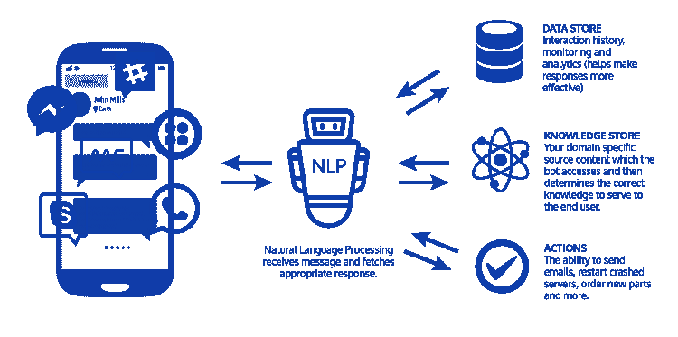

# 如何用 Python 创建聊天机器人

> 原文：<https://medium.com/analytics-vidhya/how-to-create-a-chatbot-in-python-7ab924f10125?source=collection_archive---------8----------------------->

## 快速指南

## 使用高效转换器开发基于自然语言处理的聊天机器人第 1 部分


# **简介**

帽子机器人，一个与人类或其他机器人互动的人造个体或人类。会话可以是基于文本的会话、口头或非口头的会话。可以通过桌面、手机或其他外围设备访问。从古老的基于 HTML 的网站到现代的电子商务以及食品订购网站，我们都可以看到这些系统。

# 聊天机器人是如何工作的？



聊天机器人使用自然语言处理(NLP)和**高级机器学习(ML)算法**从数据洞察中学习。NLP 是计算机理解和处理人类语音，并以人类可以理解的语言做出反应的能力。这样，它使交互看起来像是两个人之间的交流。谈到聊天机器人中的自然语言处理，有两个过程:

**自然语言理解(NLU)——**这使得机器人能够理解人类，将文本转换成机器可以理解的结构化数据。

**自然语言生成(NLG)——**它将结构化数据转换成文本，使人类有可能理解对话。

# 聊天机器人的优势


聊天机器人对客户的主要优势如下:

*   **24*7 支持** —您不能依赖支持代理提供 24*7 支持。即使在工作时间之后，团队不在时，随时响应也很重要。聊天机器人可以通过自动回复来管理这类客户查询。
*   **即时回答** —客户不喜欢等待帮助，任何等待时间都可能导致失望和潜在的流失。聊天机器人是确保客户收到他们要求的即时响应的一种更聪明的方式。
*   **无需人工帮助的订单** —企业可以利用聊天机器人来自动预订订单和约会，这样客户就可以立即从网站或脸书页面预订。47%的消费者会从聊天机器人那里购买商品。


在本文中，我们将使用**转换器**创建一个聊天机器人，也称为高效转换器，在两个机器人之间生成对话。您将向您的模型输入对话，它将学习如何理解每个对话的上下文。它不仅会学习如何回答问题，如果需要更多信息，它还会知道如何提问。例如，在顾客索要火车票后，聊天机器人可以询问该顾客想什么时候离开。我们可以使用这个概念来自动化呼叫中心、酒店前台、私人教练或任何类型的客户服务。通过，我们将:

*   了解高效变压器的工作原理。
*   探索 ***MultiWoz*** 数据集。
*   处理数据，将其输入模型。
*   训练你的模型。
*   向模型提出一个问题，生成一个对话。

# 概述

1.  **探索 MultiWoz 数据集**
2.  **处理转化炉输入数据**
3.  **令牌化，用分桶分批**
4.  **可逆层**
5.  **可逆层和随机性**
6.  **改革者培训**
7.  **从预训练模型解码**

## 1:探索多 Woz 数据集

您将从探索 MultiWoz 数据集开始。我们将要使用的数据集有超过 10，000 个人类注释的对话，跨越多个领域和主题。一些对话包括多个领域，而另一些包括单个领域。我们将加载和探索这个数据集，并开发一个函数来提取对话。

让我们首先导入我们将使用的模块:

```
import json
import random
import numpy as np
from termcolor import coloredimport trax   
from trax import layers as tl
from trax.supervised import training
!pip list | grep trax
```

让我们也声明一些我们将在练习中使用的常量。

```
# filename of the MultiWOZ dialogue dataset
DATA_FILE = 'data.json'# data directory
DATA_DIR = './data'# dictionary where we will load the dialogue dataset
DIALOGUE_DB = {}# vocabulary filename
VOCAB_FILE = 'en_32k.subword'# vocabulary file directory
VOCAB_DIR = 'data/vocabs'
```

现在让我们加载 MultiWOZ 2.1 数据集。我们有 json 格式的数据集。

```
# help function to load a JSON file
def load_json(directory, file):
    with open(f'{directory}/{file}') as file: 
        db = json.load(file)
    return db# load the dialogue data set into our dictionary
DIALOGUE_DB = load_json(DATA_DIR, DATA_FILE)
```

让我们看看字典里有多少对话。1 个键-值对是一个对话，所以我们可以得到字典的长度。

```
print(f'The number of dialogues is: {len(DIALOGUE_DB)}') #Output----------------
#The number of dialogues is: 10438
```

对话由多个文件组成，文件名在我们的字典中用作关键字。那些多域对话的文件名中有“MUL ”,而单域对话的文件名中有“SNG”或“WOZ”。

```
# print 7 keys from the dataset to see the filenames
print(list(DIALOGUE_DB.keys())[0:7]) #Output----------------
#['SNG01856.json', 'SNG0129.json', 'PMUL1635.json', 'MUL2168.json', 'SNG0073.json', 'SNG01445.json', 'MUL2105.json']
```

有 10，438 个对话，每个都有自己的文件。您将在所有这些对话中训练您的模型。每个文件也被加载到一个字典中，并且每个文件都有两个键，它们是:

```
# get keys of the fifth file in the list above
print(DIALOGUE_DB['SNG0073.json'].keys()) #Output-----------
dict_keys(['goal', 'log'])
```

`goal`也指向一个字典，它包含几个与对话目标相关的关键字。例如下面，我们可以看到对话将是关于预订出租车。

```
DIALOGUE_DB['SNG0073.json']['goal'] #*output:-* #{'taxi': {'info': {'leaveAt': '17:15',
   'destination': 'pizza hut fen ditton',
   'departure': "saint john's college"},
  'reqt': ['car type', 'phone'],
  'fail_info': {}},
 'police': {},
 'hospital': {},
 'hotel': {},
 'attraction': {},
 'train': {},
 'message': ["You want to book a <span class='emphasis'>taxi</span>. The taxi should go to <span class='emphasis'>pizza hut fen ditton</span> and should depart from <span class='emphasis'>saint john's college</span>",
  "The taxi should <span class='emphasis'>leave after 17:15</span>",
  "Make sure you get <span class='emphasis'>car type</span> and <span class='emphasis'>contact number</span>"],
 'restaurant': {}}
```

另一方面,`log`包含对话框。这是一个字典列表，列表中的每个元素都包含一些描述。让我们看一个例子:

```
# get first element of the log list
DIALOGUE_DB['SNG0073.json']['log'][0]
```

*输出*

```
{'text': "I would like a taxi from Saint John's college to Pizza Hut Fen Ditton.",
 'metadata': {},
 'dialog_act': {'Taxi-Inform': [['Dest', 'pizza hut fen ditton'],
   ['Depart', "saint john 's college"]]},
 'span_info': [['Taxi-Inform', 'Dest', 'pizza hut fen ditton', 11, 14],
  ['Taxi-Inform', 'Depart', "saint john 's college", 6, 9]]}
```

目前，我们只对`text`字段中的对话感兴趣。对话在两个人之间反复进行。我们称他们为‘第一人’和‘第二人’。这意味着数据[' sng 0073 . JSON '][' log '][0][' text ']是' Person 1 '，数据[' sng 0073 . JSON '][' log '][1][' text ']是' Person 2 '等等。偶数偏移是“人 1”，奇数偏移是“人 2”。

```
print(' Person 1: ', DIALOGUE_DB['SNG0073.json']['log'][0]['text'])
print(' Person 2: ',DIALOGUE_DB['SNG0073.json']['log'][1]['text']) #OutPut-----------------
#Person 1:  I would like a taxi from Saint John's college to Pizza #Hut Fen Ditton.
 #Person 2:  What time do you want to leave and what time do you #want to arrive by?
```

我们现在将实现`get_conversation()`函数，该函数将从数据集的文件中提取对话。对话在文件的`log`列表的每个元素的`text`字段中。如果日志列表有`x`个元素，那么这个函数将得到这些元素的`text`个条目。我们的函数应该返回对话，如果“x”是偶数，则在每个字段前面加上“Person 1:”或“Person 2:”如果“x”是奇数。我们可以使用 Python 模数运算符“%”来帮助选择偶数/奇数条目。

```
def get_conversation(file, data_db):
    '''
    Args:
        file (string): filename of the dialogue file saved as json
        data_db (dict): dialogue database

    Returns:
        string: A string containing the 'text' fields of  data[file]['log'][x]
    '''

    # initialize empty string
    result = ''

    # get length of file's log list
    len_msg_log = len(data_db[file]['log'])

    # set the delimiter strings
    delimiter_1 = ' Person 1: '
    delimiter_2 = ' Person 2: '

    # loop over the file's log list
    for i in range(len_msg_log):

    ### START CODE HERE (REPLACE INSTANCES OF 'None' WITH YOUR CODE) ###

        # get i'th element of file log list
        cur_log = data_db[file]['log'][i]

        # check if i is even
        if i%2 == 0:                   
            # append the 1st delimiter string
            result += delimiter_1
        else: 
            # append the 2nd delimiter string
            result += delimiter_2

        # append the message text from the log
        result += cur_log['text']

    ### END CODE HERE ###

    return result
```

*测试我们的功能*

```
# BEGIN UNIT TEST
import w4_unittest
w4_unittest.test_get_conversation(get_conversation)
```

*文件测试:-*

```
file = 'SNG01856.json'
conversation = get_conversation(file, DIALOGUE_DB)

# print raw output
print(conversation)
```

我们可以有一个实用的漂亮的打印功能，这样我们可以更容易地在视觉上跟踪对话。

```
def print_conversation(conversation):

    delimiter_1 = 'Person 1: '
    delimiter_2 = 'Person 2: '

    split_list_d1 = conversation.split(delimiter_1)

    for sublist in split_list_d1[1:]:
        split_list_d2 = sublist.split(delimiter_2)
        print(colored(f'Person 1: {split_list_d2[0]}', 'red'))

        if len(split_list_d2) > 1:
            print(colored(f'Person 2: {split_list_d2[1]}', 'green'))

print_conversation(conversation)
```

*输出:-*

```
Person 1: am looking for a place to to stay that has cheap price range it should be in a type of hotel 
Person 2: Okay, do you have a specific area you want to stay in? 
Person 1: no, i just need to make sure it's cheap. oh, and i need parking 
Person 2: I found 1 cheap hotel for you that includes parking. Do you like me to book it? 
Person 1: Yes, please. 6 people 3 nights starting on tuesday. 
Person 2: I am sorry but I wasn't able to book that for you for Tuesday. Is there another day you would like to stay or perhaps a shorter stay? 
Person 1: how about only 2 nights. 
Person 2: Booking was successful.
Reference number is : 7GAWK763\. Anything else I can do for you? 
Person 1: No, that will be all. Good bye. 
Person 2: Thank you for using our services.DIALOGUE_DB['SNG01856.json']['log'][0]
```

*输出:-*

```
{'text': 'am looking for a place to to stay that has cheap price range it should be in a type of hotel',
 'metadata': {},
 'dialog_act': {'Hotel-Inform': [['Type', 'hotel'], ['Price', 'cheap']]},
 'span_info': [['Hotel-Inform', 'Type', 'hotel', 20, 20],
  ['Hotel-Inform', 'Price', 'cheap', 10, 10]]}
```

该数据集还带有酒店、医院、出租车、火车、警察和餐馆数据库。例如，如果你需要打电话给医生、酒店或出租车，这将允许你自动完成整个对话。看一下数据集附带的文件。

```
# this is an example of the attractions file
attraction_file = open('data/attraction_db.json')
attractions = json.load(attraction_file)
print(attractions[0])
```

*这是一个景点文件的例子:-*

```
#Output----------------#{'address': 'pool way, whitehill road, off newmarket road', 'area': 'east', 'entrance fee': '?', 'id': '1', 'location': [52.208789, 0.154883], 'name': 'abbey pool and astroturf pitch', 'openhours': '?', 'phone': '01223902088', 'postcode': 'cb58nt', 'pricerange': '?', 'type': 'swimmingpool'}
```

*这是一个医院文件的例子:-*

```
hospital_file = open('data/hospital_db.json')
hospitals = json.load(hospital_file)
print(hospitals[0]) # feel free to index into other indices#Output-------------#{'department': 'neurosciences critical care unit', 'id': 0, 'phone': '01223216297'}
```

*这是一个酒店文件的例子:-*

```
hotel_file = open('data/hotel_db.json')
hotels = json.load(hotel_file)
print(hotels[0]) # feel free to index into other indices#Output----------------{'address': '124 tenison road', 'area': 'east', 'internet': 'yes', 'parking': 'no', 'id': '0', 'location': [52.1963733, 0.1987426], 'name': 'a and b guest house', 'phone': '01223315702', 'postcode': 'cb12dp', 'price': {'double': '70', 'family': '90', 'single': '50'}, 'pricerange': 'moderate', 'stars': '4', 'takesbookings': 'yes', 'type': 'guesthouse'}
```

*这是警察档案的一个例子:-*

```
police_file = open('data/police_db.json')
police = json.load(police_file)
print(police[0]) # feel free to index into other indices#Output----------------{'name': 'Parkside Police Station', 'address': 'Parkside, Cambridge', 'id': 0, 'phone': '01223358966'}
```

*这是一个 restuarant 文件的例子:-*

```
restaurant_file = open('data/restaurant_db.json')
restaurants = json.load(restaurant_file)
print(restaurants[0]) # feel free to index into other indices#Output----------------{'address': 'Regent Street City Centre', 'area': 'centre', 'food': 'italian', 'id': '19210', 'introduction': 'Pizza hut is a large chain with restaurants nationwide offering convenience pizzas pasta and salads to eat in or take away', 'location': [52.20103, 0.126023], 'name': 'pizza hut city centre', 'phone': '01223323737', 'postcode': 'cb21ab', 'pricerange': 'cheap', 'type': 'restaurant'}
```

关于 multiwoz 2.1 数据集的更多信息，让我们打印出`ReadMe.txt`文件。

```
with open('data/README') as file:
    print(file.read())
```

正如我们所见，MultiWoz 数据集还有许多其他方面。尽管如此，我们将会看到，即使只有对话，我们的模型仍然能够生成有用的响应。

我们对数据集的探索到此结束。在下一部分中，我们将在将它输入模型进行训练之前做一些预处理。

***在***[***https://github.com/shsarv/ChatBot***](https://github.com/shsarv/ChatBot)***找到数据集和源代码。***