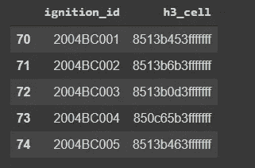

# 如何创建一个 Choropleth 地图使用优步 H3，Plotly 和 Python

> 原文：<https://medium.com/analytics-vidhya/how-to-create-a-choropleth-map-using-uber-h3-plotly-python-458f51593548?source=collection_archive---------1----------------------->


英国图书馆在 [Unsplash](https://unsplash.com?utm_source=medium&utm_medium=referral) 上拍摄的[照片](https://unsplash.com/@britishlibrary?utm_source=medium&utm_medium=referral)

在本文中，我们将构建一个交互式地图，显示整个[育空地区](https://en.wikipedia.org/wiki/Yukon)的火灾分布。

## 关于我们将要使用的数据集，

您可以使用此[链接](https://opendata.arcgis.com/datasets/3c30dd2c61644302adde38a3f5750d2c_8)从 [ArcGIS Hub](https://hub.arcgis.com/) 下载数据集。数据集是点 GIS coverage，由火点位置或火点多边形的质心组成，其中育空地区的火点位置未知，时间跨度为 1946 年至今。

## 程序，

*   数据预处理。
*   计算每个着火位置的 H3 单元。
*   清点位于每个 H3 牢房的所有着火点。
*   使用 Plotly 绘制 H3 六边形。

## 数据预处理

首先，为我们的分析导入相关的库。在本节中，我将使用 Geopandas，Numpy。

```
import geopandas as gpd
import numpy as np
```

假设您已经使用这个[链接](https://opendata.arcgis.com/datasets/3c30dd2c61644302adde38a3f5750d2c_8.zip)下载了数据集，并将其提取到您的工作目录，让我们导入数据集并快速浏览一下。

```
fire_ignitions = gpd.read_file('/data/Fire_Ignition_Locations.shp')
fire_ignitions.describe()
```


数据集概述

```
numeric_columns = (fire_ignitions
                   .select_dtypes(include=np.number)
                   .columns
                   .to_list())fire_ignitions[numeric_columns].head()
```


数字列

让我们从数据集中删除空值。我们不打算在分析中使用所有的列。我们将选择适当的列。

```
fire_ignitions.dropna(inplace=True)
fire_ignitions = (fire_ignitions
                 [['FIRE_ID','LATITUDE_D','LONGITUDE_']])
```

现在，我们的数据集可以进行分析了。进入下一步。

## 计算每个着火位置的 H3 单元

在这一部分，我将使用[优步·H3](https://h3geo.org/docs)库来为给定的起火位置分配 H3 单元。首先，安装 H3 使用，

```
pip install h3
```

现在，导入 H3 并创建一个函数来将着火点映射到 H3 单元格。在这个分析中，我将 H3 分辨率设为 5。返回一个面积约为 253 平方公里的 H3 六边形。下面您可以为您的场景选择合适的分辨率。


图片来源:**h3geo.org**

```
H3_res = 5
def geo_to_h3(row):
  return h3.geo_to_h3(lat=row.lat,lng=row.lng,resolution = H3_res)
```

然后为我们的数据集应用构建的函数，

```
fire_ignitions['h3_cell'] = fire_ignitions.apply(geo_to_h3,axis=1)
```

现在我们可以删除除了新创建的“h3_cell”和“ignition_id **”之外的其他列。**现在我们的数据集看起来像这样，



现在，我们可以进入下一部分了。

## 清点每个 H3 牢房中的所有着火点

在本节中，我们将计算一个六边形单元格中的所有点。使用 Geopandas groupby 方法，

```
fire_ignitions_g = (fire_ignitions
                          .groupby('h3_cell')
                          .ignition_id
                          .agg(list)
                          .to_frame("ids")
                          .reset_index())# Let's count each points inside the hexagonfire_ignitions_g['count'] =(fire_ignitions_g['ids']
                      .apply(lambda ignition_ids:len(ignition_ids)))
```

然后看看我们的数据集，

```
fire_ignitions_g.sort_values('count',ascending=False)
```


好了，现在我们可以进入分析的最后部分了。

## 使用 Plotly 绘制 H3 六边形

现在我们有了六边形 id 和相关的点火 id 及其计数。对于绘图部分，我们需要为每个六边形生成六边形几何图形。我们可以使用下面的函数来实现。为此，我将使用[匀称的](https://github.com/Toblerity/Shapely)。不用担心单独安装 shapely。它将在 Geopandas 安装过程中安装。导入就好。

```
from shapely.geometry import Polygondef add_geometry(row):
  points = h3.h3_to_geo_boundary(row['h3_cell'], True)
  return Polygon(points)#Apply function into our dataframefire_ignitions_g['geometry'] = (fire_ignitions_g
                                .apply(add_geometry,axis=1))
```

看着我们的数据框架，


现在我们可以使用 Plotly 绘制我们的六边形。开始之前，让我们先来看看我们要用的方法。我们使用 Plotly express 模块的 [choropleth_mapbox](https://plotly.github.io/plotly.py-docs/generated/plotly.express.choropleth.html) 方法来构建地图。为此，我们需要传递数据帧、Geojson 格式的字典、数据帧的位置列、列名，我们需要为 choropleth 分配颜色。

我们需要做的是使用我们的数据框架创建一个 *GeoJSON 格式的字典*。为此，我们可以使用下面的函数。

正在创建 *GeoJSON* 对象，

```
geojson_obj = (hexagons_dataframe_to_geojson
                (fire_ignitions_grouped,
                 hex_id_field='h3_cell',
                 value_field='count',
                 geometry_field='geometry'))
```

导入 Plotly express 模块进行绘图，

```
import plotly.express as px
```

为我们的数据集绘制 choropleth 图，

```
fig = (px.choropleth_mapbox(
                    fire_ignitions_g, 
                    geojson=geojson_obj, 
                    locations='h3_cell', 
                    color='count',
                    color_continuous_scale="Viridis",
                    range_color=(0,fire_ignitions_g['count'].mean()           ),                  mapbox_style='carto-positron',
                    zoom=7,
                    center = {"lat": 65.469211, "lon": -136.713865},
                    opacity=0.7,
                    labels={'count':'# of fire ignitions '}))fig.update_layout(margin={"r":0,"t":0,"l":0,"b":0})
fig.show()
```


请发表任何关于这次阅读的评论或问题。谢谢大家！

***参考文献***

*   [https://github.com/uber/h3/tree/master/docs](https://github.com/uber/h3/tree/master/docs)
*   [https://plotly . github . io/plotly . py-docs/generated/plotly . express . choropleth . html](https://plotly.github.io/plotly.py-docs/generated/plotly.express.choropleth.html)