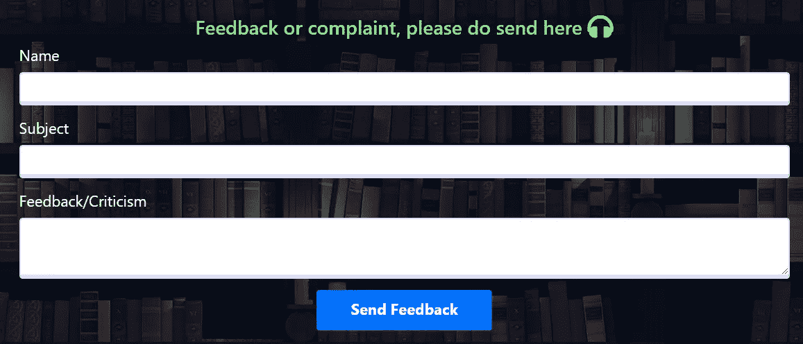
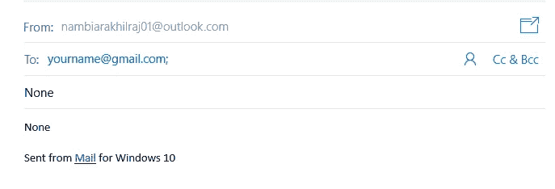
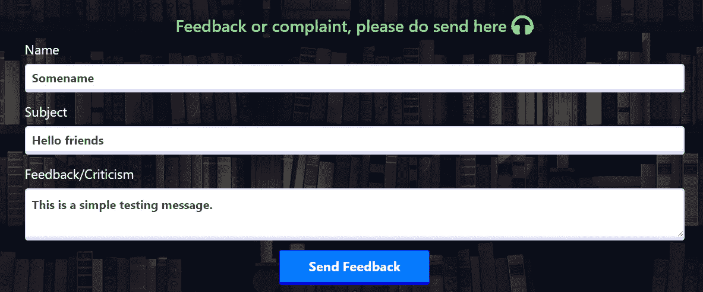
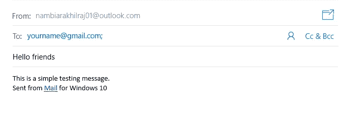

# 如何在您的网站上创建一个用户可以用来联系您的联系页面。

> 原文：<https://medium.com/analytics-vidhya/how-to-create-a-contact-page-that-users-can-use-to-contact-you-on-your-website-758187207f65?source=collection_archive---------13----------------------->

你好，首先感谢你阅读这篇文章。我将使用 Python(Flask)来验证提交后的联系表单。如果您不习惯使用 Python，可以使用任何其他后端。我也希望你有 HTML 表单的工作知识。那么让我们开始吧！

关于联系方式的使用，让我澄清一下它的上下文。这种形式是你在许多网站上看到的形式，这有助于我们联系他们，而不需要实际输入到我们设备的电子邮件客户端。我们所做的只是填写一些基本信息，然后消息被格式化为电子邮件，自动打开电子邮件客户端。按下发送按钮就是我们要做的一切！

好了，现在我们已经了解了为什么，让我们从如何开始。首先，我们需要为联系人表单设计一个简单的 HTML 和 CSS 页面。此外，它必须与我们的后端集成。因此，在我的例子中，我创建了一个 Flask 表单来使它工作(安装时附带了 wtforms python 模块)。这是我设计的一个简单的联系页面。



现在，这个表单还使用了 Bootstrap 来获得更好的样式，以防你想知道。我们想在这里关注的最重要的方面是表单在后端的构造方式。因为我使用了烧瓶模型，所以我提供的结构看起来有点像这样。

```
from flask_wtf import FlaskForm
from wtforms import StringField, TextAreaField, SubmitField
from wtforms.validators import DataRequiredclass Feedback_form(FlaskForm):
 name = StringField(‘Name’, validators=[DataRequired()])
 subject = StringField(‘Subject’,validators=[DataRequired()])
 feedback = TextAreaField(‘Feedback/Criticism’, validators=[DataRequired()])
 submit = SubmitField(‘Send Feedback’)
```

现在，正如您所看到的，代码指出了每个 from 输入的部分。例如:

> name = StringField('Name '，validators=[DataRequired()])

该字段可以映射到联系人表单中的名称字段。StringField 的第一个参数表示我们将用于输入字段的标签。DataRequired()验证器映射到 HTML 输入标记的 Required 属性。

简而言之，联系人表单的代码看起来有点像这样。

```
<form method=”POST” action="">
 {{ form.hidden_tag() }}
 <div class=”form-group row”>
 <div class=”col-12">
 {{ form.name.label(class=’form-label’) }}
 
 {{ form.name( class=’form-control form-control-lg is-invalid’ ) }}
 <div class=”invalid-feedback”>
 
 <span>{{ error }}</span>
 
 </div>
 
 {{ form.name( class=’form-control form-control-lg’ ) }}
 
 </div>
 </div>
 <div class=”form-group row”>
 <div class=”col-12">
 {{ form.subject.label(class=’form-label’) }}
 
 {{ form.subject( class=’form-control form-control-lg is-invalid’ ) }}
 <div class=”invalid-feedback”>
 
 <span>{{ error }}</span>
 
 </div>
 
 {{ form.subject( class=’form-control form-control-lg’ ) }}
 
 </div>
 </div>
 <div class=”form-group row”>
 <div class=”col-12">
 {{ form.feedback.label(class=’form-label’) }}
 
 {{ form.feedback( class=’form-control form-control-lg is-invalid’ ) }}
 <div class=”invalid-feedback”>
 
 <span>{{ error }}</span>
 
 </div>
 
 {{ form.feedback( class=’form-control form-control-lg’ ) }}
 
 </div>
 </div>
 <div class=”form-group row”>
 <div class=”col-12 text-center”>
 {{ form.submit( class=’btn btn-primary submit_button pr-5 pl-5')}}
 </div>
 </div>
 </form>
```

如果你想了解 Flask Forms 和使用 Flask 作为后端，我推荐你看这个[视频](https://www.youtube.com/watch?v=UIJKdCIEXUQ)和相关的播放列表。

```
<form method=”POST” action="">
```

请密切注意这一行。方法是 post，这意味着 POST 请求将被发送到 action 属性中指定的页面。由于 action 属性中没有提及任何内容，因此页面会将信息发送回相同的路由，即页面。

该表单必须与 flask 中的一个路由相关联，才能正常工作。这条路线大概是这样的

```
from backend.forms import Feedback_form@app.route(‘/contact’, methods=[‘GET’,’POST’])
def contact():
 form = Feedback_form()
 if current_user.is_authenticated:
   form.name.data = current_user.username
 if form.validate_on_submit():
   webbrowser.open(f”youremailid?subject={form.subject.data}&body={form.feedback.data}”, autoraise=True)
   return redirect(url_for(‘home’))
 return render_template(‘contact.html’, title=’Contact Me’, form=form)
```

让我们一行一行地检查这段代码。

```
if current_user.is_authenticated:
```

这个 if 语句在使用提交的数据和呈现 HTML 模板之前检查用户是否通过了身份验证。

```
if form.validate_on_submit():
```

该检查验证表单数据并检查错误。这些错误将由表单中内置的错误处理程序来处理。

现在是讨论的时候了。默认情况下，python 提供了 [smtplib 模块](https://www.youtube.com/watch?v=JRCJ6RtE3xU&t=567s)，用于使用电子邮件客户端发送自动电子邮件。它的升级版本是可以安装的[烧瓶邮件模块](https://pythonhosted.org/Flask-Mail/)。但这里存在的问题是，要使用这些模块发送自动邮件，我们需要访问发件人的电子邮件和密码，相对于电子邮件客户端。这并不是一个很好用的特性，因为它要求用户每次点击提交按钮时输入他们的电子邮件客户端的密码。

解决方案要简单得多。与 HTML 的锚标记一起使用的传统 mailto 链接是这里的老大，因为它可以毫不费力地满足我们的所有需求。现在又有一个麻烦了！！

如果我们看它，我们不能使用锚标记和提交按钮，以获得输入字段中输入的数据。除非提交表格，否则我们无法访问表格中输入的数据。我知道这听起来很麻烦，所以让我演示一下，以便更好地理解。

```
<div class=”form-group row”>
 <div class=”col-12 text-center”>
 {{ form.submit( class=’btn btn-primary submit_button pr-5 pl-5')}}
 </div>
 </div>
```

这是当前代码。让我们将 submit 字段修改为一个锚标记。

```
<div class=”form-group row”>
 <div class=”col-12 text-center”>
    <a href="mailto:yourname@gmail.com?subject={{form.subject.data}}&body={{form.feedback.data}}" class=’btn btn-primary submit_button pr-5 pl-5'>Submit</a>
 </div>
 </div>
```

这就是我们使用锚定标签来创建 mailto 链接的时候。从[这里](https://css-tricks.com/snippets/html/mailto-links/)可以更好的理解 mailto 链接的这种格式。

按照 jinja2 模板规则，{{}}中的值用于表示 Flask 表单中的变量。例如，在这里，form.subject.data 和 form.feedback.data 表示我们输入到表单字段 subject 和 feedback 中的值。

现在这项工作应该完成了(或者至少这是我所希望的)。但是，当您运行此代码时，邮件客户端在打开时会显示以下内容:



当 outlook 打开时，主题和正文都不存在！

这也让我感到惊讶，但是考虑到除非数据被提交，否则表单值仍然是 none，这是有意义的。简而言之，只有当我们提交表单时，字段的值才会更改为我们输入的值！

那我们该怎么办？我们保留 submit 按钮，而不使用 anchor 标签。但是，我们需要一种方法来表示我们后端的锚标签！在 Python 中，webbrowser 模块就是这样做的。HTML 中的锚标记帮助我们导航到新链接的方式，webbrowser 模块的 open 方法，根据我们提供给 open 方法的 URL 打开网页。

```
webbrowser.open(f”youremailid?subject={form.subject.data}&body={form.feedback.data}”, autoraise=True)
```

autoraise 参数仅仅意味着在调用 webbrowser 的 open 方法时打开邮件客户端窗口。

```
return redirect(url_for(‘home’))
```

重定向方法将客户端返回到主页。现在，它可以重定向到任何路由，但是因为我提供给 url_for 方法的值是“home ”,所以浏览器搜索名为 home 的路由函数并导航到它。

```
return render_template(‘contact.html’, title=’Contact Me’, form=form)
```

现在，这个最后的陈述可能会让你有点困惑，但它实际上非常简单。这一行是每当 GET 请求被传递给 contact route 时执行的一行(当没有表单提交发生时)。如果 POST 请求被通过，即当我们提交表单时，那么只执行重定向方法之前的代码。

让我们填写一些虚拟数据



虚假信息

最后，在代码执行时，邮件客户端将弹出如下所示:



耶！起作用了。

非常感谢您耐心阅读到这里。直到我们再次见面，再见。