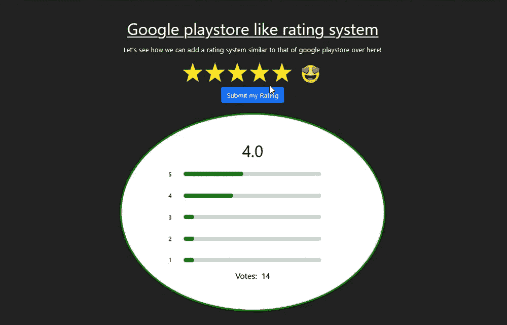
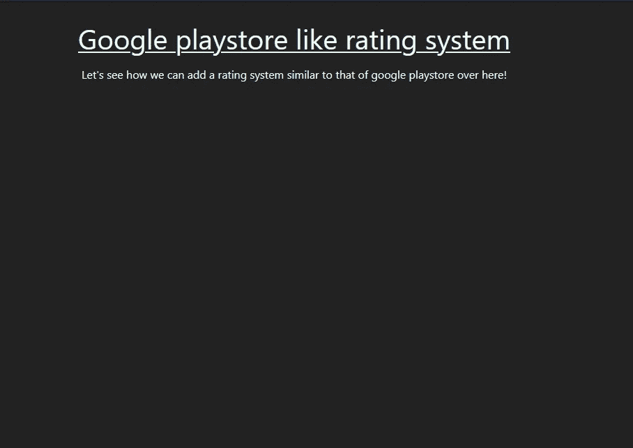
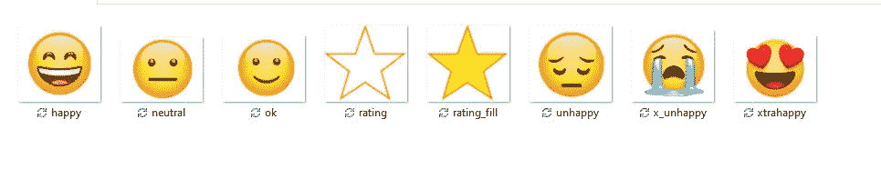
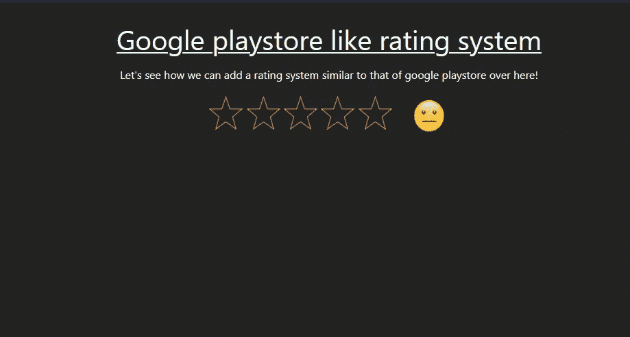
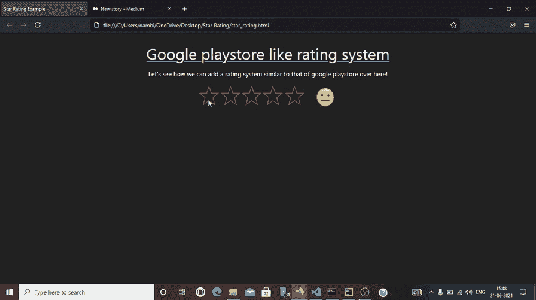
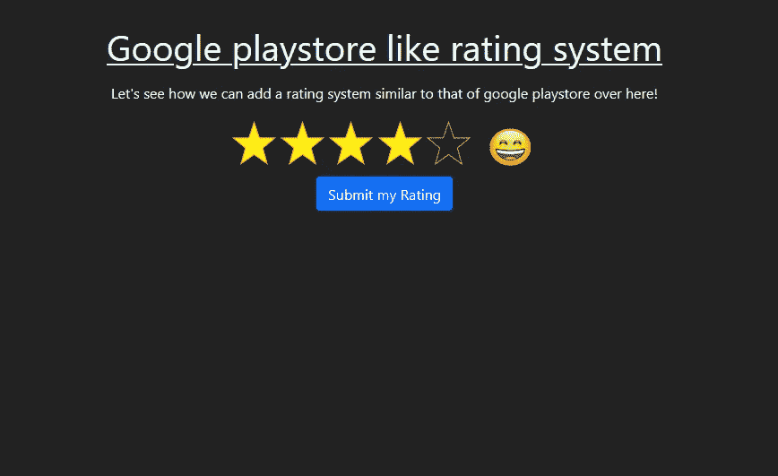
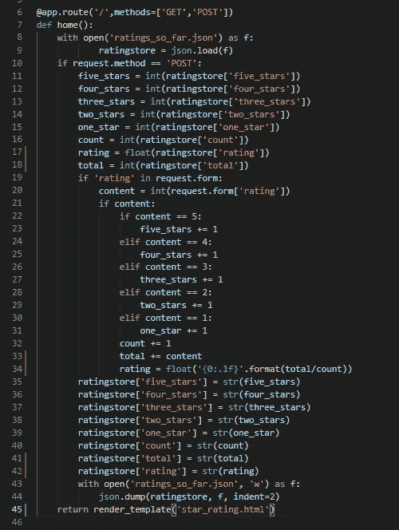
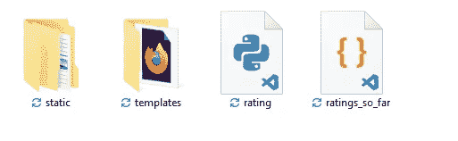
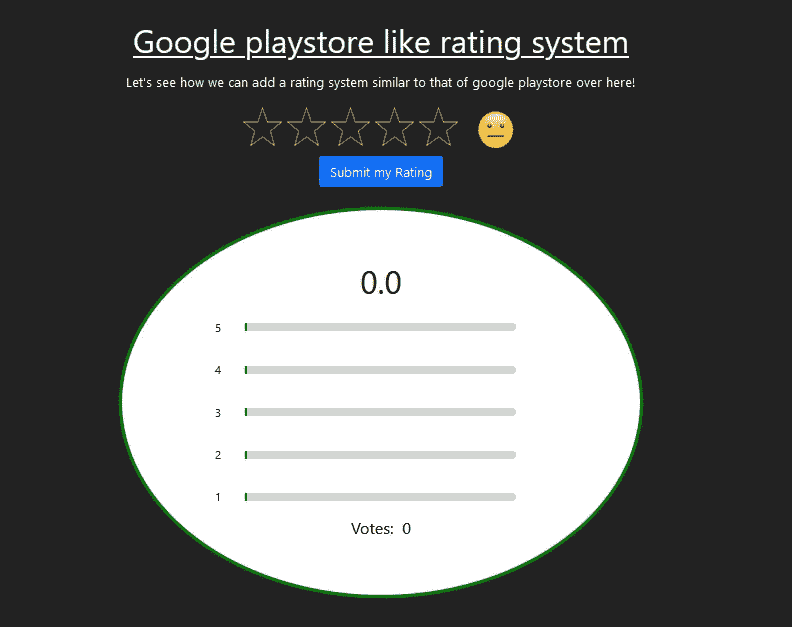
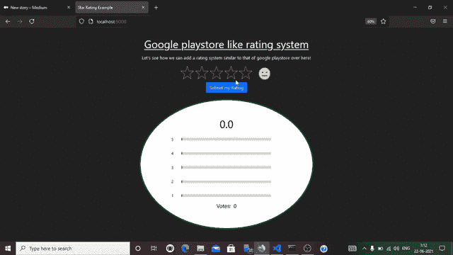

# 如何创建一个类似评级系统的 Google Play 商店！

> 原文：<https://medium.com/analytics-vidhya/how-to-create-a-google-play-store-like-rating-system-b9b39c959c07?source=collection_archive---------7----------------------->

你好，我回来了，这次我在这里帮助你创建一个类似于我们在 Play store 上的评级系统。这样做的先决条件是 HTML、CSS、Bootstrap(不是必需的)、Flask(或任何其他您熟悉的后端)和 jQuery 的知识。为了存储数据，我们需要 JSON。就这样，我们走吧。

工作页面看起来特别像下面的页面。



# **基本前端**

首先创建一个名为 starRating 的文件夹，并创建一个简单的 flask 应用程序。我把我的命名为 rating.py。

```
from flask import Flask, url_for, render_templateapp = Flask(__name__)@app.route('/')def home(): return render_template('star_rating.html')if __name__ == "__main__":app.run(debug=True)
```

star_rating.html 文件包含一些基本的 html 和 CSS。它可能基本上是这样的。



页面上的基本文本

接下来，在静态文件夹(已经有一个名为 css 的目录)中，我们再添加两个目录:js 和 images。我们将使用一组图片，GitHub 将在最后提供该库的链接。为了避免命名混乱，下面提供了这些图像。



这些图片将用于这篇文章。

假设你不想要这些图像。然后只需点击[这里的](https://emojipedia.org/people/)，选择你喜欢的表情符号。

首先，将以下代码添加到 star_rating.html 页面中。

```
<div class="text-center">&nbsp;&nbsp;</div>
```

所以上面的代码只是这样做:



所以基本上我们用 jinja2 for 循环创建了五次空星的图像，每次都给它一个单独的 id。然后，代码块添加两个不可断开的空格，然后添加中性人脸图像。

现在要创建这个功能，我们需要 jQuery。因此，在 js 文件夹中创建一个名为 rating.js 的文件。为了给出一个宽泛的理解，每当用户单击任何一个星号时，jQuery 代码将确定空星号到填充星号的变化。好了，不吹牛了，回到代码。为了让您编写的 jQuery 代码能够工作，您必须将它包含在 HTML 脚本部分中。有很多 cdn 提供这个。为了方便起见，只需复制以下代码并将其添加到 HTML 的脚本部分。

```
<script src="https://code.jquery.com/jquery-3.6.0.js" integrity="sha256-H+K7U5CnXl1h5ywQfKtSj8PCmoN9aaq30gDh27Xc0jk=" crossorigin="anonymous"></script>
```

一旦上述任务完成，我们就可以继续添加功能性的 jQuery 代码了。点击功能和星形填充将由下面的代码控制。

```
$('#star_0').click(function(){$('#star_0').attr("src", "../../static/images/rating_fill.png");$('#star_1').attr("src", "../../static/images/rating.png");$('#star_2').attr("src", "../../static/images/rating.png");$('#star_3').attr("src", "../../static/images/rating.png");$('#star_4').attr("src", "../../static/images/rating.png");$('#ratings').attr("src","../../static/images/x_unhappy.png");});$('#star_1').click(function(){$('#star_0').attr("src", "../../static/images/rating_fill.png");$('#star_1').attr("src", "../../static/images/rating_fill.png");$('#star_2').attr("src", "../../static/images/rating.png");$('#star_3').attr("src", "../../static/images/rating.png");$('#star_4').attr("src", "../../static/images/rating.png");$('#ratings').attr("src","../../static/images/unhappy.png");});$('#star_2').click(function(){$('#star_0').attr("src", "../../static/images/rating_fill.png");$('#star_1').attr("src", "../../static/images/rating_fill.png");$('#star_2').attr("src", "../../static/images/rating_fill.png");$('#star_3').attr("src", "../../static/images/rating.png");$('#star_4').attr("src", "../../static/images/rating.png");$('#ratings').attr("src","../../static/images/ok.png");});$('#star_3').click(function(){$('#star_0').attr("src", "../../static/images/rating_fill.png");$('#star_1').attr("src", "../../static/images/rating_fill.png");$('#star_2').attr("src", "../../static/images/rating_fill.png");$('#star_3').attr("src", "../../static/images/rating_fill.png");$('#star_4').attr("src", "../../static/images/rating.png");$('#ratings').attr("src","../../static/images/happy.png");});$('#star_4').click(function(){$('#star_0').attr("src", "../../static/images/rating_fill.png");$('#star_1').attr("src", "../../static/images/rating_fill.png");$('#star_2').attr("src", "../../static/images/rating_fill.png");$('#star_3').attr("src", "../../static/images/rating_fill.png");$('#star_4').attr("src", "../../static/images/rating_fill.png");$('#ratings').attr("src","../../static/images/xtrahappy.png");});
```

这段代码决定了对于所有的五颗星星，点击一颗星星会发生什么。图像也会相应地动画化。为了让你理解，我想解释一下第三颗星(#star_2)的代码，因为它把所有的东西都混在了一起。因此，当我们单击第三颗星时，就会触发“#star_2”的单击事件。代码简单地添加一个黄色填充到它前面的所有星星，第三个星星本身，如果其他星星已经被填充了，则释放黄色填充。只有当你第一次点击获得五星评级，但随后改变主意将其降至三星(记住该应用是由你的敌人发布的)时，后半部分才有意义。).无论如何，上面的代码将执行以下操作:



明星的工作。

好了，既然已经完成了，我们现在可以使用提交按钮来提交这些评级。这些数据可以用来向用户显示投票的数量和质量水平。

首先，我们添加一个 submit 按钮和一个 input type=hidden 字段。这样做的原因将在稍后解释。

```
<div class="text-center"><form method='POST' action=""><input type="hidden" id="rating_content" name='rating' value='0'><input type="submit" id="submitbtn" class="btn btn-primary mt-2" value="Submit my Rating"></form></div>
```

star_rating.html 页面现在应该如下所示:



好了，submit 按钮将数据发送到后端。隐藏标签在这里将是最重要的，因为它将把星级映射到 1 到 5 之间的值。这就是它被添加到表单中的原因！

# **将星级与数字 1-5 对应起来**

对哦！现在我们可以添加一个代码来将等级映射到 1 到 5 范围内的值。这可以添加到 rating.js 文件本身中。

为了使这一点更清楚，例如，如果你决定给一个 4 星评级，你应该点击屏幕上的第四颗星。因此，当处理第四颗星的点击事件时，我们可以简单地将隐藏的输入元素的值改为“4”。类似地，当你点击第五颗星时，输入元素的值会变成‘5’等等！希望这能理清逻辑。

现在，代码只是对上面的 rating.js 进行了如下更改:

```
$('#star_0').click(function(){$('#star_0').attr("src", "../../static/images/rating_fill.png");$('#star_1').attr("src", "../../static/images/rating.png");$('#star_2').attr("src", "../../static/images/rating.png");$('#star_3').attr("src", "../../static/images/rating.png");$('#star_4').attr("src", "../../static/images/rating.png");$('#ratings').attr("src","../../static/images/x_unhappy.png");$('#rating_content').attr('value','1');});$('#star_1').click(function(){$('#star_0').attr("src", "../../static/images/rating_fill.png");$('#star_1').attr("src", "../../static/images/rating_fill.png");$('#star_2').attr("src", "../../static/images/rating.png");$('#star_3').attr("src", "../../static/images/rating.png");$('#star_4').attr("src", "../../static/images/rating.png");$('#ratings').attr("src","../../static/images/unhappy.png");$('#rating_content').attr('value','2');});$('#star_2').click(function(){$('#star_0').attr("src", "../../static/images/rating_fill.png");$('#star_1').attr("src", "../../static/images/rating_fill.png");$('#star_2').attr("src", "../../static/images/rating_fill.png");$('#star_3').attr("src", "../../static/images/rating.png");$('#star_4').attr("src", "../../static/images/rating.png");$('#ratings').attr("src","../../static/images/ok.png");$('#rating_content').attr('value','3');});$('#star_3').click(function(){$('#star_0').attr("src", "../../static/images/rating_fill.png");$('#star_1').attr("src", "../../static/images/rating_fill.png");$('#star_2').attr("src", "../../static/images/rating_fill.png");$('#star_3').attr("src", "../../static/images/rating_fill.png");$('#star_4').attr("src", "../../static/images/rating.png");$('#ratings').attr("src","../../static/images/happy.png");$('#rating_content').attr('value','4');});$('#star_4').click(function(){$('#star_0').attr("src", "../../static/images/rating_fill.png");$('#star_1').attr("src", "../../static/images/rating_fill.png");$('#star_2').attr("src", "../../static/images/rating_fill.png");$('#star_3').attr("src", "../../static/images/rating_fill.png");$('#star_4').attr("src", "../../static/images/rating_fill.png");$('#ratings').attr("src","../../static/images/xtrahappy.png");$('#rating_content').attr('value','5');});
```

请注意每颗星星的点击事件的最后几行。

# **使用 Flask 将星级存储到 JSON 文件中**

现在到了存储部分。这对于这篇文章来说非常简单，以 JSON 文件的形式。但是假设您想将它添加到数据库中，那么也可以使用 SQLAlchemy 轻松完成。

虽然下面的说明主要与 Flask 有关，但是如果您是 Django 用户，您会发现这很容易，因为 Python 代码对它们来说是一样的，都是处理 JSON 文件。如果你是用 Laravel，NodeJS 等的人。即使这样，您也应该能够通过对代码进行适当的修改来继续下去。

首先，让我们在 rating.py 旁边创建一个 JSON 文件，并将其保存为 ratings_so_far.json。代码如下:

```
{"five_stars":"0","four_stars":"0","three_stars":"0","two_stars":"0","one_star":"0","count":"0","total":"0","rating": "0.0"}
```

因此，存储机制已准备就绪，它所指示的只是每个级别的评级数、投票数、所有评级相加的总值，以及作为浮点值的评级。现在，在 rating.py 文件中，我们需要导入一些东西:首先，来自 flask 的请求模块，然后是用于处理 json 文件的 JSON 模块。

```
from flask import Flask, url_for, render_template,**request****import json**
```

现在，每当我们单击 5 颗星中的任何一颗，我们都需要将相应的 json 值增加 1。此外，为了处理 JSON 数据，我们首先需要将它转换成 Python 对象。json.load 和 json.dump 方法在这里起着至关重要的作用(在处理 json 数据格式的字符串时，json.loads 和 json.dumps 起着至关重要的作用)。让我们开始工作。

我们之前编写的视图函数现在将类似于:



不得不张贴代码的图像，因为它是在媒体格式不佳

如你所见，已经生成了相当多的肌肉！别担心，让我们一行一行地过一遍。

1.  首先，我们通过添加方法= ['GET '，' POST']，让视图函数也接受 POST 请求，这就是我们在第 6 行中所做的。
2.  第 8 行:现在使用上下文管理器(with statement ),打开我们创建的 JSON 文件。因为它就在我们的 python 文件旁边，所以我们只需将它的名称传递给 open 方法，并以读取模式打开它(默认)。指向文件的指针被命名为 f。



目录结构必须像这样才能直接传递 json 文件名

1.  在第 9 行，我们将 JSON 数据存储到一个名为 ratingstore 的 Python 对象中。默认情况下，创建的对象是一个 Python 字典。
2.  第 10 行:我们检查是否有 post 请求，即表单的提交按钮是否被点击。所以下面的代码只有在提交按钮被点击时才会运行。
3.  第 11–18 行表示将字典的值赋给变量。为避免混淆，变量的命名与键相同。
4.  第 19 行检查在刚刚提交的表单中是否有名为“rating”的输入元素。如果您还记得，这是我们给隐藏的输入元素起的名字！(给定的值为 0)
5.  第 20 行转换隐藏输入元素的值，并将其赋给一个名为 content 的变量。任何已知名称的表单元素的值都可以通过如下方式获得，也可以通过使用 request . form . get(' input _ element _ name ')获得。
6.  第 21 行检查内容是否为空。如果没有，我们继续前进。
7.  第 22–31 行:根据我们选择的星星数，隐藏输入元素的值已经改变了。这几行检查值，并将相应的变量递增 1。也就是说，每一张选票都会被记录到这些变量中！现在，如果你没有选择任何明星就想提交怎么办？好吧，做吧，告诉我你观察到了什么变化。
8.  第 32 行:我们将评级计数增加 1。
9.  第 33 行:用内容的值增加总值。这对于计算评分非常重要。
10.  第 34 行:用总数除以目前的投票数，得到评分。此外，我们使用格式标签将评级限制为一个小数点。
11.  第 35–42 行:通过添加新值来更改字典 ratingstore 的值。
12.  第 43 行:以写模式打开 JSON 文件(是的，其中的现有数据将被删除)。
13.  第 44 行:json . dump Python 字典 ratingstore 到我们的 JSON 文件中。indent=2 参数将文件格式化为可读格式。

这就是在 JSON 文件中存储更改的方式。但是每次打开 JSON 文件查看数据可能会很繁琐。这是我们创建一个类似于 Play store 的新星级查看器的地方(相信我，用不了多久我就会闭嘴)。

# **以播放商店的方式显示星级！**

为了实时查看收视率，我们需要做一些工作。有 HTML，CSS 以及 Javascript 代码。让我们先从 HTML 和 CSS 开始。

以下是您必须添加的 HTML:

```
<div class="text-center"><h1>{{rating}}</h1><div id="display_rating"><div class="row align-items-center"><div class="offset-1 col-1 mt-3"><p style="font-size: 14px;">5</p></div><div class="col-8"><div class="content_5_star_outer"><div class="content_5_star_inner">nn</div></div></div></div><div class="row align-items-center inner-ratings"><div class="offset-1 col-1 mt-3"><p style="font-size: 14px;">4</p></div><div class="col-8"><div class="content_4_star_outer"><div class="content_4_star_inner">nn</div></div></div></div><div class="row align-items-center inner-ratings"><div class="offset-1 col-1 mt-3"><p style="font-size: 14px;">3</p></div><div class="col-8"><div class="content_3_star_outer"><div class="content_3_star_inner">nn</div></div></div></div><div class="row align-items-center inner-ratings"><div class="offset-1 col-1 mt-3"><p style="font-size: 14px;">2</p></div><div class="col-8"><div class="content_2_star_outer"><div class="content_2_star_inner">nn</div></div></div></div><div class="row align-items-center inner-ratings"><div class="offset-1 col-1 mt-3"><p style="font-size: 14px;">1</p></div><div class="col-8"><div class="content_1_star_outer"><div class="content_1_star_inner">nn</div></div></div></div></div></div>
```

你很快就会明白为什么我们增加了等级作为 jinja2 的一个变量。现在，继续。

以下是 CSS 代码:

```
.content_5_star_inner{border: solid 1px green;background-color: green;color: transparent;font-size: 5px;border-radius: 5px;width: 0%;}.content_5_star_outer{/*border: solid 1px grey;*/background-color: lightgrey;color: transparent;font-size: 5px;border-radius: 5px;}.content_4_star_inner{border: solid 1px green;background-color: green;color: transparent;font-size: 5px;border-radius: 5px;width: 0%;}.content_4_star_outer{/*border: solid 1px grey;*/background-color: lightgrey;color: transparent;font-size: 5px;border-radius: 5px;}.content_3_star_inner{border: solid 1px green;background-color: green;color: transparent;font-size: 5px;border-radius: 5px;width: 0%;}.content_3_star_outer{/*border: solid 1px grey;*/background-color: lightgrey;color: transparent;font-size: 5px;border-radius: 5px;}.content_2_star_inner{border: solid 1px green;background-color: green;color: transparent;font-size: 5px;border-radius: 5px;width: 0%;}.content_2_star_outer{/*border: solid 1px grey;*/background-color: lightgrey;color: transparent;font-size: 5px;border-radius: 5px;}.content_1_star_inner{border: solid 1px green;background-color: green;color: transparent;font-size: 5px;border-radius: 5px;width: 0%;}.content_1_star_outer{/*border: solid 1px grey;*/background-color: lightgrey;color: transparent;font-size: 5px;border-radius: 5px;}#display_rating{margin-top: 25px;margin-left: auto;margin-right: auto;width: 40%;border: solid 4px green;border-radius: 100%;color: black;background-color: white;padding: 4em;}
```

添加这两者后，页面看起来会像这样:



看起来不错，对吧？

我将简要地解释我在这里所做的事情。基本上，有两个重叠的矩形:一个灰色的在下面，另一个绿色的在上面。内部(即绿色矩形)的宽度将根据每个星级获得的评级而变化。这就是我们基本的工作方式。

现在，为了添加最后的功能，我们需要创建另一个名为 finale.js 的 javascript 文件，并将其保存到 js 文件夹中。这将防止混乱和困惑，这也是必要的，因为我们必须传递我们在表单发布时创建的 python 变量。所以让我们再来一次！

finale.js 的 javascript 代码是:

```
function starBars(five_stars, four_stars, three_stars, two_stars, one_star,total_votes){var content_5_width = (five_stars/total_votes)*100+'%';var content_4_width = (four_stars/total_votes)*100+'%';var content_3_width = (three_stars/total_votes)*100+'%';var content_2_width = (two_stars/total_votes)*100+'%';var content_1_width = (one_star/total_votes)*100+'%';document.querySelector('.content_5_star_inner').style.width = content_5_width;document.querySelector('.content_4_star_inner').style.width = content_4_width;document.querySelector('.content_3_star_inner').style.width = content_3_width;document.querySelector('.content_2_star_inner').style.width = content_2_width;document.querySelector('.content_1_star_inner').style.width = content_1_width;}
```

该代码基于计算百分比的实际原理，即某物的百分比=(该某物的数量/总数)* 100。我们对每个级别都这样做，并同样应用于每个内部矩形的宽度，从而使它对我们的投票是动态的。

但现在问题来了:我们如何传递实际上只在 Python 中可用的参数？

那同样简单。我们所要做的就是每当我们的页面作为 GET 请求被调用时传递这些参数。在 Flask 中，每当我呈现模板 star_rating.html(可以在代码图像的第 45 行看到)时，我可以简单地传递这些参数。

所以在添加参数后，它们将在我们的 HTML 代码中可用，我们可以在 Jinja2 模板中使用它们。

```
return render_template(
'star_rating.html', 
five_stars=ratingstore['five_stars'], four_stars=ratingstore['four_stars'], three_stars=ratingstore['three_stars'], two_stars=ratingstore['two_stars'], one_star=ratingstore['one_star'], 
count=ratingstore['count'], 
rating=ratingstore['rating']
)
```

即使作为参数传递，名称也不会改变。这减少了我的困惑，我想这同样适用于你！现在我也希望你明白我是如何在

# 标签中包含{ {评级}}的。

既然 finale.js 有一个名为 starBars 的函数，那么让我们首先调用它，然后在一个单独的脚本中调用这个函数。

最后，star_rating.html 的脚本部分应该如下所示:

```
<script src="{{ url_for('static',filename='js/rating.js') }}"></script><script src="{{ url_for('static',filename='js/finale.js') }}"></script><script>starBars(five_stars = '{{five_stars}}',four_stars = '{{four_stars}}',three_stars = '{{three_stars}}',two_stars = '{{two_stars}}',one_star = '{{one_star}}',total_votes = '{{count}}')</script>
```

如你所见，函数 starBars 将使用 Python 变量(交叉检查 render_template 中的名称)作为它的参数来调用。因为它已经在 finale.js 中定义了，所以 starBars 将无任何错误地运行，javascript 参数将被传递一个变量 python 参数。

瞧啊！我们完了。为了确保一切正常，我将向你们展示我们所做的现场演示。我打赌你会对自己的努力感到满意的！



还增加了最终投票显示。把那当成你的任务吧！

非常感谢亲爱的读者，如果你耐心地读到这里。希望你已经学到了一两件关于如何创建实时评级系统的事情。另外，请原谅 GIF 的质量。中仅允许 25 MB 的最大图像大小。所以我不得不去适应它！

是的，GitHub 库，我怎么能忘记呢！完整的代码和资源可以在[这里](https://github.com/AkhilrajNambiar/Playstore-like-rating-system)找到。

谢谢你，直到下一个帖子，再见！