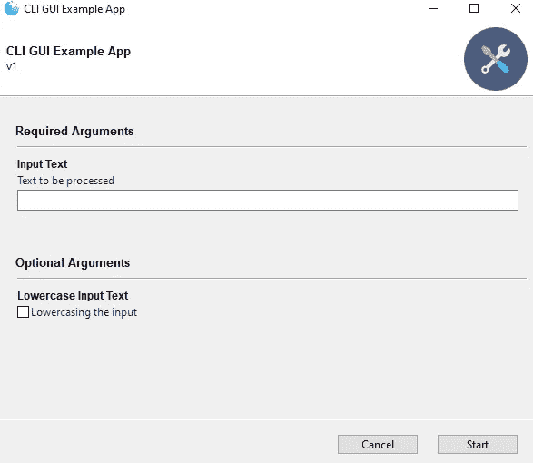
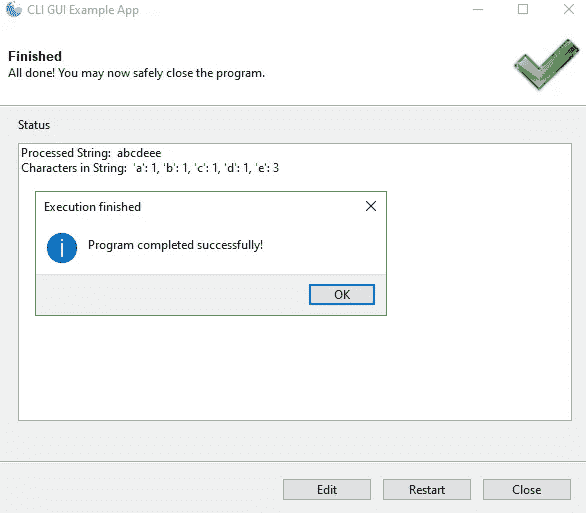
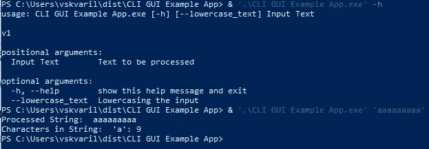

# 如何使用 Gooey 和 PyInstaller 在 Python 中创建 GUI/CLI 独立应用程序

> 原文：<https://medium.com/analytics-vidhya/how-to-create-a-gui-cli-standalone-app-in-python-with-gooey-and-pyinstaller-1a21d0914124?source=collection_archive---------5----------------------->



GUI 版本

用 Python 和通用的 [Gooey](https://github.com/chriskiehl/Gooey) 创建 GUI 很简单，并且在很多地方都有很好的证明:

*   [使用 Gooey 作为任何语言或 CLI 应用程序的通用前端](https://chriskiehl.com/article/gooey-as-a-universal-frontend)
*   [用 Gooey 创建简单的 Python GUI 应用程序](https://pakstech.com/blog/python-gooey/)

但是在一个可执行文件中实现 CLI 和 GUI 的无缝切换是另一回事。Gooey 最初并不打算这样使用，尽管该库有[一个未文档化的特性使这成为可能](https://github.com/chriskiehl/Gooey/issues/449)(因此它可以被完整地文档化，或者在 Gooey 的未来版本中被删除)。本教程对那些对 Python 脚本构建感兴趣的人也很有用。



同一脚本的 CLI 调用

对于希望将一个可执行文件分发给具有不同界面偏好的用户的用例来说，将这两者结合在一起非常好。

第一部分在于 **- ignore-gooey** 命令。允许在 GUI 和 CLI 界面之间切换。

```
if len(sys.argv) >= 2:
    if not "--ignore-gooey" in sys.argv:
        sys.argv.append("--ignore-gooey")
```

当应用程序不带参数(甚至从命令行)启动时，此代码片段触发 ignore 命令，否则 CLI 将被激活。然后 PyInstaller 库发生。如果您希望应用程序完全在 GUI/CLI 模式下工作，那么您必须覆盖中通常推荐的(默认)配置选项。规格文件**控制台=假**。启用此选项后，您可以看到 GUI 和 CLI，但是 GUI 伴随着一个难看的空命令行窗口。通过下面的代码片段，当 GUI 启动时，这个窗口是隐藏的。

```
exe = EXE(pyz,
 a.scripts,
 [],
 exclude_binaries=True,
 name=’CLI GUI Example App’,
 debug=False,
 bootloader_ignore_signals=False,
 strip=False,
 upx=True,
 **console=True** )
```

首先，我们检查脚本是否被‘冻结’/打包，以防我们在结束之前运行脚本。此外，如果在上一步中指定了-ignore-gooey 命令，那么用户可以使用命令行中的参数运行应用程序。

```
if not "--ignore-gooey" in sys.argv and getattr(sys, "frozen", False)
```

然后我们导入绑定到 Windows COM 的库。有些人可能会感到困惑，因为以 *win-* 开头的库来自库 [pywin32](https://github.com/mhammond/pywin32) 。

```
import win32process, win32gui, win32con    
import os
```

获取正在运行的脚本的进程 ID (PID)在 Python 中很简单，但实际上取决于您是将脚本构建为一个文件(**-py installer 中的 onefile** 参数)还是文件夹( **- onedir** )独立可执行文件。如果您使用父进程 ID (PPID)作为 **- onefir** 选项，那么 Windows 资源管理器将被隐藏，您将不会在基本的 Windows UI 中看到很多内容(已经有了，完成了-重启修复它)。更多关于 PyInstaller 参数的信息请点击。

```
pid = os.getpid() # PID, use if --onedir
pid = os.getppid() # PPID, use if --onefile
```

Windows 似乎没有更直接的方法如何将打开的窗口链接到进程，但下面的[这个循环](http://timgolden.me.uk/python/win32_how_do_i/find-the-window-for-my-subprocess.html)修复了它。不要担心进程不会被杀死，只是隐藏在后台。

```
open_windows_with_corresponding_pid = get_hwnds_for_pid(pid)
for hwnd in open_windows_with_corresponding_pid:
    try:            
        win32gui.ShowWindow(hwnd, win32con.SW_HIDE)        
    except Exception:            
        pass
```

代码的其余部分类似于其他粘性教程。这个脚本统计输入的字符并输出统计的字符，你可以看到下面的逻辑和结构。

# Onedir 还是 Onefile？

我更喜欢 **- onedir** PyInstaller 发行版，因为脚本启动速度更快(例如 1-5 秒而不是 20-60 秒，取决于脚本大小和复杂性)。对于某些情况(例如，没有少量第三方库的小脚本),压缩一个文件夹更方便。

```
py -m PyInstaller --onefile --clean "C:\ProjectName\script.py"
py -m PyInstaller --onedir --clean "C:\ProjectName\script.py"
```

就是这样，成功的剧本发行！

*   另一种打包应用程序的便捷方式是 cx_freeze 库，这里的[或](https://gist.github.com/ForgottenUmbrella/ce6ecd8983e76f6d8ef47e07240eb4ac)[这里的](https://github.com/chriskiehl/Gooey/issues/58)对设置进行了详细描述。
*   如何用 [Nuitka](https://github.com/chriskiehl/Gooey/issues/610) 交替包装？
*   [公文包](https://github.com/beeware/briefcase)(可安装可执行文件)