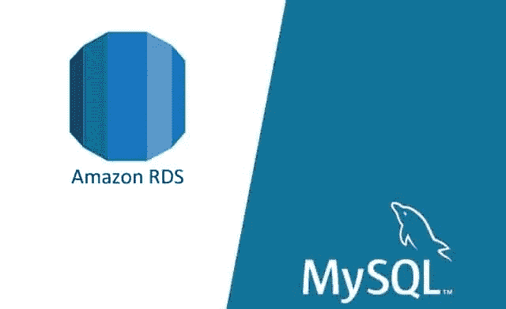

# 如何在 AWS 中创建一个 MySQL 数据库并进行管理，使用 MySQL-Workbench？

> 原文：<https://medium.com/analytics-vidhya/how-to-create-a-mysql-database-in-aws-and-manage-it-using-mysql-workbench-ca0012162215?source=collection_archive---------11----------------------->

谷歌图片

你正在读这篇博客，所以我希望你已经知道什么是 MySQL，以及我们想在这篇博客中实现什么。所以，从所有的步骤开始:

1.  **创建一个 AWS 帐户**:注册时，它会要求您提供信用卡/借记卡，但不要担心，只有在您使用服务达到一定数量后，才会向您收费…