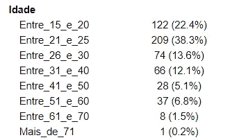
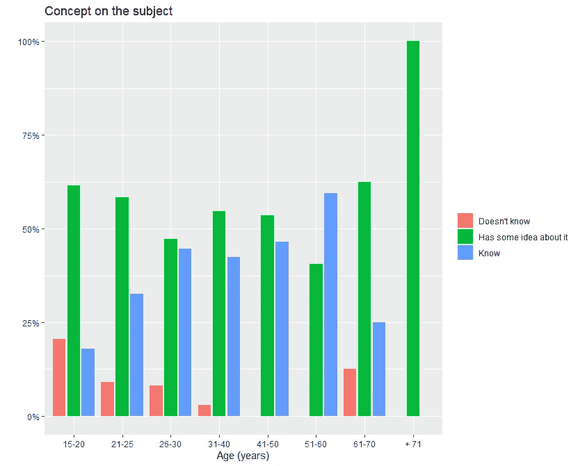
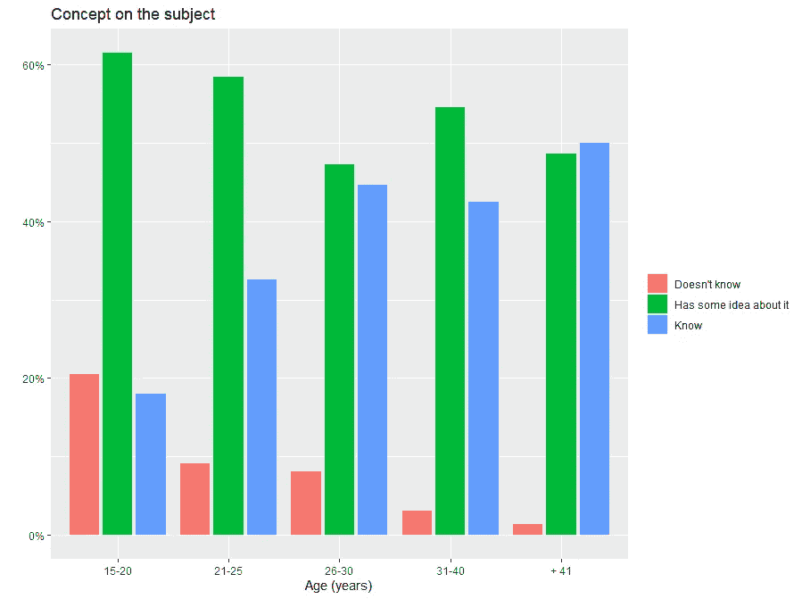

# 如何使用 ggplot2 创建百分比图

> 原文：<https://medium.com/analytics-vidhya/how-to-create-a-percentage-plot-with-ggplot2-eada0f51f925?source=collection_archive---------5----------------------->

每次你需要建立一个百分比图时，事情总不会如你所愿吗？今天，您将学习如何使用 ggplot2 从头开始绘制完美的百分比图。


首先要做的是打开你的 R 环境，加载一些包比如 ggplot2，readxl，plyr。

```
if (!require("readxl")) install.packages("readxl")
if (!require("plyr")) install.packages("plyr")
if (!require("ggplot2")) install.packages("ggplot2")
```

接下来，使用频率表查看您的数据集，我们对可变年龄感兴趣。

```
table1::table1(~., data = dados)
```



由于变量的样本量很小，我们将对其进行重新分类。

如果我们不对变量进行重新分类，我们的图将会像这样，我们不希望这种事情在这里发生。



首先，我们需要对值进行分组，以使我们的样本更具代表性(对于 41 岁以上的人，只有少数回答)。有了这个代码，我们将把年龄从 41 岁到 71 岁以上的人分成一个新的组，称为“41 岁以上”。

```
dados[dados$Idade == "Entre_41_e_50", 2] = "Mais 41"
dados[dados$Idade == "Entre_51_e_60", 2] = "Mais 41"
dados[dados$Idade == "Entre_61_e_70", 2] = "Mais 41"
dados[dados$Idade == "Mais_de_71", 2] = "Mais 41"
```

然后我们可以用变量 x(年龄)和 y(关于主题的概念)建立一个数据框架，这些变量只是例子。

```
idade_conceito <- data.frame(prop.table(table(dados$Idade, 
dados$ConceitoEfluente),1))
```

不要忘记，重要的是要把你的变量变成因子，以保留变量和值标签属性。

```
idade_conceito$Var1<- as.factor(idade_conceito$Var1)
idade_conceito$Var1<- factor(idade_conceito$Var1,
 levels = c("Entre_15_e_20", 
           "Entre_21_e_25" ,
           "Entre_26_e_30" ,
           "Entre_31_e_40", 
           "Mais 41"))
```

我们也可以用新的价值来代替原有的价值。

```
idade_conceito$var1_cat<- revalue(idade_conceito$Var1, 
replace = c("Entre_15_e_20" = "15–20", 
            "Entre_21_e_25" = "21–25",
             "Entre_26_e_30" = "26–30",
             "Entre_31_e_40" ="31–40", 
             "Mais 41" = "+ 41"))

idade_conceito$Var1 <-as.numeric(as.character(idade_conceito$Var1))
```

最后，但同样重要的是，使用 ggplot2 构建您的百分比图:

```
ggplot(idade_conceito, aes(x = var1_cat, y=Freq, fill =var2_cat ))+
geom_bar( width = 0.8, position = position_dodge(width = 0.9), stat = "identity")+ 
labs(x="Age (years)", y=" ", fill = " ") +
ggtitle("Concept on the subject") +
scale_y_continuous(labels = scales::percent)
```



你喜欢吃吗?


您可以在这里查看完整的代码:

[](https://github.com/rachderossi/data-analysis-R) [## GitHub-rachderossi/data-analysis-R:用 R 做的项目。

### 该数据集包含约 2，240 名联系过的客户的社会人口统计和公司地理特征…

github.com](https://github.com/rachderossi/data-analysis-R) 

再见，伙计们！