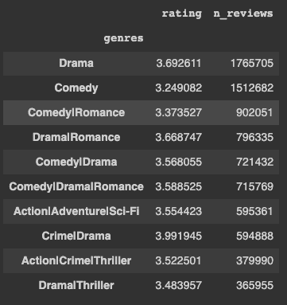
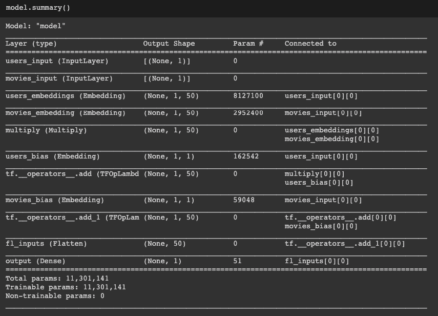

# 如何使用 Keras 从头开始创建推荐系统

> 原文：<https://medium.com/analytics-vidhya/how-to-create-a-recommendation-system-from-scratch-using-keras-f3647fc5c6f8?source=collection_archive---------10----------------------->

使用 IMDB 数据集来训练电影推荐引擎


作者安东尼奥·利斯

# 介绍

大家好，我们继续我们关于如何在经典深度学习应用中从零开始训练算法的系列。

在这篇文章中，我们将看到如何使用协同过滤算法从头开始创建和解释推荐引擎。

推荐引擎是一种预测用户可能喜欢或不喜欢什么的工具。当你有大量的用户和产品，并且你想推荐哪些产品最有可能对哪些用户有用的时候，通常会用到它。

有几个推荐系统的例子，比如网飞或者亚马逊的主页。

# 资料组

我们将用来测试我们模型的数据集是我们从[这里](https://grouplens.org/datasets/movielens/)下载的 MovieLens 25M 数据集。该数据集拥有 2500 万个评级和 100 万个标签应用，由 162，000 个用户应用于 62，000 部电影。

通过链接，我们总共下载了六个数据集。但是我们只对其中两个感兴趣:

1.  ratings.csv，包含用户对不同电影的评级
2.  movies.csv 映射每个电影的标题和类型

让我们来看看它们:


首先要做的是将两个数据集连接起来，使所有信息都包含在一个熊猫数据框架中:

```
df = df.merge(df_movie, how="left", on="movieId")
```

其中 df 是分级数据集，df_movie 是电影数据集。所以我们得到了这样的结果:


因此，我们可以将此数据帧保存在拼花文件中，以便在接下来的笔记本中轻松加载:

```
df.to_parquet("../data/processed/df_rating_movie.parquet")
```

# 数据探索

让我们探索我们的数据。我们先来看看收视率较高的电影:

```
df.groupby(["movieId", "title", "genres"]).agg({"rating": "mean", "userId": "count"}).rename(columns={"userId": "n_reviews"}).sort_values("rating", ascending=False)
```


我们可以看到，我们有很多电影只有一两个评论。为了有意义，我们需要筛选出一些评论:

```
df_top_review = df.groupby(["movieId", "title", "genres"]).agg({"rating": "mean", "userId": "count"}).rename(columns={"userId": "n_reviews"}) df_top_review = df_top_review[df_top_review.n_reviews > 10] 
df_top_review.sort_values("rating", ascending=False)[:10]
```


我们现在可以认出一些电影，但仍有一些电影像[波利安娜](https://www.imdb.com/title/tt0314519/)一样很少有评论。

来看看评论最多的电影:

```
df_top_review.sort_values("n_reviews", ascending=False)[:10]
```


我们还可以看到评分最高的流派:

```
df_top_genres = df.groupby(["genres"]).agg({"rating": "mean", "userId": "count"}).rename(columns={"userId": "n_reviews"}) df_top_genres = df_top_genres[df_top_genres.n_reviews > 10] df_top_genres.sort_values("rating", ascending=False)[:10]
```


和以前一样，我们可以看到评论最多的类型:

```
df_top_genres.sort_values("n_reviews", ascending=False)[:10]
```



戏剧和喜剧，这里不奇怪，但是我们可以看到，喜剧的比率非常低。那是因为外面有很多平庸的喜剧。戏剧就不一样了。

然后将数据集分为训练集和验证集:

```
df_train, df_val = train_test_split(df, random_state=42, test_size=0.2, stratify=df.rating)
```

# 数据预处理

在开始训练模型之前，我们需要实现一些基本的预处理步骤。我们首先对电影和用户 Id 进行编码，使它们从零开始，这样我们就可以轻松地使用 Keras 的嵌入层:

```
dict_movies = {} 
index = 0 
for ids in sorted(movies_ids): 
    dict_movies[ids] = index 
    index += 1 dict_users = {} 
index = 0 
for ids in sorted(users_ids): 
    dict_users[ids] = index 
    index += 1 df_train["movieId"] = df_train["movieId"].map(dict_movies) df_val["movieId"] = df_val["movieId"].map(dict_movies) df_train["userId"] = df_train["userId"].map(dict_users) df_val["userId"] = df_val["userId"].map(dict_users)
```

然后，我们将评级和 id 转换为 float32 NumPy 向量:

```
for col in ["userId", "movieId", "rating"]: 
    df_train[col] = df_train[col].astype(np.float32) 
    df_val[col] = df_val[col].astype(np.float32)
```

最后，我们定义了将在嵌入层中使用的唯一用户和电影的数量:

```
num_unique_users=len(set(list(df_train.userId.unique()) + list(df_val.userId.unique()))) num_unique_movies=len(set(list(df_train.movieId.unique()) + list(df_val.movieId.unique())))
```

# 协同过滤算法

协作过滤算法背后的基本概念是潜在因素可以通过用户的行为来捕获的思想。我们有用户和电影的潜在因素。相似的用户会有相似的电影口味，同时相似的电影也会被相同的用户喜欢。

让我们从实现协同过滤算法开始。我们将使用 Keras Functional API 来定义我们的模型:

```
users_input = Input(shape=(1,), name="users_input") users_embedding = Embedding(num_unique_users + 1, EMBEDDING_SIZE, name="users_embeddings")(users_input) users_bias = Embedding(num_unique_users + 1, 1, name="users_bias")(users_input) movies_input = Input(shape=(1,), name="movies_input") movies_embedding = Embedding(num_unique_movies + 1, EMBEDDING_SIZE, name="movies_embedding")(movies_input) movies_bias = Embedding(num_unique_movies + 1, 1, name="movies_bias")(movies_input) dot_product_users_movies = multiply([users_embedding, movies_embedding]) input_terms = dot_product_users_movies + users_bias + movies_bias input_terms = Flatten(name="fl_inputs")(input_terms) output = Dense(1, activation="relu", name="output")(input_terms) model = Model(inputs=[users_input, movies_input], outputs=output)
```

让我们看看模型总结:



所以我们来解释一下。我们将有两个输入:

*   代表进行审阅的用户的 UserId
*   代表所评论电影的 MovieId

然后我们有用户和电影的嵌入。基本上，我们正在创建一个长度为 50 的向量来表示单个用户和电影，以逼近我们想要逼近的潜在因素。

我们也在考虑另外两种嵌入，叫做用户和电影的偏见。就像在回归模型中一样，我们有一个偏差项，它为用户表示单个用户给出高评价的倾向。同时，一些电影是每个人都喜欢的，所以他们有一个基数高的评论，而不考虑正在做评论的特定用户。

我们把用户和电影的潜在因素相乘，然后加上两个偏差。然后，我们使用密集层输出一个数字，这是我们的预测评级。

我们现在可以像往常一样定义优化器和损失函数:

```
opt_adam = opt.Adam(lr = 0.005) model.compile(optimizer=opt_adam, loss= ['mse'], metrics=['mean_absolute_error'])
```

我们使用 Adam 优化器和均方误差作为损失函数。我们现在可以开始我们的培训了:

```
model.fit(x=[df_train.userId, df_train.movieId], y=df_train.rating, batch_size=512, epochs=3, verbose=1, validation_data=([df_val.userId, df_val.movieId], df_val.rating))
```

*历元 1/3
39063/39063[= = = = = = = = = = = = = = = = = = = = = = = = = =]—2303s 59ms/step—损耗:0.9431 —均值 _ 绝对 _ 误差:0.7221—val _ 损耗:0.6360—val _ 均值 _ 绝对 _ 误差:0.6075
历元 2/3
39063/39063[= = = = = = = = = = = = = = = = = = = = =*

我们做得还不错，但我们可以做些改进。

# 限制输出范围

我们知道，我们的评级有一个可以在 IMDB 上给出的最小值和最大值。我们可以从数据中推断出来:

```
min_rating=min(df_train.rating.min(), df_val.rating.min()) max_rating=max(df_train.rating.max(), df_val.rating.max())
```

我们的最低评分是 0.5，最高评分是 5。因此，我们现在可以限制我们的模型，使其只能预测该范围内的值。我们通过在最后一层使用一个 sigmoid 激活函数来达到这个目的。然后我们将这个数乘以最大值和最小值之差，再加上最小值:

```
output = Dense(1, activation="sigmoid", name="output")(input_terms) output = output * (max_rating - min_rating) + min_rating
```

我们可以看到新模式的总结:


和以前一样，我们使用 Adam 优化器和均方误差损失函数。所以我们编译并训练这个模型:

```
opt_adam = opt.Adam(lr = 0.005) model.compile(optimizer=opt_adam, loss= ['mse'], metrics=['mean_absolute_error']) model.fit(x=[df_train.userId, df_train.movieId], y=df_train.rating, batch_size=2048, epochs=3, verbose=1, validation_data=([df_val.userId, df_val.movieId], df_val.rating))
```

*纪元 1/3
9766/9766[= = = = = = = = = = = = = = = = = = = = = = = = = = = = = = =]—600s 61 ms/step—损耗:0.7700—mean _ absolute _ error:0.6722—val _ loss:0.6254—val _ mean _ absolute _ error:0.5998
纪元 2/3
9766/9766[= = = = = = = = = = = = = = = = = = = = = =*

我们将验证损失从 0.63 提高到 0.62，虽然提高不多，但这是一个非常简单的改进。

我们可以使用更“深入”的方法来改进模型。例如，在何等人的论文《神经协同过滤》中提出的方法..这是一种简单的方法。我们不是将潜在因素相乘并添加偏差，而是连接输入，并通过正则化在完全连接的层上添加。

我们不打算实现这一点，因为我发现分析我们创造的潜在因素和偏见更有趣。

# 探索电影的潜在因素和偏见

首先，我们需要提取层的权重:

```
dict_weights = {} for layer in model.layers: 
    if layer.name in ["users_embeddings", "movies_embeddings", "users_bias", "movies_bias"]: 
        dict_weights[layer.name] = layer.weights
```

由于用户匿名化，探索电影的潜在因素和偏见就更有意义了。我们从潜在因素开始。

我们将嵌入保存在 pandas 数据帧中，并像在原始数据集中一样定义关键 MovieId:

```
df_movies_embeddings = pd.DataFrame(dict_weights["movies_embeddings"][0].numpy()) df_movies_embeddings.columns = ["emb_" + str(col) for col in df_movies_embeddings.columns] df_movies_embeddings.reset_index(inplace=True) df_movies_embeddings.rename(columns={"index":"movieId"}, inplace=True)
```

我们现在可以从电影的原始数据集类型和名称中恢复:

```
df_movies_embeddings = df_movies_embeddings.merge(df_train[["movieId", "title", "genres"]].drop_duplicates(), how="left", on="movieId")
```

为了在二维散点图中观看电影，我们将使用统计方法 [t 分布随机邻居嵌入(t-SNE)](https://scikit-learn.org/stable/modules/generated/sklearn.manifold.TSNE.html) 来减少二维向量中的 50 长度嵌入:

```
vec_tsne = TSNE(n_components=2).fit_transform(df_movies_embeddings[[col for col in df_movies_embeddings.columns if "emb" in col]]) df_movies_embeddings["tsne_0"] = vec_tsne[:, 0] df_movies_embeddings["tsne_1"] = vec_tsne[:, 1]
```

我们现在可以看到前 100 部二维电影:

```
plt.figure(figsize=(12,12)) plt.scatter(df_movies_embeddings.tsne_0[:100], df_movies_embeddings.tsne_1[:100]) for i, x, y in zip(df_movies_embeddings.title[:100], df_movies_embeddings.tsne_0[:100], df_movies_embeddings.tsne_1[:100]): plt.text(x,y,i, color=np.random.rand(3)*0.7, fontsize=11)
```


这样一来，我们就真的推断不出多少了。我们有太多的电影。但是我们可以对嵌入使用一些聚类方法。我们将使用具有 100 个集群的 kmeans:

```
km = KMeans(100, random_state=101) 
km.fit(df_movies_embeddings[[col for col in df_movies_embeddings.columns if "emb" in col]]) clusters = km.predict(df_movies_embeddings[[col for col in df_movies_embeddings.columns if "emb" in col]]) df_movies_embeddings["cluster_n10"] = clusters
```

让我们看一些集群:


所以集群 56 只是加勒比海盗系列。让我们探索其他集群:


集群 81 是死亡系列的[面孔。](https://www.wikiwand.com/en/Faces_of_Death)

集群 84 非常有趣:


它将《星际迷航》、《星球大战》、《哈利·波特》和《指环王》这几部传奇集放在了一起。所以这是一种幻想/科幻的混合。

这非常有趣，可以作为一种新的方式，根据我们从评论中推断出的用户口味来定义流派。

最后，我们可以看到电影的偏见:

```
df_movies_embeddings["bias"] = dict_weights["movies_bias"][0].numpy()
```

带着最大的偏见看电影:


所以我们可以看到《地球》是最有偏见的电影。意思是，即使你通常不喜欢某种类型的电影(例如纪录片)，你也可能喜欢《地球》。

# 结论

所以在这篇文章中，我们展示了如何使用 Keras 从头开始编写推荐系统，并解释偏见和潜在因素。

你可以在我的 [Github](https://github.com/antonai91/recommendation_system) 上找到所有代码。有任何问题，你可以通过 [Linkedin](https://www.linkedin.com/in/lisiantonio/) 联系我。

如果你喜欢这篇文章，分享给你的朋友和同事吧！我会在下一篇文章中看到你。与此同时，保重，保持安全，记住*不要成为墙上的另一块砖。*

Anton.ai

*原载于 2021 年 4 月 22 日*[*https://antonai . blog*](https://antonai.blog/how-to-create-a-recommendation-system-from-scratch-using-keras/)*。*