# 如何使用 Node.js、MongoDB 和 Docker 创建预定的 AWS Lambda 应用程序—第 1 部分

> 原文：<https://medium.com/analytics-vidhya/how-to-create-a-scheduled-aws-lambda-app-with-node-js-mongodb-and-docker-part-1-491ff2778ae4?source=collection_archive---------14----------------------->

几天前，我需要创建一个应用程序，它使用 Rest 服务应用程序，并在每天午夜将响应保存在数据库中。

该应用程序基本上可以是一个功能，所以我决定每天使用 AWS Lambda 和 AWS CloudWatch 来触发我的功能。MongoDB 是因为服务的响应是 JSON 对象，所以除了接收和保存响应之外，我不需要任何东西，选择 Docker 是为了让环境完全在我的控制之下，否则，我可以直接在 AWS 上创建一个函数。

为了避免冗长的指南，我将把本教程分成三个部分:

*   MongoDB
*   NodeJs 和 Docker
*   自动气象站λ

让我们直奔主题，创建一个 MongoDB 数据库和一个集合。

## MongoDB

在我们的教程中，我们将使用有免费选项的 MongoDB Atlas。
[【https://www.mongodb.com/】T2](https://www.mongodb.com/)

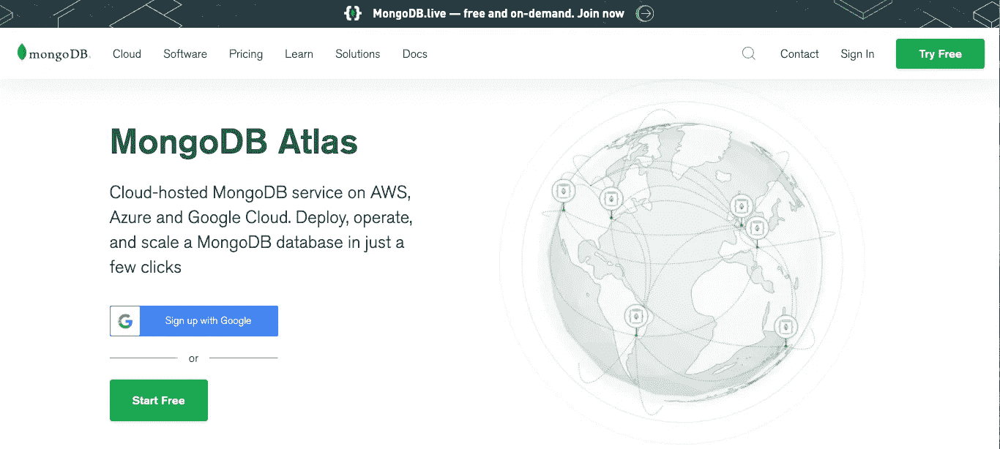

登录或创建新帐户后。我们需要有一个组织，我称之为矿 ***测试-教程***

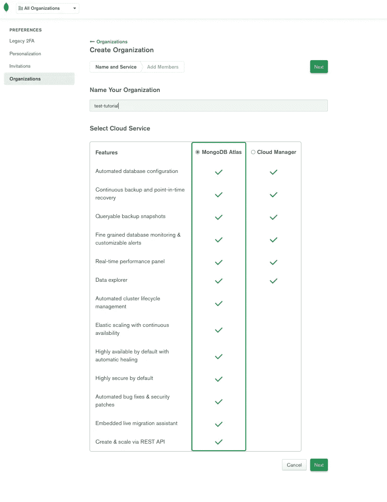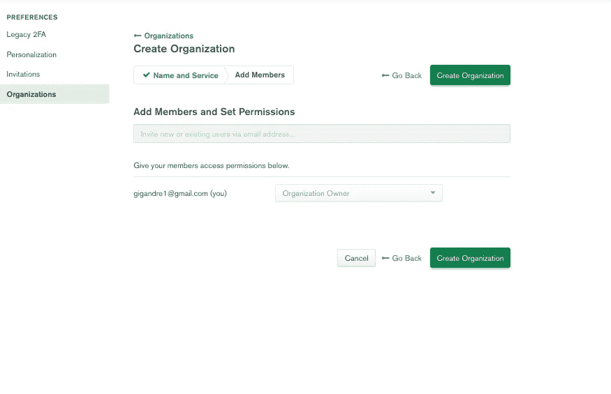

现在我们需要创建一个新项目。

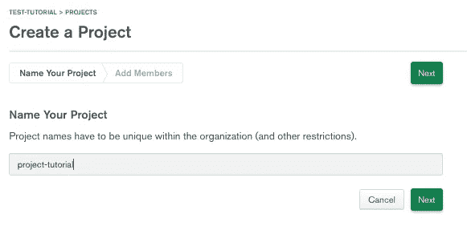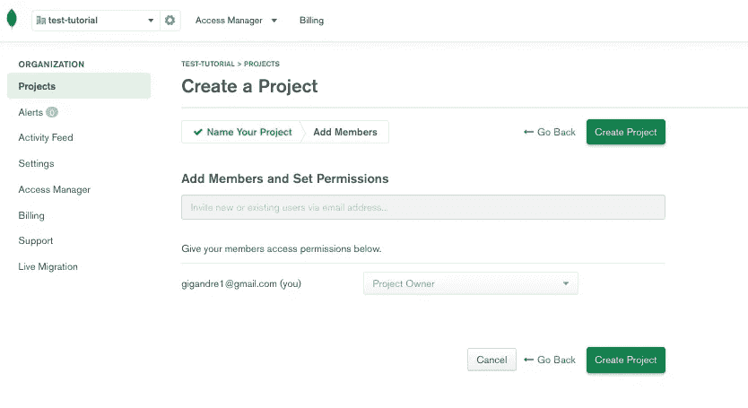

我们差不多完成了，现在我们要创建数据库和集群。选择免费选项。我们可以在不同的供应商之间选择，但我会选择 AWS，只是为了让一切都在同一个地方。

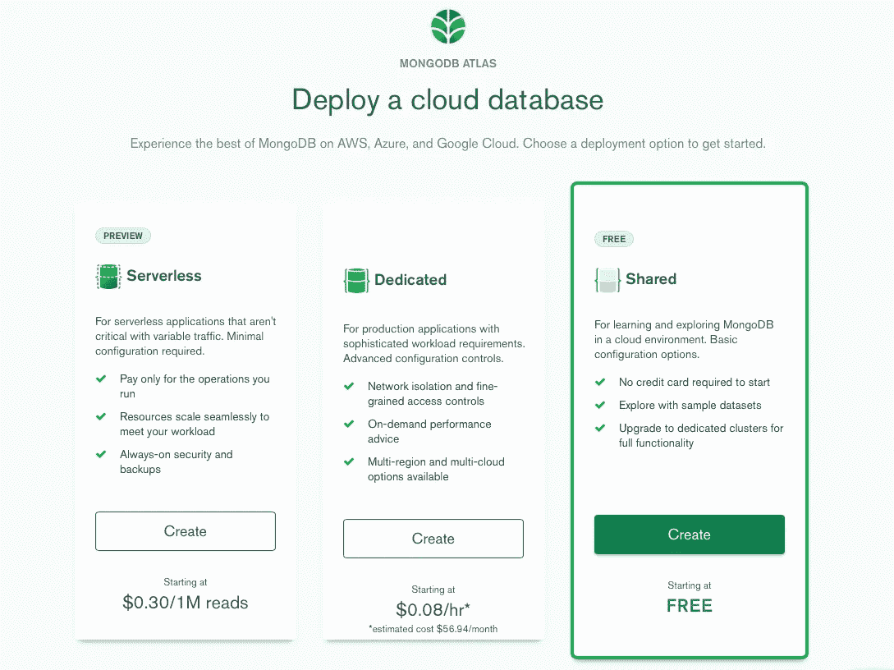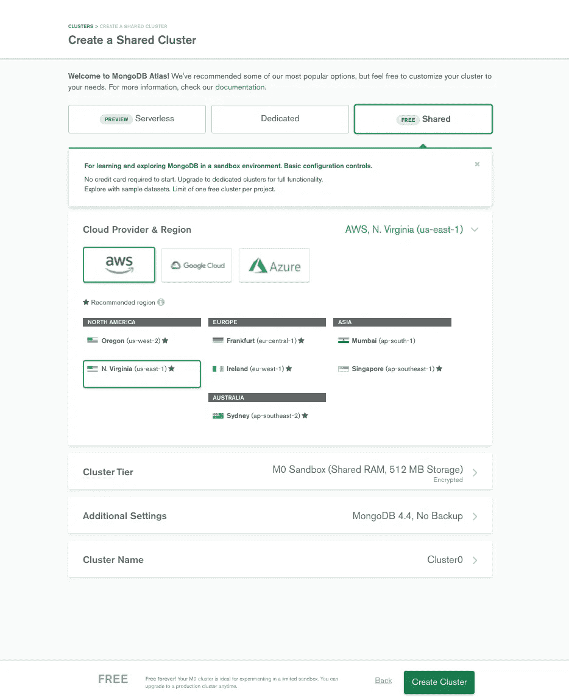

几分钟后，我们的集群就创建好了。

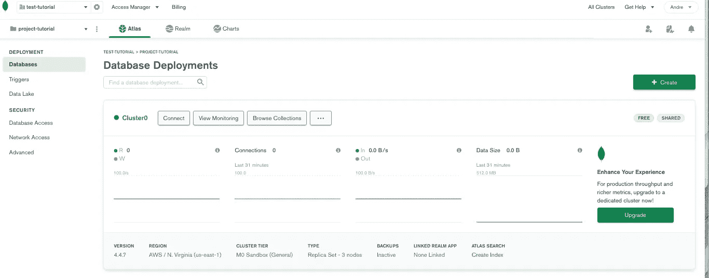

最后，点击 ***浏览收藏*** 和 ***添加我自己的数据*** ，创建我们的数据库和我们的第一个收藏。对于还不了解 MongoDB 的人来说，集合与传统数据库中的表是一样的。

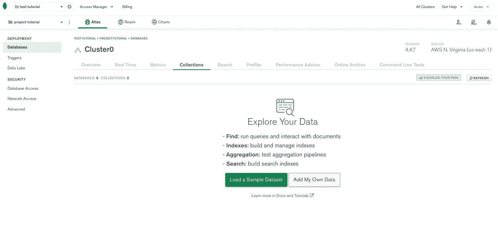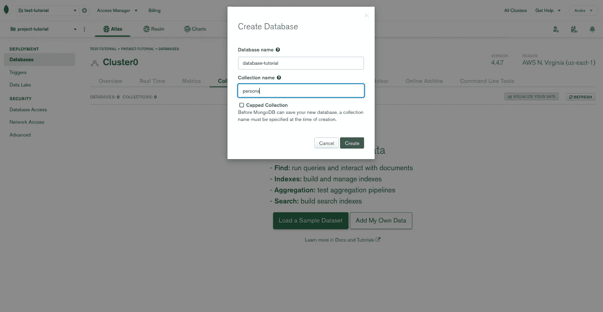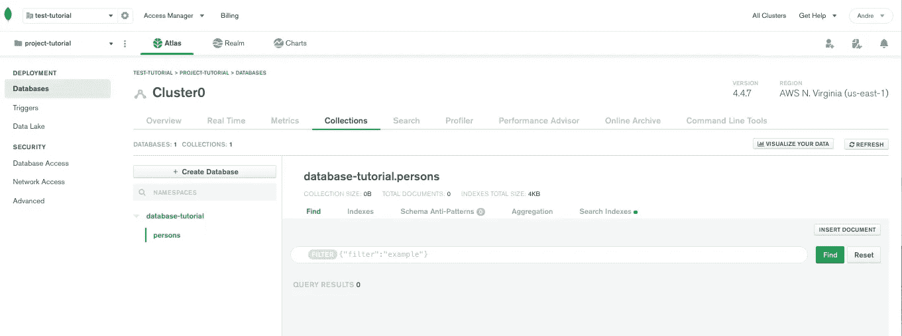

现在我们已经准备好创建 Node.js 应用程序，它将使用我们的数据库。

第二部分见。