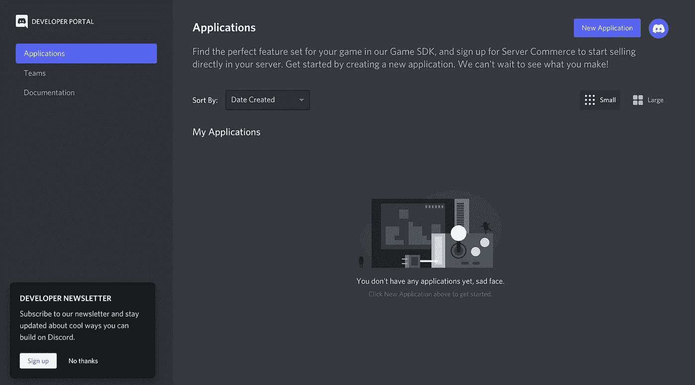
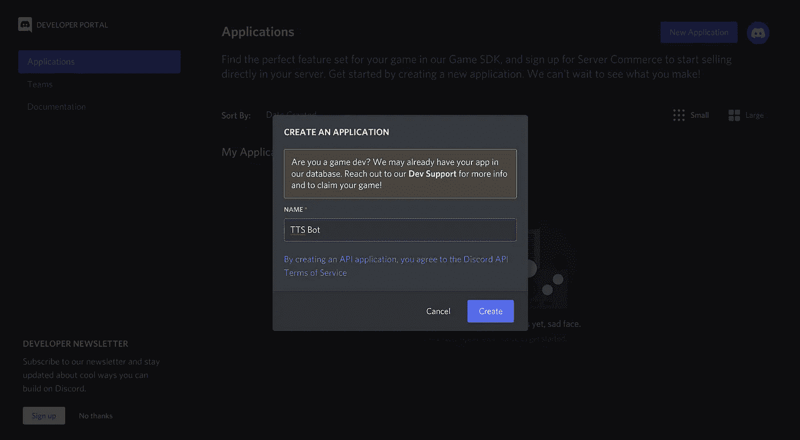
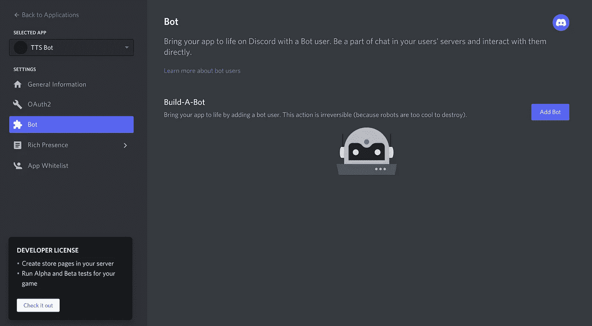
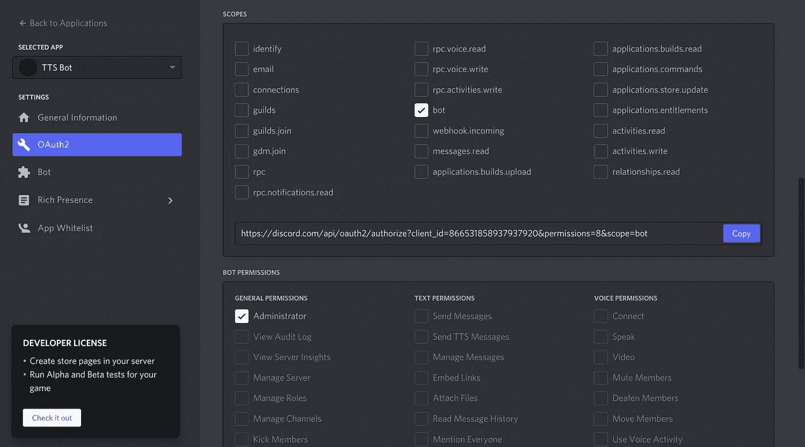
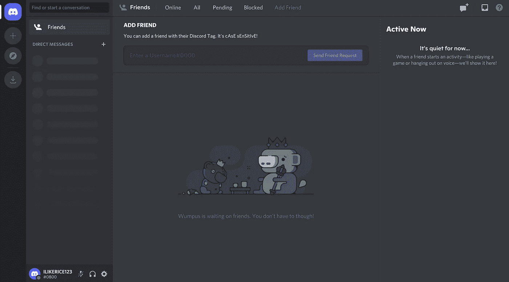
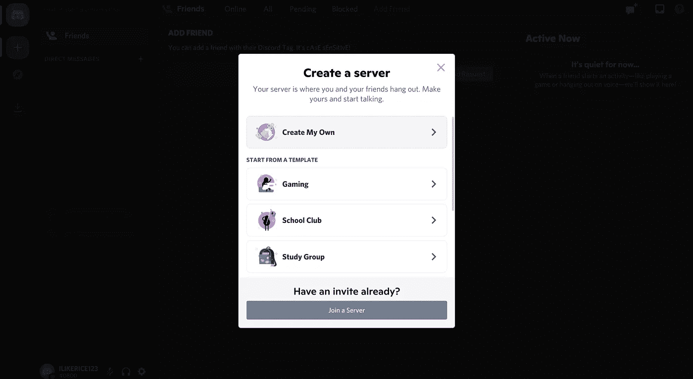
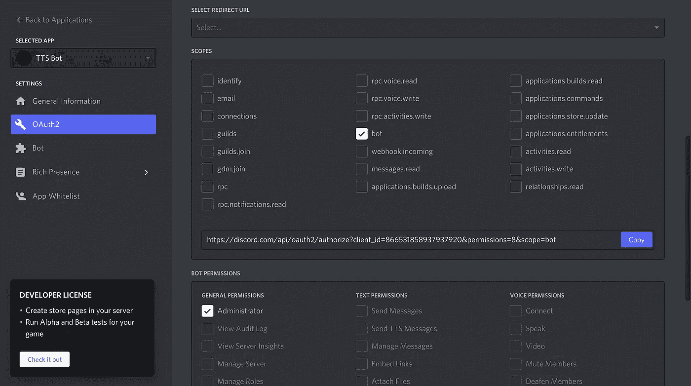
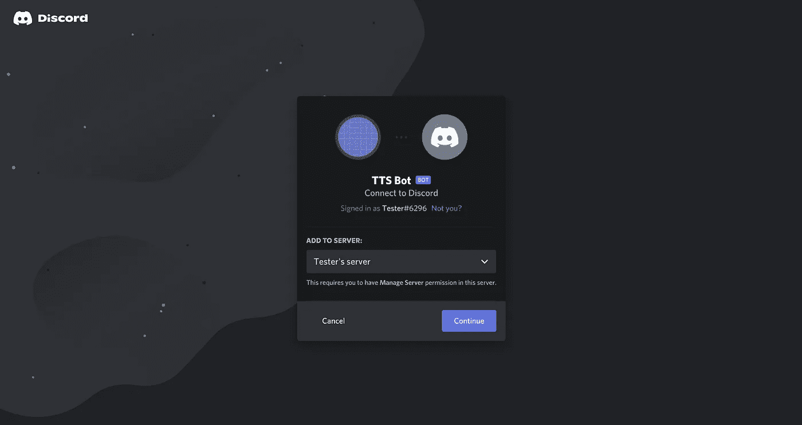
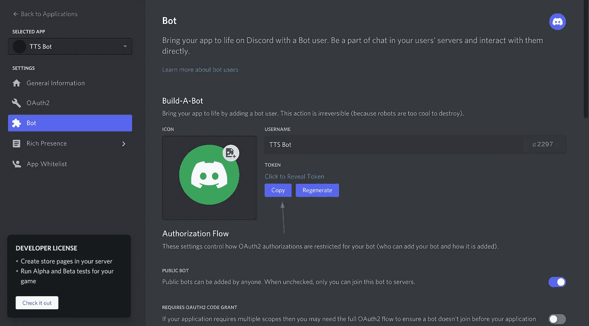

# 如何创建一个简单有效的不和谐机器人

> 原文：<https://medium.com/analytics-vidhya/how-to-create-a-simple-and-effective-discord-bot-4af3128454cf?source=collection_archive---------3----------------------->


# 背景

我决定创建一个 Discord bot 来试验 discord.py 库，并在此过程中享受一些乐趣。如果你不知道什么是 Discord，这是一个主要由游戏玩家使用的消息应用程序，可以用来与人交谈和发短信。我每天都使用 Discord，因为它使与朋友的互动变得快速而简单。然而，有些时候，我想在不说话的情况下进行社交。当我父母很忙或者我没有心情说话的时候，我不喜欢制造太多的噪音。这就是为什么我创建了一个机器人，允许你输入一些文本，机器人会在语音通话中向其他用户朗读出来。我将向您展示我是如何做到这一点的。

# 创建机器人

在创建机器人之前，你必须创建一个不一致的帐户。导航到[https://discord.com/developers/applications](https://discord.com/developers/applications)，你会被提示创建一个。只需输入一个电子邮件地址和所需的密码就可以继续了。您应该会在页面的右上角看到一个新的应用程序按钮。这标志着你的新不和谐机器人的诞生，所以给它一个你选择的名字，然后点击创建。



右上角的新应用程序按钮



命名和创建你的不和谐机器人

你创造了一个不和谐机器人！然而，在我们真正开始对文本到语音的特性进行编码之前，还有一些进一步的设置。在左侧，您想要导航到 Bot 面板。



你从一般信息开始，所以只需点击下面的机器人面板

下一步，点击添加机器人和定制你喜欢的东西。如果您愿意，您可以更改您的机器人的个人资料图片和名称。然后，导航到上面的 OAuth2 面板并向下滚动。为了方便起见，选择 bot 和 Administrator。



选择范围后，Bot 权限选项将可用

我们几乎完成了机器人的设置。让这个页面保持原样，打开一个新标签，输入 https://discord.com/channels/@me。为你的机器人做一个测试服务器是个好主意，因为它就像一个允许你犯错的游乐场。当你还在工作的时候邀请你的机器人进入一个已经存在的服务器是一个糟糕的主意，因为它可以执行你不希望它执行的动作。转到右侧，单击加号添加服务器。



您可以为以下问题列出任何内容，因为它们不会影响任何内容

创建好服务器后，您就可以邀请您的机器人了。要邀请它，请返回到 Discord 开发者页面并复制 OAuth2 面板中的链接。



单击复制

在新选项卡中输入此链接，并选择您刚刚创建的服务器。



单击继续，然后授权并完成验证码，最后邀请您的机器人到您的服务器。这就完成了 bot 设置。

# 编写机器人代码

目前，您的机器人无法执行任何操作。我们得先把它和不和谐联系起来。安装 discord.py 库，并从 discord 开发者页面复制您的 bot 令牌。您需要确保您的 bot 令牌是保密的。

```
pip install -U discord.py
```



保持你的机器人令牌私有

现在，你可以进入你的 Python IDE，最终将你的 bot 连接到 discord。

```
import discord
from discord.ext import commandsclient = commands.Bot(command_prefix='$')@client.event
async def on_ready():
    print('READY')client.run('TOKEN')
```

首先，导入 bot 所需的库。然后创建 bot 客户机，它处理事件和 bot 在连接到 Discord 时执行的其他动作。命令前缀是运行命令时机器人将识别的字符或短语。例如，机器人将响应$talk，因为它包含命令前缀。我们还告诉我们的 bot 在第一次初始化时打印“READY”。最后，我们通过粘贴前面的令牌来运行客户端。运行这段代码将使我们的机器人在线。

我们正处于文本到语音转换机器人的最后阶段。你需要安装 FFMpeg 和 gTTS，这样机器人就可以输入文本和输出音频。

```
pip install gTTSgit clone https://git.ffmpeg.org/ffmpeg.git ffmpeg
```

为了让你的机器人首先输出音频，它必须加入语音通话。我们可以创建一个名为 join 的命令，它将在语音呼叫中加入键入该命令的用户。它检查消息的作者是否在语音呼叫中，并将加入或发送不一致的消息。

```
import discord
from discord.ext import commandsclient = commands.Bot(command_prefix='$')@client.event
async def on_ready():
    print('READY')@client.command
async def join(ctx):
    connected = ctx.author.voice
    if connected:
        await connected.channel.connect()
    else:
        await ctx.send('Please join a voice channel before using this command')client.run('TOKEN')
```

我们还希望我们的机器人在必要时离开语音通话。我们可以创建一个 leave 命令来做到这一点。

```
import discord
from discord.ext import commandsclient = commands.Bot(command_prefix='$')@client.event
async def on_ready():
    print('READY')@client.command
async def join(ctx):
    connected = ctx.author.voice
    if connected:
        await connected.channel.connect()
    else:
        await ctx.send('Please join a voice channel before using this command')@client.command
async def leave(ctx):
    voice = discord.utils.get(client.voice_clients, guild=ctx.guild)
    if voice.is_connected()
    await voice.disconnect()client.run('TOKEN')
```

我们的 leave 命令检查我们的机器人是否断开连接。如果是的话，这个机器人就和它所在的语音通道断开了。否则，什么都不会发生。

为了完成我们的机器人，我们需要添加对话命令。您将需要导入我们之前安装的 gTTS 库和操作系统。

```
import discord
from discord.ext import commands
import os
from gtts import gTTSclient = commands.Bot(command_prefix='$')@client.event
async def on_ready():
    print('READY')@client.command
async def join(ctx):
    connected = ctx.author.voice
    if connected:
        await connected.channel.connect()
    else:
        await ctx.send('Please join a voice channel before using this command')@client.command
async def leave(ctx):
    voice = discord.utils.get(client.voice_clients, guild=ctx.guild)
    if voice.is_connected()
    await voice.disconnect()@client.command
async def talking(ctx, *, phrase):
    phrase_there = os.path.isfile('phrase.mp3')
    if phrase_there:
        os.remove('phrase.mp3') voice = discord.utils.get(client.voice_clients, guild=ctx.guild)
    speech = gTTS(text=phrase, lang='en', slow=False)
    speech.save('phrase.mp3')
    voice.play(discord.FFmpegPCMAudio('phrase.mp3'))client.run('TOKEN')
```

上面的代码就是完成的 bot。talking 命令首先检查我们的路径中是否有音频文件。这将是我们的机器人说话时播放的文件。因为我们不想制作这个文件的很多副本，所以如果它在我们的路径中，我们就删除它。接下来，我们声明我们的机器人的语音客户端，并将输入的短语转换成音频。我们将音频保存到 mp3 文件中，并使用机器人的语音客户端和 FFmpeg 播放。

# 结束

经过大量的设置和编码，我们终于创建了一个文本到语音不和谐机器人的工作。这在你不能大声说话或者只是瞎折腾的时候很有用。我希望你学到了新的东西，感谢你的阅读。

# 来源

FFmpeg Download: [https://ffmpeg.org/download.html](https://ffmpeg.org/download.html)
Discord.py Docs: [https://discordpy.readthedocs.io/en/stable/api.html](https://discordpy.readthedocs.io/en/stable/api.html)
GTTS Docs: [https://gtts.readthedocs.io/en/latest/](https://gtts.readthedocs.io/en/latest/)
Discord.py 教程: [https://www.youtube.com/watch?v=nW8c7vT6Hl4 & list=PLW3GfRiBCHOhfVoiDZp Sz8SM_HybXRPzZ](https://www.youtube.com/watch?v=nW8c7vT6Hl4&list=PLW3GfRiBCHOhfVoiDZpSz8SM_HybXRPzZ)