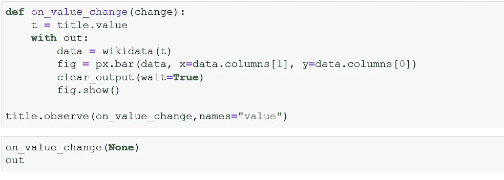

# 一个非常简单的维基百科页面视图仪表板。

> 原文：<https://medium.com/analytics-vidhya/how-to-create-a-very-simple-wikipedia-pageview-dashboard-using-voila-897b666d11cd?source=collection_archive---------15----------------------->

维基百科是互联网上最大的知识库。今天，让我们继续在 jupyter notebook 中构建一个非常简单的页面视图仪表板，然后使用 python 包 voila 让我们将该笔记本转换为一个独立的仪表板。好吧，什么是瞧？Voilà可作为独立应用程序运行、转换和维护 Jupyter 笔记本电脑。要运行此仪表板，必须在计算机中安装 voila。我们也在使用 mwviews，它提供了从在线 API 解析和查询 Wikimedia Foundation 页面视图数据的工具。

## 要加载的包。

*   mwviews——从维基媒体获取浏览量数据。
*   JSON——处理来自维基媒体的数据。
*   ipywidgets——在 jupyter 笔记本中创建用户交互式小部件，voila 抓取并显示为它生成的仪表板的一部分。
*   IPython.display 中的 clear_output 用于自动更新笔记本中的图形。因此，在 clear_output 的帮助下，该笔记本中的 plotly 可视化会针对 ipywidgets 的每个输入自动更新自身。

## 怎么办？

1.  使用下面的代码片段。首先，启动一个 jupyter 笔记本。加载所需的包。抄下下面给出的代码并运行它们。
2.  转到终端类型。瞧，现在将在浏览器中打开。搜索出现以下代码的 jupyter 笔记本的名称。点击它。等一分钟，瞧！我们有一个仪表板。

Voila 基本上一个接一个地运行 jupyter 笔记本中的每个单元格，并显示所有相应的视觉输出，即与每个单元格相关联的图形和小部件。

让我们初始化页面视图客户端。这里，user_agent 可以是您碰巧使用的任何电子邮件 id。

在下面的代码块中，正在使用 Ipywidgets。主要是标签、测试和 Vbox。Label 是一个小部件，它显示类似于 Vbox 小部件的标题，其中 Vbox 是一个包含标签和文本小部件的区域。文本是提示用户输入维基百科页面名称的地方，该页面的浏览量统计数据将自动显示，即使在 jupyter 笔记本中也是如此。这里有一个警告，自动更新只发生在笔记本从头到尾运行一次的时候，之后对于每个新的查询，绘图可视化将自动更新。

函数 on_value_change 负责可视化的自动更新。

最后启动 voila，把这个笔记本加载到上面，得到的仪表板看起来如下。

## 参考文献。

*   [mwviews](https://pypi.org/project/mwviews/) 的文档
*   瞧，[文档和安装](https://voila.readthedocs.io/en/stable/using.html)指南。
*   这篇博文是用 jupyter_to_medium 包渲染的，更多细节请点击这里。