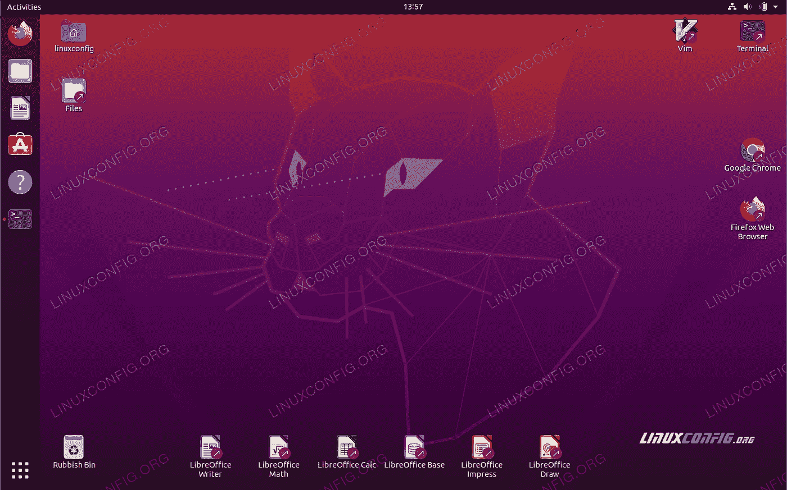

# 如何在 Windows 上创建虚拟机

> 原文：<https://medium.com/analytics-vidhya/how-to-create-a-virtual-machine-on-windows-cc2897355aa?source=collection_archive---------25----------------------->

**创建虚拟机:**

打开 VirtualBox 并选择顶部任务栏中的新建。

给 VM 起一个名字，选择 Linux 作为类型，然后选择 Ubuntu 作为版本，并选择 Next。

选择您想要分配给虚拟机多少[内存](https://www.lifewire.com/what-is-random-access-memory-ram-2618159)，然后选择**下一步**。建议最小值为 1024 [MB](https://www.lifewire.com/what-is-a-megabit-2483412) 。

选择**立即创建虚拟硬盘**并选择**创建**。

选择 **VDI** (VirtualBox 磁盘镜像)并选择**下一步**。

选择**动态分配**或**固定大小**作为存储类型，并选择**下一个**。

选择您希望为 Ubuntu 留出多少空间，然后选择**创建**。

虚拟机的名称现在将出现在 VirtualBox 管理器的左侧。选择工具栏中的**开始**启动您的虚拟机。

这就是你需要选择之前下载的 Ubuntu ISO 文件的地方。如果虚拟机没有自动检测到它，选择**空**字段旁边的**文件夹**。

在弹出的窗口中选择**添加**并选择你的 ubuntu 磁盘镜像，选择选择然后开始。

你的虚拟机现在将启动到 Ubuntu 的实时版本。选择您的语言，然后选择**安装 Ubuntu** 。然后执行基本的设置位置和用户密码，然后重新启动。

已成功创建虚拟机。

通过以上步骤，您可以在 windows 操作系统上轻松创建虚拟机。

谢谢大家！