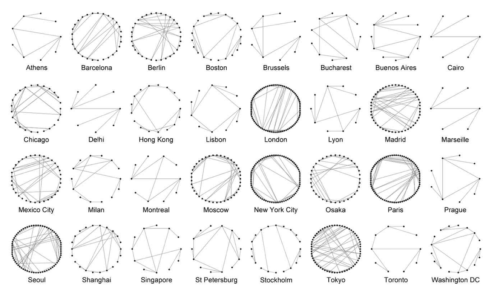
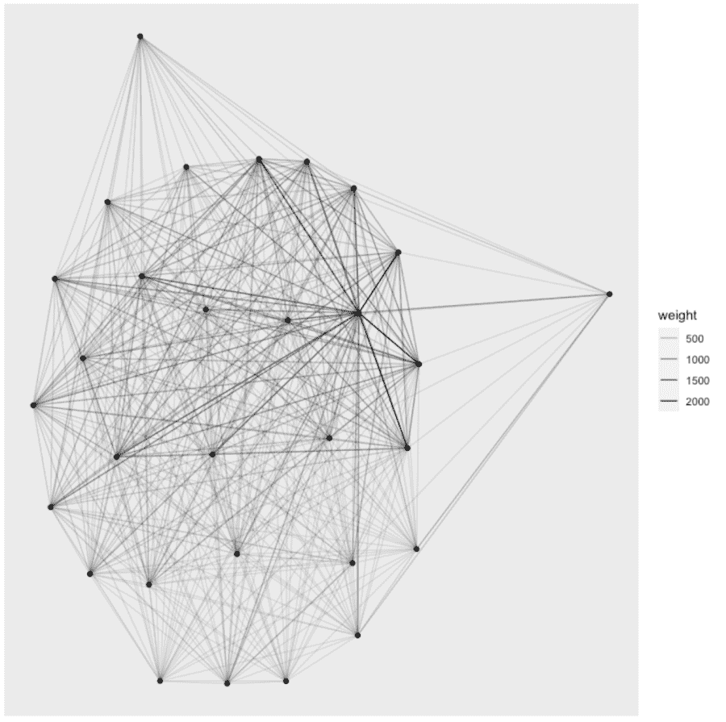

# 🕸如何从与 r 共享一个属性的元素列表中创建一个加权网络

> 原文：<https://medium.com/analytics-vidhya/how-to-create-a-weighted-network-from-a-list-of-elements-sharing-an-attribute-with-r-dccd4131f3fc?source=collection_archive---------14----------------------->



来源:德里布尔，S. (2012)。地铁系统的网络中心性。PloS one，7(7)，e40575。

网络分析是数据科学的一个分支，受到外界的广泛关注，主要是因为**我们生活的许多方面都可以用网络**来描述，比如[十五世纪佛罗伦萨的婚姻](https://www.google.com/url?sa=t&rct=j&q=&esrc=s&source=web&cd=&cad=rja&uact=8&ved=2ahUKEwj55KGu787wAhVKmqQKHU_iCpEQFjALegQIBhAD&url=http%3A%2F%2Fnetworkdata.ics.uci.edu%2Fnetdata%2Fhtml%2Fflorentine.html&usg=AOvVaw0c0ZncX3Zq76ahJkPixNYi)、[体育俱乐部的友谊](https://www.google.com/url?sa=t&rct=j&q=&esrc=s&source=web&cd=&cad=rja&uact=8&ved=2ahUKEwiowtW3787wAhUR7KQKHfTgDSoQFjAAegQIBBAD&url=https%3A%2F%2Fen.wikipedia.org%2Fwiki%2FZachary%2527s_karate_club&usg=AOvVaw2bK6rvTRmDU2eDilAq0dvd)、病毒式营销策略、地铁连接等等。

如果你也对网络分析感兴趣，你可能想用统计计算和图形的免费软件环境 **R 来做这件事。我们还假设您想从一个列表中创建一个网络。在该列表中，每个行元素都在一个属性中列出，如下例所示。**

篮球足球高尔夫球 Marc 1100 John 0200 Paul 505 Micheal 005

*在本例中，参与程度从 0 到 20 不等，0 表示参与者没有参与，20 表示最大参与程度。*

在场景中， **Marc 和 Paul 因为都踢足球而“联系在一起”**，Marc 和 John 因为篮球而联系在一起，Paul 和 Micheal 因为高尔夫而联系在一起，等等。你可能还想假设马克和约翰之间的联系是篮球创造的，远高于马克和保罗在足球上的联系。正如你所想象的，这可以用许多不同的方式来利用，因为在许多情况下，一个网络可以由共享一个属性的其他个人形成(例如，购买相同产品的客户)。

让我们以一个非常通用的矩阵为例，然后让我们生成**个人之间所有可能的组合**(在我们的例子中，他们将是 Marc-John、Marc-Paul、Marc-Micheal、John-Paul、John-Micheal 和 Paul-Micheal)。

```
# table with 50 random values
set.seed(345)
inc <- matrix( rbinom(50, 1, p=0.2) , 10, 5)
colnames(inc) <- letters[1:5] # activities
rownames(inc) <- LETTERS[1:10] # individuals# generate all combinations of individuals
d <- data.frame(t(combn(rownames(inc), 2)), stringsAsFactors = F)
```

现在，我们将构建一个**函数，它将通过对每个属性的值的乘积求和来计算两个人之间的联系强度**。例如，在上面的示例中，将通过应用以下公式来计算 Marc 和 John 之间的联系:

```
LinkStrength(Mark, John) = Football(Marc) * Football(John) + Basketball(Marc) * Basketball(John)+Golf(Marc) * Golf(John)sum_act <- function(x){
  sum = sum(inc[ d[x,"X1"],] * inc[ d[x,"X2"],])
}d$keep <- sapply(1:nrow(d), sum_act)head(d)
  X1 X2 keep
1  A  B    1
2  A  C    0
3  A  D    0
4  A  E    0
5  A  F    0
6  A  G    0
```

现在，您将能够生成自己的网络对象，并分析其所有特征。

```
library(igraph)
g <- graph_from_data_frame(d[d$keep>0,], directed = F)
plot(g)
```



你呢？你在 R 做过网络分析吗？