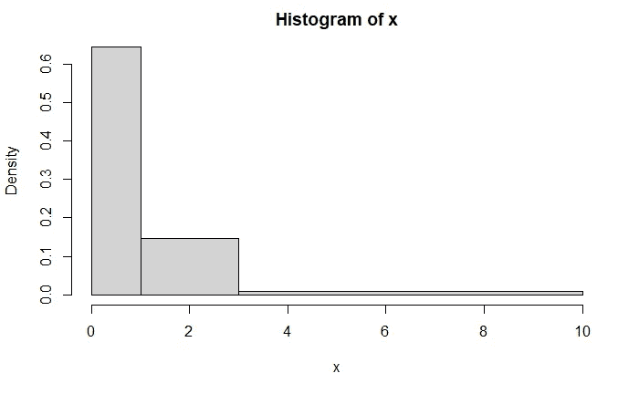

# 如何创建和解释丑陋的密度直方图与 R…

> 原文：<https://medium.com/analytics-vidhya/how-to-create-and-explain-ugly-density-histograms-with-r-4f5337717933?source=collection_archive---------18----------------------->



x = Rγ(1000，1)的直方图

```
x <- rgamma(1000,1)
hist(x, c(0,1,3,10))
```

上面的直方图是绘制伽马分布概率密度函数的另一种方法，以 1000 个项目为样本。

容易出图，多亏了“hist”功能吧？但是它是如何工作的呢？