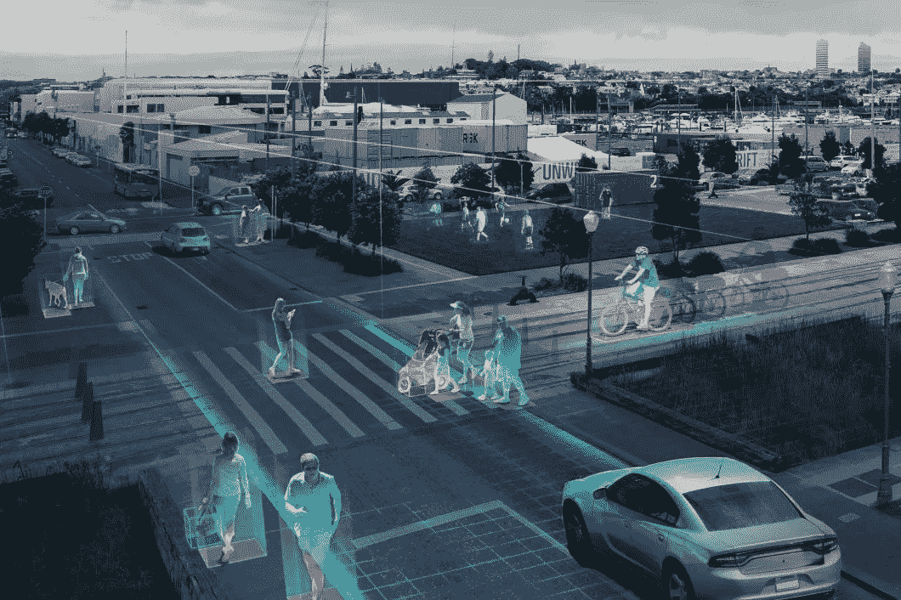
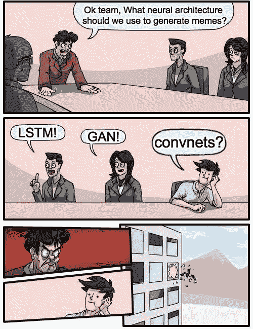
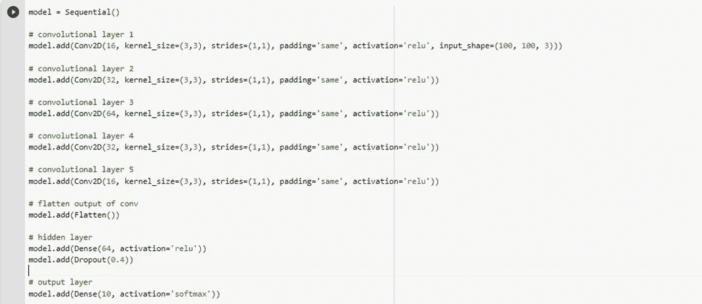
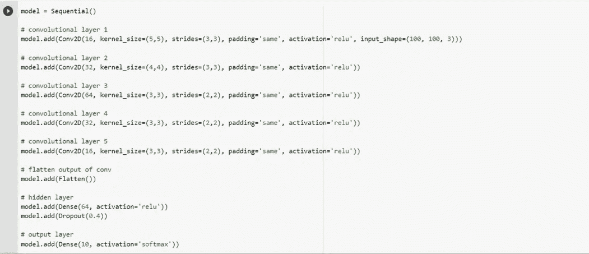
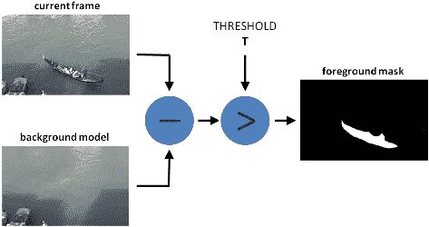
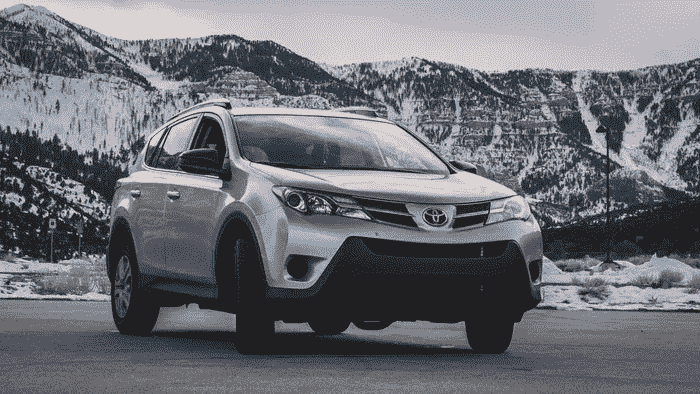
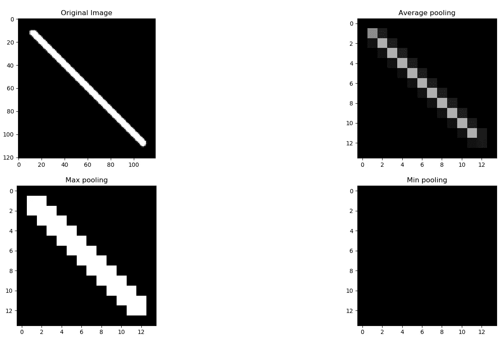
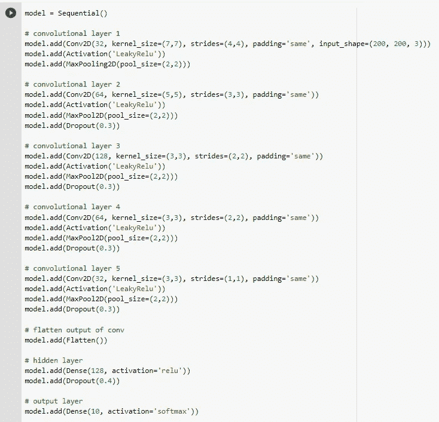

# 如何为你的用例创建一个有效的 CNN 模型

> 原文：<https://medium.com/analytics-vidhya/how-to-create-effective-cnn-for-your-use-case-6bae5c6871f6?source=collection_archive---------3----------------------->

## 介绍

人工智能的计算机视觉方面可以用于几乎任何只需要视觉监督的用例。如果每次那只该死的流浪狗在你停着的车上拉屎的时候，你都能得到通知，那该有多酷啊！它也有一些更有成效的用例。

它可以用于智能监控，如盗窃检测，入室盗窃检测，商店盗窃检测，检测您的产业工人是否配备了安全警卫等。它还可以用于检测制造单位的故障，方法是在传送带上放置一个摄像头，并部署人工智能算法来检测产品信息的裂缝、破损或漏印等。还有，基于闭路电视的停车场系统怎么样？

## 为什么创建 CNN 架构

github 上有数不清的最先进的算法，如 ResNet、AlexNet 等，可用于此目的。但是使用迁移学习有各种各样的缺点，因为它非常繁琐和耗时。我敢肯定你一定亲身感受到了这一点，这就是为什么你在这里学习如何为你的用例创建一个有效的 CNN 架构。

开发自己的架构的主要优势是:

*   由预训练模型训练的权重依赖于域，因此它们可能适用于您的用例，也可能不适用。例如，ResNet 是在 ImageNet 数据集上训练的，因此如果你用它们来检测非常小的肺癌颗粒，结果会很差。
*   在大多数情况下，您需要管理输入形状，因为它们对于预训练模型和数据集可能是不同的。
*   大多数预训练模型需要庞大的数据集和计算资源来产生有效的结果，这些结果你可能有也可能没有。
*   在使用我们自己开发的模型时，通过改变一些参数或添加/删除层，可以更容易地控制模型的复杂性。很明显，你是你的模特之王！

首先让我们简单了解一下 CNN 是如何工作的。

## 魔术背后:CNN 如何运作？

CNN——卷积神经网络是 MLP(多层感知器)的即兴版本，它是在考虑人类视觉皮层的情况下开发的。让我们以一个 100 x 100 的 RGB 图像为例。因此，基本上我们有一个 3 x 3 x 100 的图像阵列，每个值代表 0 到 255 之间的 RGB 像素强度。CNN 能够通过逐个遍历像素集并将它们输入到用于图像分类的神经网络中来识别图像中对象的曲线、边缘和形状。

CNN 由输入层、卷积层、激活函数、池层、全连接层组成。由于我们专注于为特定用例创建一个利基模型，我假设您已经非常熟悉这些内容中的每一个是做什么的，并且不会进入这样的细节。然而，通过阅读这篇精彩的[博客](https://towardsdatascience.com/basics-of-the-classic-cnn-a3dce1225add)，你可以更多地了解这些内容是如何发挥作用的。

## 开发有效的利基 CNN 模型

根据下面的案例，你可以从头开始创建一个有效的 CNN 模型。修改最适合您的用例的属性，因为一个或多个条件可能暗示您的数据集。此外，我将在文章的最后附上一个 CNN 架构示例，我已经亲自在不同领域的不同数据集上进行了尝试，并且表现良好。所以多待一会儿吧！

1.  **识别微小细节**

如果您的用例需要考虑图像中的微小细节，例如狗和猫的分类，您必须关注耳朵、鼻子、爪子等的大小。然后，你必须创建一个瓶颈，这意味着首先获取关于图像的更大信息，然后只将必要的细节传递给模型的后续层。前几层不断增加神经元然后减少。例如，如果您有 6 个卷积层，它们可以分别包含 16、32、64、128、64、32 个神经元，然后是具有 128 个神经元的密集层和具有与类别数量相等的神经元的输出层。一个示例瓶颈 CNN 模型如下所示:

看到每一层的神经元数量了吗

**2。认清大局**

大多数 CNN 的模式都专注于微小的细节，但有时你需要着眼于更大的画面。例如，如果你必须在卡车和飞机之间进行分类，你不需要关注微小的细节，因为这两个物体是完全不同的。记住，一本书放在离眼睛太近的地方会变得难以阅读。这是深刻的，的确！

所以回到正题，当你想让你的模型关注整体图像而不是微小的细节时，你必须增加内核和步长。对初始层使用较大的值，如(6，6)或(7，7)，对后续层使用(4，4)或(5，5)。记住，由于显而易见的原因，步幅大小必须小于内核大小。此外，在随后的层中，步幅大小必须保持相同或更小(但不是更大)。

看看内核的大小和步幅

**3。开发环境独立模型**

有时候关注模型不仅仅是它。数据是燃料。在某些使用案例中，在输入模型之前对图像进行预处理可以提高精确度。如果您必须创建一个将在不同背景和照明条件下使用的通用模型，那么在不同背景/照明条件下测试时，您的模型可能会产生误导性输出。为此，您可以使用各种图像处理技术，如 openCV 的[边缘检测](https://docs.opencv.org/3.4/da/d22/tutorial_py_canny.html)、[中值模糊](https://docs.opencv.org/4.5.2/d4/d86/group__imgproc__filter.html#ga564869aa33e58769b4469101aac458f9)、[绝对差值](https://www.programcreek.com/python/example/89428/cv2.absdiff)、[背景减除](https://docs.opencv.org/3.4/d1/dc5/tutorial_background_subtraction.html)等。

基于 OpenCV 的背景减除方法

传递这些预处理过的图像会使模型更关注物体而不是背景。因此，您将能够创建一个可以在多种环境下工作的更通用的模型。

**4。识别颜色和清晰度**

keras 中有三种可用的池化方法:

*   最大池化-选择跨距中的最大像素
*   最小池-选择跨距中的最小像素
*   平均池-选择步幅的平均像素

最大池的可视化表示

**您应该使用哪种池？**

**平均池**平滑图像，因此无法识别图像中的边缘特征。因此，如果影像数据集中的对象过于集中，并且您还希望考虑背景或其他细节，则应使用平均池，这样可以平滑清晰的特征，从而避免过于集中于一个对象或影像的一部分。

例如，你一定注意到了上图中的豪华汽车，但是你没有注意到它后面雄伟的山脉。对吗？所以如果你戴上一杯平均池，你的思想也会开始关注后面的山。

**最大池化**关注更亮的像素。因此，如果图像中的背景较暗，而您的对象具有较亮的像素，例如 MNIST 数据集，请使用 Max Pooling 图层，以便它可以轻松检测对象，而不会过多关注背景。

**最小池**与最大池相反。它侧重于较亮的像素。因此，如果图像的背景较亮，并且您只担心较亮的像素，您应该使用最小池。

平均池与最小池与最大池

除此之外，如果你发现你的模型过拟合，你可以使用**脱落层**。

这标志着从头开始创建您自己的 CNN 模型的简短指南的结束。正如所承诺的，这里有一个 CNN 架构的例子，已经在不同的数据集上进行了测试。然而，我强烈建议根据您的用例和数据集创建您自己的模型。

如果你仍然发现自己在你的计算机视觉项目上苦苦挣扎，给 darshil3011@gmail.com 发邮件或者在 [LinkedIn](https://www.linkedin.com/in/darshil-modi3011/) 上 ping 我，我会非常乐意帮助你！

***欲定制基于 AI 和计算机视觉的解决方案，请联系*** [***想在字节***](http://www.thinkinbytes.in) ***！***