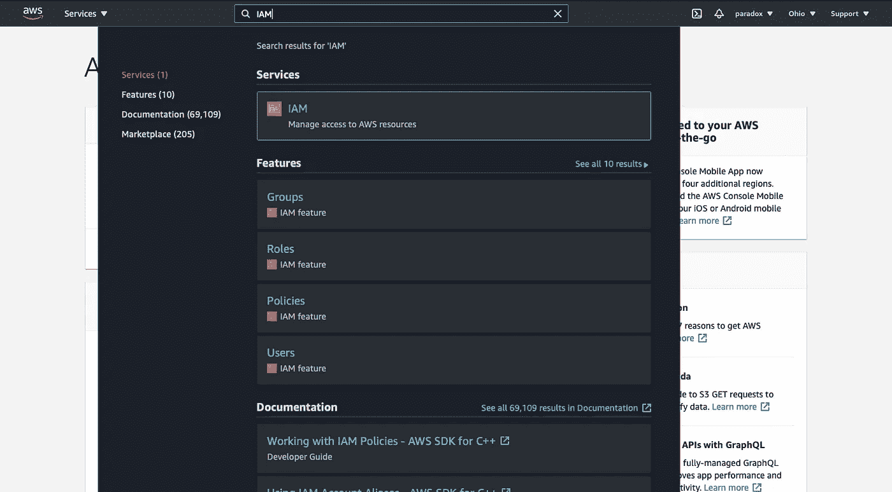
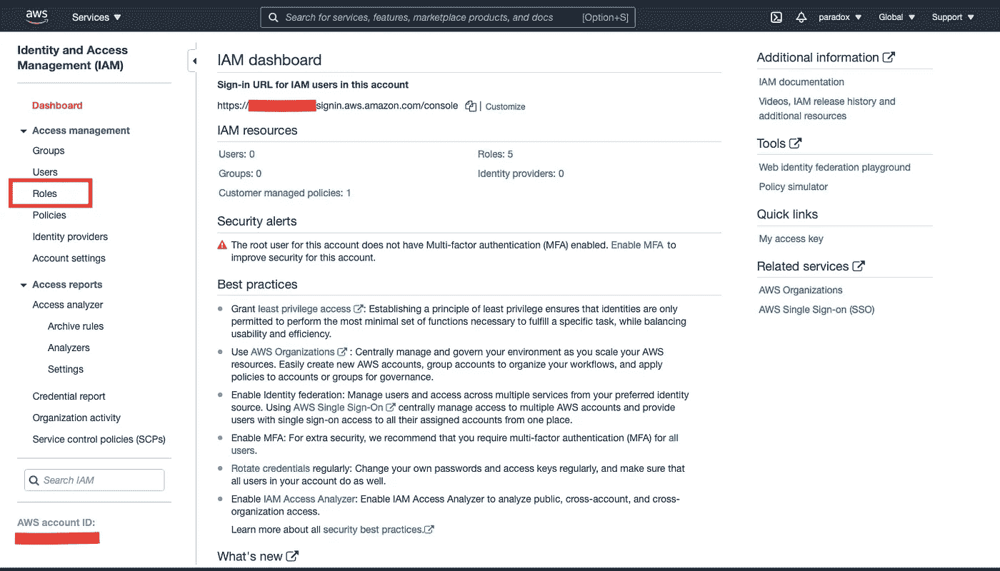
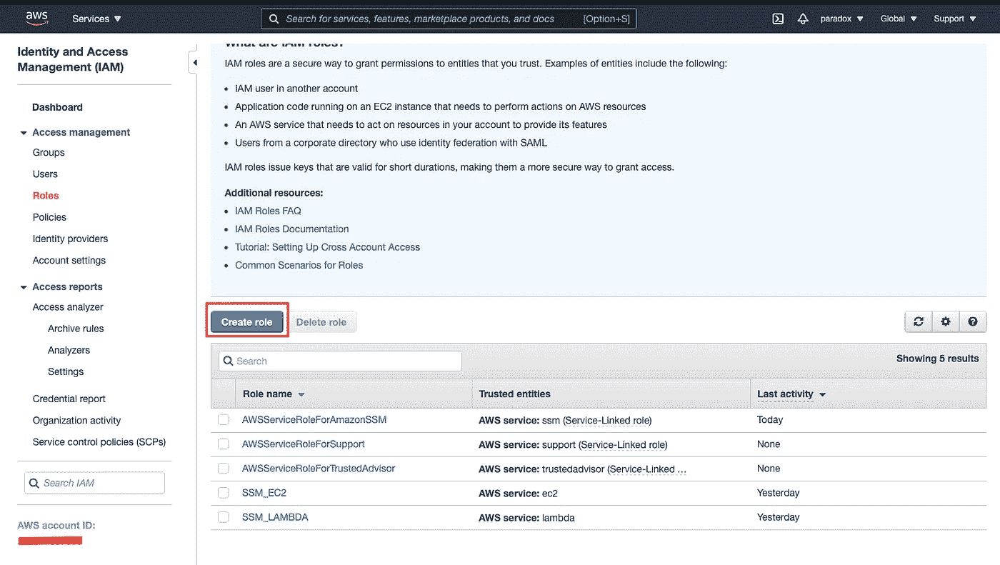
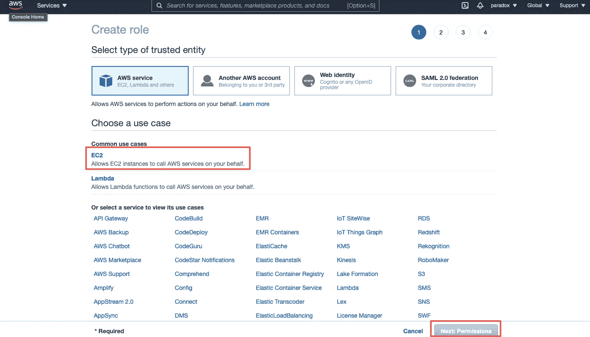
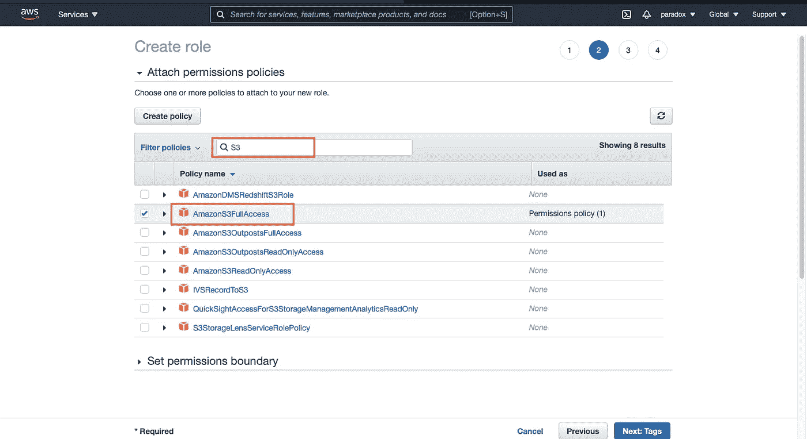
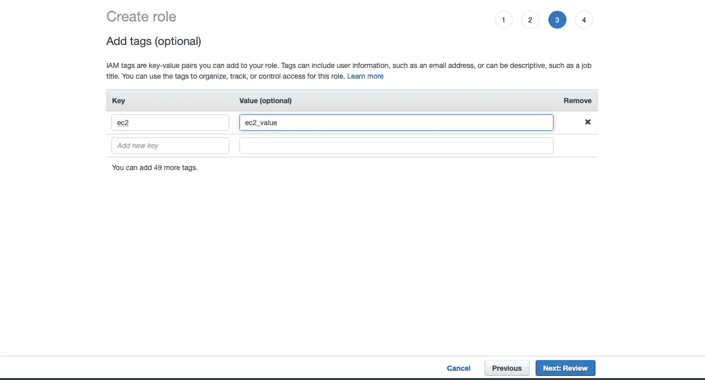
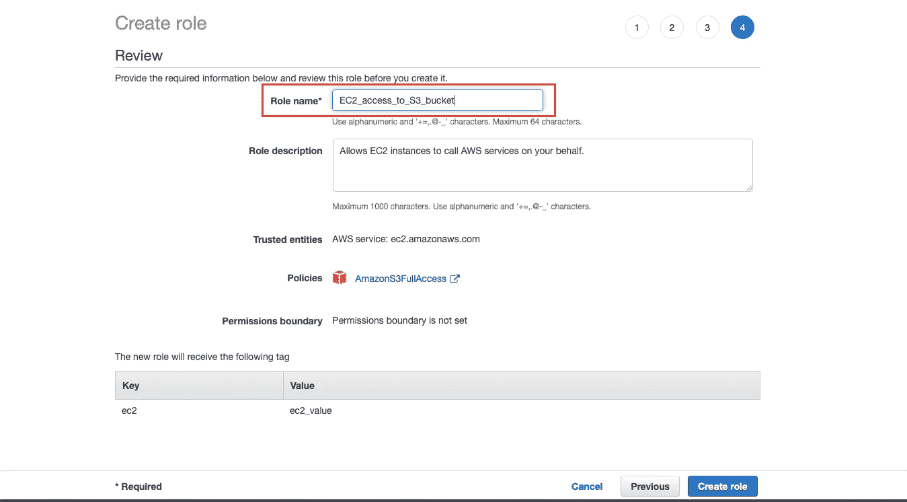
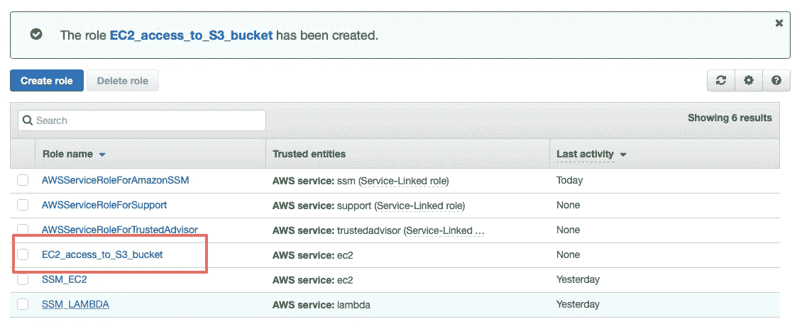

# 如何在 AWS 中创建 IAM 角色

> 原文：<https://medium.com/analytics-vidhya/how-to-create-iam-roles-in-aws-311940e6ebe3?source=collection_archive---------16----------------------->

克里斯蒂安·威迪格在 [Unsplash](https://unsplash.com?utm_source=medium&utm_medium=referral) 上拍摄的照片

**注意:我假设你已经有一个 AWS 账户，我不会教你如何创建一个 AWS 账户。**

**第一步:**在搜索栏中输入 IAM 并点击它。

AWS 仪表板

**第二步:**点击权限管理下的**角色**。

IAM 仪表板

**第三步:**点击**创建角色**

创建角色

**步骤 4:** 现在，我们可以选择任何**用例。**您可以选择我正在选择的任何服务 **EC2。**

> *选择服务意味着这个服务在我的例子中是****EC2****将能够访问* ***AWS 其他服务*** *就像访问 S3 桶一样简单地说，您给了特定服务使用其他服务的权利。*

选择服务后，点击**下一步:权限**按钮。*选择您的服务后，按钮将高亮显示。*

**步骤 5:** 现在，我们将搜索在我想要 EC2 服务访问 S3 存储桶的情况下要使用的策略。

> 策略是 **AWS** 中的一个对象，当它与一个实体或资源相关联时，定义它们的权限。 **AWS** 评估这些**策略**当一个当事人，比如一个用户，发出请求时。**策略**中的权限决定请求是被允许还是被拒绝。大多数**策略**作为 JSON 文档存储在 **AWS** 中。—摘自 AWS 文章

因此，键入您想要的策略名称我想使用我的 EC2 实例访问 S3 存储桶，因此我将键入***【S3】***，我将找到**amazons 3 full access***策略选择它并单击**下一步:标记**按钮。*

**

*附加策略*

> *您可以在任何特定服务上添加任意数量的策略，以了解有关策略的更多信息[单击](https://docs.aws.amazon.com/IAM/latest/UserGuide/access_policies.html)*

***第 6 步:**点击**后下一步:标签**按钮将要求您添加标签这是*可选* ***当您有许多与不同用户和服务相关联的策略时，它将有助于组织策略。****

**

*点击**下一步:查看**按钮*

***步骤 7:** 现在，在完成上述所有步骤之后，编写您的策略的相关角色名称。*所以，你要确定这个角色是干什么的。像在这个角色，我给 EC2 实例访问 S3 桶。所以，我会根据这两个服务来命名我的角色名。**

**

*现在，点击**创建角色**按钮。*

*你将得到已经创建的角色*

**

*现在，如何使用这个政策呢？*

*这篇文章越来越长了。因此，我将在下一篇文章中介绍如何使用这些策略。*

*如果您有任何建议或发现任何错误，请提出意见，我将予以纠正，谢谢。*