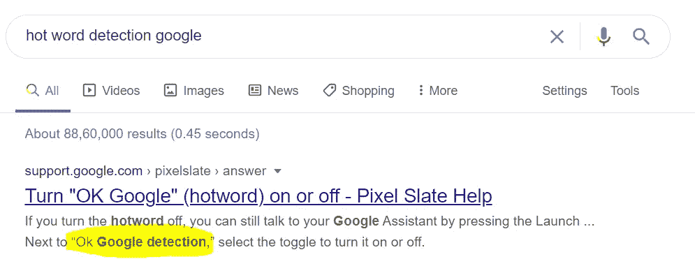
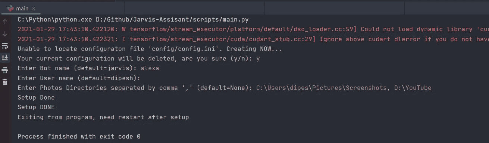
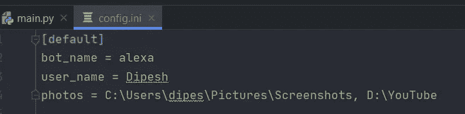
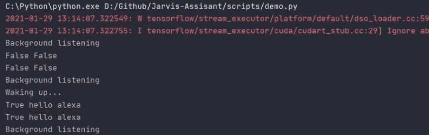

# 如何在 Python 中创建虚拟助手 10 min 50 行代码|无需购买 ALEXA，构建您的 JARVIS

> 原文：<https://medium.com/analytics-vidhya/how-to-create-virtual-assistant-in-python-10-min-50-lines-of-code-no-need-to-buy-alexa-build-7ad5102c57ba?source=collection_archive---------3----------------------->

# 介绍

虚拟助理，也称为人工智能助理或数字助理，是一种理解自然语言语音命令并为用户完成任务的应用程序。


Jarvis AI 2.0 Python 虚拟助手

> 虚拟助理，也称为人工智能助理或数字助理，是一种理解自然语言语音命令并为用户完成任务的应用程序。

最新演示和代码演练

## 上一版本演示:[https://youtu.be/LliTjuxDw_o](https://youtu.be/LliTjuxDw_o)

# 内容-

1.  我们正在建造的-
2.  代码解释
3.  完全码
4.  GitHub 知识库
5.  你可以如何贡献
6.  参考
7.  如何保持对新版本的更新

# 1.我们正在建造的-

**我们的虚拟助手将能够做以下事情-**

*   声音识别
*   文本到语音
*   打开照片
*   打开 Google 相册
*   给你讲笑话
*   关闭你的系统
*   天气预报
*   启动游戏
*   启动 Windows 应用程序
*   打开网站
*   告诉你几乎所有你问的问题
*   告诉你日期和时间
*   问候
*   新闻
*   人脸识别(需要训练 ML 模型)

你可以 ***与笔记本电脑的麦克风/控制台*** 互动。助手生成的响应将通过 ***显示在控制台上或作为语音通过*** 扬声器发出。

**未来更新:自拍点击，聊天更像人类等。你告诉我你想要什么。或者贡献于**[***https://pypi.org/project/JarvisAI***](https://pypi.org/project/JarvisAI/)

# 2.代码解释-

因此，让我们创建自己的虚拟助手。

***注释-***

*   所有的代码都在我的 GitHub 上。
*   演示 YouTube 视频和代码 YouTube 视频也可以在我的频道上看到。
*   下面提到了所需的链接和包。
*   在 YouTube 上分享和订阅我将不胜感激
*   代码和功能可能会在未来更新，所以请继续关注我的 [YouTube](https://www.youtube.com/dipeshpal17) 和这个项目的官方页面。

***让代码-***

## 2.1.必需的包和库-

[https://pypi.org/project/JarvisAI/](https://pypi.org/project/JarvisAI/)

```
pip install JarvisAI
```

这是最新的虚拟助理模块，由我创建。它提供了任何虚拟助手的基本功能。前提条件只有 Python (> 3.6)。

# 用法和功能-

安装完库后，您可以导入模块-

```
import JarvisAI
obj = JarvisAI.JarvisAssistant()
response = obj.mic_input()
print(response)
```

**查看此脚本了解更多示例-**[https://github . com/Dipeshpal/Jarvis-assi sant/blob/master/scripts/main . py](https://github.com/Dipeshpal/Jarvis-Assisant/blob/master/scripts/main.py)

## 可用方法-

功能由方法名来定义。你可以查看代码。这些是创建 JarvisAI 对象后可以使用的可用函数的名称

```
import JarvisAI
obj = JarvisAI.JarvisAssistant()
response = obj.mic_input()
```

1.  res = obj.mic_input(lang='en ')
2.  RES = obj . website _ opener(" Facebook ")
3.  RES = obj . send _ mail(sender _ email = None，sender_password=None，receiver_email=None，msg="Hello ")
4.  res = obj.launch_app("edge ")
5.  天气(城市= '孟买')
6.  res = obj.news()
7.  res = obj.tell_me(topic='India '，sentences=1)
8.  res = obj.tell_me_time()
9.  res = obj.tell_me_date()
10.  res = obj.shutdown()
11.  res = obj.text2speech(text= '你好，你好吗？'，lang='en ')
12.  RES = obj . dataset create(dataset _ path = ' datasets '，class_name='Demo '，haarc scade _ path = ' haarc scade/haarc scade _ frontal face _ default . XML '，eye cascade _ path = ' haarc scade/haarc scade _ eye . XML '，eye_detect=False，save_face_only=True，no_of_samples=100，width=128，height=128，color_mode=False)
13.  RES = obj . face _ recognition _ train(data _ dir = ' datasets '，batch_size=32，img_height=128，img_width=128，epochs=10，model_path='model '，pretrained=None，base _ model _ trainable = False)
14.  RES = obj . predict _ faces(class _ name = None，img_height=128，img_width=128，haarc scade _ path = ' haarc scade/haarc scade _ frontal face _ default . XML '，eye cascade _ path = ' haarc scade/haarc scade _ eye . XML '，model_path='model '，color_mode=False)
15.  res = obj.setup()
16.  res = obj.show_me_my_images()
17.  res= show_google_photos()
18.  res = tell_me_joke(language='en '，category='neutral ')
19.  res = hot_word_detect(lang='en ')

> 以上方法从名字本身就很清楚了。更多信息请阅读 GitHub 或 Pypi 的 Jarvis_AI 官方页面。

# 2.2.代码-

## 步骤 1(导入并创建 JarvisAI 对象)

```
*import* JarvisAI
*import* re
*import* pprint
*import* random
```

根据[文档](https://pypi.org/project/JarvisAI/)创建 JarvisAI 的对象

```
obj = JarvisAI.JarvisAssistant()
```

我们创建了这个“t2s(text)”函数。这将把任何文本转换成语音。整个程序我们将使用(调用)这个函数来从文本中产生语音。

## 步骤 2(创建 text2speech 或 speak 函数)

```
*def* t2s(text):
    obj.text2speech(text)
```

## 步骤 3 ( **持续**监听背景和热词检测)—

**我们希望不断地听取用户的输入，**所以我们将在这里使用 while 循环。

## **我们将使用‘hot _ word _ detect()’函数。为什么？这是什么？**



什么是热词检测

我想没必要解释它是什么。

这个 hot_word_detect 将开始在后台听你的声音。所以这个热词检测将返回 2 个东西“状态”和“命令”。状态是布尔型的，命令是你所说的文本。如果检测到您想要的 hot_word，它将返回 status=True。

```
*while True*:
    status, command = obj.hot_word_detect()
    *if* status:
        *# We will do something...*
```

假设你运行了这么多代码。如果你是第一次运行这个程序，它会先要求你设置一些东西。



设置初始事物

完成后，它将创建一个“config/config.ini”文件。它具有与您的虚拟助理相关的配置。



config.ini

现在再次运行脚本，它将开始在背景中列出你的声音。



背景听力

要唤醒助手，你需要说出你的热门词。热门词是你在 config.ini 文件中的 bot_name。

所以，你可以说，“你好，亚历山大”，“你好，亚历山大”，“等等，等等，等等”。只有一个说着热词的你的助手将我们唤醒。否则它会一直在后台监听。

## 步骤 4(检测到热词后，通过麦克风发出命令)

因此，如果状态为“真”,那么我们要使用 mic_input()来再次从麦克风中听到您的声音。现在你什么都可以说了。它会把你的声音转换成文本。

```
*while True*:
    status, command = obj.hot_word_detect()
    *if* status:
        *while True*:
            res = obj.mic_input()
            print(res)
```

## 步骤 5(根据用户命令执行动作，让我们来实现笑话)

假设用户说“给我讲个笑话”。

现在我们将使用正则表达式来匹配用户输入中想要的单词。我们想匹配“笑话|笑话|笑话”下面的“res”中的任何一个模式。

(注意:‘RES’在这里代表‘response’。我超级懒，所以我写了“res”)

```
*while True*:
    status, command = obj.hot_word_detect()
    *if* status:
        *while True*:
            res = obj.mic_input()
            print(res)

            *if* re.search("jokes|joke|Jokes|Joke", res):
                joke_ = obj.tell_me_joke('en', 'neutral')
                print(joke_)
                t2s(joke_)
                *break*
```

如果在“res”中发现了 pattern(" Jokes | Joke | Joke ")，那么我们要调用 ***tell_me_joke('en '，' neutral ')。*** *本将返回单笑话为‘str’。*我们可以打印这个，也可以使用我们的“t2s”功能来说话(将这个文本转换成语音)。

## 步骤 6(现在也实现了其他操作)

**再举一个例子——**

**实施日期和时间:**它将告诉您系统的当前日期和时间。

```
*if* re.search('date', res):
        date = obj.tell_me_date()
        print(date)
        print(t2s(date))
        break*if* re.search('time', res):
        time = obj.tell_me_time()
        print(time)
        t2s(time)
        break
```

**你可以定义你的基于 if-else 的逻辑，就像我们在“笑话”中使用的那样，并相应地调用这些方法中的任何一个-**

*   website _ opener _ RES = obj . website _ opener(" Facebook ")
*   mail _ RES = obj . send _ mail(sender _ email = None，sender_password=None，receiver_email=None，msg="Hello ")
*   launch _ app _ RES = obj . launch _ app(" edge ")
*   天气(城市= '孟买')
*   news_res = obj.news()
*   topic _ RES = obj . tell _ me(topic = ' India '，sentences=1)
*   time_res = obj.tell_me_time()
*   date_res = obj.tell_me_date()
*   shutdown_res = obj.shutdown()
*   setup_res = obj.setup()
*   local _ dir _ images _ RES = obj . show _ me _ my _ images()
*   google _ photos _ res = show _ 谷歌 _ 照片()
*   joke _ RES = tell _ me _ joke(language = ' en '，category='neutral ')
*   wake _ word _ RES = hot _ word _ detect(lang = ' en ')
*   dataset create _ RES = obj . dataset create(dataset _ path = ' datasets '，class_name='Demo '，haarc scade _ path = ' haarc scade/haarc scade _ frontal face _ default . XML '，eye cascade _ path = ' haarc scade/haarc scade _ eye . XML '，eye_detect=False，save_face_only=True，no_of_samples=100，width=128，height=128，color_mode=False)
*   face _ recognition _ train _ RES = obj . face _ recognition _ train(data _ dir = ' datasets '，batch_size=32，img_height=128，img_width=128，epochs=10，model_path='model '，pretrained=None，base _ model _ trainable = False)
*   predict _ faces _ RES = obj . predict _ faces(class _ name = None，img_height=128，img_width=128，haarcascade _ path = ' haarcascade/haarcascade _ frontal face _ default . XML '，eye cascade _ path = ' haarcascade/haarcascade _ eye . XML '，model_path='model '，color_mode=False)

# 3.完整代码-

演示脚本-

[](https://github.com/Dipeshpal/Jarvis-Assisant/blob/master/scripts/main.py) [## dipeshpal/Jarvis-assistant

### 贾维斯助理是做基本任务的虚拟助理

github.com](https://github.com/Dipeshpal/Jarvis-Assisant/blob/master/scripts/main.py) 

# 4.Github 知识库

你可以随意使用我的代码。如果你喜欢我的作品就开始吧，如果你喜欢就订阅 YouTube。

只需克隆库-【https://github.com/Dipeshpal/Jarvis-Assisant.git 

然后运行 pip install -r requirements.txt

它会自动安装一切。

# 5.你能做些什么-

【https://github.com/Dipeshpal/Jarvis_AI/discussions】受暗示的想法:

**通过寻找 bug:**https://github.com/Dipeshpal/Jarvis_AI/issues

**通过贡献代码:**只要打开这个 [GitHub 库](https://github.com/Dipeshpal/Jarvis_AI) *，*阅读它你就会明白你可以如何贡献。

***你的贡献会体现在*** [***这个项目上***](https://pypi.org/project/JarvisAI/) ***。***

# 6.参考文献-

*   GitHub 库和代码演示:[https://github.com/Dipeshpal/Jarvis-Assisant](https://github.com/Dipeshpal/Jarvis-Assisant.git)
*   GitHub Pypi 资源库投稿:[***https://github.com/Dipeshpal/Jarvis_AI***](https://github.com/Dipeshpal/Jarvis_AI)
*   JarvisAI 库:[**【https://pypi.org/project/JarvisAI/】T2**](https://pypi.org/project/JarvisAI/)
*   YouTube 频道:[https://www.youtube.com/DIPESHPAL17](https://www.youtube.com/DIPESHPAL17)
*   演示和代码(YouTube)版本 1:[https://youtu.be/LliTjuxDw_o](https://youtu.be/LliTjuxDw_o)
*   演示和代码(YouTube)版本 1:[https://youtu.be/C-sKlSULLrI](https://youtu.be/C-sKlSULLrI)

# 7.如何保持对新版本的更新？

*   贾维赛库:[***https://pypi.org/project/JarvisAI/***](https://pypi.org/project/JarvisAI/)
*   YouTube 频道:[https://www.youtube.com/DIPESHPAL17](https://www.youtube.com/DIPESHPAL17)

> **【https://www.buymeacoffee.com/dipeshpal】**给我买杯咖啡:[](https://www.buymeacoffee.com/dipeshpal)
> 
> *没钱？*
> 
> *在 YouTube 上为我订阅:[https://www.youtube.com/dipeshpal](https://www.youtube.com/DIPESHPAL17)17*

# *—过去的文章*

*   *[5 行 10 分钟用 Python 和深度学习进行人脸识别](/analytics-vidhya/face-recognition-with-python-and-deep-learning-in-5-lines-5-minutes-39a5bf798267)*
*   *[通过 Tensorflow 使用机器学习模糊或改变图像背景](/analytics-vidhya/blur-or-change-background-of-images-using-machine-learning-with-tensorflow-f7dab3ddab6f)*
*   *[使用 Tensorflow Keras 使用 Unet 进行人体图像分割](/analytics-vidhya/humans-image-segmentation-with-unet-using-tensorflow-keras-fd6cb43b06e5)*