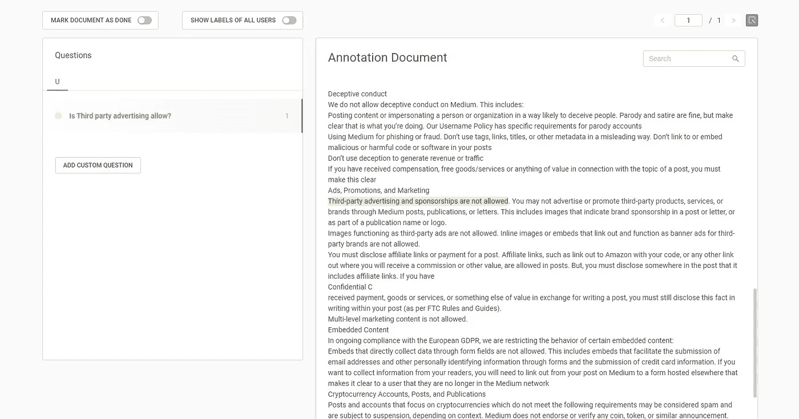
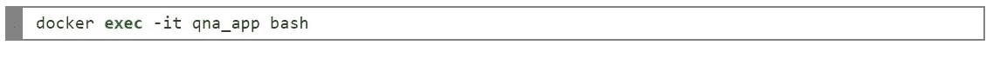
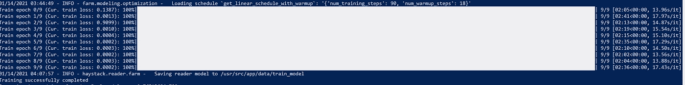
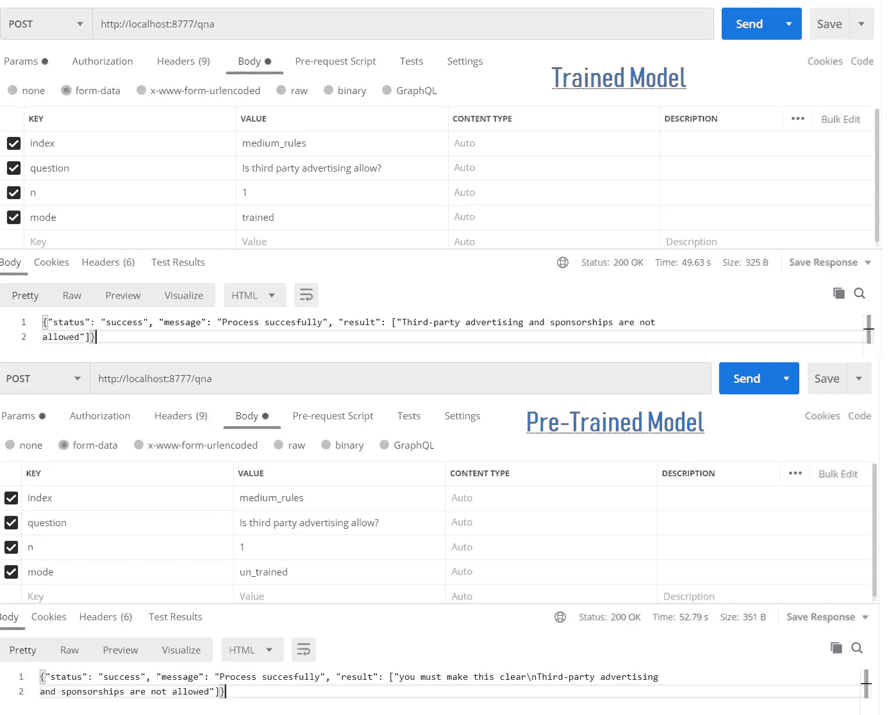

# 如何使用 haystack 框架创建自己的问答 API(Flask+Docker+BERT)——第二部分

> 原文：<https://medium.com/analytics-vidhya/how-to-create-your-own-question-and-answering-api-flask-docker-bert-using-haystack-framework-7084208c2e7e?source=collection_archive---------13----------------------->

> ***作者注:***
> 
> 在本文中，我们将学习如何使用 python、flask 和带有 docker 的 [haystack](https://github.com/deepset-ai/haystack) 框架创建自己的问答(QA) API。haystack 框架将提供完整的 QA 特性，它是高度可扩展和可定制的。在本文中[中，规则](https://policy.medium.com/medium-rules-30e5502c4eb4)文本将被用作目标文档，并对模型进行微调。
> 
> ***所需基础知识:****elastic search&Docker*
> 
> 这篇文章包含的工作代码，可以直接建立使用 docker。

突出文章的内容

1.  文档库设置—安装 Elasticsearch
2.  API 代码解释
3.  在 docker 中构建 Flask API
4.  从 API 加载数据
5.  API 的演示
6.  微调模型
7.  代码调整(已培训/预培训)
8.  总结结果

# 6.微调模型

让我们尝试改进模型，按照我们的要求训练自己。对于任何特定领域的训练，我们必须训练自己， [Haystack 注释工具](https://annotate.deepset.ai/index.html)将用于标记我们的数据。在本文中，我将使用来自 haystack 的注释工具的托管版本。

对于本地版本，请点击此处。

[https://github . com/deepset-ai/haystack/tree/master/annotation _ tool](https://github.com/deepset-ai/haystack/tree/master/annotation_tool)

现在用你的个人邮箱 id 创建一个账户，上传 txt 文档。在下面的快照中注释您的问题和答案:

使用 Haystack 注释工具进行文本注释

现在将所有标签以小队格式导出为***" answers . JSON "***，并使用以下命令将文件复制到 docker 容器中:

## 代码解释 util-trainer.py

在收集了训练标签之后，这个 python 工具将帮助我们根据我们的需求来训练和微调模型。让我们用 10 个纪元进行训练。

使用以下 docker 命令从 docker 容器执行:

要开始训练，运行命令" **python util-trainer.py "**

用 10 个纪元训练

训练结束时，模型将保存在 **train_model** 目录**中。现在训练已经成功完成。**

# 7.代码调整(训练和未训练)模型

让我们修改代码，在同一个端点中订阅已训练和预训练的模型。我们将添加额外的参数“模式”来对模型进行分类。

将包含以下命令的代码发布到 docker:

> docker copy main . py qna _ app:/usr/src/app/main . py

现在重启容器以反映 API 中的变化

> docker 重启 qna_app

现在，API 已经准备好订阅经过培训和预培训的模型。

# 8.总结结果

现在让我们比较两个模型(训练的和预训练的)并分析最可能的答案。在快照中使用下面的 API:

训练和预训练模型比较

经过训练的模型给出了完美的结果，因为我们在训练数据中提供了标签。

我希望我们已经学会了通过微调模型来开发我们自己的 QNA api。

> [如何使用 haystack 框架创建自己的问答 API(Flask+Docker+BERT)——第一部分](https://kohinoor-soubam.medium.com/how-to-create-your-question-and-answering-flask-api-using-haystack-e97205a240d1)

完整的源代码可以在[这里](https://github.com/Kohimax/qna-api)找到

# 参考

1.  【https://github.com/deepset-ai/haystack 
2.  [https://github . com/deepset-ai/haystack/tree/master/annotation _ tool](https://github.com/deepset-ai/haystack/tree/master/annotation_tool)
3.  [https://github . com/deepset-ai/haystack/blob/master/tutoria L2 _ fine tune _ a _ model _ on _ your _ data . ipynb](https://github.com/deepset-ai/haystack/blob/master/tutorials/Tutorial2_Finetune_a_model_on_your_data.ipynb)

# 如果这篇文章有帮助，请点击拍手👏按钮下面几下，以示支持！⬇⬇