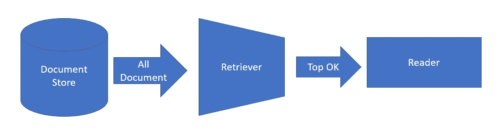
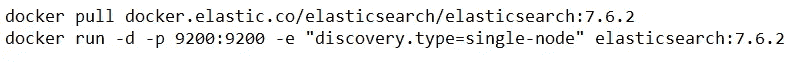
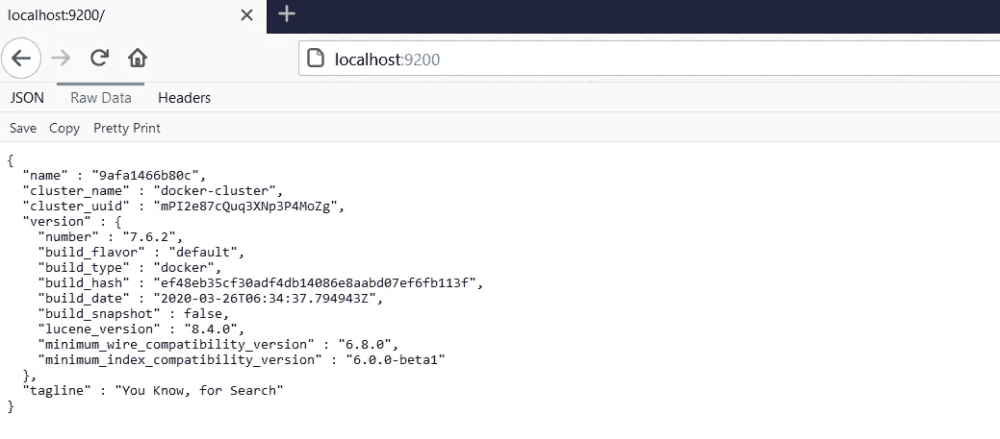
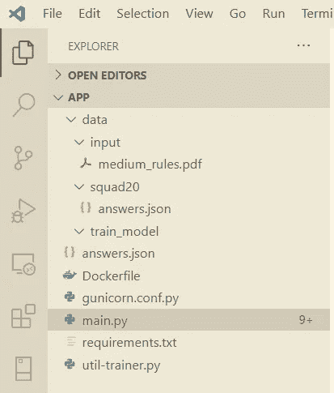
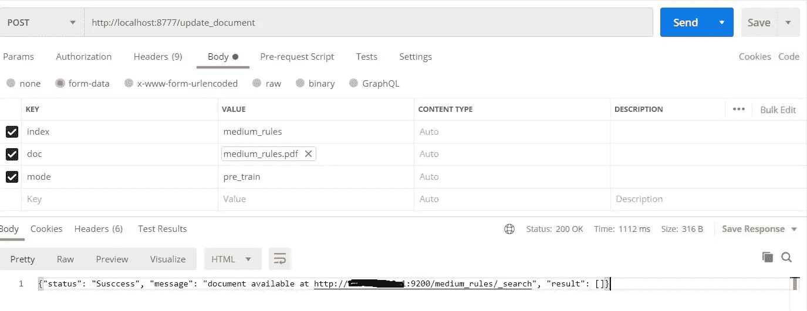
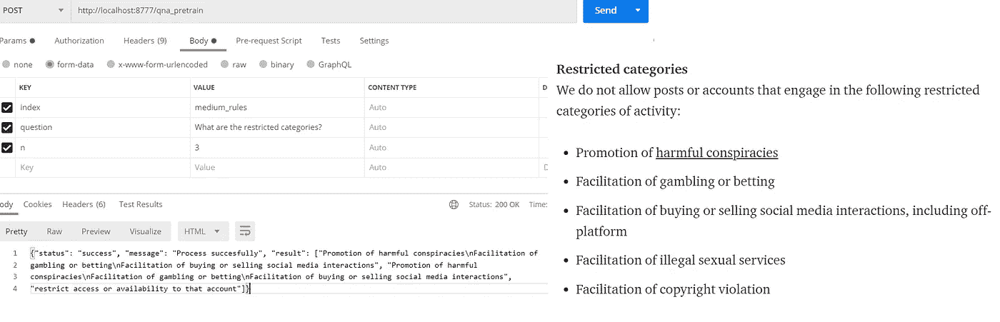

# 如何使用 haystack 框架创建自己的问答 API(Flask+Docker+BERT)——第一部分

> 原文：<https://medium.com/analytics-vidhya/how-to-create-your-question-and-answering-flask-api-using-haystack-e97205a240d1?source=collection_archive---------6----------------------->

> **作者说明:**
> 
> *在这篇文章中，我们将学习如何使用 python、flask 和带有 docker 的* [*haystack*](https://github.com/deepset-ai/haystack) *框架创建自己的问答(QA) API。haystack 框架将提供完整的 QA 特性，它是高度可扩展和可定制的。在本文中* [*中等规则*](https://policy.medium.com/medium-rules-30e5502c4eb4) *文本将被用作目标文档并对模型进行微调。*
> 
> **所需基础知识:**弹性搜索& Docker
> 
> *这篇文章包含可以使用 docker 直接构建的工作代码。*

文章内容

1.  文档库设置—安装 Elasticsearch
2.  API 代码解释
3.  在 docker 中构建 Flask API
4.  从 API 加载数据
5.  API 的演示
6.  微调模型
7.  代码调整(已培训/预培训)
8.  总结结果

# **1。建立文档库**

Haystack rise 对 DocumentStore 中提供的文档进行查询。haystack 中包含了各种文档存储，分别是**ElasticsearchDocumentStore**、 **SQLDocumentStore** 和 **InMemoryDocumentStore** 。在这篇文章中，我将使用推荐的 Elasticsearch。它提供了预加载的功能，如全文查询、BM25 检索和文本嵌入的矢量存储。

干草堆组件

运行以下命令安装 Elasticsearch

通过浏览下面的 url 验证安装。如果安装成功，它将显示如下:

Elasticsearch 服务器已启动

# 2.API 代码解释

Haystack 框架有 3 个主要的基本组件文档存储、检索器和阅读器，我们必须根据我们的需求来选择。

**DocumentStore :** 作为推荐 ***本文将使用 ElasticsearchDocumentStore****。它*预装了诸如全文查询、BM25 检索和文本嵌入矢量存储等功能。在建立索引之前，应该将文档分成更小的单元(例如段落),以使检索器返回的结果更加精确。

**检索器:**答案需要根据嵌入的相似性显示。因此 **DensePassageRetriever** 是对文本相似性评分的有力替代。

**读者:**如果您希望使用 Transformer 阅读器，本文将使用 Farm 阅读器。为了更准确，读者将使用“蒸馏-基础-无壳-蒸馏-小队”模型

app 结构如下所示:

**main . py 的代码解释**

在本文中，我们将使用 ElasticSearch 文档。应用程序配置声明如下:

让我们实现上传 PDF 文档的端点。pdf 文档将以提供的索引名称上传到 ElasticSearch 中。

让我们实现查询的端点，并将从 ElasticSearch 文档中获得相关的(n)答案。需要在搜索查询期间提供索引。

**requirement.txt**

烧瓶
gunicorn
期货
农场干草堆

**Docker 文件**

QNA API 将在端口 8777 可用。

# 4.在 docker 中构建 Flask API

让我们运行下面的命令来构建 docker 映像:

> docker build -t qna:v1。

使用以下命令在 docker 容器中构建并运行 flask API:

> 码头运行-名称 qna_app -d -p 8777:8777 xxxxxxxxx

*注意:* xxxxxxxxx 是图像 id

使用以下命令确认 docker 容器:

> docker ps

它将显示所有的过程如下:

现在 QNA API 已经成功运行@[http://localhost:8777](http://localhost:8777)

# 4.从 API 加载数据

让我们从 [*介质规则*](https://policy.medium.com/medium-rules-30e5502c4eb4) 准备 pdf 文档，该文档应该上传到弹性搜索文档中。准备好 pdf 文档后，使用 API 上传，如下图所示:

验证以下快照中的上传文档:

# 5.API 的演示

让我们使用 qna_pretrain 端点问一个问题。目前，我们仅使用预训练模型“**蒸馏-基础-无壳-蒸馏-小队”**，它提供了良好的准确性。在下一篇文章中，我将演示如何注释和改进模型。要查询问题，请使用 API，如下图所示:

> [如何使用 haystack 框架创建自己的问答 API(Flask+Docker+BERT)——第二部分](https://kohinoor-soubam.medium.com/how-to-create-your-own-question-and-answering-api-flask-docker-bert-using-haystack-framework-7084208c2e7e)

完整的源代码可从[这里](https://github.com/Kohimax/qna-api)获得

# **参考文献**

1.  [https://github.com/deepset-ai/haystack](https://github.com/deepset-ai/haystack)
2.  [https://github . com/deepset-ai/haystack/tree/master/annotation _ tool](https://github.com/deepset-ai/haystack/tree/master/annotation_tool)
3.  [https://github . com/deepset-ai/haystack/blob/master/tutoria L2 _ fine tune _ a _ model _ on _ your _ data . ipynb](https://github.com/deepset-ai/haystack/blob/master/tutorials/Tutorial2_Finetune_a_model_on_your_data.ipynb)

# 如果这篇文章有帮助，请点击拍手👏按钮下面几下，以示支持！⬇⬇