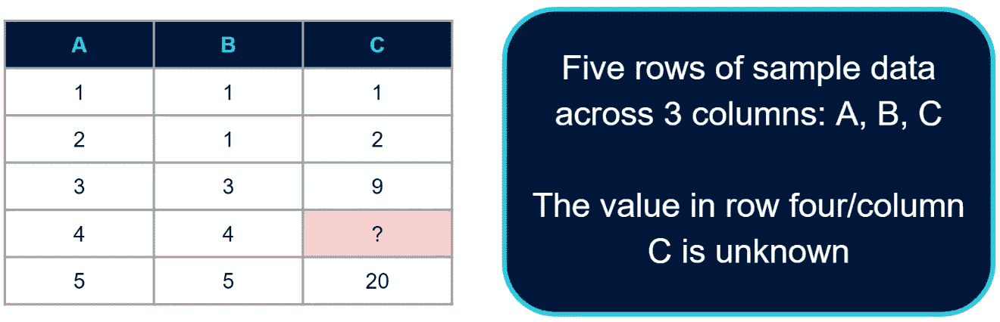
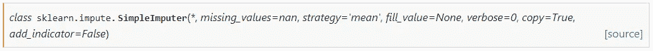
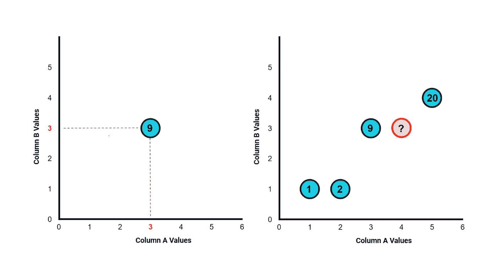
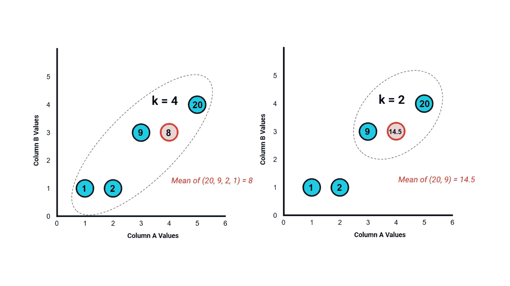
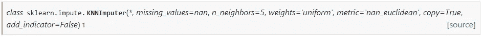

# 价值观缺失怎么处理？

> 原文：<https://medium.com/analytics-vidhya/how-to-deal-with-missing-values-600b70b79918?source=collection_archive---------12----------------------->

[图片来自 Displayr 博客](https://www.displayr.com/deal-missing-values-cluster-analysis/)

*回答关于如何处理缺失值的可怕问题*

W **hy** 我们到底需要处理数据中缺失的值吗？为什么我们需要担心这个？模型不会忽略它们吗？

当建立机器学习模型时，我们需要意识到数据中存在的空值和缺失值，因为在大多数情况下，模型不知道如何处理它们，并将导致问题或错误。

***熊猫*** 为我们提供了一种使用*快速检查缺失值的方法。isna()* 方法，使用*删除列。dropna()* 方法，并用。 *fillna()* 法。

# **使用 Scikit-learn 的 SimpleImputer 处理缺失值**

> “SimpleImputer 是 scikit-learn 的一个软件包，可以使用常数值或列平均值、中值，甚至最常见的值，对缺失值进行静态插补。”

简单估算逻辑

***simple imputr 的*** 逻辑真的很简单。它取该列的平均值，并用结果对其进行估算。在下面的示例中，它将取 C 列中所有值的平均值，这些值是；1 + 2 + 9 + 20.这里，缺少的值将是 8。

[安德鲁·琼斯的《数据科学无限》](https://www.data-science-infinity.com/)

它通过使用***simple imputr()***方法实现，该方法采用以下参数:

*详见* [*用户指南*](https://scikit-learn.org/stable/modules/impute.html#impute) 。

在第 15 行和第 18 行中，它是单独运行的。但是有一个使用*的 scikit-learn 方法。fit_transform* 可以同时进行拟合和变换，如第 24 行所示。

***注意*** : **仅在训练数据上使用** *fit_transform* ，因为您希望您的插补规则基于您的训练数据。如果您分别在训练和测试数据集中使用插补规则，您最终会得到不同的插补规则，这意味着您的训练和测试结果不完全可比。如果您想要对测试数据和新数据使用相同的逻辑或规则，请分别使用 fit 和 transform。

# **使用 Scikit-learn 的 KNNImputer 处理缺失值**

> “scikit-learn 库中的 KNNImputer 使用 k-nearest-neighbors 算法，通过利用在其他可用的数值特征上看起来相似的其他数据点来动态地估算缺失的数值。
> 
> 它假设其他看起来相似的数据点将对丢失的值给出更好的估计。"

**KNNImputer 的逻辑**

与简单估算器不同， ***KNNImputer 的*** 逻辑会考虑其他数字列的值。在前面的同一个例子中， *KNNImputer* 不仅从列 C 中获取值，还将从列 A 和列 B 中获取值。

[安德鲁·琼斯的《数据科学无限》](https://www.data-science-infinity.com/)

在引擎盖下发生的是，它根据它们的值绘制空间中的值。(*见下图*)

[安德鲁·琼斯的《数据科学无限》](https://www.data-science-infinity.com/)

左图绘制了来自第 3 行第 A 列和第 3 行第 b 列的数据点。它还记录了 C 列的值，即图上的 9，并对所有数据进行了相同的处理，如右图所示。

根据您为 k 值指定的内容，该算法将查找 k 个最近邻，并对 c 列取平均值来估计缺失值。

如果我们用 k 值为 4。它将取 4 个最近的数据点，并对其进行平均，以获得缺失值(* *见下图左图)*如果我们使用值为 2 的 k，它将取两个最近的数据点(* *见下图右图*)。

[安德鲁·琼斯的《数据科学无限》](https://www.data-science-infinity.com/)

***中的***k***k-nearest-neighbors***表示我们要评估的邻居的数量，以猜测丢失数据点的值可能是多少。

关于如何给 k 赋值或决定给 k 赋什么值，有很多问题。在 Scikit-learn 中，默认值是 5，但您可以根据需要将它更改为任何值。该算法用于插补目的的前提是，数据点越接近，越有可能更好地代表未知或缺失值。因此，您在右图中看到的值 14.5 可能比左图中的值 8 更适合估算，因为它使用的数据点在其他要素或数据列中更相似。

***KNNImputer()*** 方法采用以下参数:

*详见* [*用户指南*](https://scikit-learn.org/stable/modules/impute.html#knnimpute) *。*

***注*** :一般来说，如果您不只是删除包含缺失值的行并尝试估算缺失值，我建议尝试上面讨论的 *Scikit-learn* 方法之一来进行估算，而不是仅仅使用 *Pandas* ，因为 *Pandas* 没有拟合和转换方法。

***参考文献:***

要了解更多关于数据科学的信息，请点击下面的链接查看安德鲁·琼斯的《数据科学无限》:

 [## 数据科学无限

### 以正确的方式学习正确的内容，并提供无限的支持和指导，我致力于帮助您成为一名…

data-science-infinity.teachable.com](https://data-science-infinity.teachable.com/?affcode=716157_jcwmqdhh)