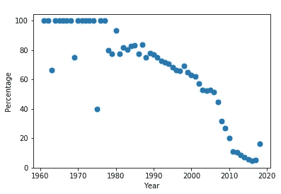
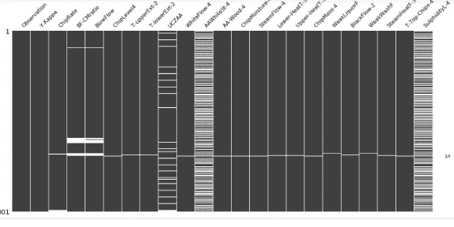
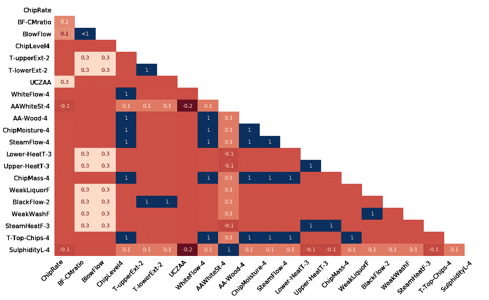

# 如何处理一个数据集中的缺失值？

> 原文：<https://medium.com/analytics-vidhya/how-to-deal-with-missing-values-in-data-set-8e8f70ecf155?source=collection_archive---------8----------------------->

现实世界的数据集由缺失值组成，数据科学家花费大量时间进行数据准备，包括数据清理。缺少值可能是未记录的观察结果或数据损坏的结果。

**缺失数据的类型**

*   随机缺失(MAR)-这意味着缺失值的比例与观察数据之间存在关系。例如，在下图中，我们看到里程列中缺失值的比例与汽车的制造年份相关。因此，可以使用其他特征来预测数据集中这种类型的缺失值。



缺失值百分比与汽车制造年份的关系。

*   完全随机缺失(means 这意味着缺失值的比例与数据中的任何观察无关。例如，电子秤电池没电了，因此会丢失一些数据。
*   非随机缺失(MNAR)-这意味着缺失的数据与我们未知的因素有关。例如，称重秤机械装置可能会随着时间的推移而磨损，从而随着时间的推移产生更多的缺失值，但我们可能不会注意到同样的情况。如果我们有 MNAR 丢失机制，我们需要理解为什么数据丢失，而不是直接归咎于它们。

**在 Python 中检测缺失值**

缺失值的形式可以是空字符串、NA、N/A 或 None。python 中的 Pandas 将数据中的所有 NA 或空白值标识为 NaN 值。但是，它不识别 na，？可使用 **df.isnull()** 命令检测数据集中的 NA 或空白值格式。当数据中存在缺失值时，此方法返回布尔响应 True。

但是，有时可能会出现数据中缺失值的格式不同的情况。例如，某一列缺少 n/a、_ _ 或 na 格式的值。在导入数据时，pandas 检测数据集中非标准格式的缺失值的一个简单方法是将所有类型的缺失值作为一个列表。

```
missing_values = ["n/a", "na", " _ _"]
df = pd.read_csv("loan data.csv", na_values = missing_values)
```

在数据集中 **df.isnull()。sum()** 命令用于查找数据中每个特征缺失值的总数。

**在 Python 中可视化缺失值**

可视化缺失值使分析师能够很好地理解数据集中 NaN 值的分布。

```
# Import the library
pip install missingno
import missingno as msno
# Visualize the missing values using a matrix 
msno.matrix(df)
```



`AAWhiteSt-4`和`SulphidityL-4 columns`的失踪模式相似

每列中缺失值的计数用条形图表示。

```
# Visualize missing values as a bar chartmsno.bar(df)
```


热图表示每列中缺失值之间的相关性。
对应于-1 的值表示数据集中的变量 A 导致其变量 b 中的值缺失

```
msno.heatmap(df)
```



**处理缺失值的方法**

**1 删除包含缺失值的列和行**

删除 MCAR 数据中包含缺失值的列和行。然而，这种方法的问题是信息的丢失。如果数据中缺失值的数量超过 70–75 %,建议删除特定的列。此外，当我们有大型数据集时，我们可以删除包含空值的行。但是，如果数据集中缺失值的百分比大于 30 %,则不建议这样做。

```
#Drop the rows with at least one element missing
df.dropna(inplace = True)# Drop the rows with all the elements missing
df.dropna(how='all',inplace = True)# Drop the rows with missing values greater than two
df.dropna(thresh=2, inplace = True)# Drop the rows with at least one missing value in the columns specified in the subset function
df.dropna(subset=['age', 'fare'])# Drop the columns with at least one missing value
df.dropna(axis= 1 , inplace = True)# Drop the columns containing all the elements missing
df.dropna(axis= 'columns',how = 'all', inplace = True)
```

**2 用平均值、中值和众数输入数据中的缺失值**

我们可以用特定特征的平均值、中值或众数来替换数据集中的缺失值，但这种方法会导致低估方差，并会增加数据中的偏差。当数据量很小时，这种方法是理想的，因为它有助于防止信息丢失，但在 python 中进行均值或中值插补时，它没有考虑变量之间的相关性，因为它是一种单变量方法。

例如，在包含“年龄”和“费用”列的数据集中，年龄特征中有缺失值。如果我们用平均年龄来估算缺失值，那么由于年龄和票价特征之间的正相关，可能会导致偏差增加。

```
from sklearn.impute import SimpleImputer
mean_imp = SimpleImputer( strategy='mean') 
# For Mode replace strategy with most_frequent
# For Median replace strategy with Medianmean_imp.fit(train)
train_df = mean_imp.transform(train)
```

如果我们希望数据首先被处理为缺失值，然后由我们的模型使用，那么我们可以使用管道，因为这可以防止数据泄漏。

```
from sklearn.pipeline import Pipeline
from sklearn.impute import SimpleImputer
from sklearn.discriminant_analysis import LinearDiscriminantAnalysis
from sklearn.model_selection import KFold
from sklearn.model_selection import cross_val_score
# define the imputer
imputer = SimpleImputer(strategy='mean')
# define the model
lda = LinearDiscriminantAnalysis()
# define the modeling pipeline
pipeline = Pipeline(steps=[('imputer', imputer),('model', lda)])
# define the cross validation procedure
kfold = KFold(n_splits=3, shuffle=True, random_state=1)
# evaluate the model
result = cross_val_score(pipeline, X, y, cv=kfold, scoring='accuracy')
```

**3 使用 k-NN 的插补**

*k* 最近邻是一种算法，其中新点根据其与训练数据集中的点的相似性被分配一个值。这种方法可以通过与缺失数据相邻的非缺失值来估算每个特征的缺失值。根据数据集的不同，它可以提供比众数、中位数或平均数插补更准确的结果。然而，这种方法在计算上是昂贵的，因为整个训练数据集被存储在存储器中，并且与 SVM 不同，它对数据中的异常值敏感。

```
from sklearn.impute import KNNImputer
# define imputer
imputer = KNNImputer(n_neighbors=5, weights='uniform', metric='nan_euclidean')
# fit on the data set
imputer.fit(X)
# fit on the data set
imputer.fit(X)
# transform the data set
Xtrans = imputer.transform(X)
```

**4 链式方程多重插补(小鼠)**

MICE 是一种多重插补技术，用 MAR 缺失机制来代替数据集中的缺失值。它使用数据中的其他特征为每个缺失值做出最佳预测。在该算法中，每个缺失值都是根据数据中的观察值建模的。要了解关于 MICE 算法的更多信息，请查看“ [*MICE 算法以估算数据集中的缺失值*](/swlh/mice-algorithm-to-impute-missing-values-in-a-dataset-c55d555b6fbe) ”。该算法可以使用 Scikit-learn 迭代估算器来实现。

```
from sklearn.experimental import enable_iterative_imputer
from sklearn.impute import IterativeImputer
```

在此之后，我们将发现 X 中的值是如何相互关联的，以决定使用哪种算法来估算空值。

```
X.corr()
lr  = LinearRegression()
imp = IterativeImputer(estimator = lr ,verbose = 2 ,max_iter = 30,tol = 1e-10,order = 'roman')
imp.fit(X)
imp.transform(X)
```

**结论**

由于缺少完整的信息，缺失数据可能会导致无效的结果。它们被处理为在由缺失值组成的数据集上训练 ML 模型会导致错误，因为 python 库(包括 Scikit learn)不支持它们。
点击💚如果你喜欢这篇文章。有问题可以写在下面的评论区，我会尽力解答。