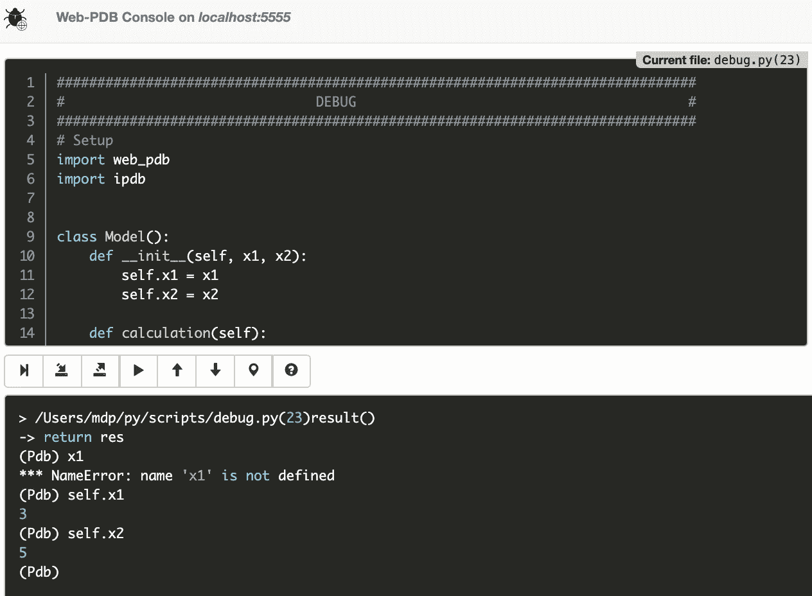

# 如何像专业人士一样用 Python 调试

> 原文：<https://medium.com/analytics-vidhya/how-to-debug-like-a-pro-with-python-53e52552c6c2?source=collection_archive---------7----------------------->

## 使用调试器 Web 界面调试您的代码

## 摘要

你喜欢写代码但讨厌它崩溃吗？那么你会喜欢这个让调试变得有趣的工具。

作者图片

**调试**是检测和消除软件代码中可能导致其异常行为的现有和潜在错误的过程…