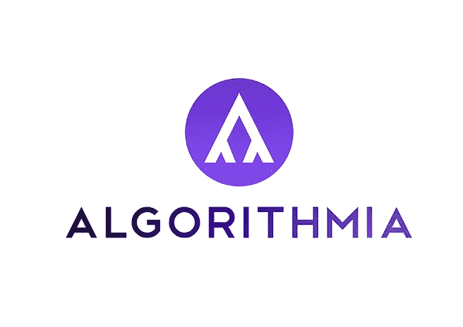
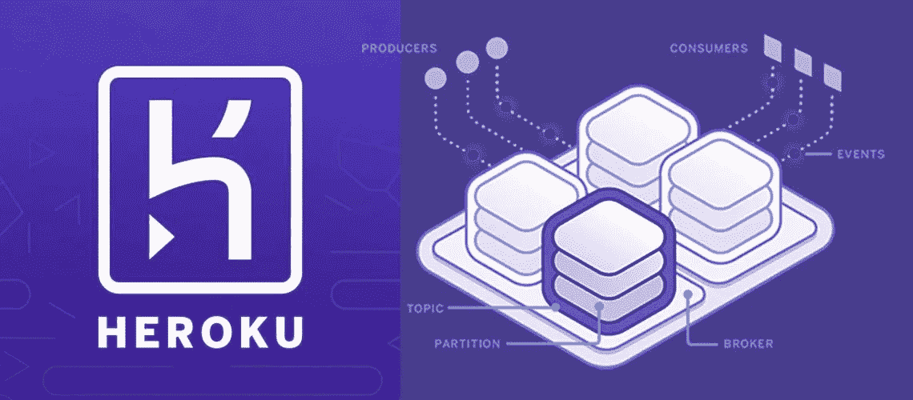
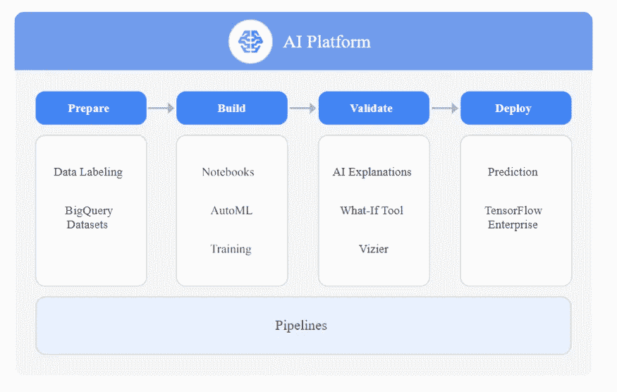
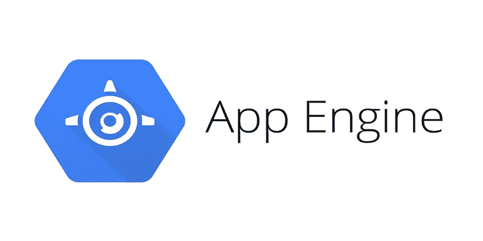
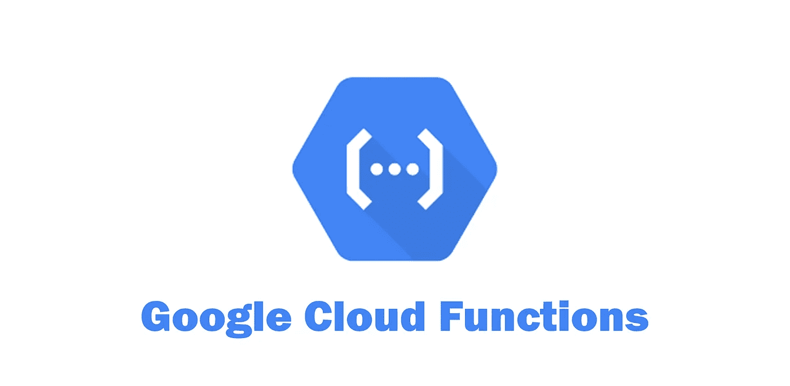
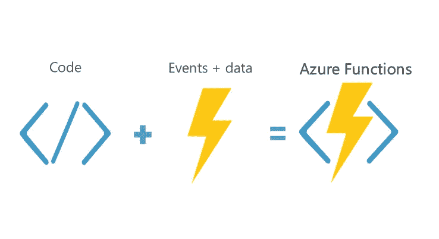
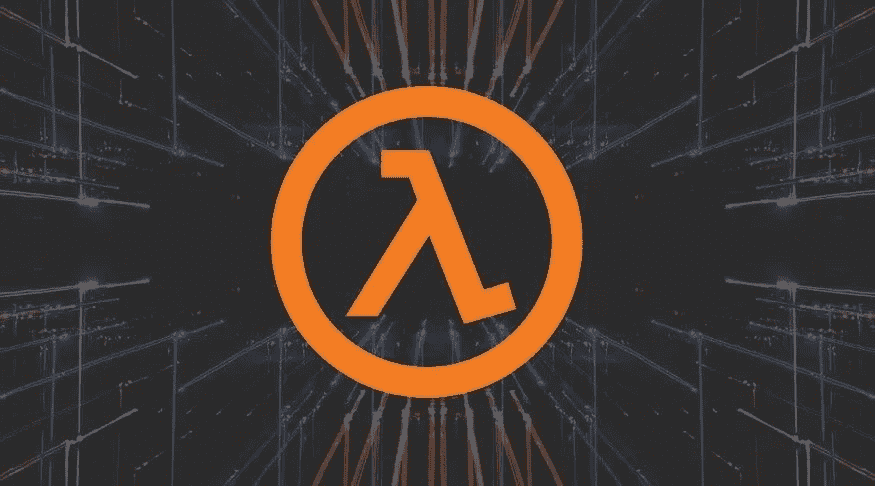
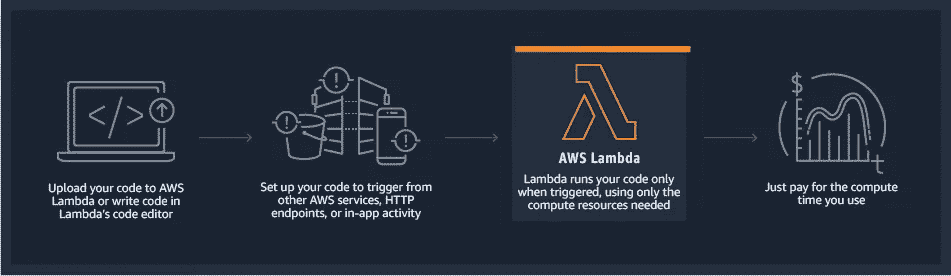

# 如何免费部署机器学习模型— 7 ML 模型部署云平台

> 原文：<https://medium.com/analytics-vidhya/how-to-deploy-a-machine-learning-model-for-free-7-ml-model-deployment-cloud-platforms-fd9191726a10?source=collection_archive---------10----------------------->

照片由来自[佩克斯](https://www.pexels.com/photo/woman-wearing-pink-dress-shirt-holding-gray-laptop-computer-1181341/?utm_content=attributionCopyText&utm_medium=referral&utm_source=pexels)的[克里斯蒂娜·莫里洛](https://www.pexels.com/@divinetechygirl?utm_content=attributionCopyText&utm_medium=referral&utm_source=pexels)拍摄

我记得我第一次创建一个简单的机器学习模型。这是一个可以根据你多年的经验预测你工资的模型。制作完成后，我很好奇如何将它应用到生产中。

如果你一直在学习机器学习，你可能会在在线教程或书籍中看到这个挑战。感兴趣的话可以在这里找到[的源代码。](https://github.com/Davisy/Model-Deployment-by-using-Flask)

对我来说，找出在哪里部署我的模型真的很难。我试图将它部署在一个 web 托管平台上，但是很难配置和运行为我的模型服务的 Flask 应用程序。

然后我决定探索专门为机器学习模型部署创建的不同平台(或者有一个好的环境来支持我的模型堆栈)。

> 只有当模型与业务系统完全集成时，我们才能从其预测中提取真正的价值。—克里斯托弗·萨米乌拉

在本文中，您将了解不同的平台，这些平台可以帮助您将机器学习模型部署到生产中(免费)，并使它们变得有用。

我还包含了一些很棒的资源，可以帮助您开始在特定的平台上部署您的模型。

**注意:**本文中提到的平台提供**免费等级**计划，允许您使用他们的产品或服务，直到他们指定的**免费使用限制**。如果你想获得无限的服务，你将根据服务的价格收费。

# 这篇文章是写给谁的？

本文面向那些已经在本地机器上创建了机器学习模型，并希望探索部署该模型的潜在平台的人。

它也适用于那些正在寻找替代平台来部署其机器学习模型的人。

我们开始吧！🚀

# 机器学习模型部署选项#1: Algorithmia

[Algorithmia](https://algorithmia.com/) 是由 [Diego Oppenheimer](https://www.linkedin.com/in/doppenheimer/) 和 [Kenny Daniel](https://www.linkedin.com/in/kennydaniel) 创建的 MLOps(机器学习操作)工具，它提供了一种简单快捷的方式将你的机器学习模型部署到生产中。

Algorithmia 专注于**“算法即服务”**。它允许用户创建运行 ML 模型的代码片段，然后将它们托管在 Algorithmia 上。然后你可以调用你的代码作为一个 API。

现在，通过 Algorithmia 的简单 API 调用，您的模型可以用于您选择的不同应用程序，如 web 应用程序、移动应用程序或电子商务。

Algorithmia 的好处在于，它将机器学习问题与应用程序的其余部分分离开来。在这种情况下，您必须调用您的模型，并以 API 调用的方式进行预测。你的应用将摆脱机器学习环境的影响。

这里有一个很好的资源可以让你了解更多关于 Algorithmia 的知识。

*   [如何使用 Algorithmia 将您的 NLP 模型作为 API 部署到生产中](https://www.freecodecamp.org/news/deploy-ml-model-to-production-as-api/)

# 机器学习模型部署选项#2: PythonAnywhere

PythonAnywere 是另一个基于 Python 编程语言的知名且不断发展的平台即服务。它使得在云中运行 Python 程序变得容易，并提供了一种简单的方法来托管基于 web 的 Python 应用程序。

您可以使用任何 Python web 框架(如 Flask)来部署您的机器学习模型，并在 pythonAnywhere 平台上运行它，只需几分钟。

请记住，pythonAnywhere 不支持 GPU。如果你有一个依赖 CUDA 和 GPU 的深度学习模型，你需要找到一个好的服务器来适应你的模型需求(查看以下平台)。

这里有一些资源可供您学习如何在 PythonAnywhere 上运行您的机器学习模型:

*   [免费部署机器学习模型](/analytics-vidhya/how-to-deploy-simple-machine-learning-models-for-free-56cdccc62b8d)
*   [如何部署和托管机器学习模型](/@kaustuv.kunal/how-to-deploy-and-host-machine-learning-model-de8cfe4de9c5)

# 机器学习模型部署选项#3: Heroku

Heroku 是一个云平台即服务，帮助开发人员快速部署、管理和扩展现代应用程序，而没有基础设施问题。

如果您想第一次部署您的模型，我推荐您尝试 Heroku，因为它灵活且易于使用

它提供了广泛的服务和工具来加速您的开发，并帮助您避免一切从零开始。它还支持几种广泛使用的编程语言，如 Python、Java、PHP、Node、Go、Ruby、Scala 和 Clojure。

Heroku 的好处在于，它使创建、部署和管理你的应用程序变得容易。您可以使用 [Heroku CLI](https://devcenter.heroku.com/articles/heroku-cli) (适用于 Windows、Linux 和 Mac 用户)从命令行直接完成此操作。

在部署部分，通过将 Github 存储库链接到 Heroku 帐户，您可以将经过训练的机器学习模型和源代码上传到 Heroku 上。

这里有一些资源供您学习如何在 Heroku 平台上部署您的模型。

*   [如何开发一个端到端的机器学习项目，并用 Flask 部署到 Heroku](https://www.freecodecamp.org/news/end-to-end-machine-learning-project-turorial/)
*   [使用 Python 和 Heroku 创建并部署你的第一个 Flask 应用](https://www.kdnuggets.com/2020/09/flask-app-using-python-heroku.html)

> *“据*[*VentureBeat*](https://venturebeat.com/2019/07/19/why-do-87-of-data-science-projects-never-make-it-into-production/)*报道，大约 90%的机器学习模型从未投入生产。换句话说，数据科学家只有十分之一的工作日最终能为公司做出有用的东西。”— Rhea Moutafis*

# 机器学习模型部署选项#4:谷歌云平台

谷歌云平台(GCP)是谷歌提供的一个平台，提供一系列云计算服务，如计算、存储和数据库、人工智能(AI) /机器学习(ML)、网络、大数据以及身份和安全。

Google 云平台提供基础设施即服务、平台即服务和无服务器计算环境。

谷歌云在 12 个月内免费提供 300 美元的信用，但你必须添加你的信用卡信息，以确保你不是机器人。在你决定升级到付费账户之前，平台不会向你收费。

谷歌云平台提供了三种方式来部署你的机器学习模型。

# 谷歌人工智能平台

Google AI 平台提供全面的机器学习服务。数据科学家和机器学习工程师可以使用这个平台更有效地从构思到部署处理机器学习项目。

有了谷歌人工智能平台，你可以在一个屋檐下访问它的所有资产。包括数据准备、模型训练、参数调优、模型部署，以及与其他开发者共享机器学习模型。

要了解更多关于 Google AI 平台的信息，可以查看该平台的网站[这里](https://cloud.google.com/ai-platform)。

# 谷歌应用引擎

Google App Engine 是 Google 提供的平台即服务(PaaS ),支持开发和托管不同的可扩展 web 应用程序。

Google App Engine 提供了自动缩放功能，可以自动分配资源，这样您的 web 应用程序就可以处理更多的请求。

它支持流行的编程语言，包括 Python、PHP、Node.js、Java、Ruby、C#和 Go。

因此，您可以使用 Flask 框架或您知道的任何其他框架在 Google App Engine 上部署您的模型。

要了解更多，你可以访问这里的[平台。](https://cloud.google.com/appengine)

# 谷歌云功能

Google Cloud Function 是一个无服务器计算平台，提供功能即服务(FaaS ),无需服务器管理即可运行您的代码。

你需要做的就是用任何一种支持的编程语言写一小段代码(函数)，然后托管在 Google Cloud 函数上。在这种情况下，你不需要面对维护自己服务器的困难。

所有在 Google Cloud Functions 上创建和托管的功能，在需要的时候都会在云端执行。你可以通过使用不同的[触发器](https://cloud.google.com/functions/docs/calling)来调用云函数。最常见的方法是使用 HTTP 调用。

因此，您可以使用受支持的代码块部署您的机器学习模型，以便在 google cloud 函数上执行，并从您的 web 应用程序或任何其他系统调用 HTTP 请求进行预测。

这里有一些资源供你学习如何在 Google 云平台上部署你的模型。

*   [如何借助谷歌云平台从零到英雄](https://www.freecodecamp.org/news/google-cloud-platform-from-zero-to-hero/)
*   [如何将 Fast.ai 模型部署到谷歌云功能进行预测](https://jianjye.medium.com/how-to-deploy-fast-ai-models-to-google-cloud-functions-for-predictions-e3d73d71546b)

# 机器学习模型部署选项#6:微软 Azure 功能

Azure Functions 是微软 Azure 作为功能即服务(FaaS)提供的无服务器云服务。Azure 功能帮助开发人员卸载基础设施管理任务，专注于运行他们的应用程序。

> *“你专注于对你最重要的代码片段，Azure Functions 处理剩下的部分。”* [*天蓝色功能页面*](https://docs.microsoft.com/en-us/azure/azure-functions/?WT.mc_id=ignite-event-toanglin) *。*

使用 serverless，你可以编写一段运行你的模型的代码，然后在 Azure 函数上部署代码和机器学习模型，并作为 API 调用它进行预测。Azure 功能类似于谷歌云功能。

Azure Functions 支持用 C#、F#、Node.js、Python、PHP、JavaScript、Java 8、Powershell Core、TypeScript 开发的不同函数。

如果你有一个大的机器学习模型，那么 Azure functions 是你正确的选择。它支持部署大型 ML 包，如深度学习框架(Tensorflow 和 Pytorch)。

这里有一些资源供你学习如何在 Azure Functions 中部署你的模型。

*   [用于 ML 的 Azure 函数](/microsoftazure/azure-functions-for-ml-4440bee58621)
*   [在 Azure 上高效部署 PyTorch 模型](/pytorch/efficient-serverless-deployment-of-pytorch-models-on-azure-dc9c2b6bfee7)

# 机器学习模型部署选项#7: AWS Lambda

AWS Lambda 是一种无服务器计算服务，由 Amazon 作为 Amazon Web Services 的一部分提供。AWS lambda 帮助您在不管理底层基础设施的情况下运行代码。

有了 Lambda，你可以在一个容器图像或 zip 文件中上传你的代码。Lambda 会根据传入的请求或事件自动分配计算能力来运行您的代码，而无需您进行任何配置。

AWS Lambda 允许您的代码与其他 AWS 资源相关联，如亚马逊 DyanamoDB 表、亚马逊 S3 桶、亚马逊 SNS 通知和亚马逊 Kinesis 流。

因此，您可以轻松地在 AWS Lambda 上部署您的机器学习模型，并且可以使用 Amazon API Gateway 通过 API 访问它。

可以用以下支持的编程语言编写 Lambda 函数:Python、Java、Go、PowerShell、Node.js、Ruby、C#代码。

AWS Lambda 非常便宜，因为您只需在调用 Lambda 函数时(也就是在发出预测请求时)付费。与运行容器或虚拟机的成本相比，它可以节省大量资金。

如果你想监控你创建的 lambda 函数，AWS Lambda 会代你完成。

AWS Lambda 将通过 Amazon CloudWatch 监控实时指标，包括错误率、总请求数、功能级并发使用、延迟和节流的请求。

然后，您可以使用 AWS lambda 控制台或 Amazon CloudWatch 控制台查看每个 Lambda 函数的统计数据。

这里有一些资源供你学习如何在 Azure 函数中部署你的模型。

*   [在 AWS Lambda 上部署机器学习模型的经验教训](https://www.freecodecamp.org/news/what-we-learned-by-serving-machine-learning-models-using-aws-lambda-c70b303404a1/)
*   [将机器学习模型部署为无服务器 API](https://aws.amazon.com/blogs/machine-learning/deploying-machine-learning-models-as-serverless-apis/)
*   [如何用 AWS Lambda 和 TensorFlow 部署深度学习模型](https://aws.amazon.com/blogs/machine-learning/how-to-deploy-deep-learning-models-with-aws-lambda-and-tensorflow/)

# 还有一个额外的机器学习模型部署选项:mc2gen 库

如果上述平台不符合你的要求，我有一个额外的选择给你。你知道有可能把你训练好的机器学习模型转换成你选择的编程语言吗？

是的，你可以通过使用由[Bayes’witness](https://github.com/BayesWitnesses)开发的 [m2cgen](https://github.com/BayesWitnesses/m2cgen) Python 库来转换你的模型。m2cgen (Model 2 Code Generator)是一个简单的 Python 库，可以将经过训练的机器学习模型转换成不同的编程语言

它目前支持 14 种不同的编程语言，包括 Go、C#、Python、PHP 和 JavaScript。m2cgen 库支持来自 scikit-learn 和 Gradient boost 框架的回归和分类模型，如 XGBoost 和 LightGBM(光梯度增强机器)。

要了解这个库的更多信息，我推荐你阅读我的[阅读我的 mc2gen 指南这里](https://www.freecodecamp.org/news/transform-machine-learning-models-into-native-code-with-zero-dependencies/)。我解释了如何使用该库，然后将一个经过训练的机器学习模型转换成三种不同的编程语言，然后进行预测。

该 Python 库将帮助您将模型部署到无法安装 Python 堆栈来支持模型预测的环境中。

# 包扎

如果你要从事机器学习项目，机器学习部署是你应该具备的重要技能之一。上面提到的平台可以帮助您部署您的模型并使其有用，而不是将它保存在您的本地机器中。

**恭喜**👏👏**，**你已经熬到这篇文章的结尾了！。我希望你学到了对你的职业生涯有帮助的新东西。

如果你学到了新的东西或者喜欢阅读这篇文章，请分享给其他人看。在那之前，下期帖子再见！你也可以在 Twitter 上找到我 [@Davis_McDavid](https://twitter.com/Davis_McDavid) 。

本文最初发表于 [freecodecamp](https://www.freecodecamp.org/news/deploy-your-machine-learning-models-for-free/) 。