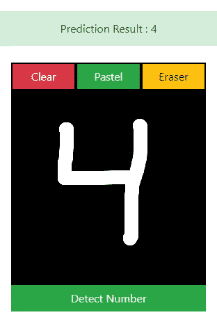
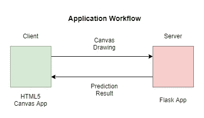
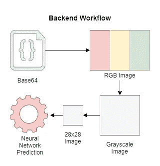
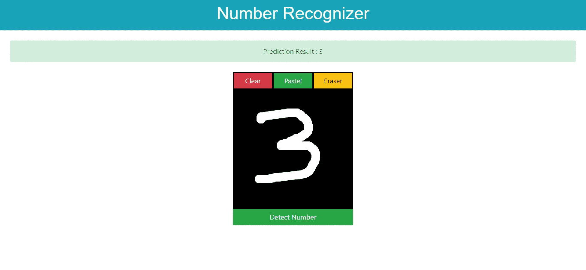

# 如何将数字识别模型部署到绘图应用中

> 原文：<https://medium.com/analytics-vidhya/how-to-deploy-digit-recognition-model-into-drawing-app-6e59f82a199c?source=collection_archive---------6----------------------->

## 使用 flask 将您的 Python 数字识别神经网络模型部署到 web HTML5 绘图应用程序中


由[克里斯多夫·高尔](https://unsplash.com/@cgower?utm_source=medium&utm_medium=referral)在 [Unsplash](https://unsplash.com?utm_source=medium&utm_medium=referral) 上拍摄

你好。在这篇文章中，我将指导你如何创建人工智能来检测手写数字，并创建 web 绘图应用程序作为用户界面。做这篇文章的直觉是因为我在网上找到了很多教我如何创建一个人工智能模型的教程，但直到创建了一个应用程序。我希望这篇文章能对你寻找全面的指南有所帮助。



应用演示

## 为什么要创建应用程序？

人工智能最终的结果应该是一个产品。在这种情况下，我们的产品是一个绘图应用程序，具有使用人工智能模型本身检测手写数字的功能。这将是不现实的项目，如果我们的最终产品使用终端作为界面，所以使一个应用程序将是一个有效的投资组合。

## 应用程序工作流程

我们将建立后端和前端应用程序。解释复杂过程的最佳方式是通过可视化。为了更好地交流，我制作了这些工作流程图。我们将在客户端使用 javascript 构建绘图应用程序，在后端使用 python 进行处理和预测。



应用程序工作流程图



后端工作流程图

Tensorflow，Flask，Opencv，sklearn 和 numpy 都是我们在这个项目中需要的 python 库。我建议使用虚拟环境，如 venv 或 virtualenv，因为我们的计算机中可能有不同版本的库用于不同的项目。

## 步骤#1:创建模型

第一步是使用 Keras 创建分类模型。MNIST 手写是许多神经网络入门教程中常用的数据集。使用顺序 API，你可以很容易地创建神经网络(NN)。没有必要创建复杂的神经网络，但如果你想获得最大的性能，那么使用卷积神经网络(CNN)这是很好的图像分类。

MNIST 手写数字分类模型的建立

在序列神经网络中，我使用输入形状为(28，28，)的展平层。**一定要在最后一个元组加逗号，而不仅仅是(28，28)** 。因为(28，28)是图像大小，最后一个元组中的逗号将是我们的训练数据量。如果您尝试使用`print(x_train.shape)`，形状将会是(60000，28，28 ),因为我们有 60000 个大小为 28 x 28 的训练图像。

你可以把上面的代码复制粘贴到 google colab，jupyter notebook，或者 pycharm。`model.save(filename.h5)`将把模型存储在这个程序运行的同一个目录中，但是如果你使用 google colab，你应该下载. h5 模型。您可以随意命名该文件，但它应该以. h5 文件扩展名结尾。如果你对模型表现满意，那么你可以进入下一步。

## 步骤 2:创建烧瓶应用程序

创建 flask 应用程序来处理来自前端的用户请求，并使用模板引擎呈现 html。创建新的文件夹应用程序，并在其中创建名为`main.py`的新文件。另外，将您的 model .h5 文件移动到 app 文件夹中。

从前端接收 base64 数据后，我们需要将图像从 3 通道转换为 1 通道(在第 30 行),因为我们在 1 通道图像上训练模型。我们从前端收到的图像有 3 个通道(RBG)，形状为(280，280，3)，我们将其转换为(280，280)。

我们需要将图像的大小调整为 28 x 28(在第 33 行)。我们需要调整图像的大小，因为我们的原始尺寸是 280 x 280。您可以检查宽度和高度为 280 的 canvas 标签(在第 43 行)。请记住，我们的模型是使用 28 x 28 的图像训练的，所以如果我们想要预测任何图像，我们需要将大小调整为 28 x 28。还要将数组维数从(28，28)扩展到(1，28，28)，因为数字 1 意味着我们有 1 个大小为 28 x 28 的图像。

## 步骤 3:创建绘图应用程序

我们将使用 HTML5 画布来创建一个简单的工作绘图应用程序，它可以用来用鼠标写数字。然后我们可以将 base64 图像数据发送到我们的服务器。在应用程序文件夹中创建名为 templates 的新文件夹，然后创建名为 drawing.html 的新文件

请看一下 html 文件中的``和`{{ }}`标签。这是 flask 的模板引擎，可以用来为用户视图添加逻辑。我们使用这些逻辑来显示来自后端的预测结果。

HTML 文件中的 script 标签是一个客户端 javascript，用于通过监听鼠标与 canvas 进行交互，并进行绘制和擦除。此外，当用户单击检测按钮时，javascript 会将画布转换为 base64 图像

## 步骤 4:部署

现在我们的应用程序运行良好，下一步是将应用程序部署到 heroku。转到 heroku dashboard，用您想要的名称创建新应用程序。转到设置，复制 git 的网址，并按照这些步骤。

1.  使用`git init`在项目目录中初始化 git，
2.  使用`git add .`然后`git commit -m “Your message”`提交您的更改
3.  使用`git branch -M master`将主分支设置为主控
4.  使用`git remote add heroku your_heroku__git_app_url`将 heroku remote 添加到您的 git 存储库中

> **注:**master 分支的最新名称是 main，但 heroku 仍然使用 master 作为主分支的名称。你可以随意命名主分支

在主/根项目目录中创建`wsgi.py`

在主/根项目目录中创建`Procfile`。请注意，该文件没有扩展名，并以大写字符开头。这是 Procfile 中的内容。

```
web: gunicorn wsgi:app
```

## 完整的目录树

```
Digit Recognition Application
│
│   Procfile
│   wsgi.py
│
├───app
│   │   ai.h5
│   │   main.py
│   │
│   └───templates
│          drawing.html
│          home.html
│
└───static
        script.js
        style.css
```

现在你已经设置好了，首先通过运行你的 wsgi 文件`pthon wsgi.py`或者运行`flask run`，开始在你的本地应用中测试你的应用。该应用程序第一次启动时可能会很慢，特别是因为 tensorflow 需要相当长的时间。一旦启动，您应该会看到类似这样的内容。

```
* Running on [http://127.0.0.1:5000/](http://127.0.0.1:5000/) (Press CTRL+C to quit)
```

在你的浏览器中找到那个网址，你应该会看到你的应用程序。



数字识别器应用程序演示

在确保本地主机一切正常后，我们可以将我们的项目部署到 heroku 以供公众在线访问。`git add .`跟踪存储库中的所有内容，然后由`git commit -m "your commit message"`提交。最后使用`git push heroku master`将你的代码推入 heroku，因为主分支是你的主分支，而 heroku 是你的 heroku 远程 url。如果该过程成功并且没有显示错误，这意味着您的网站已成功部署。


布鲁斯·马尔斯在 [Unsplash](https://unsplash.com?utm_source=medium&utm_medium=referral) 上拍摄的照片

## 解决

祝贺您，您的网站已成功部署，在与您的同事分享之前，请访问该网站以确保一切正常。这就是全部，你有完全使用人工智能的绘图应用程序。请注意，您仍然可以通过添加额外的功能来改进应用程序，如使其实时检测。您还可以使用可视化库在前端创建预测概率的可视化。

你也可以访问我的 Github 库来获取材料和例子[https://github.com/PhilipPurwoko/NumberRecognition](https://github.com/PhilipPurwoko/NumberRecognition)

也可以阅读我的另一篇文章来获得更多的资料和教程

[](/analytics-vidhya/how-to-make-mask-detection-ai-using-python-in-6-steps-157696e84871) [## 如何用 6 个步骤用 Python 制作掩膜检测 AI

### 使用 keras 一步一步创建面具检测人工智能的综合指南

medium.com](/analytics-vidhya/how-to-make-mask-detection-ai-using-python-in-6-steps-157696e84871) 