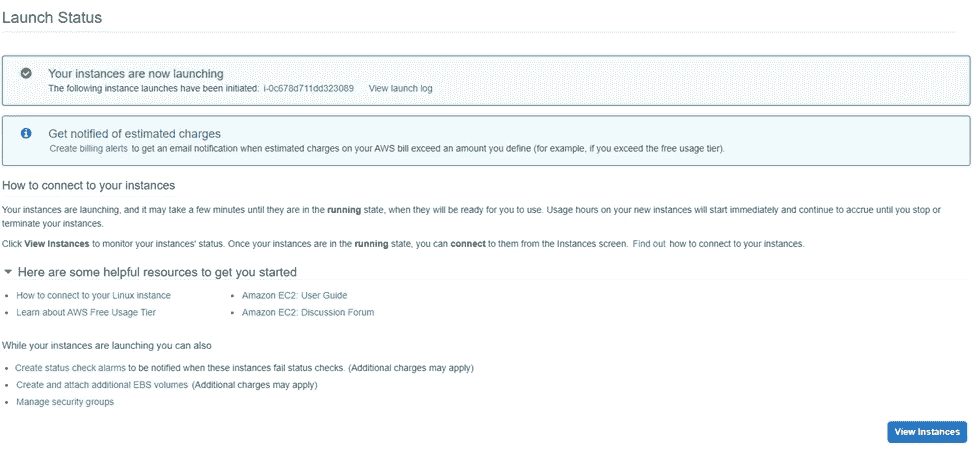

# 如何使用 Nginx 和 uWSGI 在 AWS Ubuntu EC2 上部署 Django 应用程序——实用指南

> 原文：<https://medium.com/analytics-vidhya/how-to-deploy-django-application-on-aws-ubuntu-ec2-with-nginx-and-uwsgi-a-practical-guide-1c114cb5f6b6?source=collection_archive---------0----------------------->

我过去写过很多 Django 相关的博客。我没有讨论的一件事是如何将 Django 项目投入生产。在这篇文章中，我想讨论这个问题。要将项目部署到生产环境中，有许多方法。首先，您的主机/服务器环境是什么？其次，您必须选择将要使用的 Web 服务器(HTTP ),最后，您需要选择一个 WSGI 服务器，因为 Django 是一个 Python Web 框架。在本文中，我将通过使用 AWS Ubuntu EC2 + Nginx + uWSGI 来说明其中一个解决方案。

从 AWS 开始，您可以创建一个 AWS 帐户来享受一些免费层产品，包括我们将在其上部署 Django 项目的服务器。AWS 喜欢将这些服务器称为 EC2 实例。

链接到 AWS 免费层:

[https://aws.amazon.com/free/](https://aws.amazon.com/free/)

简而言之，整个技术栈和依赖项如下所示。

*   Ubuntu 20.04
*   Nginx
*   uWSGI
*   Python 3.8
*   Django 2.2.24
*   主题库—管理

下图说明了上述堆栈的系统拓扑。


在本文中，我将在这里使用示例项目，它是我在上一篇文章[“Django and admin LTE”](/analytics-vidhya/how-to-use-adminlte-in-django-225359ce8c72)中提到的项目的副本。让我们开始吧。

# 步骤 1:提供 EC2 实例

在 https://console.aws.amazon.com/ec2/[打开亚马逊 EC2 控制台](https://console.aws.amazon.com/ec2/)。从控制台仪表板中，单击**启动实例**。


在**步骤 1:选择一个亚马逊机器映像(AMI)** 页面，

1.  用“ubuntu”搜索。
2.  从**快速入门**选项卡的结果中，选择 **64 位(x86)** 并选择 **Ubuntu Server 20.04 LTS (HVM)，SSD 卷类型**。


在**步骤 2:选择实例类型页面**，

1.  选择标记为**自由层合格**的实例类型
2.  点击**查看并启动**。

我们将被引导至步骤 7。不要担心其他步骤。保留默认设置。


在**Step 7:Review Instance Launch**页面上，我们的实例将运行 Ubuntu Server 20.04。它将有 1 个 CPU，1 GB 内存和 8 GB 存储。点击**发射**。


在**上选择一个现有的密钥对或创建一个新的密钥对**模式:

1.  选择**创建新的密钥对**
2.  选择 **RSA** 密钥对类型
3.  键入密钥对名称。比如我的 _demo_key。
4.  点击**下载密钥对**。应该在您的本地机器上下载一个 **my_demo_key.pem** 文件。请确保您安全地存储了这个密钥文件。
5.  点击**启动实例**。


等待几秒钟。一旦实例准备就绪，我们应该会看到下面的页面。点击**查看实例**。



在**实例**页面上，应该会显示我们刚刚启动的实例。

1.  请键入一个容易记住的名称。比如 my_demo_server。
2.  记下它的公共 IPv4 地址。例如，54.193.19.108。
3.  记下它的安全组名。例如，默认情况下，启动向导-1。

此时，启动了一个新实例。

为了连接实例并使实例公开，我们需要改变安全组。

1.  打开**网络&安全**部分下的**安全组**页面。
2.  点击**启动向导-1** 组的**安全组 ID** 。
3.  在**启动-向导-1** 页面，点击**编辑入库规则**。
4.  在**编辑入库规则**页面中，

4.1.添加 **SSH** 类型规则。来源是**我的 IP** 。

4.2.添加 **HTTP** 类型规则。源是 **Anywhere-IPv4** 。

4.3.添加 **HTTP** 类型规则。来源是 **Anywhere-IPv6** 。

4.4.添加 **HTTPS** 型法则。来源是 **Anywhere-IPv4** 。

4.5.添加 **HTTPS** 型尺。来源是 **Anywhere-IPv6** 。


# 第二步:改变设置

打开 **mysite/settings.py** 文件，如下更改变量。

```
ALLOWED_HOSTS = ['54.193.19.108']
STATIC_ROOT = '/var/www/mysite/assets/'
```

# 步骤 3:在 EC2 实例上上传代码库

有许多 SFTP 客户。在本教程中，让我们使用适用于微软视窗系统的 WinSCP。

1.  建立连接，点击**登录**。需要使用 **my_demo_key.pem** 密钥文件来配置**高级**>>**SSH**>>**认证** > > **私钥文件**。
2.  在 **/home/ubuntu/** 目录下创建一个 **project_codebase** 目录。
3.  将代码库内容从本地机器上传到我们刚刚创建的目录。


# 步骤 4:配置 EC2 实例

有几种方法可以连接服务器。请在此处查看 AWS 文档[中的演练。由于上一步我们使用了 WinSCP，我们可以通过 PuTTY 中打开的**命令**菜单> > **来连接服务器。**](https://docs.aws.amazon.com/AWSEC2/latest/UserGuide/AccessingInstances.html)

我们应该会看到如下所示的新窗口。


通过运行如下命令安装 **Python 3.8** 。

```
sudo apt update
sudo apt-get install python3.8 python3.8-dev python3.8-distutils python3.8-venv
```

通过运行如下命令安装**虚拟环境**。

```
python3.8 -m venv /home/ubuntu/venv/
```

通过运行如下命令安装 **gcc** 。这是可选的。如果你因为缺少 gcc 而遇到错误，它会有所帮助。

```
sudo apt-get install gcc
```

通过运行如下命令，在虚拟环境下安装**轮**和 **uwsgi** 。

```
source /home/ubuntu/venv/bin/activate
pip install wheel
pip install uwsgi
```

安装这个 Django 项目所需的**其他库**。然后停用虚拟环境。

```
pip install -r /home/ubuntu/project_codebase/requirements.txt
```

创建 **uwsgi_params** 文件。路径和内容如下。

```
nano /home/ubuntu/uwsgi_params
```

内容:

```
uwsgi_param  QUERY_STRING       $query_string;
uwsgi_param  REQUEST_METHOD     $request_method;
uwsgi_param  CONTENT_TYPE       $content_type;
uwsgi_param  CONTENT_LENGTH     $content_length;uwsgi_param  REQUEST_URI        $request_uri;
uwsgi_param  PATH_INFO          $document_uri;
uwsgi_param  DOCUMENT_ROOT      $document_root;
uwsgi_param  SERVER_PROTOCOL    $server_protocol;
uwsgi_param  REQUEST_SCHEME     $scheme;
uwsgi_param  HTTPS              $https if_not_empty;uwsgi_param  REMOTE_ADDR        $remote_addr;
uwsgi_param  REMOTE_PORT        $remote_port;
uwsgi_param  SERVER_PORT        $server_port;
uwsgi_param  SERVER_NAME        $server_name;
```

通过运行如下命令创建 **/run/uwsgi/** 文件夹。

```
sudo mkdir /run/uwsgi/
sudo chown ubuntu:ubuntu /run/uwsgi/
```

通过运行如下命令安装 **Nginx** 。

```
sudo apt-get install nginx
```

在下面的路径中创建 **mysite.nginx.conf** 文件，并填写如下内容。

```
sudo nano /etc/nginx/sites-available/mysite.nginx.conf
```

内容:

```
upstream django {
    server unix:///run/uwsgi/mysite.sock;
}
server {
    listen      80;
    server_name 54.193.19.108;
    charset     utf-8;location = /favicon.ico { access_log off; log_not_found off; }
    location /static {
        alias /var/www/mysite/assets/;
    }location / {
        uwsgi_pass  django;
        include     /home/ubuntu/uwsgi_params;
    }
}
```

注意，server_name 是 EC2 实例的 IPv4 地址。

创建指向 **mysite.nginx.conf** 文件的符号链接，以便 nginx 进程可以找到。重启 Nginx 以反映变化。

```
sudo ln -s /etc/nginx/sites-available/mysite.nginx.conf /etc/nginx/sites-enabled/
sudo systemctl restart nginx
```

此时，我们应该能够通过运行如下命令在虚拟环境下启动 Django 项目。

```
uwsgi --socket /run/uwsgi/mysite.sock --chdir /home/ubuntu/project_codebase/ --module mysite.wsgi --chmod-socket=666
```

应该打印以下日志。


我们应该能够浏览这个网站，并看到如下页面。显然 css、image 和 javascript 还没有加载。因为我们没有收集静态文件。


通过运行以下命令创建 **mysite** 静态文件夹。

```
sudo mkdir /var/www/mysite
sudo chmod 777 /var/www/mysite
```

通过运行以下命令收集虚拟环境下的静态文件。

```
python /home/ubuntu/project_codebase/manage.py collectstatic
```

我们应该会看到以下消息。


通过运行以下命令创建 uwsgi 文件夹。

```
sudo mkdir -p /etc/uwsgi/sites
```

通过运行以下命令创建 uwsgi 日志文件夹。

```
sudo mkdir /var/log/uwsgi/
sudo chmod 666 /var/log/uwsgi/
```

创建 uwsgi **myproject.ini** 文件。路径和内容应该如下所示。

```
sudo nano /etc/uwsgi/sites/myproject.ini
```

内容:

```
[uwsgi]
chdir = /home/ubuntu/project_codebase/
module = mysite.wsgi
home = /home/ubuntu/venv/
master = true
processes = 10
socket = /run/uwsgi/mysite.sock
chmod-socket = 666
vacuum = true
logto = /var/log/uwsgi/%n.log
logfile-chown = %(uid):%(uid)
logfile-chmod = 666
```

通过运行如下命令重新启动服务器。实例将在几分钟后重新启动。之后重新连接。

```
sudo reboot
```

创建 **uwsgi.service** 文件。文件路径和内容应该如下所示。

```
sudo nano /etc/systemd/system/uwsgi.service
```

内容:

```
[Unit]
Description=uWSGI Emperor service[Service]
ExecStartPre=/bin/bash -c 'mkdir -p /run/uwsgi; chown ubuntu:www-data /run/uwsgi'
ExecStart=/home/ubuntu/venv/bin/uwsgi --emperor /etc/uwsgi/sites
Restart=always
KillSignal=SIGQUIT
Type=notify
NotifyAccess=all[Install]
WantedBy=multi-user.target
```

通过运行以下命令检查配置语法。

```
sudo nginx -t
```

如果一切配置正确，它应该显示以下消息。


启动 **nginx** 和 **uwsgi**

```
sudo systemctl restart nginx
sudo systemctl start uwsgi
```

如果一切顺利，您可以通过键入以下命令使这两个服务在启动时自动启动:

```
sudo systemctl enable nginx
sudo systemctl enable uwsgi
```

我们应该能够再次浏览网站，并看到如下完全加载的页面。


# 结论

恭喜你。您已经在云服务器上启动了 Django 项目。为了说明关键组件，我在下图中添加了文件/目录路径。


希望这篇文章能解除您对部署的困扰。当然，您需要细化每个组件来提高性能。这个教程再深入挖掘就有点过了。请不要犹豫留下你的评论。

同样，我在本文中使用的示例项目是上传到 GitHub 上的。链接如下。

[https://github.com/slow999/DjangoAndAWSEC2Deployment](https://github.com/slow999/DjangoAndAWSEC2Deployment)

如果你对视频教程感兴趣，请查看我下面的视频。

感谢阅读。敬请关注。